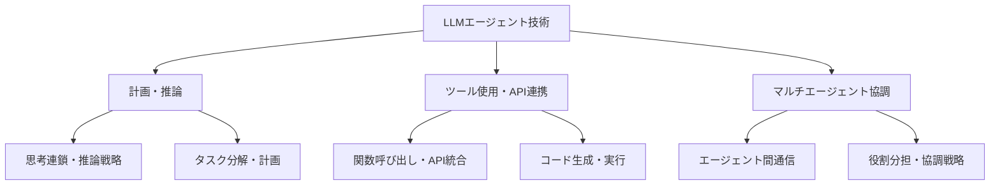

# LLMエージェント技術

## Research Parameters

- **Research type**: 学術論文サーベイ, 特許調査
- **Time range**: 2022 – 2026
- **Generated on**: 2026-03-20
- **Input keywords**: LLM agent, autonomous agent, tool use, planning, multi-agent

## Big Picture

大規模言語モデル（LLM）を基盤としたエージェント技術は、2023年以降急速に発展している分野である。単なるテキスト生成を超え、ツール使用、計画立案、環境との対話を通じて複雑なタスクを自律的に遂行するシステムの構築が活発に研究されている。マルチエージェント協調やコード生成エージェントなど、応用領域も急速に広がっている。

## Domain Map

## Cluster Summary

| # | Cluster Name | Keyword Count | Summary |
|---|-------------|---------------|---------|
| 1 | 計画・推論 | 8 | LLMの推論能力を活用したタスク計画と段階的問題解決 |
| 2 | ツール使用・API連携 | 7 | 外部ツールやAPIを呼び出して実世界と対話する能力 |
| 3 | マルチエージェント協調 | 6 | 複数のLLMエージェントが協力してタスクを遂行する枠組み |

## Cluster Details

### Cluster 1: 計画・推論

**Overview**: LLMの推論能力を活用し、複雑なタスクを段階的に分解・計画・実行するアプローチ。Chain-of-Thought、ReAct、Tree-of-Thoughtsなどの推論戦略が含まれる。

**Keywords**:
`chain-of-thought`, `ReAct`, `tree-of-thoughts`, `task decomposition`, `planning`, `reasoning`, `self-reflection`, `step-by-step`

**Research Strategy**:
- arXivで "LLM planning" "LLM reasoning agent" を検索
- NeurIPS, ICML, ACL の agent 関連ワークショップ論文を確認

---

### Cluster 2: ツール使用・API連携

**Overview**: LLMが外部ツール（検索エンジン、計算機、API等）を呼び出し、テキスト生成だけでは不可能なタスクを遂行する技術。Function callingやMCPなどの標準化も進んでいる。

**Keywords**:
`tool use`, `function calling`, `API integration`, `code execution`, `MCP`, `retrieval augmented`, `web browsing`

**Research Strategy**:
- "LLM tool use" "function calling LLM" で arXiv 検索
- OpenAI, Anthropic, Google の技術ブログを確認

---

### Cluster 3: マルチエージェント協調

**Overview**: 複数のLLMエージェントが役割分担しながら協力してタスクを遂行するフレームワーク。議論、投票、分業などの協調戦略が研究されている。

**Keywords**:
`multi-agent`, `agent communication`, `role assignment`, `collaborative agents`, `debate`, `agent framework`

**Research Strategy**:
- "multi-agent LLM" "collaborative LLM agents" で arXiv 検索
- AutoGen, CrewAI, LangGraph 等のフレームワーク論文を確認
