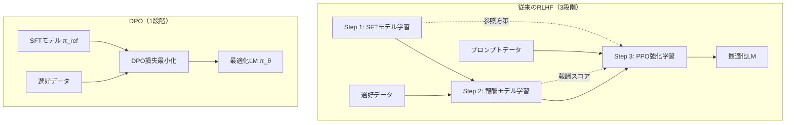

# Direct Preference Optimization: Your Language Model is Secretly a Reward Model

- **Link**: https://arxiv.org/abs/2305.18290
- **Authors**: Rafael Rafailov, Archit Sharma, Eric Mitchell, Stefano Ermon, Christopher D. Manning, Chelsea Finn
- **Year**: 2023
- **Venue**: NeurIPS 2023 (Oral)
- **Type**: Academic Paper

## Abstract

Existing methods for training language models from human preferences typically involve collecting human labels, fitting a reward model, and then fine-tuning the language model using reinforcement learning (e.g., PPO) to maximize the estimated reward without drifting too far from the original model. This RLHF pipeline is complex and often unstable. This paper introduces Direct Preference Optimization (DPO), leveraging a mapping between reward functions and optimal policies to show that the constrained reward maximization problem can be optimized exactly with a simple classification loss. DPO is stable, performant, and computationally lightweight, eliminating the need for sampling from the LM during fine-tuning or performing significant hyperparameter tuning. Experiments show that DPO can fine-tune LMs to align with human preferences as well as or better than existing methods on tasks including sentiment modulation, summarization, and single-turn dialogue.

## Abstract（日本語訳）

人間の選好から言語モデルを学習する既存の手法は、通常、人間のラベルを収集し、報酬モデルを学習した後、強化学習（例：PPO）を用いて言語モデルをファインチューニングし、元のモデルから大きく逸脱することなく推定報酬を最大化する。このRLHFパイプラインは複雑であり、しばしば不安定である。本論文はDirect Preference Optimization（DPO）を導入し、報酬関数と最適方策の間のマッピングを活用することで、制約付き報酬最大化問題を単純な分類損失で正確に最適化できることを示す。DPOは安定的で高性能かつ計算コストが低く、ファインチューニング中に言語モデルからのサンプリングや大規模なハイパーパラメータ調整を不要にする。実験により、DPOは感情制御、要約、単一ターン対話を含むタスクにおいて、既存手法と同等またはそれ以上に人間の選好に整合するように言語モデルをファインチューニングできることが示された。

## Overview

Direct Preference Optimization（DPO）は、RLHF（Reinforcement Learning from Human Feedback）の複雑な多段階パイプラインを、シンプルな分類損失関数に置き換える画期的な手法である。従来のRLHFでは「SFT → 報酬モデル学習 → PPOによるRL最適化」という3段階のパイプラインが必要であったが、DPOはこれを単一の教師あり学習ステップに凝縮する。

核心的な洞察は、Bradley-Terry選好モデルの下で報酬関数を最適方策の関数として解析的に表現できることである。この再パラメータ化により、報酬モデルを明示的に学習する必要がなくなり、選好データから直接方策を最適化できる。実験では、GPT-2からGPT-J（6Bパラメータ）までのモデルにおいて、感情制御・要約・対話の3タスクでPPOベースのRLHFと同等以上の性能を達成した。

## Problem

- **RLHFパイプラインの複雑さ**: 従来のRLHFは、SFT、報酬モデル学習、PPO最適化の3段階を必要とし、各段階で大量の計算リソースとハイパーパラメータ調整が必要
- **学習の不安定性**: PPOベースの強化学習は、Actor-Critic構造に起因する学習の不安定性を持ち、報酬ハッキングやモード崩壊のリスクがある
- **計算コスト**: 学習中にLMからのサンプリングが必要であり、別途報酬モデルの推論も必要なため、計算コストが高い
- **再現性の困難**: 多数のハイパーパラメータ（PPOのクリッピング率、GAE λ、報酬モデルの正則化等）の調整が必要で、再現が困難

## Proposed Method

**Direct Preference Optimization (DPO)**

DPOの核心的なアイデアは、KL制約付き報酬最大化問題の最適解を解析的に導出し、報酬関数を最適方策の関数として再パラメータ化することである。

### コアアイデア

1. KL制約付き報酬最大化問題 $\max_\pi E_{x \sim D}[E_{y \sim \pi(y|x)}[r(x,y)] - \beta D_{KL}[\pi(y|x) \| \pi_{ref}(y|x)]]$ の最適解が閉形式で得られる
2. この閉形式解を用いて報酬を方策の関数として表現する
3. Bradley-Terry選好モデルに代入すると、分配関数がキャンセルされ、方策のみの損失関数が得られる

### 主要アルゴリズムステップ

1. **参照モデルの準備**: SFTモデル $\pi_{ref}$ を教師ありファインチューニングで学習
2. **選好データの収集**: 入力 $x$ に対して、選好される出力 $y_w$ と選好されない出力 $y_l$ のペアを収集
3. **報酬の再パラメータ化**: 報酬関数を $r(x,y) = \beta \log \frac{\pi_\theta(y|x)}{\pi_{ref}(y|x)} + \beta \log Z(x)$ と表現
4. **DPO損失の最適化**: Bradley-Terry モデルへの代入により得られるDPO損失を最小化

### 既存手法との差異

- **PPO-RLHF**: 明示的な報酬モデル + 強化学習が必要 → DPOは不要
- **RLHF**: 学習中のLMサンプリングが必要 → DPOは不要
- **SLiC/RRHF**: ヒューリスティックな損失関数 → DPOは理論的に導出された損失

**Key Formulas**:

KL制約付き報酬最大化の最適解:

$$\pi^*(y|x) = \frac{1}{Z(x)} \pi_{ref}(y|x) \exp\left(\frac{1}{\beta} r(x,y)\right)$$

ここで $Z(x) = \sum_y \pi_{ref}(y|x) \exp\left(\frac{1}{\beta} r(x,y)\right)$ は分配関数。

報酬の再パラメータ化:

$$r(x,y) = \beta \log \frac{\pi^*(y|x)}{\pi_{ref}(y|x)} + \beta \log Z(x)$$

DPO損失関数:

$$\mathcal{L}_{DPO}(\pi_\theta; \pi_{ref}) = -\mathbb{E}_{(x, y_w, y_l) \sim \mathcal{D}} \left[ \log \sigma \left( \beta \log \frac{\pi_\theta(y_w|x)}{\pi_{ref}(y_w|x)} - \beta \log \frac{\pi_\theta(y_l|x)}{\pi_{ref}(y_l|x)} \right) \right]$$

ここで $\sigma$ はシグモイド関数、$\beta$ は参照方策からの乖離を制御する温度パラメータ、$y_w$ は選好される応答、$y_l$ は選好されない応答である。

**Features**:

- 明示的な報酬モデルの学習が不要
- 学習中のLMサンプリングが不要
- シンプルなバイナリ交差エントロピー損失
- ハイパーパラメータが $\beta$ のみ
- 理論的に同じRLHF目的関数を最適化

## Algorithm (Pseudocode)

```
Algorithm: Direct Preference Optimization (DPO)
Input: 選好データセット D = {(x_i, y_w_i, y_l_i)}, 参照モデル π_ref, 温度 β
Output: 最適化された方策 π_θ

1. π_θ ← π_ref を初期化                     // SFTモデルを初期パラメータとして使用
2. for each batch B ⊂ D do                   // ミニバッチ学習ループ
3.   for each (x, y_w, y_l) ∈ B do           // 各選好ペアに対して
4.     r_w ← β * log(π_θ(y_w|x) / π_ref(y_w|x))  // 選好応答の暗黙的報酬を計算
5.     r_l ← β * log(π_θ(y_l|x) / π_ref(y_l|x))  // 非選好応答の暗黙的報酬を計算
6.     loss ← -log(σ(r_w - r_l))             // Bradley-Terryモデルに基づく損失
7.   end for
8.   L ← mean(loss over B)                   // バッチ平均損失
9.   θ ← θ - α * ∇_θ L                      // 勾配降下法でパラメータ更新
10. end for
11. return π_θ                                // 最適化された方策を返す
```

## Architecture / Process Flow

### 従来のRLHFパイプライン vs DPO

```
【従来のRLHF】
選好データ → [報酬モデル学習] → 報酬モデル r_φ
                                      ↓
SFTモデル π_ref → [PPO強化学習] ← 報酬モデル r_φ
                       ↓
                  最適化されたLM π_θ

（3段階・複雑・不安定・高計算コスト）

【DPO】
選好データ + SFTモデル π_ref → [DPO損失の最小化（教師あり学習）] → 最適化されたLM π_θ

（1段階・シンプル・安定・低計算コスト）
```

### DPOの学習フロー

```mermaid
graph LR
    A[選好データ<br>x, y_w, y_l] --> B[π_θ: 学習中モデル]
    A --> C[π_ref: 参照モデル<br>frozen]
    B --> D[log π_θ y_w|x<br>log π_θ y_l|x]
    C --> E[log π_ref y_w|x<br>log π_ref y_l|x]
    D --> F[暗黙的報酬差<br>Δr = r_w - r_l]
    E --> F
    F --> G[σ Δr]
    G --> H[DPO Loss<br>-log σ Δr]
    H --> I[勾配更新<br>θ ← θ - α∇L]
    I --> B
```

## Figures & Tables

### 1. 主要実験結果テーブル: TL;DR要約タスクのWin Rate

GPT-4による評価。人間が書いた要約に対するWin Rate（高いほど良い）。

| アルゴリズム | Temp 0.0 | Temp 0.25 | Temp 0.5 | Temp 0.75 | Temp 1.0 |
|-------------|----------|-----------|----------|-----------|----------|
| **DPO** | **0.61** | **0.60** | **0.57** | **0.54** | **0.50** |
| PPO | 0.57 | 0.53 | 0.44 | 0.38 | 0.31 |
| Preferred-FT | 0.48 | 0.46 | 0.43 | 0.40 | 0.36 |
| Unpreferred-FT | 0.24 | 0.22 | 0.20 | 0.18 | 0.16 |
| SFT (GPT-J) | 0.33 | 0.32 | 0.30 | 0.28 | 0.25 |

**注記**: DPOは全てのサンプリング温度でPPOを上回り、特に高温度での堅牢性が顕著。PPOは温度1.0でベースGPT-Jレベルまで性能が劣化する。

### 2. システムアーキテクチャ図: RLHFパイプライン vs DPO



### 3. アブレーション / 分析テーブル: Out-of-Distribution汎化（CNN/DailyMail）

Reddit TL;DRで学習したモデルをCNN/DailyMail（分布外データ）で評価。GPT-4によるWin Rate。

| アルゴリズム | Temp 0.0 | Temp 0.25 | 相対改善（対PPO） |
|-------------|----------|-----------|------------------|
| **DPO** | **0.36** | **0.31** | — |
| PPO | 0.26 | 0.23 | — |
| Preferred-FT | 0.22 | 0.20 | — |
| DPO vs PPO | +0.10 | +0.08 | +38.5% / +34.8% |

**注記**: DPOは分布外データに対しても優れた汎化性能を示し、PPOを約35-39%上回る。

### 4. 手法比較テーブル

| 特徴 | DPO | PPO-RLHF | SLiC | RRHF | Best-of-N |
|------|-----|----------|------|------|-----------|
| 明示的報酬モデル | 不要 | 必要 | 不要 | 不要 | 必要 |
| 学習中サンプリング | 不要 | 必要 | 必要 | 必要 | 推論時のみ |
| 理論的保証 | あり | あり | なし | なし | あり |
| ハイパーパラメータ数 | 少（βのみ） | 多数 | 中程度 | 中程度 | 少 |
| 計算コスト | 低 | 高 | 中 | 中 | 非常に高 |
| 学習安定性 | 高い | 低い | 中程度 | 中程度 | N/A |
| 要約Win Rate (T=0) | 0.61 | 0.57 | — | — | — |
| OOD汎化 (T=0) | 0.36 | 0.26 | — | — | — |

### 5. 人間評価との一致率テーブル（Table 2）

GPT-4評価と人間評価の一致率検証。TL;DR要約タスクにおける各手法のWin Rate。

| 評価方法 | DPO | SFT | PPO |
|---------|-----|-----|-----|
| GPT-4 (Simple prompt) | 47% | 27% | 13% |
| GPT-4 (Concise prompt) | 54% | 32% | 12% |
| Human評価 | 58% | 43% | 17% |

| 一致率指標 | 値 |
|-----------|-----|
| GPT-4 ↔ 人間 一致率 | 67-70% |
| 人間同士の一致率 | 65-87% |
| 人間評価参加者数（DPO） | 272名 |
| 人間評価参加者数（SFT） | 122名 |
| 人間評価参加者数（PPO） | 199名 |

### 6. Anthropic HH 対話タスク結果

| 手法 | 選好応答に対する改善 | Best-of-128との比較 |
|------|-------------------|-------------------|
| **DPO** | 改善あり（唯一の効率的手法） | 同等以上 |
| PPO | 改善なし | 下回る |
| Preferred-FT | 改善なし | 下回る |
| Unpreferred-FT | 改善なし | 大幅に下回る |
| Best-of-128 | 改善あり | ベースライン |

**注記**: DPOはAnthropic HHテストセットにおいて、選好された応答（preferred completions）を超える改善を達成した唯一の計算効率の良い手法であり、計算コストの非常に高いBest-of-128サンプリングと同等の性能を実現。

## Experiments & Evaluation

### Setup

- **モデル**: GPT-2 Large（感情制御）、GPT-J 6B（要約・対話）、Pythia 2.8B（対話）
- **データセット**:
  - 感情制御: IMDb映画レビューデータセット
  - 要約: Reddit TL;DRデータセット（学習）、CNN/DailyMail（OOD評価）
  - 対話: Anthropic Helpful and Harmless (HH) データセット
- **評価指標**: GPT-4によるWin Rate評価、人間評価
- **ベースライン**: PPO（通常 + 地上真値報酬）、Preferred-FT、Unpreferred-FT、SFT、Best-of-128

### Main Results

#### 感情制御（IMDb）
- DPOは報酬-KLフロンティアにおいて全てのKL値でPPOを上回る
- 地上真値報酬にアクセスできるPPO-GT（PPO with ground-truth rewards）をも上回る
- これはDPOの最適化品質の高さを実証

#### 要約（TL;DR）
- DPOはTemp 0.0で61%のWin Rateを達成（PPOは57%）
- サンプリング温度の変化に対して高い堅牢性を示す
- PPOは高温度で性能が著しく劣化する一方、DPOは安定

#### 対話（Anthropic HH）
- DPOは選好応答を超える改善を達成した唯一の計算効率の良い手法
- Best-of-128サンプリングベースラインと同等の性能を実現

#### 分布外汎化（CNN/DailyMail）
- Reddit TL;DRで学習したモデルをCNN/DailyMailで評価
- DPOのWin Rate: 0.36（PPO: 0.26）、約38%の相対改善

### Ablation Study

#### 理論的分析

論文は3つの重要な理論的結果を提示:

1. **Lemma 1**: コンテキスト依存定数のみが異なる報酬関数は同一の選好分布を誘導
2. **Lemma 2**: そのような等価な報酬関数は同一の最適方策を生成
3. **Theorem 1**: Plackett-Luceモデル下の全ての報酬クラスが提案された再パラメータ化を許容（一般性の損失なし）

#### 温度パラメータ β の影響

$\beta$ は参照方策からの乖離をペナルティする度合いを制御する。大きな $\beta$ は参照方策に近い保守的な方策を生成し、小さな $\beta$ はより積極的な最適化を許容する。

## Notes

- **発表場所**: NeurIPS 2023でOral発表として採択（トップ約0.5%の論文）
- **影響力**: DPOはLLMアライメントの標準手法となり、Zephyr 7B、TÜLU 2 70B、Meta Llama等の主要モデルで採用
- **実装**: Hugging Face TRLライブラリ、OpenRLHFライブラリに統合済み
- **スケーラビリティの課題**: 論文では最大6Bパラメータのモデルでの検証にとどまるが、後続研究で70B以上のモデルでも有効性が確認
- **後続研究**: IPO、KTO、ORPO、SimPO等、DPOの理論的基盤を拡張・改善する多数の手法が提案されている
- **限界**: 著者らは分布外汎化の不確実性、報酬の過剰最適化の発現形態、桁違いに大きなモデルへのスケーリングについて限界を認めている

Sources:
- [arXiv: DPO Paper](https://arxiv.org/abs/2305.18290)
- [NeurIPS 2023 Proceedings](https://papers.nips.cc/paper_files/paper/2023/hash/a85b405ed65c6477a4fe8302b5e06ce7-Abstract-Conference.html)
- [ICLR Blog: RLHF without RL](https://iclr-blogposts.github.io/2024/blog/rlhf-without-rl/)
- [Hugging Face Paper Page](https://huggingface.co/papers/2305.18290)
