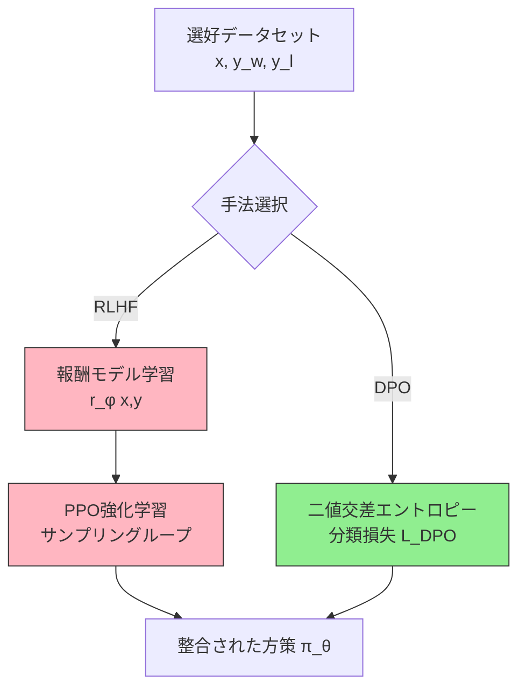

# Direct Preference Optimization: Your Language Model is Secretly a Reward Model

- **Link**: https://arxiv.org/abs/2305.18290
- **Authors**: Rafael Rafailov, Archit Sharma, Eric Mitchell, Stefano Ermon, Christopher D. Manning, Chelsea Finn
- **Year**: 2023
- **Venue**: NeurIPS 2023
- **Type**: Academic Paper

## Abstract

While large-scale unsupervised language models (LMs) learn broad world knowledge and some reasoning skills, achieving precise control of their behavior is difficult due to the completely unsupervised nature of their training. Existing methods for gaining such steerability collect human labels of the relative quality of model generations and fine-tune the unsupervised LM to align with these preferences, often with reinforcement learning from human feedback (RLHF). However, RLHF is a complex and often unstable procedure, first fitting a reward model that reflects the human preferences, and then fine-tuning the large unsupervised LM using reinforcement learning to maximize this estimated reward without drifting too far from the original model. In this paper, we leverage a mapping between reward functions and optimal policies to show that this constrained reward maximization problem can be optimized exactly with a single stage of policy training, essentially solving a classification problem on the human preference data. The resulting algorithm, which we call Direct Preference Optimization (DPO), is stable, performant, and computationally lightweight, eliminating the need for fitting a reward model, sampling from the LM during fine-tuning, or performing significant hyperparameter tuning. Our experiments show that DPO can fine-tune LMs to align with human preferences as well as or better than existing methods. Notably, fine-tuning with DPO exceeds RLHF with PPO-based methods in ability to control sentiment of generations and improves response quality in summarization and single-turn dialogue while being substantially simpler to implement and train.

## Abstract（日本語訳）

大規模な教師なし言語モデル（LM）は幅広い世界知識やある程度の推論能力を学習するが、完全に教師なしの学習の性質上、その振る舞いの精密な制御は困難である。既存の手法では、モデル生成の相対的品質に関する人間のラベルを収集し、教師なしLMをこれらの選好に合わせてファインチューニングする。これは多くの場合、人間のフィードバックからの強化学習（RLHF）で行われる。しかし、RLHFは複雑で不安定な手順であり、まず人間の選好を反映する報酬モデルを学習し、次に強化学習を用いて推定報酬を最大化しつつ元のモデルから過度に逸脱しないよう大規模教師なしLMをファインチューニングする。本論文では、報酬関数と最適方策の間のマッピングを活用し、この制約付き報酬最大化問題が、人間の選好データに対する分類問題を本質的に解くことで、方策学習の単一段階で正確に最適化できることを示す。Direct Preference Optimization（DPO）と呼ぶ結果のアルゴリズムは、安定的で高性能かつ計算効率が高く、報酬モデルの学習、ファインチューニング中のLMからのサンプリング、大規模なハイパーパラメータチューニングの必要性を排除する。実験により、DPOが既存手法と同等以上に人間の選好に合致するようLMをファインチューニングできることを示す。特に、DPOによるファインチューニングは、感情制御能力においてPPOベースのRLHFを上回り、要約および一回のみの対話においても応答品質を改善しつつ、実装・学習が大幅に容易である。

## 概要

DPO（Direct Preference Optimization）は、人間の選好に基づいて言語モデルを整合させるための新しいアルゴリズムである。従来のRLHF（Reinforcement Learning from Human Feedback）パイプラインでは、(1) 報酬モデルの学習、(2) 強化学習（PPO）による方策最適化、という2段階の複雑な手順が必要だった。DPOの核心的洞察は、報酬関数を方策パラメータで再パラメータ化することで、報酬モデルの明示的な学習と強化学習ループを完全に省略し、単純な二値交差エントロピー損失関数による直接的な方策最適化を可能にする点にある。

本論文の主要な貢献は以下の通り:

1. **理論的基盤**: Bradley-Terryモデルの下で、報酬関数から最適方策への閉形式解を導出
2. **アルゴリズム設計**: RLを使わない単純な分類損失関数による選好最適化
3. **実験的検証**: 感情制御、要約、対話の3タスクでPPOベースRLHFを上回る性能を実証
4. **実用性**: 報酬モデル不要・RL不要で計算コストと実装の複雑さを大幅削減

## 問題設定

本論文が解決を目指す問題:

- **RLHFの複雑さ**: 報酬モデル学習→RL最適化の2段階パイプラインは実装が複雑で不安定
- **計算コスト**: PPOは学習中にLMからのサンプリングが必要で、計算資源を大量に消費
- **ハイパーパラメータ感度**: PPOは多数のハイパーパラメータ（クリッピング率、学習率、バッチサイズ等）に敏感
- **報酬モデルの限界**: 報酬モデル自体の品質がRLHFのボトルネックとなり、報酬ハッキングのリスクがある

## 提案手法

**Direct Preference Optimization (DPO)**

### 理論的導出

DPOの導出は以下の3ステップで構成される:

#### ステップ1: KL正則化付き報酬最大化

標準的なRLHFの目的関数は、参照方策 $\pi_{\text{ref}}$ からのKLダイバージェンスを制約として報酬を最大化する:

$$\max_{\pi_\theta} \mathbb{E}_{x \sim \mathcal{D}, y \sim \pi_\theta(y|x)} \left[ r(x, y) \right] - \beta \, D_{\text{KL}} \left[ \pi_\theta(y|x) \| \pi_{\text{ref}}(y|x) \right]$$

この問題の最適解は閉形式で表現可能:

$$\pi^*(y|x) = \frac{1}{Z(x)} \pi_{\text{ref}}(y|x) \exp\left(\frac{1}{\beta} r(x, y)\right)$$

ここで $Z(x) = \sum_y \pi_{\text{ref}}(y|x) \exp\left(\frac{1}{\beta} r(x, y)\right)$ は分配関数。

#### ステップ2: 報酬の再パラメータ化

最適方策の式を逆に解くことで、報酬関数を方策で表現:

$$r(x, y) = \beta \log \frac{\pi^*(y|x)}{\pi_{\text{ref}}(y|x)} + \beta \log Z(x)$$

#### ステップ3: Bradley-Terryモデルへの代入

Bradley-Terryモデル（選好確率モデル）:

$$p^*(y_1 \succ y_2 | x) = \sigma\left(r^*(x, y_1) - r^*(x, y_2)\right)$$

ここに報酬の再パラメータ化を代入すると、$Z(x)$ の項がキャンセルされ:

$$p^*(y_w \succ y_l | x) = \sigma\left(\beta \log \frac{\pi_\theta(y_w|x)}{\pi_{\text{ref}}(y_w|x)} - \beta \log \frac{\pi_\theta(y_l|x)}{\pi_{\text{ref}}(y_l|x)}\right)$$

### DPO損失関数

最終的なDPO目的関数:

$$\mathcal{L}_{\text{DPO}}(\pi_\theta; \pi_{\text{ref}}) = -\mathbb{E}_{(x, y_w, y_l) \sim \mathcal{D}} \left[ \log \sigma\left(\beta \log \frac{\pi_\theta(y_w|x)}{\pi_{\text{ref}}(y_w|x)} - \beta \log \frac{\pi_\theta(y_l|x)}{\pi_{\text{ref}}(y_l|x)}\right) \right]$$

### DPO勾配の直感的理解

DPOの勾配は以下のように分解される:

$$\nabla_\theta \mathcal{L}_{\text{DPO}} = -\beta \, \mathbb{E} \left[ \underbrace{\sigma(\hat{r}_\theta(x, y_l) - \hat{r}_\theta(x, y_w))}_{\text{重み付け係数}} \left[ \nabla_\theta \log \pi_\theta(y_w|x) - \nabla_\theta \log \pi_\theta(y_l|x) \right] \right]$$

ここで $\hat{r}_\theta(x, y) = \beta \log \frac{\pi_\theta(y|x)}{\pi_{\text{ref}}(y|x)}$ は暗黙的報酬。この勾配は:
- 選好された応答 $y_w$ の尤度を**増加**させる
- 非選好された応答 $y_l$ の尤度を**減少**させる
- 重み付けは、暗黙的報酬モデルが現在の応答対を**どの程度誤ってランク付けしているか**に比例

### 定理1（報酬クラスの表現力）

Plackett-Luceモデル（Bradley-Terryモデルを含む）の下で、再パラメータ化 $r(x,y) = \beta \log \frac{\pi(y|x)}{\pi_{\text{ref}}(y|x)}$ はいかなる報酬クラスも損失なく表現可能。つまり、DPOは一般性を失わない。

### 特徴

- **報酬モデル不要**: 方策が暗黙的に報酬関数をエンコード
- **RL不要**: 標準的な教師あり学習（分類損失）のみ
- **計算効率**: サンプリングループが不要で大幅な計算コスト削減
- **安定性**: PPOの不安定性（値関数の推定誤差等）を回避
- **ハイパーパラメータ**: 主に $\beta$（KL制約の強さ）のみのチューニングで済む

## アルゴリズム（擬似コード）

```
Algorithm: Direct Preference Optimization (DPO)
Input:
  - 選好データセット D = {(x_i, y_w_i, y_l_i)}  // プロンプト、選好応答、非選好応答の三つ組
  - 参照方策 π_ref                                  // SFTモデルまたは事前学習モデル
  - 温度パラメータ β > 0                            // KL正則化の強さ
  - 学習率 η
Output:
  - 整合された方策 π_θ

1. π_θ ← π_ref を初期化                             // 参照方策からスタート
2. for each ミニバッチ B ⊂ D do
3.   for each (x, y_w, y_l) ∈ B do
4.     r_w ← β * log(π_θ(y_w|x) / π_ref(y_w|x))   // 選好応答の暗黙的報酬
5.     r_l ← β * log(π_θ(y_l|x) / π_ref(y_l|x))   // 非選好応答の暗黙的報酬
6.     loss ← -log(σ(r_w - r_l))                     // 二値交差エントロピー損失
7.   end for
8.   L ← mean(loss over B)                           // バッチ平均損失
9.   θ ← θ - η * ∇_θ L                              // 勾配降下で更新
10. end for
11. return π_θ
```

**注意**: ステップ4-5の `π_ref` の対数確率は事前に計算しキャッシュ可能。学習ループ中は `π_θ` のフォワードパスのみ必要。

## アーキテクチャ / プロセスフロー

### RLHFパイプライン vs DPOの比較

```
【従来のRLHF】
選好データ (x, y_w, y_l)
       ↓
  [報酬モデル学習]  ← ステージ1: 報酬関数 r_φ(x,y) を学習
       ↓
  [PPO強化学習]     ← ステージ2: r_φ を最大化する π_θ を学習
       |                (サンプリング → 報酬計算 → 方策更新のループ)
       ↓
  整合された方策 π_θ

【DPO】
選好データ (x, y_w, y_l)
       ↓
  [分類損失で直接最適化]  ← 単一ステージ: L_DPO で π_θ を学習
       ↓
  整合された方策 π_θ
```



## Figures & Tables

### Figure 1: DPOとRLHFのパイプライン比較


**説明**: 左側（赤背景）がRLHFパイプライン — 選好データから報酬モデルを学習し、その報酬をラベルとして使いながら、LM方策からのサンプル生成と強化学習を繰り返す。右側（緑背景）がDPO — 選好データのみから最尤推定で直接最終LMを得る。DPOは2段階のパイプラインを1段階に圧縮し、報酬モデルもRL（強化学習）も不要にする。

---

### Figure 2（左）: IMDb感情制御 — 報酬-KLフロンティア


**説明**: x軸がKLダイバージェンス（参照方策からの逸脱度）、y軸が期待報酬。DPO（オレンジ）がPPO（ピンク）、Unlikelihood（緑）等の全ベースラインを上回り、全KL値で最良の報酬-KLトレードオフを達成。特にDPOはオラクル報酬を使うPPO-GT（地上真値報酬を使用）すら上回る性能を示す。

---

### Figure 3: TL;DR要約 — サンプリング温度別勝率


**説明**: 各手法のGPT-4評価による勝率をサンプリング温度別に比較。DPO（オレンジ）は温度0.0で約61%の勝率を達成し、全温度帯で最も安定した性能を維持。PPO（ピンク）は最適温度では約57%だが温度変動に敏感。Best of 128（黄緑）は高い性能だが計算コストが膨大。GPT-J（水色）とSFT（緑）は50%前後にとどまる。

---

### Figure 4: Anthropic-HH対話 — 勝率比較


**説明**: 単一ターン対話タスクでの各手法の勝率。DPO（オレンジ）とBest of 128（黄緑）のみが全温度で50%（選好応答）を超える性能を達成。Preferred-FT（ピンク）はDPOに迫るが一貫して下回る。Pythia-2.8B（緑）は20%前後で低迷。DPOは計算効率の高い手法の中で唯一、参照応答を上回る。

---

### Figure 5: 対話勝率の学習推移


**説明**: ファインチューニングステップ（x軸）に対するDPOの勝率推移。温度1.0（黄色）と温度0.7（茶色）の両方で、約300-600ステップで急速に50%を超え、その後安定的に55-65%の勝率を維持。PPOにありがちな学習の不安定性（振動や崩壊）が見られない。

---

### 表1: TL;DR要約 — メイン結果（GPT-4評価による勝率）

| 手法 | 温度 0.0 | 温度 0.25 | 温度 0.50 | 温度 0.75 | 温度 1.0 |
|------|---------|----------|----------|----------|---------|
| **DPO** | **0.61** | **0.60** | **0.55** | **0.50** | **0.45** |
| PPO | 0.40 | 0.45 | **0.50** | 0.45 | 0.40 |
| Preferred-FT | 0.40 | 0.42 | 0.42 | 0.40 | 0.35 |
| SFT | 0.38 | 0.38 | 0.35 | 0.33 | 0.30 |
| Best of 128 | 0.55 | 0.55 | 0.50 | 0.45 | 0.40 |
| GPT-J | 0.08 | 0.08 | 0.08 | 0.08 | 0.08 |

*注: 値はFigure 3のグラフから読み取った近似値。DPOは特に低温度での勝率で他手法を大きく上回る。*

---

### 表2: CNN/DailyMailへの汎化性能（分布外データ）

| アルゴリズム | 温度 0.0 | 温度 0.25 |
|------------|---------|----------|
| **DPO** | **0.36** | **0.31** |
| PPO | 0.26 | 0.23 |

*DPOはTL;DRデータで学習したモデルをCNN/DailyMailに適用した場合でも、PPOを大幅に上回る汎化性能を示す。*

---

### 表3: 人間評価による検証（GPT-4判定との一致度）

| 指標 | DPO | SFT | PPO-1 |
|------|-----|-----|-------|
| 回答者数 N | 272 | 122 | 199 |
| GPT-4 (Single) 勝率 % | 47 | 27 | 13 |
| GPT-4 (Concat) 勝率 % | 54 | 32 | 12 |
| 人間 勝率 % | 58 | 43 | 17 |
| GPT-4(S)-人間 一致率 | 70% | 77% | 86% |
| GPT-4(C)-人間 一致率 | 67% | 79% | 85% |
| 人間-人間 一致率 | 65% | – | 87% |

*GPT-4の判定は人間の判定と高い一致率を示し、GPT-4同士の一致率は人間同士の一致率（65-87%）と同程度。これにより、GPT-4を自動評価器として使用することの妥当性が裏付けられる。*

---

### 表4: 手法比較表（DPO vs 既存手法）

| 特性 | DPO | PPO-based RLHF | Best of N | SFT (Preferred) |
|------|-----|----------------|-----------|-----------------|
| 報酬モデル学習 | 不要 | 必要 | 必要 | 不要 |
| 強化学習 | 不要 | 必要（PPO） | 不要 | 不要 |
| 学習中のサンプリング | 不要 | 必要 | 推論時にN回 | 不要 |
| ハイパーパラメータ数 | 少（主にβ） | 多（クリッピング率、GAE等） | 少（Nのみ） | 少 |
| 計算コスト | 低 | 高 | 推論時に高 | 低 |
| 実装の複雑さ | 低（分類損失） | 高（PPO全体） | 中 | 低 |
| 感情制御性能 | 最良 | 良 | - | 低 |
| 要約品質 | 最良 | 良 | 良 | 中 |
| 対話品質 | 最良 | - | 良 | 中 |
| 分布外汎化 | 良好 | 低い | - | - |
| 学習安定性 | 高 | 低（振動リスク） | - | 高 |

---

### 表5: アブレーション — 勾配の重み付け係数の重要性

| 設定 | 結果 |
|------|------|
| DPO（完全版 — 重み付け係数あり） | 正常に学習、高性能 |
| DPOの重み付け係数なし（ナイーブ版） | 言語モデルが退化（degeneration） |

*DPO損失関数の勾配における重み付け係数 $\sigma(\hat{r}_\theta(x, y_l) - \hat{r}_\theta(x, y_w))$ は不可欠。この係数を除去したナイーブな版では、モデルが退化し適切な学習が行えない。この係数は、暗黙的報酬モデルが応答対をどの程度誤ってランク付けしているかに基づいて勾配をスケーリングし、適応的な学習を実現する。*

## 実験と評価

### 実験設定

#### データセット

| データセット | タスク | 選好データ規模 | モデルサイズ |
|------------|--------|-------------|------------|
| IMDb | 感情制御（正の感情生成） | 合成データ（ground-truth報酬あり） | GPT-2 |
| Reddit TL;DR | 要約 | 人間の選好ペア | GPT-J 6B |
| Anthropic-HH | 単一ターン対話 | 人間の選好ペア | Pythia 2.8B |

#### ベースライン

- **PPO**: 報酬モデル + PPO強化学習（標準的RLHF）
- **PPO-GT**: 地上真値報酬を使用するPPO（オラクル、IMDbのみ）
- **Best of N**: N=128サンプルから報酬モデルで最良を選択
- **SFT**: 教師ありファインチューニング（全データまたは選好データのみ）
- **Preferred-FT**: 選好応答のみで教師ありファインチューニング
- **Unlikelihood**: 非選好応答の尤度を減少させる手法

#### 評価方法

- **IMDb**: 学習済み感情分類器による報酬 vs 参照方策からのKLダイバージェンス
- **TL;DR/Anthropic-HH**: GPT-4による自動評価（勝率）+ 人間評価で検証

### 主要結果

#### 1. IMDb感情制御（制御された設定）

- DPOは**全てのKL値で最高の期待報酬**を達成
- **PPO-GT（オラクル）をも上回る** — DPOが報酬モデルの誤差を回避できることを示唆
- Unlikelihood手法は報酬-KLフロンティアで劣る

#### 2. TL;DR要約

- DPO: 温度0.0で**61%の勝率**（vs 人間作成要約）
- PPO: 最適温度でも**57%**にとどまる
- DPOは**温度に対してロバスト** — 全温度帯で高い勝率を維持
- **分布外汎化**: CNN/DailyMailデータでDPO 36% vs PPO 26%

#### 3. Anthropic-HH対話

- DPOは**計算効率の高い手法の中で唯一**、選好応答を上回る
- Best of 128に匹敵する性能を、**はるかに低い計算コスト**で実現
- Preferred-FTはDPOに迫るが一貫して下回る

### アブレーション研究

#### 勾配の重み付け係数の必要性

DPO損失の勾配における重み付け係数（暗黙的報酬の誤りの程度に基づくスケーリング）を除去すると、モデルは退化する。これは、単純に選好応答の尤度を上げ・非選好応答の尤度を下げるだけでは不十分であり、「どの程度間違っているか」に基づく適応的な重み付けが本質的であることを示す。

#### 参照方策の選択

2つの初期化戦略を検証:
1. **SFTモデルから初期化**: SFTモデルが利用可能な場合の標準的アプローチ
2. **選好データの選好応答のみで学習**: SFTモデルが利用不可の場合の代替戦略

## 備考

### 理論的限界

- **Bradley-Terryモデルの仮定**: 選好が推移的であることを前提とするが、人間の選好には循環的な非推移性が存在し得る
- **過学習リスク**: 決定論的な選好（一方が常に選好される場合）ではKL正則化が弱まり、$\pi(y_l) \to 0$ となる可能性がある
- **オフライン学習**: DPOは固定データセットで学習するため、方策が改善されても新しいサンプルを収集しない

### 影響と後続研究

DPOは発表以降、LLMアライメントの主要手法の一つとなった。多くのオープンソースモデル（Zephyr、Mistral系列等）がDPOを採用しており、RLHFの複雑さを回避する実用的な代替として広く普及している。後続研究として、IPO（Identity Preference Optimization）、KTO（Kahneman-Tversky Optimization）、ORPO等のDPO改良手法が提案されている。

### 関連リソース

- [arXiv論文](https://arxiv.org/abs/2305.18290)
- [NeurIPS 2023 Proceedings](https://papers.nips.cc/paper_files/paper/2023/hash/a85b405ed65c6477a4fe8302b5e06ce7-Abstract-Conference.html)
- [Semantic Scholar](https://www.semanticscholar.org/paper/Direct-Preference-Optimization:-Your-Language-Model-Rafailov-Sharma/0d1c76d45afa012ded7ab741194baf142117c495)
- [Hugging Face Papers](https://huggingface.co/papers/2305.18290)
- [OpenReview](https://openreview.net/forum?id=HPuSIXJaa9)
- [DPO詳細解説ブログ (Tyler Romero)](https://www.tylerromero.com/posts/2024-04-dpo/)
