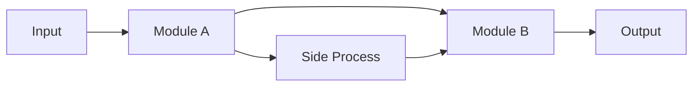

# Research Retrieval — Per-Resource Detailed Report Generator

Takes URLs, PDFs, keyword searches, or research-gather output as input, retrieves detailed information for each resource, and generates individual report files + an index file. Supports academic papers, patents, technical articles, and business cases.

## Auto Mode (`--auto`)

When `$ARGUMENTS` contains `--auto`, run the entire workflow **non-interactively** — skip ALL AskUserQuestion calls and use the following defaults:

| Parameter | Default Value |
|-----------|--------------|
| Priority Sections | All sections equally (Core method + Results + Problem + Practical applications) |
| Detail Level | Overview level (100-200 lines per report) |
| Additional Elements | None |
| Next Action (Step 7) | Done (自動終了) |

In `--auto` mode, the remaining text in `$ARGUMENTS` (after removing `--auto`) is used as the input (file path, URLs, or keywords). For example: `/research-retrieval --auto docs/research/resources-llm.md` → input is the gather result file.

If `$ARGUMENTS` does NOT contain `--auto`, proceed with the normal interactive workflow below.

## Pipeline Position

```
research-clustering → research-gather → research-retrieval
(domain mapping)      (resource lists)   (detailed reports)
```

This skill also works standalone — users can provide URLs, PDFs, or keywords directly without upstream skills.

## Report Quality Principles — Visual Richness

Reports must be dense with visual and structural elements. A report without figures, tables, and diagrams is an incomplete report. The reader should be able to skim the report and grasp the key ideas purely from the visual elements alone.

### Figures and Tables — The Most Important Part

Every report MUST contain a dedicated `## Figures & Tables` section. This section is NOT optional and must appear even if you have to construct the figures yourself from the text content. A report missing this section is considered a failure.

**What to include in Figures & Tables:**

1. **Reproduce every key table from the source** — If the paper has experimental results tables, reproduce them as Markdown tables with the exact numbers. If the source has 3 results tables, include all 3, not just 1.
2. **Recreate architecture/system diagrams** — Use Mermaid diagram syntax (`\`\`\`mermaid ... \`\`\``) or ASCII art to recreate figures from the source. For papers: the model architecture, the training pipeline, the data flow. For patents: the system diagram, the process flow.
3. **Create comparison tables even when the source doesn't have one** — If the source discusses related work or compares to baselines, synthesize this into a structured comparison table.
4. **Performance charts as tables** — When the source has line charts or bar charts showing performance, convert them to Markdown tables with the data points.

**Minimum requirements per resource type:**
- Academic Paper: at least 4 visual elements (main results table, architecture diagram, comparison table, ablation/analysis table)
- Patent: at least 3 visual elements (process flow diagram, claims structure table, prior art comparison table)
- Technical Article: at least 3 visual elements (architecture diagram, performance table, comparison table)
- Business Case: at least 2 visual elements (results before/after table, solution architecture diagram)

### Other Structural Elements

- **Step-by-step decomposition** — Break down methods, algorithms, processes, and patent claims into numbered step sequences. When a paper proposes a 3-phase training procedure, list each phase with its inputs, operations, and outputs. When a patent describes a process, decompose it into steps.
- **Mathematical formulas** — Include key equations using LaTeX notation (`$...$` for inline, `$$...$$` for display). For papers: the loss function, the core estimator, the objective function. For patents: any mathematical relationships in the claims. Don't skip formulas just because they're complex — they're often the most precise description of the method.
- **Pseudocode** — Always include pseudocode for algorithmic methods, not just when the user selects it in the hearing. If the source describes a procedure, convert it to pseudocode even if the original doesn't present it that way.
- **Comparison tables** — Whenever the source compares its approach to alternatives (which most papers and patents do), create a comparison table with columns for method name, key properties, strengths, and weaknesses.
- **Timeline/flow diagrams** — For multi-stage processes, create Mermaid diagrams or ASCII flow diagrams showing the data flow or process stages.

Think of each report as a "cheat sheet" someone could use to quickly understand and potentially reimplement the approach. If a reader has to go back to the original source to see a table or figure, the report has failed its purpose.

## Workflow

### Step 1: Parse Input

Determine the input type and extract resources to investigate.

**Supported input types:**

1. **research-gather output** — Markdown file with resource tables. Parse URLs, titles, and types from the table rows.
2. **URL list** — One or more URLs provided in conversation or in a file (one per line, or comma-separated).
3. **PDF files** — Local PDF file paths. Use the Read tool to extract content from PDFs.
4. **Keywords/search terms** — Keywords provided in conversation. Run WebSearch to find relevant resources, then proceed with the discovered URLs.
5. **Mixed input** — Any combination of the above.

**Input detection logic:**
- If the input is a Markdown file with resource tables (containing columns like Title, URL, Year), treat as gather output
- If the input contains `arxiv.org` URLs, flag those resources as academic papers
- If the input contains `patents.google.com`, `USPTO`, or patent numbers, flag as patents
- If the input contains local file paths ending in `.pdf`, flag as PDF input
- Otherwise, treat as keywords and search first

### Step 2: Resource Type Classification

Classify each resource into one of four types. This determines which report template and information-gathering strategy to use.

| Type | Detection signals |
|------|-------------------|
| **Academic Paper** | arXiv URL, DOI link, `.pdf` from academic domain, gather output marked as paper |
| **Patent** | Patent number format, patents.google.com URL, gather output marked as patent |
| **Technical Article** | Blog URLs, GitHub repos, conference talk links, technical documentation |
| **Business Case** | Company case study URLs, market report links, press releases |

If the type is ambiguous, infer from context or ask the user via AskUserQuestion.

### Step 3: User Hearing

> **`--auto` mode**: Skip this entire step. Use the default values from the Auto Mode table above.

Confirm report parameters via AskUserQuestion. Skip hearings for parameters already specified.

#### Hearing 1: Priority Sections

```
AskUserQuestion:
  question: "Which sections should be emphasized in each report? (multiple selection)"
  header: "Priority Sections"
  multiSelect: true
  options:
    - label: "Core method/technology details"
      description: "Algorithm steps, technical architecture, formulas, key innovations in detail"
    - label: "Results & evaluation"
      description: "Experimental results, performance metrics, comparison with alternatives"
    - label: "Problem & motivation"
      description: "What problem is being solved, why it matters, background context"
    - label: "Practical applications"
      description: "Real-world use cases, implementation considerations, applicability conditions"
```

#### Hearing 2: Detail Level

```
AskUserQuestion:
  question: "What detail level should each report have?"
  header: "Detail Level"
  multiSelect: false
  options:
    - label: "Overview level (recommended)"
      description: "100-200 lines per report. Concise summary of key points"
    - label: "Detailed level"
      description: "200-400 lines per report. In-depth analysis with formulas/architecture"
    - label: "Brief level"
      description: "50-100 lines per report. Minimal: summary, key points, and links only"
```

#### Hearing 3: Additional Elements

```
AskUserQuestion:
  question: "Would you like to include any additional elements? (multiple selection)"
  header: "Additional Elements"
  multiSelect: true
  options:
    - label: "Cross-resource relationship map"
      description: "Show relationships, citations, or evolution between resources in index.md"
    - label: "Comparison table"
      description: "Add a feature/method comparison table to index.md"
    - label: "Further investigation candidates"
      description: "List related resources worth investigating from references/citations"
    - label: "None"
      description: "Basic structure only"
```

### Step 4: Information Retrieval

Retrieve detailed information for each resource using the appropriate strategy based on resource type.

#### Figure & Table Acquisition Strategy

Figures and tables are critical to report quality. Use the best available method depending on the input type:

**Priority order (use the highest available):**

1. **PDF input** → Extract figures directly from PDF using the bundled script
2. **HTML version available** (arXiv `/html/`, blog posts, web articles) → Download `` images from HTML via `curl`
3. **Neither available** → Recreate as Mermaid diagrams, ASCII art, and Markdown tables

##### Method 1: PDF Figure Extraction (for PDF input)

When the input is a local PDF file, extract embedded images and figure pages:

```bash
uv run --with pymupdf python <skill-dir>/scripts/extract_figures.py <pdf_path> <output_dir>/figures/ [--min-size 150]
```

Where `<skill-dir>` is the directory containing this SKILL.md (use the absolute path). The script:
- Extracts all embedded images (diagrams, charts, photos) larger than `min-size` pixels
- Renders full pages that contain figure/table captions as high-resolution PNGs
- Writes `metadata.json` listing all extracted images with page numbers and dimensions

After extraction:
1. Read the extracted images using the Read tool to visually inspect them
2. Reference them in the report using relative Markdown image links: ``
3. Add captions and descriptions in Japanese based on what you see in each image
4. Still recreate key tables as Markdown tables (for text searchability) in addition to the image

##### Method 2: HTML Image Reference (for URL input with HTML version)

When an HTML version of the resource is available (arXiv `/html/`, blog posts, technical articles), include figures from the HTML in the report:

1. **WebFetch the HTML page** and identify `` tags that represent figures, charts, or diagrams (skip navigation icons, logos, and decorative images — look for `<figure>`, `` inside content areas, images with `alt` text mentioning "figure", "table", "diagram")
2. **Extract the full image URL** from each `` tag (resolve relative URLs to absolute)
3. **Embed directly in the report** using the absolute URL: ``
4. Add captions from the HTML `<figcaption>` or surrounding text, translated to Japanese
5. **Optionally download** images locally using `curl -L -o <output_dir>/figures/fig-NNN.png <image_url>` if Bash is available — but URL reference is sufficient if Bash is not available

The key point: every figure identified in the HTML **must** appear in the report, either as a downloaded local file or as a direct URL reference. Never skip a figure just because you cannot download it locally.

**HTML figure sources by resource type:**
- **arXiv**: `arxiv.org/html/XXXX.XXXXXvN` — contains `` tags for all paper figures. Typical URL pattern: `https://arxiv.org/html/XXXX.XXXXXvN/x1.png`, `https://arxiv.org/html/XXXX.XXXXXvN/figures/...`. When WebFetching the HTML page, look for `` tags inside `<figure>` elements or with `src` containing image extensions.
- **Tech blogs** (Google AI Blog, Meta Research, etc.): figures are standard `` tags
- **GitHub READMEs**: images are often hosted on `raw.githubusercontent.com` or `user-images.githubusercontent.com`
- **Patent pages** (Google Patents): contain patent drawing images as `` tags

**Example for arXiv paper 2305.18290:**
```markdown


```

##### Method 3: Text-based Recreation (fallback)

When neither PDF nor HTML images are available, recreate figures using:
- **Mermaid diagrams** for architecture, flowcharts, and process flows
- **ASCII art** for simple diagrams
- **Markdown tables** for data tables, comparison charts, and results

This is always done in addition to Methods 1 and 2 — extracted images alone are not sufficient. Tables should always be reproduced as Markdown for text searchability.

---

#### 4a: Academic Papers (arXiv-first)

For academic papers, arXiv is the primary source because it provides open-access content, stable URLs, and consistent metadata.

**Retrieval strategy — WebFetch is mandatory for every paper:**

1. **URL normalization**: Convert any arXiv URL to the abstract page format (`arxiv.org/abs/XXXX.XXXXX`). Also derive the HTML version URL (`arxiv.org/html/XXXX.XXXXXvN`) and the PDF URL (`arxiv.org/pdf/XXXX.XXXXX`).
2. **WebFetch the abstract page** (`arxiv.org/abs/...`): Always fetch this first. Extract title, authors, abstract, submission date, categories, and comments (which often mention the venue, page count, and number of figures/tables).
3. **WebFetch the HTML version** (`arxiv.org/html/...`): Always attempt this as the second fetch. The HTML version contains the full paper text including section headings, equations, figure captions, table data, and algorithm listings. Also download figure images from the HTML `` tags using Method 2 above.
4. **If HTML version is unavailable**: Download the PDF (`curl -L -o /tmp/{paper-id}.pdf https://arxiv.org/pdf/{paper-id}`) and extract figures using Method 1 above.
5. **WebSearch for supplementary context**: After fetching, search for `"{paper title}" {first author}` to find blog posts, presentation slides, code repositories, and discussions that provide additional context.
6. **For non-arXiv papers**: Use WebFetch on the provided URL (IEEE, ACM, OpenReview, etc.). If the page has HTML figures, download them (Method 2). Fall back to WebSearch with the paper title if fetching fails.
7. **For PDF input**: Use the Read tool to extract text content from the PDF file. Extract figures using Method 1 above.

The report quality depends heavily on the information retrieved. Do not skip WebFetch calls — they provide the concrete numbers, formulas, and experimental details needed for a useful report. Vague or qualitative descriptions (e.g., "high", "improved") are not acceptable when specific numbers are available in the source.

**Information to extract:**
- Title, authors (full list), year, venue
- Abstract (original English)
- Core problem and motivation
- Proposed method/approach with key details, including specific formulas and algorithm steps
- Experimental results with **specific numbers** (accuracy, win rates, scores, etc.) — never use vague qualitative descriptions when the source contains quantitative data
- Notable figures/tables content (recreate as Markdown tables or ASCII diagrams)

#### 4b: Patents

**Retrieval strategy — WebFetch is mandatory for every patent:**

1. **WebFetch the patent page**: Always fetch the full patent page from Google Patents, USPTO, or the provided URL. Google Patents pages contain structured data (claims, description, classifications, family info) that is essential for report quality.
2. **Download patent drawing images**: Google Patents pages contain `` tags for patent drawings. Download them using Method 2 (HTML image download) from the Figure Acquisition Strategy above. Patent drawings are essential for understanding the invention.
3. **Extract structured data**: Patent number, title, assignee, filing/grant dates, inventors, classification codes (IPC/CPC).
4. **Parse claims and description**: Focus on independent claims and the technical description summary. Extract specific claim language.
5. **Supplementary search**: WebSearch for related patents in the same family, and any litigation or licensing information.

**Information to extract:**
- Patent number, title, assignee/applicant, inventors
- Filing date, grant date, priority date
- Classification codes (IPC/CPC)
- Abstract
- Key independent claims (summarized)
- Technical approach description
- Patent family information (if available)

#### 4c: Technical Articles

**Retrieval strategy — WebFetch is mandatory:**

1. **WebFetch the article URL**: Always fetch the full article content. Extract all technical details, code snippets, architecture descriptions, and performance data from the fetched content.
2. **Download figures from HTML**: Tech blogs and articles contain `` tags for diagrams, charts, and screenshots. Download them using Method 2 (HTML image download) from the Figure Acquisition Strategy above.
3. **For GitHub repos**: WebFetch the README and key metadata (stars, language, last update). Download any diagram images from the README.
4. **For conference talks**: WebSearch for slides, video, or transcript, then WebFetch discovered URLs.
5. **Supplementary context**: WebSearch for discussions, reviews, or follow-up articles.

**Information to extract:**
- Title, author/organization, date
- Core technical content and key takeaways
- Architecture or design decisions
- Code examples or implementation details (if relevant)
- Community reception and impact

#### 4d: Business Cases

**Retrieval strategy — WebFetch is mandatory:**

1. **WebFetch the case URL**: Always fetch the full article/report content. Extract all quantitative metrics, timelines, and implementation details.
2. **Supplementary search**: WebSearch for additional coverage, results, or follow-up reports.
3. **Company context**: WebSearch for the company's position in the industry.

**Information to extract:**
- Company/organization, industry, date
- Problem being addressed
- Solution implemented (technology, approach)
- Results and metrics (quantitative where available)
- Lessons learned, challenges encountered

### Step 5: Generate Report Files

Create one report file per resource, using the appropriate template based on resource type.

#### 5a: Academic Paper Report Template

Use an incremental ID as prefix, followed by a kebab-case short name.
Example: `01-causal-forest.md`, `02-meta-learner.md`

```markdown
# {Paper title}

- **Link**: {URL}
- **Authors**: {Author list}
- **Year**: {Publication year}
- **Venue**: {Journal/Conference name}
- **Type**: Academic Paper

## Abstract

{Original English abstract text}

## Abstract (Japanese Translation)

{Japanese translation of the abstract. Preserve the original meaning accurately while writing natural Japanese}

## Overview

{Overview of the paper. Not a mere repetition of the Abstract — organize and present the key points of the entire paper}

## Problem

{Problems the paper aims to solve, in list format}

- **{Problem name}**: {Description}

## Proposed Method

**{Method name}**

{Description of the method:}

- Core idea
- Main algorithm steps (decompose into numbered steps)
- Differences from existing methods

**Key Formulas**:

{Include the core mathematical formulations. For example:}

$$L(\theta) = \sum_{i=1}^{N} \ell(y_i, f(x_i; \theta)) + \lambda \|\theta\|_2^2$$

{Explain each variable and what the formula represents.}

**Features**:

- {Feature 1}
- {Feature 2}

## Algorithm (Pseudocode)

{Always include pseudocode for algorithmic methods.
Present in pseudocode format with explanations for each step.}

```
Algorithm: {Method name}
Input: {Input description}
Output: {Output description}

1. {Step 1}    // {Explanation}
2. {Step 2}    // {Explanation}
3. {Step 3}    // {Explanation}
...
```

## Architecture / Process Flow

{Create an ASCII or Mermaid diagram showing the overall architecture, data flow, or process stages.}

```
Input Data → [Preprocessing] → [Module A] → [Module B] → Output
                                    ↓
                              [Side Process]
```

## Figures & Tables

{THIS SECTION IS MANDATORY AND MUST NOT BE SKIPPED. Include at minimum 4 visual elements.

Reproduce every significant table and figure from the source. If the paper has 5 tables, include all 5.
If the source has architecture diagrams, recreate them. The reader should never need to open the original.

1. **Main results table** — reproduce the primary experimental results with exact numbers:

| Method | Dataset A | Dataset B | Dataset C |
|--------|-----------|-----------|-----------|
| Proposed | 95.2 | 87.1 | 92.3 |
| Baseline 1 | 91.4 | 83.2 | 88.7 |
| Baseline 2 | 89.8 | 81.5 | 86.4 |

2. **Architecture / system diagram** — Mermaid or ASCII art:



3. **Ablation study / analysis table** — component contribution analysis:

| Configuration | Metric | Delta |
|---------------|--------|-------|
| Full model | 95.2 | — |
| w/o Component A | 92.1 | -3.1 |
| w/o Component B | 93.5 | -1.7 |

4. **Method comparison table** — synthesize from related work discussion:

| Feature | This Work | Prior Art A | Prior Art B |
|---------|-----------|-------------|-------------|
| {feature} | {value} | {value} | {value} |

5. **Additional tables** — any other tables from the source (dataset statistics, hyperparameters, per-category breakdown, etc.)}

## Experiments & Evaluation

{Experimental setup, comparison methods, and main results.
Structure as:}

### Setup
{Datasets, metrics, baselines used}

### Main Results
{Key findings with specific numbers. Reproduce the main results table.}

### Ablation Study
{If available: which components contribute how much}

## Notes

{Additional notable points, references to related work, practical usage tips}
```

#### 5b: Patent Report Template

```markdown
# {Patent title}

- **Patent Number**: {number}
- **Assignee**: {assignee/applicant}
- **Inventors**: {inventor list}
- **Filing Date**: {date}
- **Grant Date**: {date, if granted}
- **Classification**: {IPC/CPC codes}
- **Link**: {URL}
- **Type**: Patent

## Abstract

{Patent abstract — original language}

## Abstract (Japanese Translation)

{Japanese translation if the original is not in Japanese}

## Overview

{Concise overview of the invention and its significance}

## Technical Problem

{What technical problem does this patent address?}

## Technical Solution

{Core technical approach of the invention. Decompose into numbered steps:}

### Process Steps

1. **Step 1**: {Description} → {Output}
2. **Step 2**: {Description} → {Output}
3. **Step 3**: {Description} → {Output}

### Key Innovation

- What is novel compared to prior art
- Technical advantage gained

### Mathematical Relationships

{If the patent includes any mathematical formulas or relationships in the claims or description:}

$$\text{formula from patent}$$

## Key Claims

{Summarize the independent claims. Decompose complex claims into sub-elements:}

### Claim 1 (Main)

{Summary of the main independent claim, broken into elements:}

- **Element a)**: {description}
- **Element b)**: {description}
- **Element c)**: {description}

### Claim N

{Other notable independent claims, similarly decomposed}

## Process Flow Diagram

{Mandatory. Recreate the patent's process as an ASCII or Mermaid flow diagram:}

```
[Input] → [Step 1: Process A] → [Step 2: Process B] → [Output]
               ↓                        ↑
         [Database/Model]          [Feedback Loop]
```

## Figures & Tables

{Mandatory. Include at minimum 2 visual elements:

1. **Claims structure table**:

| Claim # | Type | Depends On | Key Element |
|---------|------|-----------|-------------|
| 1 | Independent | — | {main invention} |
| 2 | Dependent | 1 | {specific feature} |

2. **Prior art comparison table**:

| Feature | This Patent | Prior Art A | Prior Art B |
|---------|------------|-------------|-------------|
| {feature} | {value} | {value} | {value} |

3. **System architecture diagram** — recreate from patent figures}

## Patent Family & Related Art

{Related patents, patent family members, cited prior art — to the extent available}

## Notes

{Commercial significance, licensing status, potential applications}
```

#### 5c: Technical Article Report Template

```markdown
# {Article title}

- **Source**: {Author/Organization}
- **Date**: {Publication date}
- **Link**: {URL}
- **Type**: Technical Article / OSS Project / Conference Talk

## Overview

{Concise overview of the article's key message and significance}

## Key Technical Content

{Main technical insights, architecture decisions, or implementation details.
Decompose into structured subsections:}

### Architecture / Design

{Describe the system architecture or design. Include a diagram:}

```
[Component A] ←→ [Component B] → [Component C]
      ↓                                ↑
[Data Store]  ─────────────────────────┘
```

### Implementation Steps

{Break down the implementation or approach into numbered steps:}

1. **Step 1**: {description}
2. **Step 2**: {description}
3. **Step 3**: {description}

### Key Formulas / Metrics

{If the article includes any quantitative analysis or formulas:}

| Metric | Value | Context |
|--------|-------|---------|
| {metric} | {value} | {what it means} |

## Figures & Tables

{Mandatory. Include at minimum 2 visual elements:
- Architecture diagram (ASCII/Mermaid)
- Performance or comparison table
- Timeline or process flow diagram}

## Practical Takeaways

{What can a practitioner learn and apply from this? Structure as actionable items:}

1. {Takeaway 1}
2. {Takeaway 2}
3. {Takeaway 3}

## Notes

{Community reception, follow-up work, related resources}
```

#### 5d: Business Case Report Template

```markdown
# {Case title}

- **Company/Organization**: {name}
- **Industry**: {industry}
- **Date**: {date}
- **Link**: {URL}
- **Type**: Business Case

## Overview

{Concise overview of the case and its significance}

## Problem & Context

{Business problem being addressed, market context}

## Solution

{Technology/approach implemented:}

- What was built or adopted
- Key technical decisions
- Integration approach

## Results & Impact

{Quantitative and qualitative results:}

| Metric | Before | After |
|--------|--------|-------|
| {metric} | {value} | {value} |

## Figures & Tables

{Mandatory. Visualize key results, architecture, or timeline.}

## Lessons Learned

{Key takeaways, challenges encountered, recommendations}

## Notes

{Follow-up developments, related cases, broader implications}
```

### Step 6: Generate Index File

Create `index.md` in the output directory with links and summaries for all reports.

```markdown
# {Research Theme} — Detailed Reports

## Parameters

- **Resources analyzed**: {total count}
- **Resource types**: {Paper / Patent / Technical / Business}
- **Generated on**: {YYYY-MM-DD}
- **Input source**: {gather output / user URLs / PDF files / keyword search}

## Report List

### Academic Papers

| # | Title | Year | Venue | Summary | Report |
|---|-------|------|-------|---------|--------|
| 1 | {title} | {year} | {venue} | {one-line} | [Details](01-xxx.md) |

### Patents

| # | Title | Patent No. | Assignee | Year | Report |
|---|-------|-----------|----------|------|--------|
| 1 | {title} | {number} | {assignee} | {year} | [Details](02-xxx.md) |

### Technical Articles

| # | Title | Source | Date | Report |
|---|-------|--------|------|--------|
| 1 | {title} | {source} | {date} | [Details](03-xxx.md) |

### Business Cases

| # | Title | Company | Date | Report |
|---|-------|---------|------|--------|
| 1 | {title} | {company} | {date} | [Details](04-xxx.md) |

{Include only the sections relevant to the resources analyzed. Omit empty sections.}

## Cross-Resource Insights

{If "Cross-resource relationship map" was selected: show relationships, common themes, or evolution across resources.}

## Comparison Table

{If "Comparison table" was selected: comparative table of methods, approaches, or solutions.}

## Further Investigation Candidates

{If selected: list of related resources worth investigating, discovered during retrieval.}
```

### Step 7: Output Confirmation

> **`--auto` mode**: Skip this step entirely. Treat the result as "Done" and finish.

```
AskUserQuestion:
  question: "Reports are complete. What would you like to do next?"
  header: "Next Action"
  multiSelect: false
  options:
    - label: "Done"
      description: "Finalize the current output"
    - label: "Revise specific reports"
      description: "Revise or enhance specific report files"
    - label: "Change structure/detail level"
      description: "Adjust section structure or detail level and regenerate"
    - label: "Investigate additional resources"
      description: "Find and analyze additional related resources"
```

If "Revise specific reports" is selected, present a follow-up AskUserQuestion with report titles as options.

## Output Location

**MUST READ FIRST**: Before deciding the output path, read `docs/research/README.md` (the single source of truth for the research directory layout) and `.claude/rules/research.md`.

### Path resolution

1. Identify the **domain** (`<domain>`, `snake_case`):
   - If the input is a gather/clustering file under `docs/research/runs/<domain>/...`, use that `<domain>`.
   - Otherwise infer from context or ask the user.
2. Identify the **cluster** (`<cluster>`):
   - From the gather file's cluster context (e.g., `metalearner`, `nl2sql-nl2code`).
   - If retrieving for a free-form URL/PDF list with no cluster context, use `all`.
3. If `docs/research/domains/<domain>/domain.yaml` defines `output_paths.retrieval`, use it.
4. Otherwise use the default path:

   ```
   docs/research/runs/<domain>/retrieval/<YYYYMMDD>_<cluster>/
   ```

   - Place `index.md` and per-resource files (`NN-kebab-case-name.md`) inside this directory.
5. **Never write directly under `docs/research/domains/<domain>/reports/`** — that layer is symlinks.
6. **Never overwrite previous retrieval runs** — append-only.

### After writing

Update the latest pointer:

```bash
ln -snf <YYYYMMDD>_<cluster> docs/research/runs/<domain>/retrieval/latest_<cluster>
ln -snf ../../../runs/<domain>/retrieval/latest_<cluster> docs/research/domains/<domain>/reports/<cluster>
```

### Filename conventions

- Report filenames: `{NN}-{kebab-case-short-name}.md` (NN = zero-padded sequential number)
- Index filename: `index.md`

## Parallel Processing

When processing multiple resources, use the Agent tool to spawn subagents for concurrent retrieval and report generation. Each subagent handles one resource. Group into batches of 3-5 to avoid rate limiting on WebFetch.

## Integration with Other Skills

- **research-gather** (upstream): Accepts gather output files directly. Parse the resource tables and generate detailed reports for each entry.
- **research-clustering** (upstream): Can accept clustering output to understand domain context, improving report quality.
- **research-prompt-builder**: Can generate focused research prompts based on report findings.

## Language

- User interactions (AskUserQuestion, etc.) follow the project's response language setting
- For academic papers: include both the original English abstract and Japanese translation
- Keep method names, patent titles, and proper nouns in their original language
- **All user-facing output, reports, and summaries must be written in Japanese(すべてのユーザーへの出力は日本語にしてください)**
