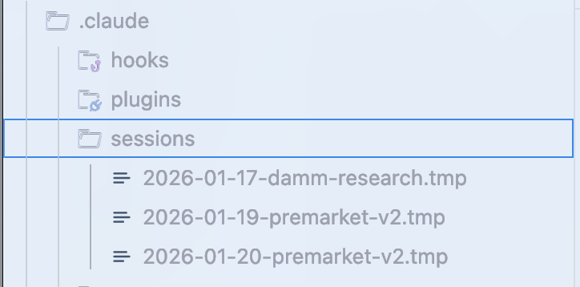

# Everything Claude Code 詳細ガイド


---

> **前提条件**: このガイドは [Everything Claude Code 簡易ガイド](./the-shortform-guide.md) の上に構築されています。スキル、フック、サブエージェント、MCP、プラグインをまだセットアップしていない場合は、先にそちらを読んでください。


*簡易ガイド - まずこちらを読んでください*

簡易ガイドでは、基礎的なセットアップをカバーしました：スキルとコマンド、フック、サブエージェント、MCP、プラグイン、そして効果的なClaude Codeワークフローの基盤となる設定パターン。それがセットアップガイドと基本インフラでした。

この詳細ガイドでは、生産的なセッションと無駄なセッションを分ける技術について掘り下げます。簡易ガイドを読んでいない場合は、戻って設定を先にセットアップしてください。以下の内容は、スキル、エージェント、フック、MCPがすでに設定・動作していることを前提としています。

ここでのテーマ：トークンエコノミクス、メモリ永続化、検証パターン、並列化戦略、そして再利用可能なワークフロー構築の複利効果。これらは10ヶ月以上の日常使用で洗練したパターンで、最初の1時間でコンテキスト劣化に悩まされるのと、何時間も生産的なセッションを維持する違いを生み出します。

簡易ガイドと詳細ガイドで取り上げたすべてがGitHubで利用可能です: `github.com/affaan-m/everything-claude-code`

---

## ヒントとコツ

### 一部のMCPは代替可能でコンテキストウィンドウを解放できる

バージョン管理（GitHub）、データベース（Supabase）、デプロイメント（Vercel、Railway）などのMCPについて - これらのプラットフォームのほとんどは、MCPが本質的にラップしているだけの堅牢なCLIをすでに持っています。MCPは便利なラッパーですが、コストがかかります。

MCPを実際に使わずに（それに伴うコンテキストウィンドウの縮小なしに）CLIをMCPのように機能させるには、機能をスキルとコマンドにバンドルすることを検討してください。MCPが公開している便利なツールを取り出して、コマンドに変換しましょう。

例: GitHub MCPを常時ロードする代わりに、好みのオプションで `gh pr create` をラップする `/pr` コマンドを作成。Supabase MCPがコンテキストを消費する代わりに、Supabase CLIを直接使用するスキルを作成。

遅延読み込みにより、コンテキストウィンドウの問題はほぼ解決されました。しかしトークン使用量とコストは同じようには解決されていません。CLI + スキルアプローチは依然としてトークン最適化の手法です。

---

## 重要な内容

### コンテキストとメモリ管理

セッション間でメモリを共有するには、進捗を要約・確認し、`.claude` フォルダ内の `.tmp` ファイルに保存してセッション終了まで追記するスキルまたはコマンドが最善です。翌日にはそれをコンテキストとして使用し、中断した場所から再開できます。古いコンテキストが新しい作業を汚染しないよう、セッションごとに新しいファイルを作成してください。


*セッションストレージの例 -> https://github.com/affaan-m/everything-claude-code/tree/main/examples/sessions*

Claudeが現在の状態を要約するファイルを作成します。レビューし、必要なら編集を依頼し、新しいセッションを開始。新しい会話ではファイルパスを提供するだけです。コンテキスト制限に達し、複雑な作業を継続する必要がある場合に特に有用です。これらのファイルには以下を含めるべきです：
- うまくいったアプローチ（証拠付きで検証可能）
- 試みたがうまくいかなかったアプローチ
- まだ試していないアプローチと残りの作業

**戦略的なコンテキストクリア：**

計画を設定しコンテキストをクリア（現在のClaude Codeのプランモードのデフォルトオプション）した後、計画に基づいて作業できます。実行にはもう関連のない多くの探索コンテキストが蓄積された場合に有用です。戦略的コンパクションには、自動コンパクトを無効にしてください。論理的な間隔で手動コンパクトするか、自動で行うスキルを作成してください。

**上級: 動的システムプロンプト注入**

私が取り入れたパターン：CLAUDE.md（ユーザースコープ）や `.claude/rules/`（プロジェクトスコープ）にすべてを入れるだけでなく（これらは毎セッション読み込まれる）、CLIフラグを使ってコンテキストを動的に注入します。

```bash
claude --system-prompt "$(cat memory.md)"
```

これにより、いつどのコンテキストを読み込むかをより精密に制御できます。システムプロンプトの内容はユーザーメッセージより高い権限を持ち、ユーザーメッセージはツール結果より高い権限を持ちます。

**実践的なセットアップ：**

```bash
# 日常の開発
alias claude-dev='claude --system-prompt "$(cat ~/.claude/contexts/dev.md)"'

# PRレビューモード
alias claude-review='claude --system-prompt "$(cat ~/.claude/contexts/review.md)"'

# リサーチ/探索モード
alias claude-research='claude --system-prompt "$(cat ~/.claude/contexts/research.md)"'
```

**上級: メモリ永続化フック**

メモリに役立つ、あまり知られていないフックがあります：

- **PreCompactフック**: コンテキストコンパクション前に重要な状態をファイルに保存
- **Stopフック（セッション終了）**: セッション終了時に学習内容をファイルに永続化
- **SessionStartフック**: 新しいセッション開始時に前回のコンテキストを自動読み込み

これらのフックを構築し、リポジトリの `github.com/affaan-m/everything-claude-code/tree/main/hooks/memory-persistence` に公開しています。

---

### 継続学習 / メモリ

プロンプトを何度も繰り返す必要があり、Claudeが同じ問題にぶつかったり、以前聞いた回答を返してきたりした場合 - それらのパターンはスキルに追記すべきです。

**問題:** トークンの浪費、コンテキストの浪費、時間の浪費。

**解決策:** Claude Codeが自明でないことを発見した場合 - デバッグ技術、回避策、プロジェクト固有のパターンなど - その知識を新しいスキルとして保存します。次に同様の問題が発生した際、スキルが自動的にロードされます。

これを行う継続学習スキルを構築しました: `github.com/affaan-m/everything-claude-code/tree/main/skills/continuous-learning`

**なぜStopフック（UserPromptSubmitではなく）：**

重要な設計判断はUserPromptSubmitではなく**Stopフック**を使うことです。UserPromptSubmitはすべてのメッセージで実行され、各プロンプトに遅延を追加します。Stopはセッション終了時に1回だけ実行 - 軽量で、セッション中の速度低下がありません。

---

### トークン最適化

**主要戦略: サブエージェントアーキテクチャ**

使用するツールを最適化し、タスクに十分な最も安価なモデルに委任するように設計されたサブエージェントアーキテクチャ。

**モデル選択クイックリファレンス：**


*さまざまな一般的タスクでのサブエージェントの仮想的なセットアップとその選択の理由*

| タスクタイプ | モデル | 理由 |
| ----------- | ------ | ---- |
| 探索/検索 | Haiku | 高速、低コスト、ファイル検索には十分 |
| 簡単な編集 | Haiku | 単一ファイルの変更、明確な指示 |
| 複数ファイルの実装 | Sonnet | コーディングに最適なバランス |
| 複雑なアーキテクチャ | Opus | 深い推論が必要 |
| PRレビュー | Sonnet | コンテキストを理解し、ニュアンスを捉える |
| セキュリティ分析 | Opus | 脆弱性を見逃す余裕がない |
| ドキュメント作成 | Haiku | 構造がシンプル |
| 複雑なバグのデバッグ | Opus | システム全体を頭に入れる必要がある |

コーディングタスクの90%はSonnetをデフォルトに。最初の試行が失敗した場合、5ファイル以上にまたがるタスク、アーキテクチャの判断、セキュリティ重要なコードの場合はOpusにアップグレード。

**料金参考：**


*ソース: https://platform.claude.com/docs/en/about-claude/pricing*

**ツール固有の最適化：**

grepをmgrepに置き換え - 従来のgrepやripgrepと比較して平均約50%のトークン削減：


*50タスクのベンチマークで、mgrep + Claude Codeは同等以上の品質評価でgrepベースのワークフローの約2倍少ないトークンを使用。ソース: https://github.com/mixedbread-ai/mgrep*

**モジュール式コードベースのメリット：**

メインファイルが数千行ではなく数百行のより モジュール式なコードベースは、トークン最適化コストと最初の試行でタスクを正しく完了することの両方に役立ちます。

---

### 検証ループと評価

**ベンチマークワークフロー：**

スキルありとなしで同じ要求をし、出力の違いを確認して比較：

会話をフォークし、一方でスキルなしの新しいワークツリーを開始し、最後にdiffを確認し、ログされた内容を確認。

**評価パターンの種類：**

- **チェックポイントベースの評価**: 明示的なチェックポイントを設定、定義された基準に対して検証、進行前に修正
- **継続的評価**: N分ごとまたは大きな変更後に実行、完全なテストスイート + リント

**主要指標：**

```
pass@k: k回の試行のうち少なくとも1回が成功
        k=1: 70%  k=3: 91%  k=5: 97%

pass^k: k回の試行すべてが成功する必要あり
        k=1: 70%  k=3: 34%  k=5: 17%
```

動けばよい場合は **pass@k** を使用。一貫性が不可欠な場合は **pass^k** を使用。

---

## 並列化

マルチClaude端末セットアップで会話をフォークする場合、フォークと元の会話のアクションのスコープを明確に定義してください。コード変更の重複を最小限に。

**私の好みのパターン：**

コード変更にはメインチャット、コードベースと現在の状態に関する質問や外部サービスの調査にはフォーク。

**任意のターミナル数について：**


*Boris（Anthropic）の複数Claudeインスタンス実行について*

Borisは並列化についてのヒントを持っています。ローカルで5つ、アップストリームで5つのClaudeインスタンスを実行するなどを提案しています。任意のターミナル数を設定することはお勧めしません。ターミナルの追加は真の必要性から行うべきです。

目標は：**最小限の並列化で最大限の成果を得ること。**

**並列インスタンス用のGitワークツリー：**

```bash
# 並列作業用のワークツリーを作成
git worktree add ../project-feature-a feature-a
git worktree add ../project-feature-b feature-b
git worktree add ../project-refactor refactor-branch

# 各ワークツリーに独自のClaudeインスタンス
cd ../project-feature-a && claude
```

インスタンスのスケーリングを始める場合、かつ互いに重複するコードで作業する複数のClaudeインスタンスがある場合、gitワークツリーを使用し、それぞれに非常に明確な計画を持つことが不可欠です。`/rename <名前>` を使ってすべてのチャットに名前を付けてください。


*スタートセットアップ: 左ターミナルでコーディング、右ターミナルで質問 - /rename と /fork を使用*

**カスケード方式：**

複数のClaude Codeインスタンスを実行する場合、「カスケード」パターンで整理：

- 新しいタスクは右側の新しいタブで開く
- 左から右へ、古いものから新しいものへスイープ
- 同時に最大3-4タスクに集中

---

## 基盤作り

**2インスタンスキックオフパターン：**

自分のワークフロー管理として、空のリポジトリで2つのClaudeインスタンスを開いてスタートするのが好きです。

**インスタンス1: スキャフォールディングエージェント**
- スキャフォールドと基盤を構築
- プロジェクト構造を作成
- 設定をセットアップ（CLAUDE.md、ルール、エージェント）

**インスタンス2: ディープリサーチエージェント**
- すべてのサービスに接続、ウェブ検索
- 詳細なPRDを作成
- アーキテクチャのmermaidダイアグラムを作成
- 実際のドキュメントの引用付きで参考資料をまとめる

**llms.txt パターン：**

利用可能な場合、多くのドキュメント参照でドキュメントページにアクセスした後 `/llms.txt` を行うことで `llms.txt` を見つけることができます。これにより、LLM最適化されたクリーンなバージョンのドキュメントが得られます。

**哲学: 再利用可能なパターンを構築**

@omarsar0 より: 「初期に再利用可能なワークフロー/パターンの構築に時間を費やしました。構築は面倒でしたが、モデルとエージェントハーネスが改善されるにつれて、驚異的な複利効果がありました。」

**投資すべきもの：**

- サブエージェント
- スキル
- コマンド
- 計画パターン
- MCPツール
- コンテキストエンジニアリングパターン

---

## エージェントとサブエージェントのベストプラクティス

**サブエージェントのコンテキスト問題：**

サブエージェントはすべてをダンプする代わりに要約を返すことでコンテキストを節約するために存在します。しかしオーケストレーターはサブエージェントが持たないセマンティックコンテキストを持っています。サブエージェントはリテラルなクエリのみを知り、リクエストの背後にある**目的**を知りません。

**反復的取得パターン：**

1. オーケストレーターがすべてのサブエージェントの返答を評価
2. 受け入れる前にフォローアップの質問をする
3. サブエージェントがソースに戻り、回答を得て返す
4. 十分になるまでループ（最大3サイクル）

**重要:** クエリだけでなく、目的のコンテキストを渡す。

**順次フェーズ付きオーケストレーター：**

```markdown
フェーズ1: リサーチ（Exploreエージェント使用） → research-summary.md
フェーズ2: 計画（plannerエージェント使用） → plan.md
フェーズ3: 実装（tdd-guideエージェント使用） → コード変更
フェーズ4: レビュー（code-reviewerエージェント使用） → review-comments.md
フェーズ5: 検証（必要ならbuild-error-resolver使用） → 完了またはループバック
```

**重要なルール：**

1. 各エージェントは1つの明確な入力を受け、1つの明確な出力を生成
2. 出力が次のフェーズの入力になる
3. フェーズを飛ばさない
4. エージェント間で `/clear` を使用
5. 中間出力をファイルに保存

---

## お楽しみ / 重要ではないが楽しいヒント

### カスタムステータスライン

`/statusline` で設定できます - Claudeはまだ設定されていないことを伝え、何を表示したいか聞いてセットアップしてくれます。

参照: https://github.com/sirmalloc/ccstatusline

### 音声トランスクリプション

音声でClaude Codeに話しかけましょう。多くの人にとってタイピングより速いです。

- Mac では superwhisper、MacWhisper
- トランスクリプションのミスがあっても、Claudeは意図を理解します

### ターミナルエイリアス

```bash
alias c='claude'
alias gb='github'
alias co='code'
alias q='cd ~/Desktop/projects'
```

---

## マイルストーン


*1週間足らずで25,000以上のGitHubスター*

---

## リソース

**エージェントオーケストレーション：**

- https://github.com/ruvnet/claude-flow - 54以上の専門エージェントを持つエンタープライズオーケストレーションプラットフォーム

**自己改善型メモリ：**

- https://github.com/affaan-m/everything-claude-code/tree/main/skills/continuous-learning
- rlancemartin.github.io/2025/12/01/claude_diary/ - セッション振り返りパターン

**システムプロンプトリファレンス：**

- https://github.com/x1xhlol/system-prompts-and-models-of-ai-tools - システムプロンプトのコレクション（110kスター）

**公式：**

- Anthropic Academy: anthropic.skilljar.com

---

## 参考文献

- [Anthropic: AIエージェントの評価を解明する](https://www.anthropic.com/engineering/demystifying-evals-for-ai-agents)
- [YK: 32のClaude Codeヒント](https://agenticcoding.substack.com/p/32-claude-code-tips-from-basics-to)
- [RLanceMartin: セッション振り返りパターン](https://rlancemartin.github.io/2025/12/01/claude_diary/)
- @PerceptualPeak: サブエージェントコンテキストネゴシエーション
- @menhguin: エージェント抽象化ティアリスト
- @omarsar0: 複利効果の哲学

---

*両方のガイドで取り上げたすべてがGitHubの [everything-claude-code](https://github.com/affaan-m/everything-claude-code) で利用可能です*
