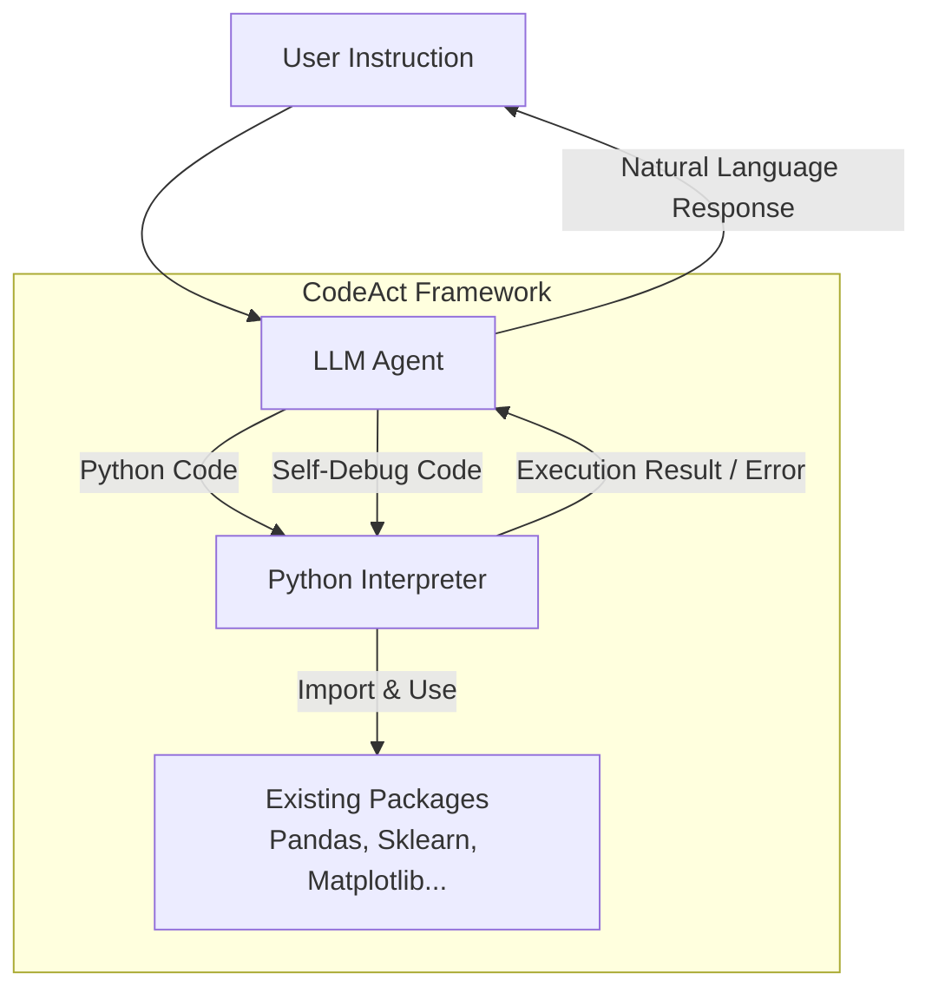

# Executable Code Actions Elicit Better LLM Agents

- **Link**: https://arxiv.org/abs/2402.01030
- **Authors**: Xingyao Wang, Yangyi Chen, Lifan Yuan, Yizhe Zhang, Yunzhu Li, Hao Peng, Heng Ji
- **Year**: 2024
- **Venue**: ICML 2024
- **Type**: Academic Paper
- **GitHub**: https://github.com/xingyaoww/code-act

## Abstract

Large Language Model (LLM) agents, capable of performing a broad range of actions, such as invoking tools and controlling robots, show great potential in tackling real-world challenges. LLM agents are typically prompted to produce actions by generating JSON or text in a pre-defined format, which is usually limited by constrained action space (e.g., the scope of pre-defined tools) and restricted flexibility (e.g., inability to compose multiple tools). This work proposes to use executable Python code to consolidate LLM agents' actions into a unified action space (CodeAct). Integrated with a Python interpreter, CodeAct can execute code actions and dynamically revise prior actions or emit new actions upon new observations through multi-turn interactions. Our extensive analysis of 17 LLMs on API-Bank and a newly curated benchmark shows that CodeAct outperforms widely used alternatives (up to 20% higher success rate). The encouraging performance of CodeAct motivates us to build an open-source LLM agent that interacts with environments by executing interpretable code and collaborates with users using natural language. To this end, we collect an instruction-tuning dataset CodeActInstruct that consists of 7k multi-turn interactions using CodeAct. We show that it can be used with existing data to improve models in agent-oriented tasks without compromising their general capability. CodeActAgent, finetuned from Llama2 and Mistral, is integrated with Python interpreter and uniquely tailored to perform sophisticated tasks (e.g., model training) using existing libraries and autonomously self-debug.

## Abstract（日本語訳）

大規模言語モデル（LLM）エージェントは、ツール呼び出しやロボット制御など幅広いアクションを実行可能であり、現実世界の課題解決に大きな可能性を示している。LLMエージェントは通常、JSONやテキストなどの定義済みフォーマットでアクションを生成するよう促されるが、これはアクション空間の制約（定義済みツールの範囲）や柔軟性の制限（複数ツールの組み合わせ不能）に制約される。本研究では、実行可能なPythonコードを用いてLLMエージェントのアクションを統一的なアクション空間（CodeAct）に集約することを提案する。Pythonインタプリタと統合されたCodeActは、コードアクションを実行し、マルチターンインタラクションを通じて過去のアクションを動的に修正したり、新たな観測に基づいて新しいアクションを発行したりできる。17のLLMに対するAPI-Bankおよび新たにキュレーションされたベンチマークでの広範な分析により、CodeActは広く使用されている代替手法を上回る（最大20%高い成功率）ことが示された。CodeActの有望な性能に動機づけられ、実行可能なコードで環境と対話し自然言語でユーザーと協調するオープンソースLLMエージェントを構築した。そのために、CodeActを用いた7kのマルチターンインタラクションからなる指示チューニングデータセットCodeActInstructを収集した。これを既存データと組み合わせることで、一般的な能力を損なうことなくエージェント指向タスクのモデル性能を向上できることを示した。Llama2およびMistralからファインチューニングされたCodeActAgentは、Pythonインタプリタと統合され、既存ライブラリを用いた高度なタスク（モデル訓練など）の実行と自律的なセルフデバッグに特化している。

## Overview

CodeActは、LLMエージェントのアクション表現としてJSON/テキストの代わりに**実行可能なPythonコード**を採用するフレームワークである。従来のJSON/テキストベースのアクション形式は、定義済みツールの範囲に限定されるアクション空間の制約や、複数ツールの動的な組み合わせが困難という柔軟性の制限があった。CodeActはこれらの課題を、Pythonインタプリタとの統合によるマルチターンインタラクション、既存ソフトウェアパッケージの活用、事前学習からのコード親和性、制御/データフローのネイティブサポートという4つの利点で解決する。17のLLMを用いた評価では最大20%の成功率向上を達成し、さらにCodeActInstruct（7,139件のマルチターンインタラクション）による指示チューニングで、汎用能力を損なわずにエージェント性能を向上させたCodeActAgentを構築した。

## Problem

- **アクション空間の制約**: JSON/テキスト形式では、事前定義されたツールの範囲内でしかアクションを実行できず、新しいツールや操作への対応が困難
- **柔軟性の制限**: 複数ツールの動的な組み合わせ（composition）ができず、複雑なタスクへの対応力が低い
- **動的修正の困難さ**: 実行結果に基づいてアクションを修正・再試行する仕組みが欠如
- **オープンソースLLMの性能格差**: クローズドソースモデルに比べてエージェントタスクでの性能が大幅に劣る

## Proposed Method

**CodeAct**

LLMエージェントのアクション空間をPythonコードに統一するフレームワーク。エージェントは観測（ユーザー指示またはコード実行結果）を受け取り、Pythonコードをアクションとして出力する。

- **核心アイデア**: エージェントのアクションとしてJSON/テキストの代わりに実行可能なPythonコードを採用し、Pythonインタプリタで直接実行
- **主要アルゴリズムステップ**:
  1. ユーザーから指示（observation）を受け取る
  2. Pythonコードをアクションとして生成
  3. Pythonインタプリタでコードを実行
  4. 実行結果（observation）をフィードバックとして受け取る
  5. エラーがあれば修正コードを生成して再実行（セルフデバッグ）
  6. タスク完了まで2-5を繰り返す
- **既存手法との差異**: JSON形式は定義済みツールAPI呼び出しに限定、テキスト形式はパース精度に依存するが、CodeActはプログラミング言語の表現力を直接活用

**特徴**:

- Pythonの制御フロー（ループ、条件分岐）をネイティブにサポート
- 既存のPythonパッケージ（Pandas、Scikit-Learn、Matplotlibなど）をツール定義なしで活用可能
- マルチターンインタラクションによるエラー回復・セルフデバッグ
- 事前学習でコードに親しんだLLMの強みを最大限に活用

## Algorithm（擬似コード）

```
Algorithm: CodeAct Multi-Turn Interaction
Input: ユーザー指示 instruction, 環境 env, 最大ターン数 max_turns
Output: タスク結果 result

1. observation ← instruction                    // 初期観測はユーザー指示
2. for t = 1 to max_turns do:
3.   action ← LLM.generate(observation)         // Pythonコードを生成
4.   if action is natural_language then:
5.     return action                             // ユーザーへの応答として返す
6.   result ← env.execute(action)               // Pythonインタプリタで実行
7.   observation ← format_result(result)         // 実行結果を次の観測に
8.   if task_completed(result) then:
9.     return result                             // タスク完了
10. return timeout_result                        // 最大ターン到達
```

## Architecture / Process Flow



```
User Instruction
      ↓
┌─────────────────────────────────┐
│         LLM Agent               │
│   (CodeAct Action Generation)   │
└──────────┬──────────────────────┘
           ↓ Python Code
┌─────────────────────────────────┐
│      Python Interpreter         │
│  ┌───────────┐ ┌─────────────┐  │
│  │  Pandas   │ │ Scikit-Learn│  │
│  └───────────┘ └─────────────┘  │
│  ┌───────────┐ ┌─────────────┐  │
│  │ Matplotlib│ │  Any Lib    │  │
│  └───────────┘ └─────────────┘  │
└──────────┬──────────────────────┘
           ↓ Result / Error
    Observation → LLM Agent (loop)
           ↓
    Natural Language Response → User
```

## Figures & Tables

### Figure 1: CodeAct vs Text/JSON アクション比較


CodeAct（左）はPythonコードでツールを直接呼び出し、変数の再利用・条件分岐・ループを自然に記述できる。一方、JSON（中央）は各ツール呼び出しを個別のオブジェクトとして定義する必要があり、テキスト（右）は自然言語記述のパースに依存する。


M3ToolEvalベンチマークにおける各アクション形式の成功率と平均ターン数の比較。CodeActが多くのモデルで最高の成功率と最少ターン数を達成。

### Figure 2: マルチターンインタラクションフレームワーク


エージェント（Agent）、ユーザー（User）、環境（Environment）の3つの役割とそのインタラクションを示す一般的なフレームワーク。CodeActInstructデータセットの構築動機となった。

### Figure 3: CodeActAgent実行例


CodeActAgent（Mistral-7B）がPandas、Scikit-Learn、Matplotlibを使用してモデル訓練を行うマルチターンインタラクション例。インコンテキストデモンストレーションなしで実行。

### Table 1: API-Bank アトミックAPIコール正答率

各アクション形式（CodeAct / JSON / Text）における17モデルの正答率比較:

| Model | CodeAct | JSON | Text | Best |
|-------|---------|------|------|------|
| GPT-4-1106-preview | 76.7% | **82.7%** | 73.4% | JSON |
| GPT-4-0613 | **80.5%** | 79.7% | 72.2% | CodeAct |
| GPT-3.5-turbo-1106 | 72.2% | **73.7%** | 69.9% | JSON |
| Claude-2 | 68.4% | **71.4%** | 62.4% | JSON |
| Gemini-Pro | **67.7%** | 63.2% | 64.7% | CodeAct |
| Llama-2-70b | 35.6% | 14.3% | **37.6%** | Text |
| Lemur-70b | **49.6%** | 45.9% | 48.9% | CodeAct |
| CodeLlama-34b | **27.8%** | 14.3% | 24.8% | CodeAct |

*CodeActは17モデル中8モデルで最高性能（オープンソース4、クローズド4）*

### Table 2: M3ToolEval 成功率・平均ターン数

複合ツール使用タスクにおける成功率（↑）と平均ターン数（↓）:

| Model | CodeAct SR | JSON SR | Text SR | CodeAct Turns | JSON Turns | Text Turns |
|-------|-----------|---------|---------|---------------|------------|------------|
| GPT-4-1106-preview | **74.4%** | 61.0% | 54.9% | **5.5** | 7.1 | 7.3 |
| GPT-4-0613 | **69.5%** | 53.7% | 56.1% | **5.6** | 6.5 | 7.0 |
| GPT-3.5-turbo-1106 | **54.9%** | 30.5% | 32.9% | **6.9** | 8.5 | 8.7 |
| Claude-2 | **54.9%** | 31.7% | 29.3% | **7.2** | 8.3 | 8.5 |
| Gemini-Pro | **36.6%** | 26.8% | 20.7% | **7.2** | 8.0 | 8.6 |
| Lemur-70b | **13.4%** | 3.7% | 8.5% | **8.5** | 9.6 | 9.4 |

*CodeActは17モデル中12モデルで最高成功率、12モデルで最少ターン数を達成。最大20%の絶対的成功率向上。*

### Table 3: CodeActInstruct データセット統計

| データソース | インスタンス数 | トークン数 | 平均トークン/インスタンス |
|-------------|--------------|-----------|------------------------|
| Information Seeking (HotpotQA) | 1,664 | — | — |
| Software Package (MATH) | 1,732 | — | — |
| Software Package (APPS) | 647 | — | — |
| External Memory (WikiTableQuestion) | 1,065 | — | — |
| Robot Planning (ALFWorld) | 2,031 | — | — |
| **CodeActInstruct 合計** | **7,139** | **10,581,681** | **1,482.24** |
| General Conversation | 69,230 | 55,146,326 | — |

*FireActの5倍のトークン数、AgentInstructの3.8倍のインスタンス数*

### Table 4: CodeActAgent 評価結果

CodeActAgent と既存手法のベンチマーク比較:

| Model | MINT ID | MINT OD | M3ToolEval | MMLU | HumanEval | GSM8K | MTBench |
|-------|---------|---------|------------|------|-----------|-------|---------|
| **CodeActAgent (Mistral-7B)** | **57.4%** | **32.4%** | **12.2%** | 57.6 | 34.1 | 36.5 | 6.38 |
| **CodeActAgent (Llama-2-7B)** | **51.3%** | **20.4%** | — | 45.5 | 12.8 | 22.9 | 5.60 |
| Llama-2-7B Chat baseline | — | 11.0% | — | 46.5 | 12.8 | 22.6 | — |
| FireAct (7B) | — | 0.3% | — | — | — | — | — |
| AgentLM (7B) | — | 6.1% | — | — | — | — | — |
| AgentInstruct (7B) | — | — | — | — | — | — | — |

*CodeActAgentはAgentInstructに対して24%、FireActに対して119%の相対的性能向上*

### Table 5: Ablation Study（Llama-2-7B）

各コンポーネントの寄与分析:

| 構成 | MINT ID | Overall | Delta |
|------|---------|---------|-------|
| Full model (CodeActInstruct + General) | **51.3%** | **35.1%** | — |
| w/o CodeActInstruct | 17.0% | 34.5% | -34.3 (ID) |
| w/o General Conversations | 29.2% | 22.9% | -22.1 (ID) |

CodeActInstructの除去はエージェントタスク（MINT ID）で-34.3%の大幅な性能低下を引き起こす。General Conversationの除去は汎用能力（Overall）に大きく影響。

### 手法比較テーブル

| 特徴 | CodeAct | JSON | Text |
|------|---------|------|------|
| アクション空間 | 無制限（Python全体） | 定義済みツールに限定 | 自然言語で記述 |
| ツール組み合わせ | ネイティブサポート | 困難 | パース依存 |
| 動的修正 | Pythonインタプリタ経由 | 再生成が必要 | 再生成が必要 |
| 制御フロー | ループ・条件分岐可能 | 不可 | 限定的 |
| 既存パッケージ活用 | 直接import可能 | ラッパー必要 | 不可 |
| セルフデバッグ | エラー情報から自動修正 | エラー情報が限定的 | エラー検出困難 |
| 複雑タスク成功率 | 最大74.4% | 最大61.0% | 最大56.1% |

## Experiments & Evaluation

### Setup

- **ベンチマーク**: API-Bank（アトミックツール使用）、M3ToolEval（複合ツール使用、82タスク、新規キュレーション）
- **評価対象**: 17のLLM（GPT-4、Claude-2、Gemini-Pro、Llama-2、Mistral等）
- **アクション形式**: CodeAct、JSON、Text の3形式を比較
- **評価指標**: 成功率（exact match）、平均インタラクションターン数
- **設定**: ゼロショット、最大10ターン

### Main Results

1. **アトミックツール使用（API-Bank）**: CodeActは17モデル中8モデルで最高性能。特にオープンソースモデルで優位性が顕著
2. **複合ツール使用（M3ToolEval）**: CodeActは12/17モデルで最高成功率を達成。GPT-4では74.4%（JSONの61.0%に対して+13.4%）。平均ターン数も12/17モデルで最少
3. **スケーリング特性**: モデルの能力が高いほどCodeActの優位性が拡大する傾向

### Ablation Study

- **CodeActInstruct除去**: エージェントタスク（MINT ID）で-34.3%の大幅な性能低下（51.3% → 17.0%）
- **General Conversation除去**: 全体的な能力（Overall）で-12.2%の低下（35.1% → 22.9%）
- **結論**: 両データソースが相補的に機能し、エージェント能力と汎用能力の両立に不可欠

### Training Configuration

- モデル: Llama-2-7B、Mistral-7B
- シーケンス長: 4,096（Llama-2）、16,384（Mistral）
- 学習率: 1e-5（コサイン減衰）
- バッチサイズ: 32、5エポック
- ハードウェア: 4×A100 40GB GPU
- フォーマット: chatML

## Notes

- **ICML 2024** に採択された論文であり、LLMエージェントのアクション設計における重要な方向性を示す
- **OpenDevin（現OpenHands）プロジェクト**の基盤となった研究。CodeActの概念はその後のエージェントフレームワーク設計に広く影響を与えた
- **実用上の注意**: コード実行を伴うため、サンドボックス環境での実行が安全性の観点から必須
- **ハルシネーション**: LLMが存在しないAPIやパッケージを生成するケースが観測されており、今後の課題
- **データセット・モデル・コード**: https://github.com/xingyaoww/code-act で公開
