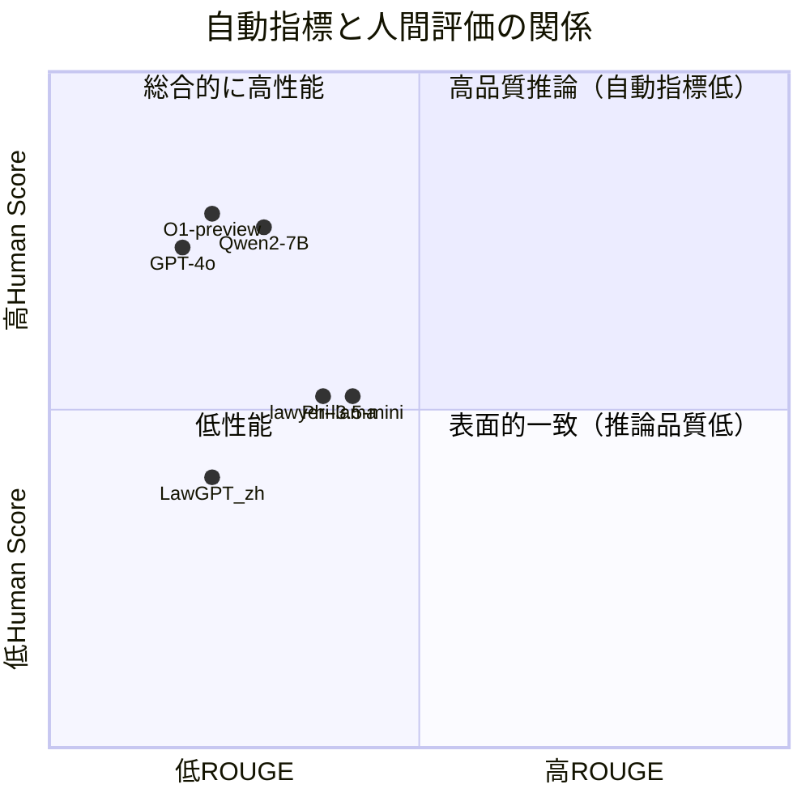

# Legal Evalutions and Challenges of Large Language Models

- **Link**: https://arxiv.org/abs/2411.10137
- **Authors**: Jiaqi Wang, Huan Zhao, Zhenyuan Yang, Peng Shu, Junhao Chen, Haobo Sun, Ruixi Liang, Shixin Li, Pengcheng Shi, Longjun Ma, Zongjia Liu, Zhengliang Liu, Tianyang Zhong, Yutong Zhang, Chong Ma, Xin Zhang, Tuo Zhang, Tianli Ding, Yudan Ren, Tianming Liu, Xi Jiang, Shu Zhang
- **Year**: 2024
- **Venue**: arXiv preprint (cs.CL, cs.AI)
- **Type**: Academic Paper

## Abstract

This paper examines testing approaches for LLMs in legal contexts, using OpenAI's o1 model as the focal point. It contrasts various state-of-the-art models including open-source and proprietary versions alongside domain-specialized legal models. Testing encompasses English and Chinese legal cases from both common law and Chinese legal systems, analyzing model performance in understanding and applying legal texts, reasoning through legal issues, and predicting judgments. Results demonstrate both promise and constraints, particularly regarding legal language interpretation and reasoning accuracy.

## Abstract（日本語訳）

本論文は、OpenAIのo1モデルを中心に、法律分野におけるLLMのテスト手法を検討する。オープンソース・プロプライエタリの最先端モデルおよび法律特化型モデルを比較対象とし、英語・中国語の法律事例（コモンロー・中国法体系）を用いて体系的な評価を実施する。法的テキストの理解・適用、法的問題の推論、判決予測におけるモデルの性能を分析し、LLMの法律応用における可能性と限界、特に法律言語の解釈精度と法的推論の正確性に関する課題を明らかにする。

## Overview

本研究は、法律分野におけるLLMの包括的評価を行った論文である。クローズドソース（GPT-4o, O1-preview, Claude 3.5 Sonnet等）、オープンソース（Llama 3, Mistral, Gemma 2, Qwen2等）、法律特化型（LawGPT, ChatLaw, Lawyer-LLaMA等）の3カテゴリのモデルを、中国語13件・英語13件の計26件の法律事例に対して評価した。

評価は自動指標（ROUGE-1/2/L, BLEU）と人間評価（法学生による5段階採点）の二重アプローチを採用。注目すべき結果として、自動指標と人間評価の間に大きな乖離が見られ、テキスト類似度が高くても法的推論の質が高いとは限らないことが示された。総合的にはO1-previewが人間評価で最高スコア（3.96/5.0）を達成し、法律特化型モデルは汎用モデルに対して優位性を示せなかった。

## Problem

本論文が取り組む課題:

- **法律言語の複雑性**: LLMが専門的な法律用語・概念を正確に理解・適用できるかが不明確
- **法的推論の正確性**: 複雑な法的論理を正しく展開し、適切な判断に至る能力の検証が不十分
- **評価手法の不整合**: ROUGE/BLEUなどの自動指標が法律分野の品質を適切に測定できない可能性
- **バイアスと公平性**: 訓練データに含まれるバイアスが法的判断に不公正な影響を与えるリスク
- **法律特化モデルの有効性**: ドメイン特化ファインチューニングが実際に性能向上に寄与するかの検証

## Proposed Method

**二重評価フレームワーク（Dual Evaluation Framework）**

本研究は新たなアルゴリズムを提案するものではなく、法律分野におけるLLM評価の包括的フレームワークを構築した研究である。

### 評価設計

1. **データセット構築**: 中国法・英米法の両体系から計26件の法律事例を選定（民事・刑事・行政事件を含む）
2. **事例構成要素**: 背景事実、争点、法的解釈、証拠評価、判決理由の5要素で構成
3. **モデル選定**: 3カテゴリ10モデル（クローズドソース、オープンソース、法律特化型）
4. **二重評価**: 自動指標（ROUGE-1/2/L, BLEU）と人間評価（法学生5段階採点）の併用

### 自動評価指標

$$\text{ROUGE-N} = \frac{\sum_{S \in \text{Ref}} \sum_{gram_n \in S} Count_{match}(gram_n)}{\sum_{S \in \text{Ref}} \sum_{gram_n \in S} Count(gram_n)}$$

$$\text{BLEU} = BP \cdot \exp\left(\sum_{n=1}^{N} w_n \log p_n\right)$$

- ROUGE-1/2: ユニグラム・バイグラムの一致率
- ROUGE-L: 最長共通部分列に基づく指標
- BLEU: 修正精度に基づく生成テキストと参照テキストの一致度
- Human Score: 法学生による1-5の5段階評価（5が最高、法的推論との整合性を評価）

### 特徴

- 中英バイリンガル評価による言語横断的な性能比較
- 自動指標と人間評価の乖離分析
- 汎用モデルと法律特化モデルの直接比較

## Algorithm (Pseudocode)

```
Algorithm: Legal LLM Evaluation Pipeline
Input: 法律事例セット C = {c_1, ..., c_26}, モデルセット M = {m_1, ..., m_10}
Output: 各モデルの性能評価スコア

1. データ準備:
   for each case c_i in C:
     extract(背景, 争点, 法的解釈, 証拠, 判決理由)  // 事例構造化

2. モデル推論:
   for each model m_j in M:
     for each case c_i in C:
       output_{j,i} = m_j.generate(c_i.prompt)  // 判決生成

3. 自動評価:
   for each (output, reference) pair:
     compute ROUGE-1, ROUGE-2, ROUGE-L  // N-gram一致率
     compute BLEU                         // 修正精度

4. 人間評価:
   for each output_{j,i}:
     score_{j,i} = law_students.evaluate(output, 1-5)  // 法学生採点

5. 集計・分析:
   aggregate scores by model, language, case type
   compare automated vs. human evaluation correlation
```

## Architecture / Process Flow

```
┌─────────────────────────────────────────────────────────┐
│                    法律事例データセット                      │
│            中国語13件 + 英語13件 = 計26件                   │
│          (民事・刑事・行政 / コモンロー・中国法)               │
└──────────────────────┬──────────────────────────────────┘
                       │
                       ▼
┌─────────────────────────────────────────────────────────┐
│                 LLMモデル群（10モデル）                     │
│  ┌───────────────┐ ┌───────────────┐ ┌────────────────┐ │
│  │ クローズドソース │ │ オープンソース  │ │ 法律特化型     │ │
│  │ GPT-4o        │ │ Gemma2-9B     │ │ LawGPT_zh     │ │
│  │ O1-preview    │ │ Llama3.2-3B   │ │ Lawyer-LLaMA  │ │
│  │               │ │ Mistral-7B    │ │               │ │
│  │               │ │ Phi-3.5-mini  │ │               │ │
│  │               │ │ Qwen2-7B      │ │               │ │
│  │               │ │ GLM-4-9B      │ │               │ │
│  └───────────────┘ └───────────────┘ └────────────────┘ │
└──────────────────────┬──────────────────────────────────┘
                       │ 各モデルで判決生成
                       ▼
┌─────────────────────────────────────────────────────────┐
│                    二重評価                               │
│  ┌─────────────────────┐  ┌──────────────────────────┐  │
│  │ 自動評価             │  │ 人間評価                  │  │
│  │ ROUGE-1/2/L         │  │ 法学生による5段階採点      │  │
│  │ BLEU                │  │ (法的推論の整合性)         │  │
│  └─────────────────────┘  └──────────────────────────┘  │
└──────────────────────┬──────────────────────────────────┘
                       │
                       ▼
              ┌────────────────┐
              │ 比較分析・考察  │
              │ 課題の特定      │
              └────────────────┘
```

## Figures & Tables

### Figure 1: 研究の概要図


本研究の全体構成を示す概要図。LLMの法律分野での評価アプローチ、対象モデル群、評価指標の関係を可視化している。

### Table I: 中国語法律テキストにおける性能比較

| Model | ROUGE-1 | ROUGE-2 | ROUGE-L | BLEU | Human Score |
|-------|---------|---------|---------|------|-------------|
| Gemma2-9B | 0.39 | 0.15 | 0.39 | 0.03 | 3.00 |
| GLM-4-9B-chat | 0.29 | 0.16 | 0.24 | 0.00 | 3.15 |
| **GPT-4o** | 0.13 | 0.01 | 0.10 | 0.00 | **3.85** |
| LawGPT_zh | 0.27 | 0.08 | 0.16 | 0.04 | 1.85 |
| lawyer-llama-13b-v2 | 0.32 | 0.19 | 0.32 | 0.05 | 2.92 |
| llama3.2-3B-instruct | 0.30 | 0.11 | 0.15 | 0.04 | 1.62 |
| Mistral-7B-instruct-v0.3 | 0.38 | 0.15 | 0.20 | 0.07 | 2.54 |
| **O1-preview** | 0.13 | 0.02 | 0.09 | 0.00 | **3.85** |
| Phi-3.5-mini-instruct | 0.38 | 0.13 | 0.38 | 0.03 | 2.15 |
| **Qwen2-7B-Instruct** | 0.27 | 0.16 | 0.23 | 0.00 | **3.85** |

**注目点**: GPT-4o、O1-preview、Qwen2-7Bが同率で最高の人間評価スコア（3.85）を獲得。一方でROUGE/BLEUスコアは低く、自動指標と人間評価の乖離が顕著。

### Table II: 英語法律テキストにおける性能比較

| Model | ROUGE-1 | ROUGE-2 | ROUGE-L | BLEU | Human Score |
|-------|---------|---------|---------|------|-------------|
| Gemma2-9B | 0.38 | 0.36 | 0.38 | 0.02 | 3.54 |
| GLM-4-9B-chat | 0.34 | 0.14 | 0.16 | 0.00 | 3.54 |
| GPT-4o | 0.23 | 0.07 | 0.21 | 0.01 | 3.54 |
| LawGPT_zh | 0.17 | 0.05 | 0.09 | 0.00 | 2.15 |
| lawyer-llama-13b-v2 | 0.42 | 0.38 | 0.42 | 0.05 | 2.23 |
| llama3.2-3B-instruct | 0.25 | 0.10 | 0.17 | 0.06 | 2.38 |
| Mistral-7B-instruct-v0.3 | 0.27 | 0.12 | 0.15 | 0.04 | 3.62 |
| **O1-preview** | 0.31 | 0.13 | 0.29 | 0.07 | **4.08** |
| Phi-3.5-mini-instruct | 0.44 | 0.41 | 0.44 | 0.04 | 3.08 |
| Qwen2-7B-Instruct | 0.31 | 0.13 | 0.14 | 0.00 | 3.85 |

**注目点**: O1-previewが英語法律テキストで最高の人間評価スコア（4.08）を達成。全体的に英語テキストでは中国語より高い人間評価スコアが観察された。

### Table III: 総合性能比較（中英両言語）

| Model | ROUGE-1 | ROUGE-2 | ROUGE-L | BLEU | Human Score |
|-------|---------|---------|---------|------|-------------|
| Gemma2-9B | 0.39 | 0.26 | 0.39 | 0.03 | 3.27 |
| GLM-4-9B-chat | 0.31 | 0.15 | 0.20 | 0.00 | 3.35 |
| GPT-4o | 0.18 | 0.04 | 0.15 | 0.01 | 3.69 |
| LawGPT_zh | 0.22 | 0.07 | 0.12 | 0.02 | 2.00 |
| lawyer-llama-13b-v2 | 0.37 | 0.28 | 0.37 | 0.05 | 2.58 |
| llama3.2-3B-instruct | 0.28 | 0.10 | 0.16 | 0.05 | 2.00 |
| Mistral-7B-instruct-v0.3 | 0.32 | 0.13 | 0.17 | 0.06 | 3.08 |
| **O1-preview** | **0.22** | **0.07** | **0.19** | **0.04** | **3.96** |
| Phi-3.5-mini-instruct | 0.41 | 0.27 | 0.41 | 0.03 | 2.62 |
| Qwen2-7B-Instruct | 0.29 | 0.15 | 0.19 | 0.00 | 3.85 |

**注目点**: O1-previewが総合人間評価で最高スコア（3.96）。自動指標ではPhi-3.5-miniが最高のROUGEスコアだが、人間評価は2.62と低い。

### モデルカテゴリ別比較表

| 特性 | クローズドソース (GPT-4o, O1) | オープンソース (Gemma2, Qwen2等) | 法律特化型 (LawGPT, Lawyer-LLaMA) |
|------|------|------|------|
| 人間評価（平均） | 3.83 | 3.03 | 2.29 |
| ROUGE-1（平均） | 0.20 | 0.33 | 0.30 |
| 法的推論品質 | 高 | 中 | 低 |
| 多言語対応 | 優秀 | 良好 | 限定的（中国語中心） |
| パラメータ規模 | 大（非公開） | 3B〜9B | 6B〜13B |

### 自動指標 vs 人間評価の乖離分析



## Experiments & Evaluation

### Setup

- **データセット**: 中国語法律事例13件（中国裁判文書網）、英語法律事例13件（Court Listener）
- **事例カテゴリ**: 民事・刑事・行政事件
- **自動指標**: ROUGE-1, ROUGE-2, ROUGE-L, BLEU
- **人間評価**: 法学生による1-5段階採点（法的推論との整合性を基準）
- **対象モデル**: 10モデル（クローズドソース2、オープンソース6、法律特化型2）

### Main Results

1. **O1-previewが総合最高性能**: 人間評価スコア3.96/5.0で、法的推論の質において他モデルを上回った
2. **法律特化モデルの劣位**: LawGPT_zh（2.00）、Lawyer-LLaMA（2.58）は汎用モデルに劣る結果。ドメイン特化ファインチューニングが必ずしも有効でないことを示唆
3. **自動指標と人間評価の逆相関**: Phi-3.5-miniはROUGEスコア最高（0.41）だが人間評価は2.62。O1-previewはROUGE低（0.22）だが人間評価最高。テキスト類似度と法的推論品質は異なる次元の指標
4. **英語 > 中国語の傾向**: 全モデルにおいて英語法律テキストでの人間評価が中国語より高い傾向
5. **Qwen2-7Bの高効率**: 7Bパラメータでありながら人間評価3.85を達成。大規模クローズドソースモデルに匹敵する性能

### Ablation Study

本論文では正式なアブレーション研究は実施されていないが、言語別の性能差異分析が実質的なアブレーションとして機能している:

| 分析軸 | 主要発見 |
|--------|---------|
| 中国語 vs 英語 | 英語テキストで全体的に人間評価が高い。O1-previewの差: 3.85→4.08（+0.23） |
| 自動指標 vs 人間評価 | 負の相関傾向。ROUGE高≠法的推論品質高 |
| 汎用 vs 法律特化 | 汎用大規模モデルが法律特化小規模モデルを上回る |

## Notes

### 主な課題（著者による5分類）

1. **データプライバシー**: 法律事例に含まれる個人情報（身分・財務・医療情報）の漏洩リスク
2. **法的責任の定義**: LLMの助言が不適切な結果を招いた場合の責任所在（開発者・利用者・モデル）が未定義
3. **倫理・道徳的問題**: 訓練データ由来のバイアスによる差別的判断のリスク、透明性の欠如
4. **技術的限界**: 法律用語の理解精度、事例コンテキストの把握、複雑なシナリオ分析の困難さ
5. **法制度の差異**: 各国の規制政策の不整合によるコンプライアンスリスク

### 論文の限界

- 評価事例数が26件と比較的少数
- 人間評価者が法学生に限定（実務家の評価なし）
- 評価タスクが判決生成に限定（法律相談、契約書レビュー等は未評価）
- 論文タイトルに"Evalutions"というタイポがある（正しくは"Evaluations"）

### 関連リソース

- [arXiv論文ページ](https://arxiv.org/abs/2411.10137)
- [ResearchGate](https://www.researchgate.net/publication/385899110_Legal_Evalutions_and_Challenges_of_Large_Language_Models)
