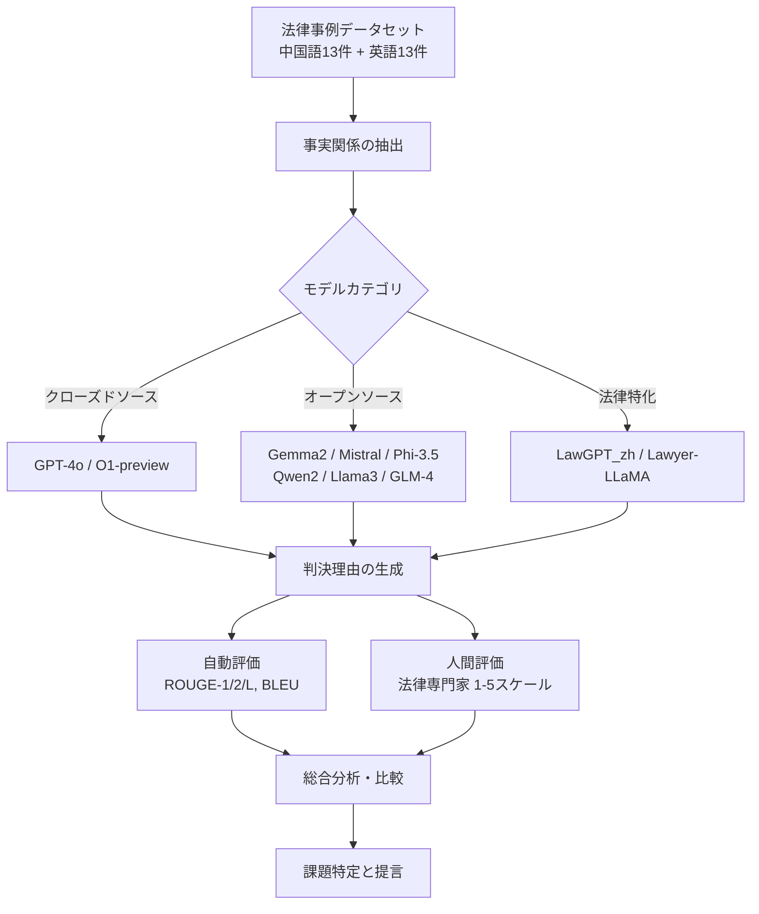
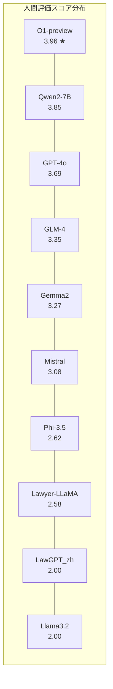

# Legal Evaluations and Challenges of Large Language Models

- **Link**: https://arxiv.org/abs/2411.10137
- **Authors**: Jiaqi Wang, Huan Zhao, Zhenyuan Yang, Peng Shu, Junhao Chen, Haobo Sun, Ruixi Liang, Shixin Li, Pengcheng Shi, Longjun Ma, Zongjia Liu, Zhengliang Liu, Tianyang Zhong, Yutong Zhang, Chong Ma, Xin Zhang, Tuo Zhang, Tianli Ding, Yudan Ren, Tianming Liu, Xi Jiang, Shu Zhang
- **Year**: 2024
- **Venue**: arXiv preprint (cs.CL, cs.AI)
- **Type**: Academic Paper

## Abstract

This paper presents a comprehensive evaluation of Large Language Models (LLMs) in legal applications, using OpenAI's o1 model as a case study. The research compares current state-of-the-art LLMs, including open-source, closed-source, and legal-specific models trained specifically for the legal domain. Systematic tests are conducted on English and Chinese legal cases, and the results are analyzed in depth. The experimental results highlight both the potential and limitations of LLMs in legal applications, particularly in terms of challenges related to the interpretation of legal language and the accuracy of legal reasoning.

## Abstract（日本語訳）

本論文は、OpenAIのo1モデルをケーススタディとして、法律分野における大規模言語モデル（LLM）の包括的な評価を提示する。オープンソース、クローズドソース、および法律ドメイン特化型モデルを含む最先端LLMを比較し、英語および中国語の法律事例に対して体系的なテストを実施し、結果を詳細に分析する。実験結果は、法律応用におけるLLMの可能性と限界の両方を明らかにし、特に法律用語の解釈と法的推論の正確性に関する課題を浮き彫りにする。

## 概要

本論文は、法律分野におけるLLMの適用可能性を多角的に検証した研究である。26件の法律事例（中国語13件、英語13件）を用いて、10種類のLLM（GPT-4o、O1-preview、Gemma2-9B、GLM-4、LawGPT_zh、Lawyer-LLaMA、Llama3.2、Mistral-7B、Phi-3.5-mini、Qwen2-7B）の性能を比較評価した。評価にはROUGE、BLEUの自動指標に加え、法律専門家による人間評価（1-5スケール）を採用している。

重要な発見として、自動評価指標と人間評価の間に大きな乖離があることが判明した。O1-previewは人間評価で最高スコア（3.96）を達成したが、ROUGE指標では中位に留まった。逆にPhi-3.5-mini-instructはROUGE-1で0.41と最高値を記録したが、人間評価は2.62と低かった。この結果は、法律分野では表面的なテキスト類似度よりも法的推論の質が重要であることを示唆している。

## 問題設定

本論文が解決を目指す課題：

- **法律用語の解釈精度**: LLMは法律特有の専門用語や文脈依存的な表現の理解に限界がある
- **法的推論の正確性**: 複雑な法律シナリオにおける推論能力が不十分である
- **自動評価の限界**: ROUGE/BLEUなどの自動指標が法的品質を適切に反映しない
- **法域間の差異**: コモンロー（英米法）と大陸法（中国法）の両方でのLLM性能評価が不足している
- **法律特化モデルの有効性**: ドメイン特化型ファインチューニングが汎用モデルに対してどの程度優位かが不明確

## 手法

**マルチモデル比較評価フレームワーク**

本研究は以下の3カテゴリのモデルを法律タスクで比較評価する：

1. **クローズドソースモデル**: GPT-4o（1.8兆パラメータ、16個のMoE）、O1-preview、Claude 3.5 Sonnet（200Kコンテキスト）、Yi-Large
2. **オープンソースモデル**: Llama 3、Mistral-7B、Gemma2-9B、Phi-3.5-mini、Qwen2-7B、GLM-4-9B
3. **法律特化モデル**: LawGPT_zh（ChatGLM-6Bベース）、Lawyer-LLaMA-13B、ChatLaw、LexiLaw、DISC-LawLLM

**評価手法**:
- 各モデルに法律事例を入力し、判決理由の生成を要求
- 生成結果を実際の判決文と比較
- ROUGE-1/2/L、BLEUの自動指標で定量評価
- 法学生による人間評価（1-5スケール）で法的推論の質を評価

**主要な評価式**:

ROUGE-Nスコア:

$$\text{ROUGE-N} = \frac{\sum_{S \in \text{Ref}} \sum_{\text{gram}_n \in S} \text{Count}_{\text{match}}(\text{gram}_n)}{\sum_{S \in \text{Ref}} \sum_{\text{gram}_n \in S} \text{Count}(\text{gram}_n)}$$

BLEUスコア:

$$\text{BLEU} = BP \cdot \exp\left(\sum_{n=1}^{N} w_n \log p_n\right)$$

ここで $BP$ はブレビティペナルティ、$p_n$ は修正n-gram精度、$w_n$ は重み係数。

**特徴**:

- 中英両言語での体系的比較（法域横断的評価）
- 自動指標と人間評価の両方を用いた多面的評価
- 汎用モデルと法律特化モデルの直接比較

## アルゴリズム（擬似コード）

```
Algorithm: Legal LLM Evaluation Pipeline
Input: 法律事例集 C = {c_1, ..., c_26}, モデル集合 M = {m_1, ..., m_10}
Output: 各モデルの評価スコア集合

1. データセット構築:
   C_zh ← 中国裁判文書オンラインから13件選出（民事・刑事・行政）
   C_en ← Court Listenerから13件選出（移民・刑事・行政）

2. For each model m_i in M:
   For each case c_j in C:
     a. response_ij ← m_i.generate(c_j.facts)     // 事実関係を入力し判決理由を生成
     b. reference_j ← c_j.actual_judgment           // 実際の判決理由
     c. rouge_ij ← compute_ROUGE(response_ij, reference_j)  // ROUGE-1/2/L算出
     d. bleu_ij ← compute_BLEU(response_ij, reference_j)    // BLEU算出
     e. human_ij ← expert_evaluate(response_ij, reference_j) // 法律専門家評価(1-5)

3. For each model m_i:
   scores_i ← aggregate(rouge_ij, bleu_ij, human_ij) for all j  // 全事例の平均

4. Return scores for all models, ranked by human evaluation
```

## アーキテクチャ / プロセスフロー



## Figures & Tables

### Figure 1: 研究の全体像


*法律分野におけるLLM評価の全体構成図。クローズドソース、オープンソース、法律特化の3カテゴリのモデルを中英両言語の法律事例で評価するフレームワークを示す。*

### Table 1: 中国語法律テキストにおけるLLM性能比較

| モデル | ROUGE-1 | ROUGE-2 | ROUGE-L | BLEU | 人間評価 |
|--------|---------|---------|---------|------|----------|
| **Qwen2-7B-Instruct** | 0.27 | 0.16 | 0.23 | 0.00 | **3.85** |
| **GPT-4o** | 0.13 | 0.01 | 0.10 | 0.00 | **3.85** |
| **O1-preview** | 0.13 | 0.02 | 0.09 | 0.00 | **3.85** |
| GLM-4-9B-chat | 0.29 | 0.16 | 0.24 | 0.00 | 3.15 |
| Gemma2-9B | 0.39 | 0.15 | 0.39 | 0.03 | 3.00 |
| Lawyer-LLaMA-13B-v2 | 0.32 | 0.19 | 0.32 | 0.05 | 2.92 |
| Mistral-7B-instruct-v0.3 | 0.38 | 0.15 | 0.20 | 0.07 | 2.54 |
| Phi-3.5-mini-instruct | 0.38 | 0.13 | 0.38 | 0.03 | 2.15 |
| LawGPT_zh | 0.27 | 0.08 | 0.16 | 0.04 | 1.85 |
| Llama3.2-3B-instruct | 0.30 | 0.11 | 0.15 | 0.04 | 1.62 |

*注: 人間評価スコア順に降順ソート。GPT-4o、O1-preview、Qwen2-7Bが同率首位（3.85）。*

### Table 2: 英語法律テキストにおけるLLM性能比較

| モデル | ROUGE-1 | ROUGE-2 | ROUGE-L | BLEU | 人間評価 |
|--------|---------|---------|---------|------|----------|
| **O1-preview** | 0.31 | 0.13 | 0.29 | 0.07 | **4.08** |
| Qwen2-7B-Instruct | 0.31 | 0.13 | 0.14 | 0.00 | 3.85 |
| Mistral-7B-instruct-v0.3 | 0.27 | 0.12 | 0.15 | 0.04 | 3.62 |
| Gemma2-9B | 0.38 | 0.36 | 0.38 | 0.02 | 3.54 |
| GLM-4-9B-chat | 0.34 | 0.14 | 0.16 | 0.00 | 3.54 |
| GPT-4o | 0.23 | 0.07 | 0.21 | 0.01 | 3.54 |
| Phi-3.5-mini-instruct | 0.44 | 0.41 | 0.44 | 0.04 | 3.08 |
| Llama3.2-3B-instruct | 0.25 | 0.10 | 0.17 | 0.06 | 2.38 |
| Lawyer-LLaMA-13B-v2 | 0.42 | 0.38 | 0.42 | 0.05 | 2.23 |
| LawGPT_zh | 0.17 | 0.05 | 0.09 | 0.00 | 2.15 |

*注: O1-previewが英語事例で最高の人間評価スコア（4.08）を達成。*

### Table 3: 総合性能比較（中英合算）

| モデル | ROUGE-1 | ROUGE-2 | ROUGE-L | BLEU | 人間評価 | カテゴリ |
|--------|---------|---------|---------|------|----------|----------|
| **O1-preview** | 0.22 | 0.07 | 0.19 | 0.04 | **3.96** | クローズドソース |
| Qwen2-7B-Instruct | 0.29 | 0.15 | 0.19 | 0.00 | 3.85 | オープンソース |
| GPT-4o | 0.18 | 0.04 | 0.15 | 0.01 | 3.69 | クローズドソース |
| GLM-4-9B-chat | 0.31 | 0.15 | 0.20 | 0.00 | 3.35 | オープンソース |
| Gemma2-9B | 0.39 | 0.26 | 0.39 | 0.03 | 3.27 | オープンソース |
| Mistral-7B-instruct-v0.3 | 0.32 | 0.13 | 0.17 | 0.06 | 3.08 | オープンソース |
| Phi-3.5-mini-instruct | 0.41 | 0.27 | 0.41 | 0.03 | 2.62 | オープンソース |
| Lawyer-LLaMA-13B-v2 | 0.37 | 0.28 | 0.37 | 0.05 | 2.58 | 法律特化 |
| LawGPT_zh | 0.22 | 0.07 | 0.12 | 0.02 | 2.00 | 法律特化 |
| Llama3.2-3B-instruct | 0.28 | 0.10 | 0.16 | 0.05 | 2.00 | オープンソース |

*注: O1-previewが総合人間評価で首位（3.96）、Phi-3.5-miniがROUGE指標で首位（0.41）。*

### Table 4: 自動評価 vs 人間評価の乖離分析

| モデル | ROUGE-1順位 | 人間評価順位 | 順位差 | 分析 |
|--------|-------------|-------------|--------|------|
| O1-preview | 9位 (0.22) | **1位** (3.96) | +8 | 法的推論の質が高いが、表面的類似度は低い |
| Phi-3.5-mini | **1位** (0.41) | 7位 (2.62) | -6 | テキスト一致度は高いが、法的推論の質は低い |
| Qwen2-7B | 6位 (0.29) | 2位 (3.85) | +4 | バランスの取れた性能 |
| GPT-4o | 8位 (0.18) | 3位 (3.69) | +5 | 推論重視の出力 |
| LawGPT_zh | 9位 (0.22) | 9位 (2.00) | 0 | 法律特化だが性能は限定的 |

*注: 順位差が大きいほど、自動評価と人間評価の乖離が大きいことを示す。*

### Table 5: 法律特化LLMの比較

| モデル名 | ベースモデル | 対象法域 | 特徴 |
|----------|-------------|----------|------|
| LawGPT_zh | ChatGLM-6B | 中国法 | 法律Q&Aデータでファインチューニング |
| Lawyer-LLaMA | LLaMA-13B | 中国法（婚姻・貸借・海事・刑事） | マルチドメイン法律対応 |
| LexiLaw | ChatGLM-6B | 中国法 | 法律相談特化 |
| ChatLaw | BERT / LLaMA | 中国法 | ベクトルDB+キーワード検索でハルシネーション低減 |
| DISC-LawLLM | — | 中国法 | 法的三段論法ベースの推論統合 |
| KL3M | — | 英米法 | 許可データのみで学習、企業向け |
| LexNLP | — | 英米法 | トークン化・特徴抽出・エンティティ認識のツールキット |



## 実験と評価

### 実験設定

- **データセット**: 26件の法律事例（中国語13件：中国裁判文書オンライン、英語13件：Court Listener）
- **事例種別**: 民事、刑事、行政（第一審判決、第二審判決、決定を含む）
- **自動評価指標**: ROUGE-1、ROUGE-2、ROUGE-L（0-1スケール）、BLEU（0-1スケール）
- **人間評価**: 法律分析の訓練を受けた法学生が1-5スケールで評価

### 主要結果

1. **O1-previewが総合首位**: 人間評価で3.96（最高スコア）を達成。特に英語事例で4.08と突出した性能を示した
2. **自動指標と人間評価の乖離**: ROUGE最高のPhi-3.5-mini（0.41）は人間評価で7位（2.62）。法的推論の質はn-gram一致度では測定できない
3. **法律特化モデルの限界**: LawGPT_zh（人間評価2.00）は汎用モデルに劣った。ドメイン特化ファインチューニングだけでは不十分
4. **Qwen2-7Bの健闘**: 7Bパラメータのオープンソースモデルながら人間評価3.85で2位。コストパフォーマンスに優れる
5. **言語間差異**: 英語事例ではモデル間の差が明確（O1: 4.08 vs LawGPT: 2.15）、中国語事例では上位が拮抗（3.85で3モデル同率）

### アブレーション的分析（カテゴリ別）

| モデルカテゴリ | 平均人間評価 | 最高ROUGE-1 | 代表モデル |
|---------------|-------------|-------------|-----------|
| クローズドソース | 3.83 | 0.22 | O1-preview, GPT-4o |
| オープンソース | 3.03 | 0.41 | Qwen2-7B, Phi-3.5-mini |
| 法律特化 | 2.29 | 0.37 | Lawyer-LLaMA, LawGPT_zh |

*クローズドソースモデルが法的推論の質で優位。法律特化モデルは汎用モデルにも劣る結果。*

## 課題

本論文が特定した法律分野へのLLM適用における5つの主要課題：

### 1. データプライバシー
法律事例には個人の身元情報、財務状況、医療記録などの機微情報が含まれる。意図しない「データ漏洩」のリスクがあり、厳格なデータ処理メカニズムが必要。

### 2. 法的責任の定義
LLMが誤った法的助言を行った場合の責任所在が不明確。「開発者、ユーザー、モデル自体のいずれが責任を負うべきか」について現時点でコンセンサスがない。

### 3. 倫理・道徳的問題
訓練データの多様性がバイアスを導入し、「不公平な出力」を生む可能性がある。法律応用では中立性を確保し差別を防ぐ「堅牢な倫理審査メカニズム」が必要。

### 4. 技術的限界
モデルは「法律用語の理解、事例の文脈把握、複雑な法律シナリオの分析」に困難を抱える。解釈可能性の欠如が不確実性を生み、人間の専門知識との組み合わせが必要。

### 5. 立法上の差異
国・地域による規制政策の違いが「法実務の不整合」を生む。データプライバシー保護を優先する国と技術革新を優先する国の間で方針が異なる。

## 注記

- GPT-3.5 TurboはLexGLUEタスクで平均micro-F1スコア49.0%を達成したが、法的テキスト分類では全体的に低い性能を示した（先行研究の参照）
- 評価データセットの規模（26件）は限定的であり、より大規模な評価が必要
- 本研究では判決理由の生成タスクに焦点を当てており、契約書レビューや法律相談など他の法律タスクは未検証
- 参考文献59件を引用し、Transformerの基礎研究からLegalBench、LexGLUEなどの法律ベンチマークまで幅広くカバー
