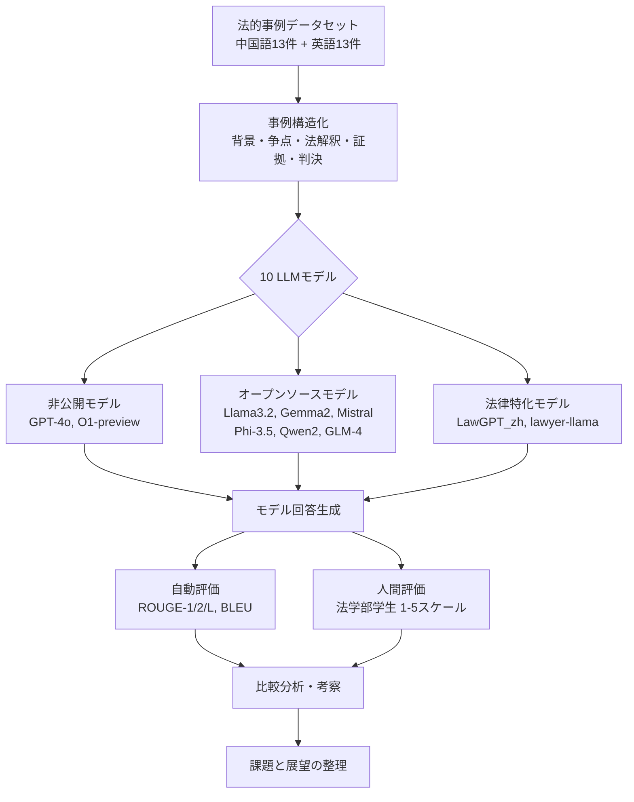
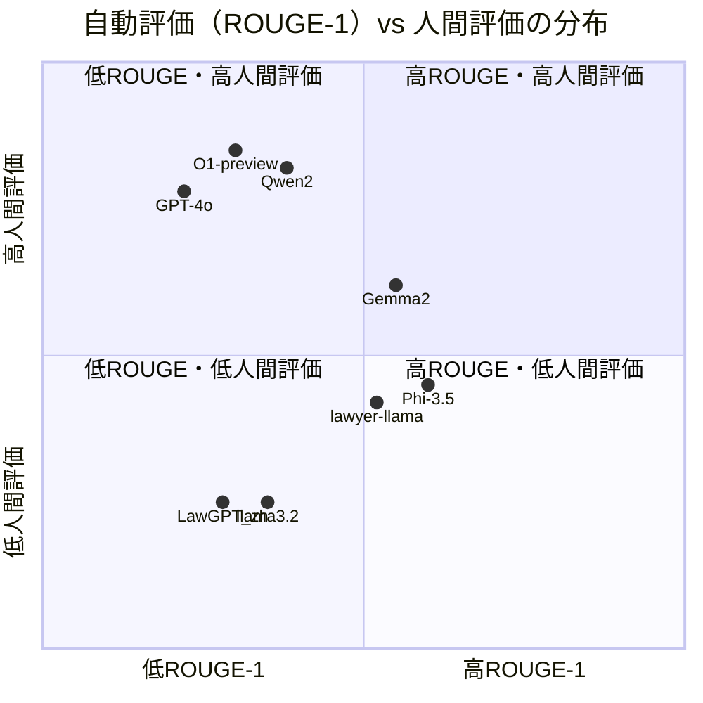

# Legal Evalutions and Challenges of Large Language Models

- **Link**: https://arxiv.org/abs/2411.10137
- **Authors**: Jiaqi Wang, Huan Zhao, Zhenyuan Yang, Peng Shu, Junhao Chen, Haobo Sun, Ruixi Liang, Shixin Li, Pengcheng Shi, Longjun Ma, Zongjia Liu, Zhengliang Liu, Tianyang Zhong, Yutong Zhang, Chong Ma, Xin Zhang, Tuo Zhang, Tianli Ding, Yudan Ren, Tianming Liu, Xi Jiang, Shu Zhang
- **Year**: 2024
- **Venue**: arXiv preprint (cs.CL, cs.AI)
- **Type**: Academic Paper

## Abstract

This paper reviews legal testing methods based on Large Language Models (LLMs), using the OpenAI o1 model as a case study to evaluate the performance of large models in applying legal provisions. It compares current state-of-the-art LLMs, including open-source, closed-source, and legal-specific models trained specifically for the legal domain. Systematic tests are conducted on English and Chinese legal cases, and the results are analyzed in depth. Through systematic testing of legal cases from common law systems and China, the paper explores the strengths and weaknesses of LLMs in understanding and applying legal texts, reasoning through legal issues, and predicting judgments. The experimental results highlight both the potential and limitations of LLMs in legal applications, particularly in terms of challenges related to the interpretation of legal language and the accuracy of legal reasoning.

## Abstract（日本語訳）

本論文は、大規模言語モデル（LLM）に基づく法的テスト手法をレビューし、OpenAIのo1モデルをケーススタディとして、法的規定の適用における大規模モデルの性能を評価する。オープンソース、クローズドソース、および法律ドメインに特化して訓練されたモデルを含む最先端LLMを比較する。英語と中国語の法的事例について体系的なテストを実施し、その結果を詳細に分析する。コモンロー法体系と中国の法的事例の体系的テストを通じて、LLMが法的テキストの理解・適用、法的問題の推論、判決予測において持つ強みと弱みを探究する。実験結果は、法的応用におけるLLMの可能性と限界の両方を浮き彫りにし、特に法的言語の解釈と法的推論の正確性に関する課題を明らかにする。

## 概要

本論文は、法的テキスト処理におけるLLMの包括的評価研究である。GPT-4o、O1-preview、Qwen2、Llama 3、Gemma2、Mistral、GLM-4、Phi-3.5 などの汎用モデルと、LawGPT_zh、lawyer-llama などの法律特化モデルを含む10モデルを、中国語13件・英語13件の合計26件の法的事例で評価している。評価にはROUGE、BLEUの自動評価指標と、法学部学生による1-5段階の人間評価を併用し、自動評価指標と人間評価の間に顕著な乖離があることを明らかにした。O1-previewが人間評価で最高スコア（3.96）を獲得し、法的推論能力の優位性を示す一方、法律特化モデル（LawGPT_zh: 2.00）が汎用モデルを下回る結果となった点は注目に値する。

## 問題設定

本論文が取り組む課題：

- **法的テキスト理解の評価不足**: LLMの法的テキスト解釈・推論能力を体系的に評価する枠組みが不十分
- **多言語法体系への対応**: 英語（コモンロー）と中国語（大陸法）という異なる法体系での性能差の解明
- **自動評価指標の限界**: ROUGE/BLEUなどのテキスト類似度指標が法的推論の質を正確に反映しない可能性
- **法律特化モデルの有効性検証**: ドメイン特化型LLMが汎用モデルに対して実際に優位性を持つかの検証
- **実用化への課題整理**: プライバシー、法的責任、倫理、技術的限界、法域差異の包括的整理

## 評価手法

**評価フレームワーク**

本研究は以下の方法論に基づく：

1. **データセット構築**: 中国裁判所オンラインデータベースから民事・刑事・行政の中国語事例13件、Court Listenerデータベースから移民・刑事・行政の英語事例13件を選定
2. **モデル選定**: 非公開モデル（GPT-4o, O1-preview）、オープンソースモデル（Llama 3.2, Gemma2, Mistral, Phi-3.5, Qwen2, GLM-4）、法律特化モデル（LawGPT_zh, lawyer-llama）の3カテゴリ10モデル
3. **自動評価**: ROUGE-1, ROUGE-2, ROUGE-L（n-gramオーバーラップ）、BLEU（修正精度）で定量評価
4. **人間評価**: 訓練を受けた法学部学生が1-5のスケールで評価（法的正確性、推論の質、実用性を考慮）
5. **比較分析**: 自動指標と人間評価の相関分析、言語別・モデルカテゴリ別の性能比較

**特徴**:

- 英語・中国語の二言語評価により、法体系の違いが性能に与える影響を分析
- 自動評価と人間評価の併用により、テキスト類似度だけでは捉えられない法的推論の質を評価
- 法律特化モデルと汎用モデルの直接比較

## アルゴリズム（疑似コード）

```
Algorithm: LLM法的事例評価パイプライン
Input: 法的事例集 C = {c_1, ..., c_n}、LLMモデル集 M = {m_1, ..., m_k}、参照判決集 R = {r_1, ..., r_n}
Output: 各モデルの評価スコア表

1. データ準備:
   for each case c_i in C:
     背景・争点・法的解釈・証拠・判決理由を構造化

2. モデル推論:
   for each model m_j in M:
     for each case c_i in C:
       response_{i,j} = m_j.generate(c_i)    // LLMに事例を入力し回答生成

3. 自動評価:
   for each (response_{i,j}, r_i) pair:
     ROUGE_scores_{i,j} = compute_ROUGE(response_{i,j}, r_i)
     BLEU_score_{i,j} = compute_BLEU(response_{i,j}, r_i)

4. 人間評価:
   for each response_{i,j}:
     human_score_{i,j} = law_student_evaluation(response_{i,j}, scale=1-5)

5. 集計・分析:
   for each model m_j:
     avg_scores_j = aggregate(all scores for m_j)
   compare(automated_metrics, human_scores)    // 相関分析
```

## アーキテクチャ / プロセスフロー



## Figures & Tables

### 1. 研究概要図


*図1: 本研究の概要 — LLMの法的評価フレームワーク全体像*

### 2. 中国語法的テキストにおける性能（TABLE I）

| モデル | ROUGE-1 | ROUGE-2 | ROUGE-L | BLEU | 人間評価 |
|--------|---------|---------|---------|------|----------|
| Gemma2-9B | 0.39 | 0.15 | 0.39 | 0.03 | 3.00 |
| GLM-4-9B-chat | 0.29 | 0.16 | 0.24 | 0.00 | 3.15 |
| **GPT-4o** | 0.13 | 0.01 | 0.10 | 0.00 | **3.85** |
| LawGPT_zh | 0.27 | 0.08 | 0.16 | 0.04 | 1.85 |
| lawyer-llama-13b-v2 | 0.32 | 0.19 | 0.32 | 0.05 | 2.92 |
| llama3.2-3B-instruct | 0.30 | 0.11 | 0.15 | 0.04 | 1.62 |
| Mistral-7B-instruct-v0.3 | 0.38 | 0.15 | 0.20 | 0.07 | 2.54 |
| **O1-preview** | 0.13 | 0.02 | 0.09 | 0.00 | **3.85** |
| Phi-3.5-mini-instruct | 0.38 | 0.13 | 0.38 | 0.03 | 2.15 |
| **Qwen2-7B-Instruct** | 0.27 | 0.16 | 0.23 | 0.00 | **3.85** |

**主要発見**: GPT-4o、O1-preview、Qwen2-7B-Instructが人間評価で同率最高（3.85）。ROUGE指標ではGemma2-9Bが最高（0.39）だが人間評価は3.00。法律特化モデルLawGPT_zhは人間評価1.85と最低水準。

### 3. 英語法的テキストにおける性能（TABLE II）

| モデル | ROUGE-1 | ROUGE-2 | ROUGE-L | BLEU | 人間評価 |
|--------|---------|---------|---------|------|----------|
| Gemma2-9B | 0.38 | 0.36 | 0.38 | 0.02 | 3.54 |
| GLM-4-9B-chat | 0.34 | 0.14 | 0.16 | 0.00 | 3.54 |
| GPT-4o | 0.23 | 0.07 | 0.21 | 0.01 | 3.54 |
| LawGPT_zh | 0.17 | 0.05 | 0.09 | 0.00 | 2.15 |
| lawyer-llama-13b-v2 | 0.42 | 0.38 | 0.42 | 0.05 | 2.23 |
| llama3.2-3B-instruct | 0.25 | 0.10 | 0.17 | 0.06 | 2.38 |
| Mistral-7B-instruct-v0.3 | 0.27 | 0.12 | 0.15 | 0.04 | 3.62 |
| **O1-preview** | 0.31 | 0.13 | 0.29 | 0.07 | **4.08** |
| Phi-3.5-mini-instruct | 0.44 | 0.41 | 0.44 | 0.04 | 3.08 |
| Qwen2-7B-Instruct | 0.31 | 0.13 | 0.14 | 0.00 | 3.85 |

**主要発見**: O1-previewが人間評価で全モデル最高（4.08）。Phi-3.5がROUGE指標で最高（0.44）だが人間評価は3.08。全体的に英語事例の方が中国語より高スコア。

### 4. 総合性能（TABLE III: 中国語・英語合算）

| モデル | ROUGE-1 | ROUGE-2 | ROUGE-L | BLEU | 人間評価 | カテゴリ |
|--------|---------|---------|---------|------|----------|----------|
| **O1-preview** | 0.22 | 0.07 | 0.19 | 0.04 | **3.96** | 非公開 |
| Qwen2-7B-Instruct | 0.29 | 0.15 | 0.19 | 0.00 | 3.85 | オープンソース |
| GPT-4o | 0.18 | 0.04 | 0.15 | 0.01 | 3.69 | 非公開 |
| GLM-4-9B-chat | 0.31 | 0.15 | 0.20 | 0.00 | 3.35 | オープンソース |
| Gemma2-9B | 0.39 | 0.26 | 0.39 | 0.03 | 3.27 | オープンソース |
| Mistral-7B-instruct-v0.3 | 0.32 | 0.13 | 0.17 | 0.06 | 3.08 | オープンソース |
| Phi-3.5-mini-instruct | 0.41 | 0.27 | 0.41 | 0.03 | 2.62 | オープンソース |
| lawyer-llama-13b-v2 | 0.37 | 0.28 | 0.37 | 0.05 | 2.58 | 法律特化 |
| LawGPT_zh | 0.22 | 0.07 | 0.12 | 0.02 | 2.00 | 法律特化 |
| llama3.2-3B-instruct | 0.28 | 0.10 | 0.16 | 0.05 | 2.00 | オープンソース |

**重要な知見**: O1-previewが総合人間評価で最高（3.96）。自動評価指標（ROUGE/BLEU）と人間評価の間に顕著な乖離が存在。法律特化モデルが汎用モデルを下回る結果。

### 5. モデルカテゴリ別比較表

| 特徴 | 非公開モデル (GPT-4o, O1) | オープンソース (Qwen2, Gemma2等) | 法律特化 (LawGPT, lawyer-llama) |
|------|--------------------------|--------------------------------|-------------------------------|
| 人間評価（平均） | 3.83 | 3.03 | 2.29 |
| ROUGE-1（平均） | 0.20 | 0.33 | 0.30 |
| 法的推論の質 | 高い | 中程度 | 低い |
| 多言語対応 | 強い | モデル依存 | 中国語に偏重 |
| パラメータ規模 | 大規模（非公開） | 3B-72B | 6B-13B |
| コスト | API課金 | 自社運用可能 | 自社運用可能 |

### 6. 自動評価 vs 人間評価の相関図



*O1-preview、GPT-4o は低ROUGE・高人間評価の象限に位置し、テキスト類似度は低いが法的推論の質は高いことを示す*

## 実験・評価

### 実験設定

- **データセット**: 中国裁判所オンラインDB（中国語13件: 民事・刑事・行政）、Court Listener（英語13件: 移民・刑事・行政法）
- **評価指標**: ROUGE-1/2/L（0-1スケール, n-gramオーバーラップ）、BLEU（修正精度）、人間評価（1-5スケール）
- **評価者**: 法的分析の訓練を受けた法学部学生
- **比較対象**: 非公開2モデル、オープンソース6モデル、法律特化2モデルの計10モデル

### 主要結果

1. **O1-previewが法的推論で最優秀**: 総合人間評価3.96（英語4.08、中国語3.85）で全モデル中最高。推論チェーン型アーキテクチャが法的推論に適合
2. **自動評価と人間評価の乖離**: Phi-3.5はROUGE-1で0.41（2位）だが人間評価は2.62（8位）。O1-previewはROUGE-1で0.22だが人間評価は3.96（1位）。テキスト類似度が法的推論の質を反映しない
3. **法律特化モデルの劣勢**: LawGPT_zh（2.00）、lawyer-llama（2.58）は汎用モデルの多くを下回る。小規模パラメータと限定的な訓練データが原因と推測
4. **言語別性能差**: 英語事例の方が全体的に高スコア。中国語法体系の独自性と訓練データの偏りが影響

### アブレーション的分析

| 分析観点 | 結果 | 示唆 |
|----------|------|------|
| 非公開 vs オープンソース | 非公開モデルが人間評価で優位（3.83 vs 3.03） | 大規模パラメータと広範な訓練データの有効性 |
| 汎用 vs 法律特化 | 汎用モデルが法律特化モデルを上回る（3.03 vs 2.29） | ドメイン特化の微調整より基盤能力が重要 |
| 英語 vs 中国語 | 英語が全体的に高スコア | 訓練データの英語偏重と法体系の構造差 |
| 自動評価 vs 人間評価 | 相関が低い | 法的テキスト評価には人間評価が不可欠 |

## 法的AI課題の体系的整理

本論文は5つの主要課題を特定：

### 1. データプライバシー
法的事例には個人情報（身元、財務、医療記録）が含まれ、LLMが生成時に意図せず暴露するリスク。プライバシー・バイ・デザインの設計と出力レビュー機構が必要。

### 2. 法的責任の定義
LLMが問題のある法的助言を提供した場合の責任帰属が不明確。開発者・利用者・モデル自体の間での責任分配に関する包括的な法的枠組みが必要。

### 3. 倫理・道徳的問題
訓練データの多様性が潜在的バイアスを導入し、事例分析に影響する可能性。法的応用は中立性と公平性を要求するが、モデルの透明性不足が信頼性評価を困難にする。

### 4. 技術的限界
法的用語の理解、事例文脈の把握、複雑な法的シナリオ分析における限界。より解釈可能なモデルと人間の専門知識の統合が必要。

### 5. 法域差異
各国の規制要件の違い（データプライバシー重視 vs イノベーション重視）がグローバル展開の障壁。コンプライアンスリスクと法的実務への適用性の不一致。

## 備考

- **レビュー対象の法律特化LLM**: LAWGPT-zh, LAWGPT, Lawyer-LLama, LexiLaw, LexGPT 0.1, ChatLaw, DISC-LawLLM, KL3M, InternLM-Law, SaulLM
- **ChatGPTの先行研究**: LexGLUEタスクでmicro-F1スコア49.0%（ゼロショット設定での限界を示唆）
- **コードリポジトリ**: 本論文に関連する公開コードリポジトリは未確認（評価研究のため）
- **関連リソース**: [LLM-and-Law GitHub リポジトリ](https://github.com/Jeryi-Sun/LLM-and-Law) に本論文が収録
- **参考文献数**: 59件（LLM技術報告、法的ベンチマーク、ドメイン特化モデル、AI倫理関連）
