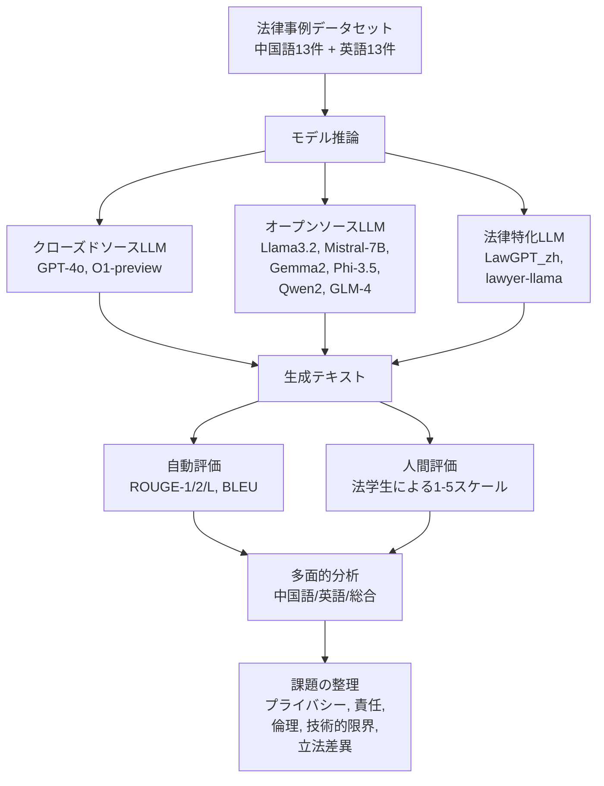
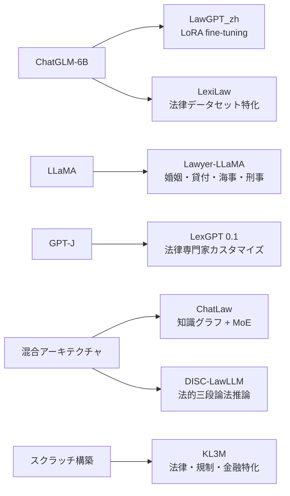
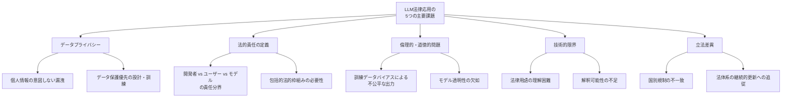

# Legal Evaluations and Challenges of Large Language Models

- **Link**: https://arxiv.org/abs/2411.10137
- **Authors**: Jiaqi Wang, Huan Zhao, Zhenyuan Yang, Peng Shu, Junhao Chen, Haobo Sun, Ruixi Liang, Shixin Li, Pengcheng Shi, Longjun Ma, Zongjia Liu, Zhengliang Liu, Tianyang Zhong, Yutong Zhang, Chong Ma, Xin Zhang, Tuo Zhang, Tianli Ding, Yudan Ren, Tianming Liu, Xi Jiang, Shu Zhang
- **Year**: 2024
- **Venue**: arXiv preprint (cs.CL, cs.AI)
- **Type**: Academic Paper

## Abstract

In this paper, we review legal testing methods based on Large Language Models (LLMs), using the OPENAI o1 model as a case study to evaluate the performance of large models in applying legal provisions. We compare current state-of-the-art LLMs, including open-source, closed-source, and legal-specific models trained specifically for the legal domain. Systematic tests are conducted on English and Chinese legal cases, and the results are analyzed in depth. Through systematic testing of legal cases from common law systems and China, this paper explores the strengths and weaknesses of LLMs in understanding and applying legal texts, reasoning through legal issues, and predicting judgments. The experimental results highlight both the potential and limitations of LLMs in legal applications, particularly in terms of challenges related to the interpretation of legal language and the accuracy of legal reasoning. Finally, the paper provides a comprehensive analysis of the advantages and disadvantages of various types of models, offering valuable insights and references for the future application of AI in the legal field.

## Abstract (Japanese Translation)

本論文では、大規模言語モデル（LLM）に基づく法律テスト手法をレビューし、OpenAI o1モデルをケーススタディとして、法律条文適用における大規模モデルの性能を評価する。オープンソース、クローズドソース、および法律ドメイン向けに特化訓練されたモデルを含む、最先端のLLMを比較する。英語および中国語の法律事例に対して体系的なテストを実施し、結果を詳細に分析する。コモンロー法体系と中国法の法律事例に対する体系的テストを通じて、本論文はLLMが法律テキストの理解・適用、法的問題の推論、判決予測において持つ強みと弱みを探求する。実験結果は、法律応用におけるLLMの可能性と限界、特に法律用語の解釈および法的推論の正確性に関する課題を浮き彫りにする。最後に、様々な種類のモデルの長所と短所を包括的に分析し、法律分野におけるAIの将来的な応用に向けた貴重な知見と参考情報を提供する。

## Overview

本論文は、10種類のLLM（クローズドソース、オープンソース、法律特化型）を、26件の法律事例（中国語13件・英語13件）を用いて体系的に評価したサーベイ・ベンチマーク論文である。ROUGE・BLEUの自動評価指標と法学生による人間評価（1-5スケール）の両面から性能を測定し、自動指標と人間評価の間に顕著な乖離があることを発見した。O1-previewが人間評価で最高スコア（総合3.96/5.00）を達成する一方、ROUGE/BLEUスコアでは他モデルに劣る結果となり、法律ドメインにおける評価指標の課題を提起している。さらに、データプライバシー、法的責任の定義、倫理的問題、技術的限界、各国の立法差異という5つの主要課題を整理している。

## Problem

本論文が取り組む主要課題:

- **法律ドメインにおけるLLM性能の体系的評価の不足**: 既存研究は個別モデルや特定タスクに限定されており、オープンソース・クローズドソース・法律特化型モデルを横断的に比較した包括的評価が欠如している
- **多言語法律テキストへの対応**: 英語圏（コモンロー）と中国語圏（大陸法系）の法体系の違いを考慮したクロスリンガル評価が不十分
- **自動評価指標と人間判断の乖離**: ROUGE/BLEUスコアが法律テキスト生成の品質を適切に反映しているかの検証が必要
- **法律AI応用における実践的課題の整理**: プライバシー、責任、倫理、技術的限界、立法差異などの実務課題の体系化

## Proposed Method

**多角的ベンチマーク評価フレームワーク**

本論文は新規手法の提案ではなく、以下の評価フレームワークに基づくベンチマーク研究である:

1. **データセット構築**: 中国裁判文書網およびCourt Listenerから26件の代表的法律事例を選定（民事・刑事・行政を網羅）
2. **モデル選定**: クローズドソース（GPT-4o, O1-preview）、オープンソース（Llama3.2, Mistral-7B, Gemma2, Phi-3.5, Qwen2, GLM-4）、法律特化型（LawGPT_zh, lawyer-llama）の10モデルを選定
3. **自動評価**: ROUGE-1/2/Lおよび BLEUスコアによるn-gram重複度・流暢性の定量評価
4. **人間評価**: 法学生が1-5スケールで法的推論との整合性を評価（5が最高）
5. **多面的分析**: 中国語・英語・総合の3観点からモデル間比較を実施

**評価指標の定義**:

$$\text{ROUGE-N} = \frac{\sum_{S \in \text{Ref}} \sum_{\text{gram}_n \in S} \text{Count}_{\text{match}}(\text{gram}_n)}{\sum_{S \in \text{Ref}} \sum_{\text{gram}_n \in S} \text{Count}(\text{gram}_n)}$$

$$\text{BLEU} = BP \cdot \exp\left(\sum_{n=1}^{N} w_n \log p_n\right)$$

ここで $BP$ はBrevity Penalty、$p_n$ はn-gram精度、$w_n$ は重みである。

**特徴**:

- 多言語（中英）・多法域（コモンロー・大陸法）にまたがる初の包括的LLM法律評価
- 自動指標と人間評価の乖離を実証的に示した点が新規性
- 法律特化モデル vs 汎用モデルの比較による実用的知見の提供

## Algorithm (Pseudocode)

本論文は評価フレームワークであるため、アルゴリズムではなく評価プロセスを記述する:

```
Procedure: LLM Legal Evaluation Framework
Input: 26 legal cases (13 Chinese, 13 English), 10 LLMs
Output: Performance comparison tables, qualitative analysis

1. Data Preparation
   1.1 Select cases from Chinese Judgments Online (civil, criminal, administrative)
   1.2 Select cases from Court Listener (immigration, criminal, administrative)
   1.3 Anonymize personal information

2. Model Inference
   For each model M in {GPT-4o, O1-preview, Gemma2, GLM-4, ...}:
     For each case C in dataset:
       2.1 Input case background and facts to M
       2.2 Request legal judgment generation
       2.3 Store generated output G(M, C)

3. Automated Evaluation
   For each (M, C) pair:
     3.1 Compute ROUGE-1, ROUGE-2, ROUGE-L vs reference judgment
     3.2 Compute BLEU score vs reference judgment

4. Human Evaluation
   For each (M, C) pair:
     4.1 Law students rate output on 1-5 scale
     4.2 Criteria: alignment with legal reasoning in actual outcomes

5. Analysis
   5.1 Aggregate scores by language (Chinese/English/Overall)
   5.2 Compare automated vs human metrics
   5.3 Identify performance patterns across model categories
```

## Architecture / Process Flow



## Figures & Tables

### Figure 1: 研究全体の概要図


*本論文の研究構造と手法の概要を示す図。LLMの法律ドメインにおける評価フレームワーク全体を可視化している。*

### Table I: 中国語法律テキストにおけるLLM性能

| Model | ROUGE-1 | ROUGE-2 | ROUGE-L | BLEU | Human Eval |
|-------|---------|---------|---------|------|------------|
| **O1-preview** | 0.13 | 0.02 | 0.09 | 0.00 | **3.85** |
| **GPT-4o** | 0.13 | 0.01 | 0.10 | 0.00 | **3.85** |
| **Qwen2-7B-Instruct** | 0.27 | 0.16 | 0.23 | 0.00 | **3.85** |
| GLM-4-9B-chat | 0.29 | 0.16 | 0.24 | 0.00 | 3.15 |
| Gemma2-9B | 0.39 | 0.15 | 0.39 | 0.03 | 3.00 |
| lawyer-llama-13b-v2 | 0.32 | 0.19 | 0.32 | 0.05 | 2.92 |
| Mistral-7B-instruct-v0.3 | 0.38 | 0.15 | 0.20 | 0.07 | 2.54 |
| Phi-3.5-mini-instruct | 0.38 | 0.13 | 0.38 | 0.03 | 2.15 |
| LawGPT_zh | 0.27 | 0.08 | 0.16 | 0.04 | 1.85 |
| llama3.2-3B-instruct | 0.30 | 0.11 | 0.15 | 0.04 | 1.62 |

*注: Human Eval上位3モデル（GPT-4o, O1-preview, Qwen2）はROUGEスコアが低い傾向にあり、自動指標と人間評価の乖離が顕著。*

### Table II: 英語法律テキストにおけるLLM性能

| Model | ROUGE-1 | ROUGE-2 | ROUGE-L | BLEU | Human Eval |
|-------|---------|---------|---------|------|------------|
| **O1-preview** | 0.31 | 0.13 | 0.29 | 0.07 | **4.08** |
| **Qwen2-7B-Instruct** | 0.31 | 0.13 | 0.14 | 0.00 | **3.85** |
| Mistral-7B-instruct-v0.3 | 0.27 | 0.12 | 0.15 | 0.04 | 3.62 |
| Gemma2-9B | 0.38 | 0.36 | 0.38 | 0.02 | 3.54 |
| GLM-4-9B-chat | 0.34 | 0.14 | 0.16 | 0.00 | 3.54 |
| GPT-4o | 0.23 | 0.07 | 0.21 | 0.01 | 3.54 |
| Phi-3.5-mini-instruct | 0.44 | 0.41 | 0.44 | 0.04 | 3.08 |
| llama3.2-3B-instruct | 0.25 | 0.10 | 0.17 | 0.06 | 2.38 |
| lawyer-llama-13b-v2 | 0.42 | 0.38 | 0.42 | 0.05 | 2.23 |
| LawGPT_zh | 0.17 | 0.05 | 0.09 | 0.00 | 2.15 |

*注: O1-previewが英語テキストで最高の人間評価スコア（4.08）を達成。全体的にモデルは英語テキストでより高い人間評価を受ける傾向。*

### Table III: LLM総合性能

| Model | ROUGE-1 | ROUGE-2 | ROUGE-L | BLEU | Human Eval | カテゴリ |
|-------|---------|---------|---------|------|------------|----------|
| **O1-preview** | 0.22 | 0.07 | 0.19 | 0.04 | **3.96** | クローズドソース |
| **Qwen2-7B-Instruct** | 0.29 | 0.15 | 0.19 | 0.00 | **3.85** | オープンソース |
| GPT-4o | 0.18 | 0.04 | 0.15 | 0.01 | 3.69 | クローズドソース |
| GLM-4-9B-chat | 0.31 | 0.15 | 0.20 | 0.00 | 3.35 | オープンソース |
| Gemma2-9B | 0.39 | 0.26 | 0.39 | 0.03 | 3.27 | オープンソース |
| Mistral-7B-instruct-v0.3 | 0.32 | 0.13 | 0.17 | 0.06 | 3.08 | オープンソース |
| Phi-3.5-mini-instruct | 0.41 | 0.27 | 0.41 | 0.03 | 2.62 | オープンソース |
| lawyer-llama-13b-v2 | 0.37 | 0.28 | 0.37 | 0.05 | 2.58 | 法律特化 |
| LawGPT_zh | 0.22 | 0.07 | 0.12 | 0.02 | 2.00 | 法律特化 |
| llama3.2-3B-instruct | 0.28 | 0.10 | 0.16 | 0.05 | 2.00 | オープンソース |

### Table IV: モデルカテゴリ別比較

| 特徴 | クローズドソース (GPT-4o, O1) | オープンソース (Qwen2, Gemma2等) | 法律特化 (LawGPT, lawyer-llama) |
|------|------|------|------|
| 人間評価 (平均) | 3.83 | 3.03 | 2.29 |
| ROUGE-1 (平均) | 0.20 | 0.33 | 0.30 |
| BLEU (平均) | 0.03 | 0.03 | 0.04 |
| 法的推論整合性 | 高 | 中 | 低 |
| 多言語対応 | 強 | モデル依存 | 中国語偏重 |
| 流暢性 | 高 | 中〜高 | 低〜中 |

### Table V: 自動指標 vs 人間評価の乖離分析

| Model | ROUGE-1順位 | Human Eval順位 | 順位差 |
|-------|-------------|---------------|--------|
| O1-preview | 9位 (0.22) | **1位** (3.96) | +8 |
| Phi-3.5-mini | **1位** (0.41) | 7位 (2.62) | -6 |
| Qwen2-7B | 6位 (0.29) | **2位** (3.85) | +4 |
| GPT-4o | 10位 (0.18) | 3位 (3.69) | +7 |
| Gemma2-9B | 2位 (0.39) | 5位 (3.27) | -3 |
| LawGPT_zh | 9位 (0.22) | 9位 (2.00) | 0 |

*この表は、ROUGEスコアの順位と人間評価の順位の間に大きな乖離があることを示している。特にO1-previewとGPT-4oは、自動指標では最下位に近いが、人間評価では最上位に位置する。*

### 法律特化LLMの系譜図



### 5つの主要課題の構造図



## Experiments & Evaluation

### Setup

- **データセット**: 26件の法律事例（中国語13件: 中国裁判文書網、英語13件: Court Listener）
- **ケースカテゴリ**: 民事、刑事、行政事件を網羅
- **評価指標**: ROUGE-1/2/L（n-gram重複度）、BLEU（修正精度）、人間評価（1-5スケール）
- **評価者**: 法学生（法的推論との整合性を基準に採点）
- **比較モデル**: 10モデル（クローズドソース2、オープンソース6、法律特化2）

### Main Results

**最重要発見: 自動指標と人間評価の逆相関**

- O1-previewは総合人間評価で最高スコア（3.96）を達成したが、ROUGE-1は0.22と低い
- Phi-3.5-mini-instructはROUGE-1最高（0.41）だが、人間評価は2.62と低い
- この結果は、法律ドメインではROUGE/BLEUが品質指標として不十分であることを示唆

**カテゴリ別傾向**:
- クローズドソースモデル（GPT-4o, O1-preview）: 人間評価で優位、法的推論の整合性が高い
- オープンソースモデル: Qwen2-7Bが例外的に高性能（人間評価3.85）
- 法律特化モデル: 期待に反して低性能。LawGPT_zh（2.00）、lawyer-llama（2.58）

**言語別傾向**:
- 全モデルが英語テキストでより高い人間評価を獲得する傾向
- O1-preview: 中国語3.85 → 英語4.08（+0.23）
- 法律特化モデルの中国語偏重にもかかわらず、英語でも中国語と同等以下の性能

### Ablation Study

本論文にはアブレーション研究は含まれていないが、モデルカテゴリ間の比較から以下の知見が得られる:

| 要因 | 効果 |
|------|------|
| モデルサイズの大型化 (3B→1.8T) | 人間評価で正の相関あり |
| 法律ドメイン特化訓練 | 必ずしも性能向上につながらず |
| 多言語事前学習 | 英語性能に正の影響 |
| クローズドソース vs オープンソース | クローズドソースが人間評価で優位 |

## Notes

- **コードリポジトリ**: 公開されていない
- **データセット公開**: 記載なし（ケースの匿名化処理は実施済み）
- **引用文献**: 59件（2018-2024年の基盤的LLM研究、法律AI応用研究を網羅）
- **重要な制約**: 評価対象が26件と小規模であり、統計的有意性の検証が不十分な可能性がある
- **実務への示唆**: 法律AI導入時にはROUGE/BLEUスコアではなく、法律専門家による人間評価を重視すべき
- **関連研究との位置づけ**: LexGLUEベンチマーク等の既存評価と補完関係にあり、判決生成タスクに特化した評価として独自の貢献
- **法律特化モデルの課題**: ChatLaw、DISC-LawLLM等のより新しい法律特化モデルが評価対象に含まれておらず、法律特化モデルの性能評価としては限定的
