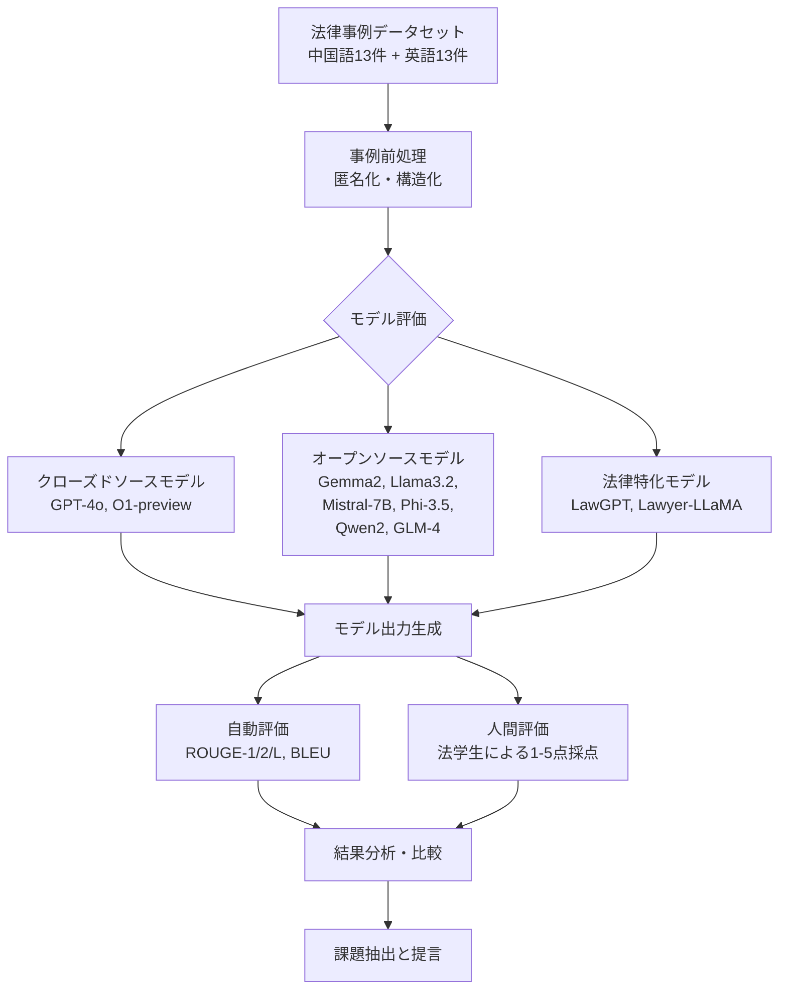

# Legal Evaluations and Challenges of Large Language Models

- **Link**: https://arxiv.org/abs/2411.10137
- **Authors**: Jiaqi Wang, Huan Zhao, Zhenyuan Yang, Peng Shu, Junhao Chen, Haobo Sun, Ruixi Liang, Shixin Li, Pengcheng Shi, Longjun Ma, Zongjia Liu, Zhengliang Liu, Tianyang Zhong, Yutong Zhang, Chong Ma, Xin Zhang, Tuo Zhang, Tianli Ding, Yudan Ren, Tianming Liu, Xi Jiang, Shu Zhang
- **Year**: 2024
- **Venue**: arXiv preprint (cs.CL, cs.AI)
- **Type**: Academic Paper

## Abstract

In this paper, we review legal testing methods based on Large Language Models (LLMs), using the OPENAI o1 model as a case study to evaluate the performance of large models in applying legal provisions. We compare current state-of-the-art LLMs, including open-source, closed-source, and legal-specific models trained specifically for the legal domain. Systematic tests are conducted on English and Chinese legal cases, and the results are analyzed in depth. Through systematic testing of legal cases from common law systems and China, this paper explores the strengths and weaknesses of LLMs in understanding and applying legal texts, reasoning through legal issues, and predicting judgments. The experimental results highlight both the potential and limitations of LLMs in legal applications, particularly in terms of challenges related to the interpretation of legal language and the accuracy of legal reasoning. Finally, the paper provides a comprehensive analysis of the advantages and disadvantages of various types of models, offering valuable insights and references for the future application of AI in the legal field.

## Abstract（日本語訳）

本論文では、大規模言語モデル（LLM）に基づく法律テスト手法をレビューし、OpenAI o1モデルをケーススタディとして、法律条文の適用における大規模モデルの性能を評価する。オープンソース、クローズドソース、および法律ドメイン特化モデルを含む最新のLLMを比較する。英語と中国語の法律事例に対して体系的なテストを実施し、結果を詳細に分析する。コモンロー制度と中国の法律事例の体系的テストを通じて、法律テキストの理解と適用、法的問題の推論、判決予測におけるLLMの強みと弱みを探る。実験結果は、法律応用におけるLLMの可能性と限界、特に法律用語の解釈と法的推論の正確性に関する課題を浮き彫りにする。最後に、各種モデルの長所と短所の包括的分析を提供し、法律分野におけるAIの将来的応用に向けた貴重な知見と参考情報を示す。

## Overview

本論文は、法律分野におけるLLMの性能を包括的に評価した研究である。OpenAI o1モデルを中心に、GPT-4o、Gemma2-9B、Llama3.2、Mistral-7B、Phi-3.5、Qwen2、GLM-4などの汎用モデルと、LawGPT、Lawyer-LLaMA、ChatLawなどの法律特化モデルを含む計10モデルを対象に、中国語13件・英語13件の計26件の法律事例を用いたベンチマーク評価を実施している。評価にはROUGE、BLEU（自動評価）と法学生による5段階人間評価の両方を使用し、自動評価指標と人間評価の間に顕著な乖離があることを報告している。特にO1-previewが人間評価で最高スコア（3.96/5.0）を達成する一方、ROUGE/BLEUでは低スコアとなり、表面的な文字列一致と実質的な法的推論能力の違いを示している。

## Problem

本論文が取り組む主要な課題：

- **法律テキスト理解の限界**: LLMは法律用語の微妙なニュアンスや特定事例への適用において正確な理解に課題がある
- **法的推論の正確性**: 複雑な法律シナリオの分析やケースコンテキストの把握において誤りが生じる
- **自動評価指標の不適切性**: ROUGE/BLEUスコアが法律タスクにおけるモデルの実質的な能力を適切に反映しない
- **データプライバシー**: 法律事例には個人の機密情報が含まれ、モデルが意図せず漏洩するリスクがある
- **法的責任の不明確性**: LLMの法的助言に基づく決定の責任所在が未確定
- **倫理的・道徳的問題**: モデルがバイアスを導入し、不公平な出力を生成する可能性
- **法域間の差異**: 各国の規制政策の違いがLLMの法律実務適用における一貫性を阻害

## Proposed Method

**包括的法律ベンチマーク評価フレームワーク**

本研究は新規アルゴリズムの提案ではなく、法律分野におけるLLMの体系的評価フレームワークを構築している：

- **コアアイデア**: 多様なLLM（汎用・法律特化・オープン/クローズドソース）を統一的な法律タスクで比較評価
- **評価対象**: 中国語・英語の二言語にわたる実際の法律事例26件
- **二重評価方式**: 自動評価指標（ROUGE-1/2/L、BLEU）と法学生による人間評価（1-5点）の併用
- **既存手法との差異**: 単一言語・単一指標の先行研究と異なり、多言語・多指標・多モデルの横断的比較を実現

**評価指標**:

ROUGE（Recall-Oriented Understudy for Gisting Evaluation）:
$$\text{ROUGE-N} = \frac{\sum_{S \in \text{Ref}} \sum_{\text{n-gram} \in S} \text{Count}_{\text{match}}(\text{n-gram})}{\sum_{S \in \text{Ref}} \sum_{\text{n-gram} \in S} \text{Count}(\text{n-gram})}$$

BLEU（Bilingual Evaluation Understudy）:
$$\text{BLEU} = \text{BP} \cdot \exp\left(\sum_{n=1}^{N} w_n \log p_n\right)$$

ここで、$p_n$ は修正n-gram精度、$\text{BP}$ はブレビティペナルティ、$w_n$ は重み係数である。

**特徴**:

- 汎用モデルと法律特化モデルの直接比較により、ドメイン適応の効果を定量化
- 人間評価と自動評価の乖離を明示的に分析
- 中国法（大陸法系）とコモンロー制度の二法体系をカバー

## Algorithm (Pseudocode)

```
Algorithm: Legal LLM Evaluation Pipeline
Input: Legal cases C = {c_1, ..., c_26}, Models M = {m_1, ..., m_10}, Reference judgments R
Output: Performance scores per model per language

1. Dataset Preparation:
   - Collect 13 Chinese cases from Chinese Judgments Online
   - Collect 13 English cases from Court Listener
   - Anonymize all personal information

2. For each model m_i in M:
   a. For each case c_j in C:
      - Feed case description to m_i
      - Generate legal analysis and judgment prediction
      - Record model output o_{i,j}

3. Automatic Evaluation:
   For each (o_{i,j}, r_j) pair:
      - Compute ROUGE-1, ROUGE-2, ROUGE-L scores
      - Compute BLEU score
      - Store metrics

4. Human Evaluation:
   For each o_{i,j}:
      - Law students score on 1-5 scale
      - Criteria: alignment with legal reasoning and real-world outcomes
      - Store human scores

5. Aggregate and Analyze:
   - Group by language (Chinese/English) and overall
   - Compare automated vs human evaluation rankings
   - Identify patterns and outliers
```

## Architecture / Process Flow



## Figures & Tables

### 1. 研究全体像


*Figure 1: 本研究の全体的なフレームワーク。LLMの法律分野への応用における評価と課題を体系的に整理している。*

### 2. 中国語法律テキストにおけるLLMの性能（Table I）

| Model | ROUGE-1 | ROUGE-2 | ROUGE-L | BLEU | Human Eval |
|-------|---------|---------|---------|------|------------|
| **O1-preview** | 0.13 | 0.02 | 0.09 | 0.00 | **3.85** |
| **GPT-4o** | 0.13 | 0.01 | 0.10 | 0.00 | **3.85** |
| **Qwen2-7B-Instruct** | 0.27 | 0.16 | 0.23 | 0.00 | **3.85** |
| GLM-4-9B-chat | 0.29 | 0.16 | 0.24 | 0.00 | 3.15 |
| Gemma2-9B | 0.39 | 0.15 | 0.39 | 0.03 | 3.00 |
| lawyer-llama-13b-v2 | 0.32 | 0.19 | 0.32 | 0.05 | 2.92 |
| Mistral-7B-instruct-v0.3 | 0.38 | 0.15 | 0.20 | 0.07 | 2.54 |
| Phi-3.5-mini-instruct | 0.38 | 0.13 | 0.38 | 0.03 | 2.15 |
| LawGPT_zh | 0.27 | 0.08 | 0.16 | 0.04 | 1.85 |
| llama3.2-3B-instruct | 0.30 | 0.11 | 0.15 | 0.04 | 1.62 |

**注目点**: GPT-4oとO1-previewはROUGE/BLEUスコアが最低水準（ROUGE-1: 0.13）にもかかわらず、人間評価では最高スコア（3.85）を達成。自動評価と人間評価の乖離が顕著。

### 3. 英語法律テキストにおけるLLMの性能（Table II）

| Model | ROUGE-1 | ROUGE-2 | ROUGE-L | BLEU | Human Eval |
|-------|---------|---------|---------|------|------------|
| **O1-preview** | 0.31 | 0.13 | 0.29 | 0.07 | **4.08** |
| **Qwen2-7B-Instruct** | 0.31 | 0.13 | 0.14 | 0.00 | 3.85 |
| **Mistral-7B-instruct-v0.3** | 0.27 | 0.12 | 0.15 | 0.04 | 3.62 |
| GPT-4o | 0.23 | 0.07 | 0.21 | 0.01 | 3.54 |
| Gemma2-9B | 0.38 | 0.36 | 0.38 | 0.02 | 3.54 |
| GLM-4-9B-chat | 0.34 | 0.14 | 0.16 | 0.00 | 3.54 |
| Phi-3.5-mini-instruct | 0.44 | 0.41 | 0.44 | 0.04 | 3.08 |
| llama3.2-3B-instruct | 0.25 | 0.10 | 0.17 | 0.06 | 2.38 |
| lawyer-llama-13b-v2 | 0.42 | 0.38 | 0.42 | 0.05 | 2.23 |
| LawGPT_zh | 0.17 | 0.05 | 0.09 | 0.00 | 2.15 |

**注目点**: O1-previewが英語テキストで最高の人間評価スコア4.08を達成。全体的に英語テキストのほうが人間評価スコアが高い傾向。

### 4. 総合性能（Table III）

| Model | ROUGE-1 | ROUGE-2 | ROUGE-L | BLEU | Human Eval | 備考 |
|-------|---------|---------|---------|------|------------|------|
| **O1-preview** | 0.22 | 0.07 | 0.19 | 0.04 | **3.96** | 人間評価最高 |
| **Qwen2-7B-Instruct** | 0.29 | 0.15 | 0.19 | 0.00 | 3.85 | 人間評価2位 |
| **GPT-4o** | 0.18 | 0.04 | 0.15 | 0.01 | 3.69 | 人間評価3位 |
| GLM-4-9B-chat | 0.31 | 0.15 | 0.20 | 0.00 | 3.35 | |
| Gemma2-9B | 0.39 | 0.26 | 0.39 | 0.03 | 3.27 | |
| Mistral-7B-instruct-v0.3 | 0.32 | 0.13 | 0.17 | 0.06 | 3.08 | |
| Phi-3.5-mini-instruct | **0.41** | **0.27** | **0.41** | 0.03 | 2.62 | ROUGE最高 |
| lawyer-llama-13b-v2 | 0.37 | 0.28 | 0.37 | 0.05 | 2.58 | |
| LawGPT_zh | 0.22 | 0.07 | 0.12 | 0.02 | 2.00 | 法律特化最低 |
| llama3.2-3B-instruct | 0.28 | 0.10 | 0.16 | 0.05 | 2.00 | |

### 5. 自動評価 vs 人間評価の順位比較

| Model | ROUGE-1順位 | Human Eval順位 | 順位差 |
|-------|-------------|---------------|--------|
| O1-preview | 9位 (0.22) | 1位 (3.96) | +8 |
| Qwen2-7B-Instruct | 7位 (0.29) | 2位 (3.85) | +5 |
| GPT-4o | 10位 (0.18) | 3位 (3.69) | +7 |
| Phi-3.5-mini-instruct | 1位 (0.41) | 7位 (2.62) | -6 |
| lawyer-llama-13b-v2 | 3位 (0.37) | 8位 (2.58) | -5 |

*この表は、自動評価指標と人間評価の逆相関を示している。高品質な法的推論を行うモデルほどROUGEスコアが低い傾向がある。*

### 6. 評価対象モデルの分類と特徴

| カテゴリ | モデル | パラメータ規模 | コンテキスト長 | 主な特徴 |
|---------|--------|-------------|------------|---------|
| クローズドソース | GPT-4 | 1.8T | - | MoE(16専門家), マルチモーダル |
| クローズドソース | GPT-4o | - | - | GPT-4の最適化版 |
| クローズドソース | O1-preview | - | - | 推論能力強化 |
| オープンソース | Gemma2-9B | 9B | - | SWA, GQA, RMSNorm |
| オープンソース | Llama3.2-3B | 3B | - | SFT + RLHF |
| オープンソース | Mistral-7B | 7B | - | GQA, RoPE, SWA |
| オープンソース | Phi-3.5-mini | - | - | リソース制約環境向け |
| オープンソース | Qwen2-7B | 7B | 128K | 29言語対応, GQA |
| オープンソース | GLM-4-9B | 9B | 1M | マルチモーダル, 多言語 |
| 法律特化 | LawGPT_zh | 6B | - | ChatGLM-6B + LoRA |
| 法律特化 | Lawyer-LLaMA-13B | 13B | - | 婚姻・刑事法特化 |

### 7. 法律特化LLMの比較

| モデル | ベースモデル | 学習手法 | 対象法域 | 特徴 |
|--------|-----------|---------|---------|------|
| LawGPT_zh | ChatGLM-6B | LoRA 16-bit | 中国法 | 中国語法律コーパスで学習 |
| LawGPT | - | ドメイン特化事前学習 | 中国法 | オープンソース |
| Lawyer-LLaMA | LLaMA | Instruction tuning | 中国法 | 婚姻・貸付・海事・刑事法 |
| LexiLaw | ChatGLM-6B | Fine-tuning | 中国法 | 法律データセット特化 |
| LexGPT 0.1 | GPT-J | Pre-training | 英米法 | Pile of Law使用 |
| ChatLaw | - | 混合 | 中国法 | ベクトルDB + キーワード検索 |
| DISC-LawLLM | - | Fine-tuning | 中国法 | 法的三段論法推論 |
| ChatLaw2-MOE | - | MoE + マルチエージェント | 中国法 | GPT-4超えベンチマーク |
| KL3M | スクラッチ | Pre-training | 英米法 | 法律・規制・金融特化 |

## Experiments & Evaluation

### Setup

- **データセット**: 中国語法律事例13件（中国裁判文書ネットワーク）+ 英語法律事例13件（Court Listener）
- **事例カテゴリ**: 民事・刑事・行政事件（中国）、移民法・刑法・行政法（米国）
- **自動評価指標**: ROUGE-1, ROUGE-2, ROUGE-L, BLEU（0-1スケール）
- **人間評価**: 法学生による1-5点の5段階評価（法的推論と実際の判決との整合性）
- **評価対象**: 10モデル（クローズドソース2、オープンソース6、法律特化2）

### Main Results

**主要発見事項**:

1. **O1-previewが総合人間評価で最高スコア（3.96/5.0）**: 法的推論の質と判決との整合性において最も優れた性能を示した
2. **自動評価と人間評価の逆相関**: ROUGE/BLEUスコアが高いモデル（Phi-3.5: ROUGE-1 0.41）は人間評価が低く（2.62）、その逆も成り立つ
3. **英語テキストでの優位性**: 全モデルが英語法律テキストで中国語より高い人間評価スコアを記録（例: Gemma2-9B: 英語3.54 vs 中国語3.00）
4. **法律特化モデルの限界**: LawGPT_zh（人間評価2.00）は汎用モデルを大幅に下回り、法律ドメイン特化学習だけでは不十分であることを示唆
5. **Qwen2-7Bの健闘**: 7Bパラメータのオープンソースモデルながら人間評価3.85でGPT-4o（3.69）を上回った

### Ablation Study

本論文は明示的なアブレーション実験は実施していないが、以下の比較分析を提供している：

- **モデル規模の影響**: パラメータ数と法律タスク性能に明確な相関なし（7BのQwen2がGPT-4oを上回る場面あり）
- **ドメイン特化の効果**: 法律特化モデル（LawGPT_zh, Lawyer-LLaMA）が汎用モデルより低いスコアとなり、法律ドメインではモデルの基礎的な推論能力がより重要であることを示唆
- **言語間の差異**: 英語テキストと中国語テキストで性能パターンが異なり、学習データにおける言語バランスの影響を示す

## Notes

- **評価スケールの限界**: 26件の事例は統計的に十分な規模とは言えず、結果の一般化には注意が必要
- **評価基準の詳細不足**: 人間評価の具体的なルーブリックや評価者間一致度（Inter-annotator agreement）の報告がない
- **モデルバージョンの影響**: 特にクローズドソースモデルはバージョン更新が頻繁であり、結果の再現性に課題がある
- **実務的示唆**: 法律タスクのLLM評価にはROUGE/BLEUだけでなく、法的推論の質を測る人間評価が不可欠
- **関連研究**: LexGLUEベンチマーク、ChatGPT/GPT-3.5のmicro-F1スコア49.0%（法律テキスト分類で低性能）
- **今後の方向性**: ドメイン特化知識の統合強化、推論能力の向上、解釈可能性の改善が推奨されている
