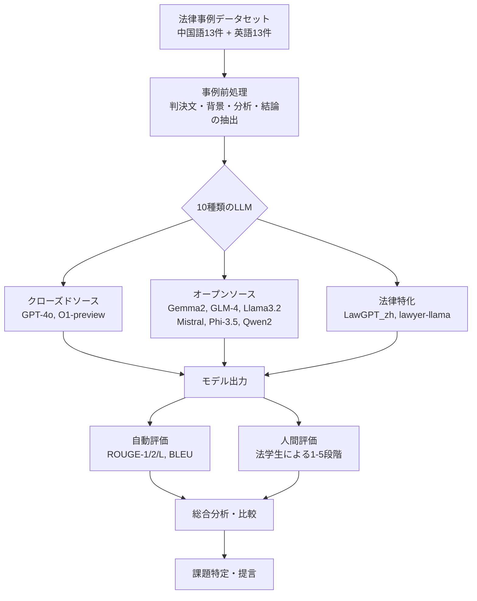
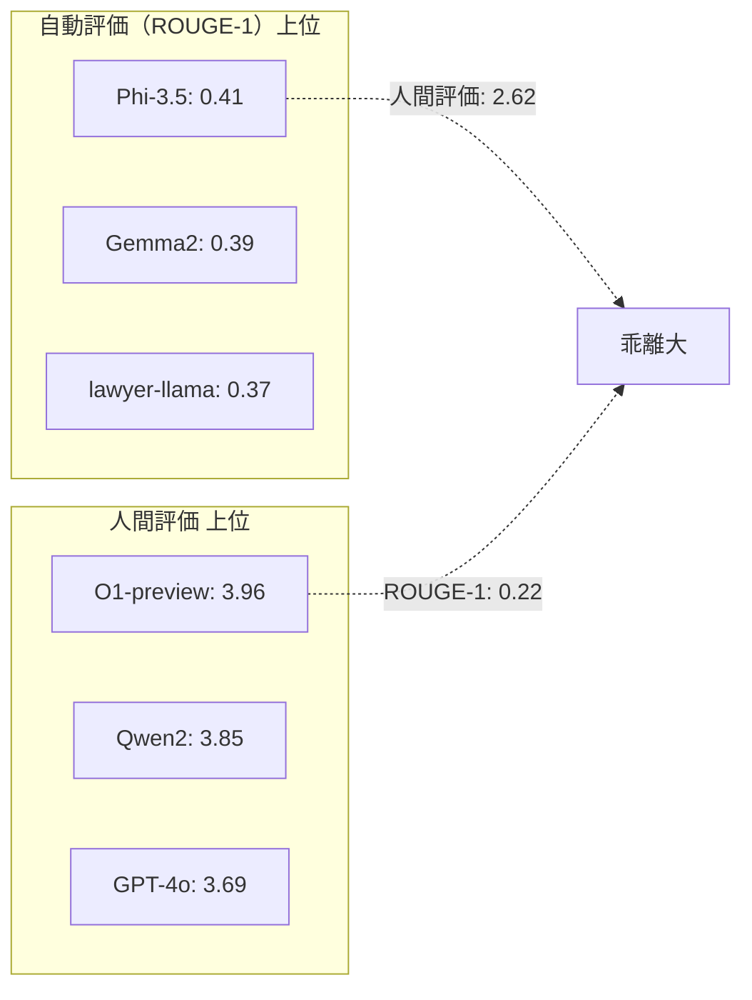
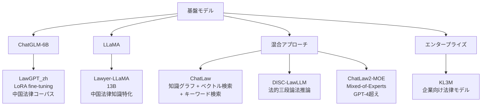

# Legal Evaluations and Challenges of Large Language Models

- **Link**: https://arxiv.org/abs/2411.10137
- **Authors**: Jiaqi Wang, Huan Zhao, Zhenyuan Yang, Peng Shu, Junhao Chen, Haobo Sun, Ruixi Liang, Shixin Li, Pengcheng Shi, Longjun Ma, Zongjia Liu, Zhengliang Liu, Tianyang Zhong, Yutong Zhang, Chong Ma, Xin Zhang, Tuo Zhang, Tianli Ding, Yudan Ren, Tianming Liu, Xi Jiang, Shu Zhang
- **Year**: 2024
- **Venue**: arXiv preprint (cs.CL, cs.AI)
- **Type**: Academic Paper
- **DOI**: https://doi.org/10.48550/arXiv.2411.10137

## Abstract

This paper reviews legal testing methods based on LLMs using OpenAI o1 as a case study. It compares current state-of-the-art LLMs, including open-source, closed-source, and legal-specific models, and conducts systematic tests on English and Chinese legal cases. Results show both potential and limitations, particularly regarding legal language interpretation and reasoning accuracy.

## Abstract（日本語訳）

本論文は、OpenAI o1をケーススタディとして、LLMに基づく法律テスト手法をレビューする。オープンソース、クローズドソース、法律特化モデルを含む最先端LLMを比較し、英語・中国語の法律事例に対する体系的テストを実施する。結果は、特に法律言語の解釈と推論精度に関して、LLMの可能性と限界の両方を示している。

## Overview

本研究は、法律分野におけるLLMの包括的な評価を行った論文である。26件の代表的な法律事例（中国語13件、英語13件）を用いて、10種類のLLM（汎用モデル・法律特化モデルを含む）を自動評価指標（ROUGE、BLEU）と人間評価の両面から比較分析した。主要な発見として、自動評価指標と人間評価の間に顕著な乖離が存在すること、O1-previewが人間評価で最高スコア（3.96/5.00）を達成したこと、法律特化モデルが必ずしも汎用モデルを上回らないことが示された。また、データプライバシー、法的責任の定義、倫理的課題、技術的限界、各国の法制度の違いという5つの主要課題を特定している。

## Problem

本論文が解決を目指す課題：

- **法律分野におけるLLM評価の不足**: 法律テキストの生成・分析能力を体系的に比較した研究が限定的
- **自動評価と人間評価の乖離**: ROUGE・BLEUスコアが法律文書の品質を正確に反映しない問題
- **多言語対応の課題**: 英語・中国語の異なる法体系に対するLLMの対応能力が未検証
- **法律特化モデルの実力検証**: 法律特化モデルが汎用大規模モデルに対して優位性を持つか不明
- **実務適用の障壁**: データプライバシー、法的責任、倫理的問題など実用化に向けた課題の整理

## Proposed Method

**多面的LLM評価フレームワーク**

本研究は、法律分野におけるLLMの能力を多角的に評価するフレームワークを提案している：

1. **データセット構築**: 中国裁判文書ネット（中国語13件）とCourt Listener（英語13件）から代表的事例を選定。民事・刑事・行政の各分野、第一審・控訴審を含む
2. **モデル選定**: クローズドソース（GPT-4o, O1-preview）、オープンソース（Gemma2, GLM-4, Llama3.2, Mistral, Phi-3.5, Qwen2）、法律特化（LawGPT_zh, lawyer-llama）の3カテゴリ10モデル
3. **自動評価**: ROUGE-1, ROUGE-2, ROUGE-L（n-gram重複度）、BLEU（修正精度スコア）で定量評価
4. **人間評価**: 法学生による1〜5段階評価で質的評価を実施

**評価指標の定義**:

$$\text{ROUGE-N} = \frac{\sum_{S \in \text{Ref}} \sum_{\text{gram}_n \in S} \text{Count}_{\text{match}}(\text{gram}_n)}{\sum_{S \in \text{Ref}} \sum_{\text{gram}_n \in S} \text{Count}(\text{gram}_n)}$$

$$\text{BLEU} = \text{BP} \cdot \exp\left(\sum_{n=1}^{N} w_n \log p_n\right)$$

**特徴**:

- 自動評価と人間評価の両方を使用し、評価の多面性を確保
- 中国語・英語の二言語にわたる評価で多言語対応を検証
- 法律特化モデルと汎用モデルの直接比較

## Algorithm（評価手順）

```
Algorithm: Legal LLM Evaluation Framework
Input: 法律事例データセット D = {d_1, ..., d_26}, LLMセット M = {m_1, ..., m_10}
Output: 評価スコア行列 S

1. データ準備
   for each case d_i in D:
     extract(判決文, 背景, 分析, 結論)          // 事例の構成要素を抽出

2. モデル推論
   for each model m_j in M:
     for each case d_i in D:
       response_ij = m_j.generate(d_i.prompt)   // 各モデルに法律事例を入力

3. 自動評価
   for each (response_ij, reference_i):
     compute ROUGE-1, ROUGE-2, ROUGE-L          // n-gram重複度を算出
     compute BLEU                                 // 修正精度スコアを算出

4. 人間評価
   for each response_ij:
     score_ij = human_evaluators.rate(1-5)       // 法学生が5段階評価

5. 集計・分析
   aggregate scores by language (Chinese/English)
   aggregate scores by model category (closed/open/legal-specific)
   compare automated vs human evaluation correlation
```

## Architecture / Process Flow



## Figures & Tables

### Figure 1: 研究の概要図


本研究の全体構成を示す概要図。法律分野におけるLLMのレビュー、主要モデルの概要、法律事例による評価、課題と議論の4つの柱で構成される。

### Table 1: 中国語法律テキストにおけるモデル性能

| Model | ROUGE-1 | ROUGE-2 | ROUGE-L | BLEU | 人間評価 |
|-------|---------|---------|---------|------|----------|
| Gemma2-9B | 0.39 | 0.15 | 0.39 | 0.03 | 3.00 |
| GLM-4-9B-chat | 0.29 | 0.16 | 0.24 | 0.00 | 3.15 |
| **GPT-4o** | 0.13 | 0.01 | 0.10 | 0.00 | **3.85** |
| LawGPT_zh | 0.27 | 0.08 | 0.16 | 0.04 | 1.85 |
| lawyer-llama-13b-v2 | 0.32 | 0.19 | 0.32 | 0.05 | 2.92 |
| llama3.2-3B-instruct | 0.30 | 0.11 | 0.15 | 0.04 | 1.62 |
| Mistral-7B-instruct-v0.3 | 0.38 | 0.15 | 0.20 | 0.07 | 2.54 |
| **O1-preview** | 0.13 | 0.02 | 0.09 | 0.00 | **3.85** |
| Phi-3.5-mini-instruct | 0.38 | 0.13 | 0.38 | 0.03 | 2.15 |
| **Qwen2-7B-Instruct** | 0.27 | 0.16 | 0.23 | 0.00 | **3.85** |

### Table 2: 英語法律テキストにおけるモデル性能

| Model | ROUGE-1 | ROUGE-2 | ROUGE-L | BLEU | 人間評価 |
|-------|---------|---------|---------|------|----------|
| Gemma2-9B | 0.38 | 0.36 | 0.38 | 0.02 | 3.54 |
| GLM-4-9B-chat | 0.34 | 0.14 | 0.16 | 0.00 | 3.54 |
| GPT-4o | 0.23 | 0.07 | 0.21 | 0.01 | 3.54 |
| LawGPT_zh | 0.17 | 0.05 | 0.09 | 0.00 | 2.15 |
| lawyer-llama-13b-v2 | 0.42 | 0.38 | 0.42 | 0.05 | 2.23 |
| llama3.2-3B-instruct | 0.25 | 0.10 | 0.17 | 0.06 | 2.38 |
| Mistral-7B-instruct-v0.3 | 0.27 | 0.12 | 0.15 | 0.04 | 3.62 |
| **O1-preview** | 0.31 | 0.13 | 0.29 | 0.07 | **4.08** |
| Phi-3.5-mini-instruct | 0.44 | 0.41 | 0.44 | 0.04 | 3.08 |
| Qwen2-7B-Instruct | 0.31 | 0.13 | 0.14 | 0.00 | 3.85 |

### Table 3: 総合性能（中国語＋英語）

| Model | ROUGE-1 | ROUGE-2 | ROUGE-L | BLEU | 人間評価 |
|-------|---------|---------|---------|------|----------|
| Gemma2-9B | 0.39 | 0.26 | 0.39 | 0.03 | 3.27 |
| GLM-4-9B-chat | 0.31 | 0.15 | 0.20 | 0.00 | 3.35 |
| GPT-4o | 0.18 | 0.04 | 0.15 | 0.01 | 3.69 |
| LawGPT_zh | 0.22 | 0.07 | 0.12 | 0.02 | 2.00 |
| lawyer-llama-13b-v2 | 0.37 | 0.28 | 0.37 | 0.05 | 2.58 |
| llama3.2-3B-instruct | 0.28 | 0.10 | 0.16 | 0.05 | 2.00 |
| Mistral-7B-instruct-v0.3 | 0.32 | 0.13 | 0.17 | 0.06 | 3.08 |
| **O1-preview** | 0.22 | 0.07 | 0.19 | 0.04 | **3.96** |
| Phi-3.5-mini-instruct | 0.41 | 0.27 | 0.41 | 0.03 | 2.62 |
| Qwen2-7B-Instruct | 0.29 | 0.15 | 0.19 | 0.00 | 3.85 |

### Table 4: モデルカテゴリ別比較

| カテゴリ | 代表モデル | 人間評価平均 | ROUGE-1平均 | 特徴 |
|---------|-----------|-------------|-------------|------|
| クローズドソース | GPT-4o, O1-preview | 3.83 | 0.20 | 高い解釈品質、低い語彙重複 |
| オープンソース | Gemma2, Mistral, Qwen2等 | 3.10 | 0.33 | 中程度の品質、高い語彙重複 |
| 法律特化 | LawGPT_zh, lawyer-llama | 2.29 | 0.30 | 期待に反して最低の人間評価 |

### Table 5: 自動評価 vs 人間評価の乖離分析

| Model | ROUGE-1 順位 | 人間評価 順位 | 順位差 | 分析 |
|-------|-------------|-------------|--------|------|
| O1-preview | 8位 (0.22) | **1位 (3.96)** | +7 | 語彙重複は低いが解釈品質が最高 |
| Phi-3.5-mini | **1位 (0.41)** | 8位 (2.62) | -7 | 語彙一致度は高いが解釈深度が不足 |
| GPT-4o | 9位 (0.18) | 3位 (3.69) | +6 | O1と同傾向、文脈理解に優れる |
| Qwen2-7B | 7位 (0.29) | 2位 (3.85) | +5 | オープンソースで最高の人間評価 |



### 法律特化LLMの系譜図



## Experiments & Evaluation

### Setup

- **データセット**: 26件の法律事例（中国語13件：中国裁判文書ネット、英語13件：Court Listener）
- **事例構成**: 民事・刑事・行政法、第一審・控訴審を含む
- **評価指標**: ROUGE-1/2/L（0〜1、高いほど良い）、BLEU（0〜1）、人間評価（1〜5、法学生による）
- **対象モデル**: 10種類（クローズドソース2、オープンソース6、法律特化2）

### Main Results

**主要な発見**:

1. **O1-previewが人間評価で最高スコア（3.96/5.00）を達成** — 自動評価指標は低い（ROUGE-1: 0.22）にもかかわらず、法律専門家から最も高い評価を受けた
2. **Qwen2-7B-Instructが汎用オープンソースモデルで最高評価（3.85）** — 7Bパラメータという比較的小規模なモデルながら、GPT-4o（3.69）に匹敵する人間評価
3. **法律特化モデルが期待を下回る** — LawGPT_zh（2.00）とlawyer-llama（2.58）は、汎用モデルに劣る人間評価
4. **自動評価と人間評価の乖離** — Phi-3.5-miniはROUGE-1で最高（0.41）だが人間評価は低い（2.62）。語彙の一致が法律文書の品質を反映しないことを示唆
5. **英語テキストの方が全体的に高性能** — ほぼすべてのモデルで英語法律テキストの方が高いスコアを記録。LLMの学習データにおける英語優位を反映

### Ablation Study

本論文では明示的なアブレーション研究は実施されていないが、以下の比較分析が同等の洞察を提供している：

| 比較軸 | 高性能側 | 低性能側 | 示唆 |
|--------|---------|---------|------|
| 言語（英語 vs 中国語） | 英語 | 中国語 | 学習データの言語バランスが影響 |
| モデルサイズ（大 vs 小） | O1, GPT-4o | Llama3.2-3B | 推論能力はスケールに依存 |
| 特化 vs 汎用 | 汎用（GPT-4o等） | 法律特化（LawGPT等） | ドメイン特化の微調整が逆効果の可能性 |
| 自動評価 vs 人間評価 | 相関弱い | — | 法律分野では人間評価が不可欠 |

## 主要課題（Challenges）

### 1. データプライバシー
法律事例には個人情報（身元、財務状況、医療記録）が含まれる。モデルがコンテンツ生成中に意図せず機密情報を露出するリスクがある。

### 2. 法的責任の定義
LLMが問題のある法的助言を提供した場合の責任所在が不明確。開発者・利用者・システムのいずれが責任を負うかのコンセンサスが存在しない。

### 3. 倫理的・道徳的問題
多様なデータソースに起因するバイアスが法律分析に影響。透明性の欠如が信頼性評価を困難にしている。

### 4. 技術的限界
法律用語の理解、事案文脈の把握、複雑なシナリオの分析においてモデルが苦戦。解釈可能性の限界が実務家の信頼を低下させる。

### 5. 各国法制度の違い
データプライバシー重視国とイノベーション重視国で規制方針が異なる。法制度の継続的更新に対するモデルの追従が課題。

## Notes

- ChatGPTはLexGLUEベンチマークで平均マイクロF1スコア49.0%を達成したが、法律テキスト分類では限界を示している
- ChatLaw2-MOEは法律ベンチマークでGPT-4を上回るとされているが、本評価には含まれていない
- 本研究の評価データセット（26件）は比較的小規模であり、結果の一般化には注意が必要
- 人間評価は法学生によるものであり、現役法律専門家による評価とは異なる可能性がある
- 参考文献として59件の学術論文が引用されており、Transformerの基礎文献からGPT-4、Gemini、Claude、Llama 3の技術報告書、法律特化モデルの論文まで幅広くカバーしている
