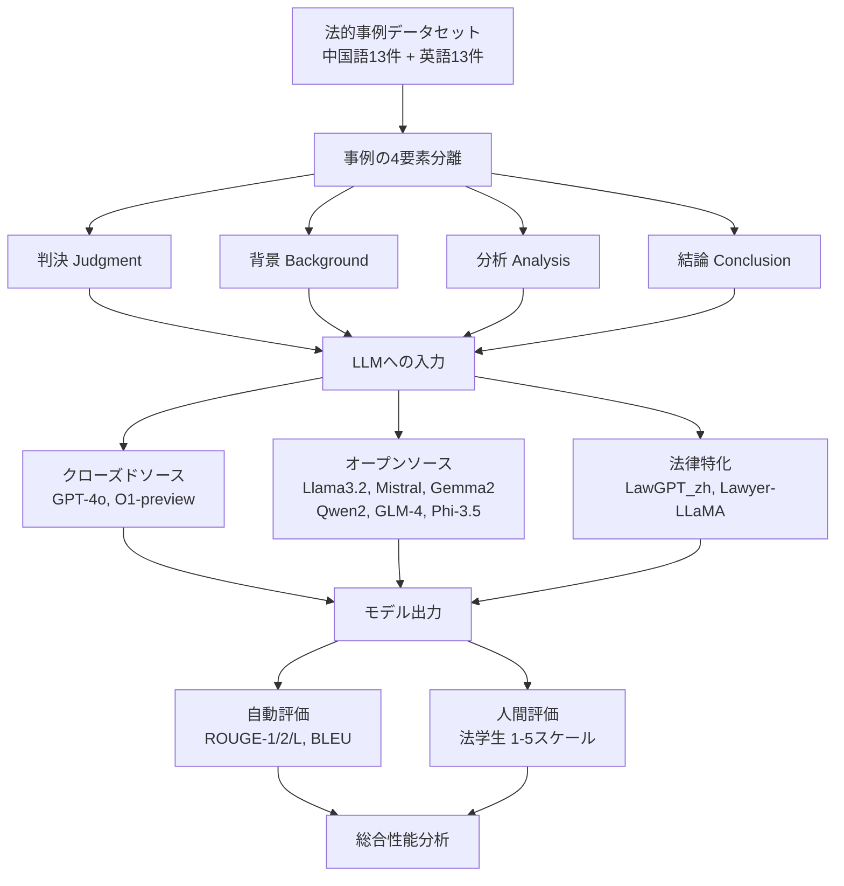
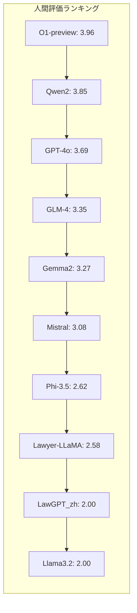

# Legal Evaluations and Challenges of Large Language Models

- **Link**: https://arxiv.org/abs/2411.10137
- **Authors**: Jiaqi Wang, Huan Zhao, Zhenyuan Yang, Peng Shu, Junhao Chen, Haobo Sun, Ruixi Liang, Shixin Li, Pengcheng Shi, Longjun Ma, Zongjia Liu, Zhengliang Liu, Tianyang Zhong, Yutong Zhang, Chong Ma, Xin Zhang, Tuo Zhang, Tianli Ding, Yudan Ren, Tianming Liu, Xi Jiang, Shu Zhang
- **Year**: 2024
- **Venue**: arXiv preprint (cs.CL, cs.AI)
- **Type**: Academic Paper

## Abstract

In this paper, we review legal testing methods based on Large Language Models (LLMs), using the OPENAI o1 model as a case study to evaluate the performance of large models in applying legal provisions. We compare current state-of-the-art LLMs, including open-source, closed-source, and legal-specific models trained specifically for the legal domain. Systematic tests are conducted on English and Chinese legal cases, and the results are analyzed in depth. Through systematic testing of legal cases from common law systems and China, this paper explores the strengths and weaknesses of LLMs in understanding and applying legal texts, reasoning through legal issues, and predicting judgments. The experimental results highlight both the potential and limitations of LLMs in legal applications, particularly in terms of challenges related to the interpretation of legal language and the accuracy of legal reasoning. Finally, the paper provides a comprehensive analysis of the advantages and disadvantages of various types of models, offering valuable insights and references for the future application of AI in the legal field.

## Abstract（日本語訳）

本論文では、大規模言語モデル（LLM）に基づく法的テスト手法をレビューし、OpenAI o1モデルをケーススタディとして、法的規定の適用における大規模モデルの性能を評価する。オープンソース、クローズドソース、および法律ドメイン向けに特化して訓練された法律特化モデルを含む、最新のLLMを比較する。英語および中国語の法的事例に対して体系的なテストを実施し、結果を詳細に分析する。コモンロー体系と中国の法的事例の体系的テストを通じて、本論文はLLMが法的テキストの理解・適用、法的問題の推論、判決予測において持つ長所と短所を探る。実験結果は、特に法的言語の解釈と法的推論の正確性に関する課題において、LLMの法的応用における可能性と限界の両方を明らかにする。最後に、様々なタイプのモデルの長所と短所の包括的な分析を提供し、法律分野におけるAIの将来的な応用に向けた有益な知見と参考情報を提示する。

## Overview

本論文は、LLMの法的応用における性能を包括的に評価した研究である。13件の中国語法的事例と13件の英語法的事例（合計26件）を用いて、クローズドソースモデル（GPT-4o、O1-preview）、オープンソースモデル（Llama 3.2、Mistral 7B、Gemma2、Qwen2、GLM-4、Phi-3.5）、法律特化モデル（LawGPT_zh、Lawyer-LLaMA）の10モデルを比較評価した。評価にはROUGE/BLEUの自動メトリクスと、法学生による人間評価（5段階）の両方を使用。結果として、O1-previewが人間評価で最高スコア（3.96）を達成した一方、自動メトリクスと人間評価の間に乖離が見られ、法的推論の評価には人間の判断が不可欠であることを示した。

## Problem

本論文が解決を目指す課題は以下の通り：

- **法的言語の専門性**: 法的言語は高度に専門的かつ精密であり、LLMが生成するコンテンツの正確性と合法性の保証が困難
- **評価手法の不足**: LLMの法的応用における性能を体系的に評価するフレームワークが不足
- **多言語・多法体系への対応**: コモンロー体系と大陸法体系（中国法）の両方にわたるLLMの性能比較が不十分
- **バイアスと倫理**: 訓練データから吸収されるバイアスと、自動化された法的意思決定の倫理的影響

## Proposed Method

**多角的LLM法的評価フレームワーク**

本研究の評価手法は以下の構成で設計されている：

1. **データセット構築**: 中国語13件（中国裁判文書公開データベース）＋英語13件（Court Listenerデータベース）の代表的法的事例を選定。民事・刑事・行政事件を含み、個人情報は匿名化処理
2. **評価対象の4コンポーネント分離**: 各事例について判決（judgment）、背景（background）、分析（analysis）、結論（conclusion）の4要素に分けて評価
3. **二重評価メトリクス**: 自動メトリクス（ROUGE-1/2/L、BLEU）による語彙的重複測定と、訓練を受けた法学生による人間評価（1-5スケール）の併用
4. **モデルカテゴリ横断比較**: クローズドソース・オープンソース・法律特化の3カテゴリにわたるモデルを統一条件で比較

**特徴**:

- 英語・中国語の二言語評価により、モデルの言語依存性を検証
- 自動メトリクスと人間評価の乖離を定量的に分析
- 法律特化モデルが汎用モデルに必ずしも勝るわけではないことを実証

## Algorithm（疑似コード）

```
Algorithm: LLM Legal Case Evaluation Pipeline
Input: Legal cases C = {c_1, ..., c_26}, Models M = {m_1, ..., m_10}
Output: Performance scores per model

1. データセット準備:
   - C_zh ← 中国裁判文書公開DBから13件選定    // 民事・刑事・行政
   - C_en ← Court Listenerから13件選定         // 連邦・州裁判所
   - 個人情報を匿名化処理

2. For each model m_i in M:
   For each case c_j in C:
     a. prompt ← 事例の事実関係と法的問題を入力として構成
     b. output_ij ← m_i(prompt)                // モデルによる判決生成
     c. ref_ij ← 実際の判決文（参照テキスト）

3. 自動評価:
   For each (output_ij, ref_ij):
     - ROUGE-1, ROUGE-2, ROUGE-L ← n-gram重複計算
     - BLEU ← 修正精度スコア計算

4. 人間評価:
   For each output_ij:
     - 訓練済み法学生が1-5スケールで評価
     - 基準: 実際の判決結果との法的推論の整合性

5. 集計: 中国語・英語・総合の3レベルで平均スコア算出
6. Return {ROUGE, BLEU, Human_Eval} per model
```

## Architecture / Process Flow



## Figures & Tables

### Figure 1: 研究の概要図


研究全体の構造と方法論を視覚的に示す概要図。LLMの法的応用評価の枠組みを示す。

### Table I: 中国語法的テキストにおけるLLMの性能

| Model | ROUGE-1 | ROUGE-2 | ROUGE-L | BLEU | 人間評価 |
|-------|---------|---------|---------|------|----------|
| Gemma2-9B | 0.39 | 0.15 | 0.39 | 0.03 | 3.00 |
| GLM-4-9B-chat | 0.29 | 0.16 | 0.24 | 0.00 | 3.15 |
| **GPT-4o** | 0.13 | 0.01 | 0.10 | 0.00 | **3.85** |
| LawGPT_zh | 0.27 | 0.08 | 0.16 | 0.04 | 1.85 |
| Lawyer-LLaMA-13b-v2 | 0.32 | 0.19 | 0.32 | 0.05 | 2.92 |
| Llama3.2-3B-instruct | 0.30 | 0.11 | 0.15 | 0.04 | 1.62 |
| Mistral-7B-instruct-v0.3 | 0.38 | 0.15 | 0.20 | 0.07 | 2.54 |
| **O1-preview** | 0.13 | 0.02 | 0.09 | 0.00 | **3.85** |
| Phi-3.5-mini-instruct | 0.38 | 0.13 | 0.38 | 0.03 | 2.15 |
| **Qwen2-7B-Instruct** | 0.27 | 0.16 | 0.23 | 0.00 | **3.85** |

### Table II: 英語法的テキストにおけるLLMの性能

| Model | ROUGE-1 | ROUGE-2 | ROUGE-L | BLEU | 人間評価 |
|-------|---------|---------|---------|------|----------|
| Gemma2-9B | 0.38 | 0.36 | 0.38 | 0.02 | 3.54 |
| GLM-4-9B-chat | 0.34 | 0.14 | 0.16 | 0.00 | 3.54 |
| GPT-4o | 0.23 | 0.07 | 0.21 | 0.01 | 3.54 |
| LawGPT_zh | 0.17 | 0.05 | 0.09 | 0.00 | 2.15 |
| Lawyer-LLaMA-13b-v2 | 0.42 | 0.38 | 0.42 | 0.05 | 2.23 |
| Llama3.2-3B-instruct | 0.25 | 0.10 | 0.17 | 0.06 | 2.38 |
| Mistral-7B-instruct-v0.3 | 0.27 | 0.12 | 0.15 | 0.04 | 3.62 |
| **O1-preview** | 0.31 | 0.13 | 0.29 | 0.07 | **4.08** |
| Phi-3.5-mini-instruct | 0.44 | 0.41 | 0.44 | 0.04 | 3.08 |
| Qwen2-7B-Instruct | 0.31 | 0.13 | 0.14 | 0.00 | 3.85 |

### Table III: LLMの総合性能

| Model | ROUGE-1 | ROUGE-2 | ROUGE-L | BLEU | 人間評価 |
|-------|---------|---------|---------|------|----------|
| Gemma2-9B | 0.39 | 0.26 | 0.39 | 0.03 | 3.27 |
| GLM-4-9B-chat | 0.31 | 0.15 | 0.20 | 0.00 | 3.35 |
| GPT-4o | 0.18 | 0.04 | 0.15 | 0.01 | 3.69 |
| LawGPT_zh | 0.22 | 0.07 | 0.12 | 0.02 | 2.00 |
| Lawyer-LLaMA-13b-v2 | 0.37 | 0.28 | 0.37 | 0.05 | 2.58 |
| Llama3.2-3B-instruct | 0.28 | 0.10 | 0.16 | 0.05 | 2.00 |
| Mistral-7B-instruct-v0.3 | 0.32 | 0.13 | 0.17 | 0.06 | 3.08 |
| **O1-preview** | 0.22 | 0.07 | 0.19 | 0.04 | **3.96** |
| Phi-3.5-mini-instruct | 0.41 | 0.27 | 0.41 | 0.03 | 2.62 |
| Qwen2-7B-Instruct | 0.29 | 0.15 | 0.19 | 0.00 | 3.85 |

### 人間評価スコアの比較（総合）



### 自動メトリクス vs 人間評価の乖離

| Model | ROUGE-1 (総合) | 人間評価 (総合) | 乖離の傾向 |
|-------|----------------|----------------|------------|
| Phi-3.5-mini-instruct | **0.41** (最高) | 2.62 | 語彙的重複は高いが文脈的正確性に欠ける |
| O1-preview | 0.22 (低) | **3.96** (最高) | 語彙的重複は低いが法的推論の質が高い |
| GPT-4o | 0.18 (低) | 3.69 | 同上の傾向 |
| LawGPT_zh | 0.22 | 2.00 | 両メトリクスとも低い |

### モデルカテゴリ別比較

| 特徴 | クローズドソース (GPT-4o, O1) | オープンソース (Llama, Mistral等) | 法律特化 (LawGPT, Lawyer-LLaMA) |
|------|-------------------------------|----------------------------------|----------------------------------|
| 人間評価（平均） | 3.83 | 2.86 | 2.29 |
| ROUGE-1（平均） | 0.20 | 0.34 | 0.30 |
| 法的推論の質 | 高い | 中程度 | 低〜中 |
| 多言語対応 | 良好 | モデル依存 | 中国語特化が多い |
| 文脈理解 | 優れている | 限定的 | 限定的 |

## Experiments & Evaluation

### Setup

- **データセット**: 26件の法的事例（中国語13件 + 英語13件）
  - 中国語: 中国裁判文書公開データベースから選定（民事・刑事・行政）
  - 英語: Court Listenerから選定（連邦・州裁判所、移民法・刑法・行政法）
- **評価メトリクス**: ROUGE-1, ROUGE-2, ROUGE-L, BLEU（自動）、人間評価1-5スケール（法学生）
- **比較モデル**: 10モデル（クローズドソース2、オープンソース6、法律特化2）

### Main Results

**総合人間評価トップ3:**
1. O1-preview: **3.96** — 多様な法的事例にわたり人間の判断と高い整合性
2. Qwen2-7B-Instruct: **3.85** — オープンソースでありながら高い法的推論能力
3. GPT-4o: **3.69** — 安定した文脈理解と法的分析能力

**重要な発見:**
- 自動メトリクスと人間評価の間に顕著な乖離が存在（Phi-3.5はROUGE最高だが人間評価では下位）
- 法律特化モデル（LawGPT_zh: 2.00, Lawyer-LLaMA: 2.58）が汎用モデルに劣る結果
- 英語テキストの方が全体的に高い人間評価スコアを獲得（例: Gemma2 英語3.54 vs 中国語3.00）
- BLEUスコアは全モデルで非常に低い（最高0.07）ため、法的テキスト評価には不適切

### Ablation Study

本論文ではアブレーションスタディは実施されていないが、言語別の分析が同等の役割を果たしている：

| Model | 中国語人間評価 | 英語人間評価 | 差分 |
|-------|---------------|-------------|------|
| O1-preview | 3.85 | 4.08 | +0.23 |
| Gemma2-9B | 3.00 | 3.54 | +0.54 |
| GLM-4-9B-chat | 3.15 | 3.54 | +0.39 |
| LawGPT_zh | 1.85 | 2.15 | +0.30 |
| Mistral-7B | 2.54 | 3.62 | +1.08 |

全モデルで英語の方が高いスコアを示しており、中国語法的テキストの処理がより困難であることを示唆。

## 法律分野特化LLMの概要

本論文で調査された主要な法律特化LLM：

| モデル名 | ベースモデル | 特徴 | 対象言語 |
|----------|-------------|------|----------|
| LAWGPT-zh | ChatGLM-6B | 16bit LoRA微調整、法律QAデータセット | 中国語 |
| LAWGPT | - | 大規模中国語法的文書による事前学習 | 中国語 |
| Lawyer-LLaMA | LLaMA | 婚姻法・貸金法・海事法・刑法 | 中国語 |
| LexiLaw | ChatGLM-6B | 法律相談特化の微調整 | 中国語 |
| LexGPT 0.1 | GPT-J | Pile of Lawデータセット | 英語 |
| ChatLaw | - | ベクトルDB+キーワード検索によるハルシネーション低減 | 中国語 |
| DISC-LawLLM | - | 法的三段論法推論+検索モジュール | 中国語 |
| KL3M | ゼロから構築 | クリーンデータによる法律・規制・金融特化 | 英語 |

## 課題と今後の展望

### 1. データプライバシー
法的事例には個人の機密情報が含まれており、モデル訓練・生成時の情報漏洩リスクが存在。厳格なデータ処理・レビューメカニズムが必要。

### 2. 法的責任の定義
LLMによる法的助言・意思決定における責任の帰属（開発者・ユーザー・モデル）が不明確。包括的な法的枠組みの確立が急務。

### 3. 倫理的問題
多様なデータソースからのバイアスが不公平な出力をもたらす可能性。法的文脈での中立性確保と差別防止が課題。

### 4. 技術的限界
法的用語の理解、文脈把握、複雑な法的シナリオの分析におけるエラー。モデルの解釈可能性の欠如が実務者の信頼性に影響。

### 5. 法制度の違い
国・地域ごとの法規制の差異がコンプライアンスリスクを生む。法制度の継続的な更新にモデルが追従する必要性。

## Notes

- 本研究は、法的推論の評価において自動メトリクス（ROUGE/BLEU）だけでは不十分であり、人間評価が不可欠であることを強く示唆している
- 法律特化モデルが汎用大規模モデルに劣る結果は、ドメイン特化の微調整よりもモデルの基盤能力（パラメータ数、訓練データ量）が法的推論に重要である可能性を示す
- 評価データセットが26件と比較的小規模であり、結果の一般化には注意が必要
- O1-previewの推論能力（Chain-of-Thought）が法的推論タスクで有効に機能している可能性がある
- 中国語法的テキストでの全モデルの性能低下は、中国法の専門性と法的言語の複雑性を反映している
