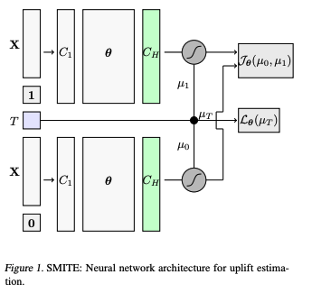

# 因果推論の論文

## [Deep Learning for Causal Inference](https://arxiv.org/abs/2405.03130)

### Abstract

This primer systematizes the emerging literature on causal inference using deep neural networks under the potential outcomes framework. It provides an intuitive introduction on building and optimizing custom deep learning models and shows how to adapt them to estimate/predict heterogeneous treatment effects. It also discusses ongoing work to extend causal inference to settings where confounding is non-linear, time-varying, or encoded in text, networks, and images. To maximize accessibility, we also introduce prerequisite concepts from causal inference and deep learning. The primer differs from other treatments of deep learning and causal inference in its sharp focus on observational causal estimation, its extended exposition of key algorithms, and its detailed tutorials for implementing, training, and selecting among deep estimators in Tensorflow 2 and PyTorch.

### 概要

機械学習を用いた因果推論モデルの実装や運用についての基本的な知識をまとめている.  Bayesian Causal Forest algorithmをneural networkで実装したものを提案している. また, stressとsleepの関係についてのデータセットを用いて提案手法の有効性を示している.

先行研究(Farrell)で次のようにモデル化されていたものを

```math
\begin{align}
\mathbb{E}(Y|X=x, Z=z) &= G(\alpha(x)+\beta(x)z) \\
\end{align}
```


```math
\begin{align}
\mathbb{E}(Y|X=x, Z=z) &= G(\alpha(x, \hat{\pi}(x))+\beta(x)z) \\
\end{align}
```


へと変更した. ここで, $\hat{\pi}(x)$は傾向スコアの推定値を表している. このモデルは, $\alpha(\cdot)$と$\beta(\cdot)$を別のネットワークとすることにより, cateの推定精度を向上させることができる.
ここで, $Y$を目的変数として, mean squared errorを最小化するように学習を行う.

```math
\begin{align}
\frac{1}{n}\sum_i[(y_i - G(\alpha(x_i, \hat{\pi}(x_i))+\beta(x_i)z_i))^2]
\end{align}
```

### 参考

- [githubリンク](https://github.com/kochbj/Deep-Learning-for-Causal-Inference?tab=readme-ov-file)

## [Deep Learning for Causal Inference](https://arxiv.org/pdf/2405.03130)

### Abstract

Causal inference has gained much popularity in recent years, with interests ranging from academic, to industrial, to educational, and all in between. Concurrently, the study and usage of neural networks has also grown profoundly (albeit at a far faster rate). What we aim to do in this blog write-up is demonstrate a Neural Network causal inference architecture. We develop a fully connected neural network implementation of the popular Bayesian Causal Forest algorithm, a state of the art tree based method for estimating heterogeneous treatment effects. We compare our implementation to existing neural network causal inference methodologies, showing improvements in performance in simulation settings. We apply our method to a dataset examining the effect of stress on sleep.

### 概要

deep learningを用いた基本的な因果推論モデルの提案

### 参考

- [TARNET](https://arxiv.org/pdf/1606.03976)
- [Dragonnet](https://arxiv.org/abs/1906.02120)
- [Deep Learning for Individual Heterogeneity: An Automatic Inference Framework](https://arxiv.org/pdf/2010.14694)

## [Recent Developments in Causal Inference and Machine Learning](https://www.annualreviews.org/docserver/fulltext/soc/49/1/annurev-soc-030420-015345.pdf?expires=1735489036&id=id&accname=guest&checksum=6A06D2C37649D9C469B2FA146A603FCA)

### Abstract

This article reviews recent advances in causal inference relevant to sociology. We focus on a selective subset of contributions aligning with four broad topics: causal effect identification and estimation in general, causal effect heterogeneity, causal effect mediation, and temporal and spatial interference. We describe how machine learning, as an estimation strategy, can be effectively combined with causal inference, which has been traditionally concerned with identification. The incorporation of machine learning in causal inference enables researchers to better address potential biases in estimating causal effects and uncover heterogeneous causal effects. Uncovering sources of effect heterogeneity is key for generalizing to populations beyond those under study. While sociology has long emphasized the importance of causal mechanisms, historical and life-cycle variation, and social contexts involving network interactions, recent conceptual and computational advances facilitate more principled estimation of causal effects under these settings. We encourage sociologists to incorporate these insights into their empirical research.

### 概要

因果推論の基本概念と機械学習による推論についてのレビュー. LASSOによる傾向スコアの推論. 交絡因子の推定についても言及.

### 参考

## [Adapting Neural Networks for the Estimation of Treatment Effects](https://arxiv.org/abs/1906.02120)

### Abstract

This paper addresses the use of neural networks for the estimation of treatment effects from observational data. Generally, estimation proceeds in two stages. First, we fit models for the expected outcome and the probability of treatment (propensity score) for each unit. Second, we plug these fitted models into a downstream estimator of the effect. Neural networks are a natural choice for the models in the first step. The question we address is: how can we adapt the design and training of the neural networks used in the first step in order to improve the quality of the final estimate of the treatment effect? We propose two adaptations based on insights from the statistical literature on the estimation of treatment effects. The first is a new architecture, the Dragonnet, that exploits the sufficiency of the propensity score for estimation adjustment. The second is a regularization procedure, targeted regularization, that induces a bias towards models that have non-parametrically optimal asymptotic properties ‘out-of-the-box’. Studies on benchmark datasets for causal inference show these adaptations outperform existing methods. Code is available at github.com/claudiashi57/dragonnet.

### 概要

Dragonnetの論文. githubリンクもあるので, 実装の参考にできる.

### 参考

## [Adapting Neural Networks for Uplift Models](https://arxiv.org/abs/2011.00041)

### Abstract

Uplift is a particular case of individual treatment effect modeling. Such models deal with cause-and-effect inference for a specific factor, such as a marketing intervention. In practice, these models are built on customer data who purchased products or services to improve product marketing. Uplift is estimated using either i) conditional mean regression or ii) transformed outcome regression. Most existing approaches are adaptations of classification and regression trees for the uplift case. However, in practice, these conventional approaches are prone to overfitting. Here we propose a new method using neural networks. This representation allows to jointly optimize the difference in conditional means and the transformed outcome losses. As a consequence, the model not only estimates the uplift, but also ensures consistency in predicting the outcome. We focus on fully randomized experiments, which is the case of our data. We show our proposed method improves the state-of-the-art on synthetic and real data.

### 概要



### 参考
