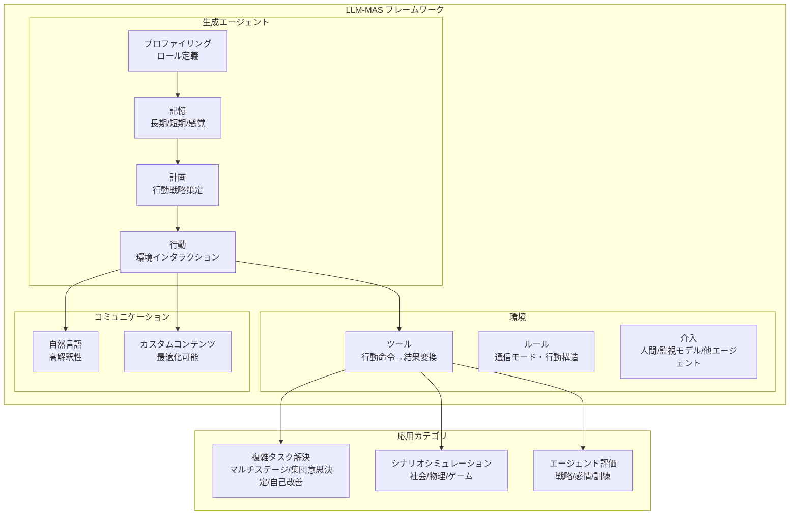

# A Survey on LLM-based Multi-Agent System: Recent Advances and New Frontiers in Application

- **Link**: https://arxiv.org/abs/2412.17481
- **Authors**: Shuaihang Chen, Yuanxing Liu, Wei Han, Weinan Zhang, Ting Liu
- **Year**: 2024
- **Venue**: arXiv preprint (ACL/NeurIPS/AAAI/ICLRなど主要会議の論文125本を分析)
- **Type**: Academic Paper (Survey)

## Abstract

LLM-based Multi-Agent Systems (LLM-MAS) have become a research hotspot since the rise of large language models (LLMs). However, with the continuous influx of new related works, the existing reviews struggle to capture them comprehensively. This paper presents a comprehensive survey of these studies. We first discuss the definition of LLM-MAS, a framework encompassing much of previous work. We provide an overview of the various applications of LLM-MAS in (i) solving complex tasks, (ii) simulating specific scenarios, and (iii) evaluating generative agents. Building on previous studies, we also highlight several challenges and propose future directions for research in this field.

## Abstract（日本語訳）

LLMベースのマルチエージェントシステム（LLM-MAS）は、大規模言語モデル（LLM）の台頭以来、研究のホットスポットとなっている。しかし、新しい関連研究が継続的に流入する中、既存のレビューはそれらを包括的に捉えることが困難になっている。本論文はこれらの研究の包括的なサーベイを提示する。まずLLM-MASの定義について議論し、先行研究の多くを包含するフレームワークを提供する。LLM-MASの(i)複雑なタスクの解決、(ii)特定のシナリオのシミュレーション、(iii)生成エージェントの評価における多様な応用の概要を示す。先行研究に基づき、この分野の研究におけるいくつかの課題を強調し、将来の研究方向を提案する。

## 概要

本サーベイは、2023-2024年のACL、NeurIPS、AAAI、ICLRなど主要AI会議およびarXivから収集した125本の論文を分析し、LLMベースマルチエージェントシステム（LLM-MAS）の現状を体系的に整理した包括的調査である。

主要な貢献は以下の通り：

1. **フレームワーク定義**: 生成エージェントの構成要素（プロファイリング・記憶・計画・行動）と環境要素（ツール・ルール・介入）を含む統一的な定義を提示
2. **アプリケーション分類体系**: 応用を「複雑タスク解決」「シナリオシミュレーション」「生成エージェント評価」の3カテゴリに整理
3. **課題と将来方向**: 個別エージェント能力、インタラクション効率、評価手法の3軸で課題を特定
4. **リソース分析**: フレームワーク・ベンチマーク・データセットの横断的な分析を提供

従来のアーキテクチャ中心のサーベイとは異なり、アプリケーション中心の分類体系を採用している点が特徴である。

## 問題と動機

- **既存レビューの網羅性不足**: LLM-MAS分野の急速な発展により、新しい研究が継続的に発表されているが、既存のレビューはそれらを包括的にカバーできていない
- **従来のRLエージェントの限界**: 従来の強化学習ベースのエージェントは汎用的な推論能力に欠けており、LLMベースのエージェントが自然言語インターフェースによる柔軟で説明可能なインタラクションを提供する
- **統一的フレームワークの欠如**: 個別の研究が独自の用語や分類を使用しており、研究間の比較・統合が困難
- **アプリケーション視点の不足**: 既存サーベイの多くがアーキテクチャ中心であり、実際の応用シーンに基づく体系的な整理が不足

## 提案手法

**LLM-MASフレームワーク（Application-Centric Taxonomy）**

本サーベイの核心は、LLM-MASを3つの主要応用カテゴリに分類するアプリケーション中心の分類体系である。

### 生成エージェントのコア構成要素

1. **プロファイリング（Profiling）**: 自然言語によるロール定義。エージェントごとにカスタマイズされたプロンプトでタスク特性を規定
2. **記憶（Memory）**: 長期・短期・感覚の3層構造。LLMのコンテキスト制限に対処しつつ、長期的な意思決定を可能にする
3. **計画（Planning）**: 拡張された時間軸にわたる行動戦略の策定
4. **行動（Action）**: 制約付き（投票）または非制約（テキスト生成）による環境とのインタラクション実行

### コミュニケーション機構

- **自然言語コミュニケーション**: 高い解釈性を持つが最適化が困難。合意形成に適している
- **カスタムエンコードコミュニケーション**: ポリシー勾配で最適化可能だが人間の解釈性が低い。協調タスクに適している
- **アーキテクチャ**: 完全接続型（組み合わせ爆発リスク）、分散議論型（不完全情報対応）、インターネット型（IOA: スケーラブル通信）

### 3つの応用カテゴリ

**カテゴリ1: 複雑タスク解決**
- マルチステージ推論（ChatDev等）: エージェントが異なるステージで直列問題解決
- 集団意思決定: 投票・議論による共有目標への収束
- 自己改善（Self-refine）: 自己反省メカニズム
- コミュニケーション最適化: 非言語通信・分散議論

**カテゴリ2: シナリオシミュレーション**
- 社会シミュレーション（Stanford Town等）: 25エージェントの1日シミュレーション
- 感情伝播・情報繭・社会運動のシミュレーション
- ゲームシナリオ（Werewolf, Avalon, Minecraft）
- 物理ドメイン（交通システム、無線ネットワーク）

**カテゴリ3: 生成エージェント評価**
- 戦略能力評価（AgentBench）
- 感情理解評価（MuMA-ToM）
- 訓練アプローチ: SFT、MARL、合成データ生成

## アーキテクチャ / プロセスフロー



```
意思決定パイプライン:
┌─────────────────────────────────────────────────┐
│ 1. 記憶からの情報抽出                             │
│    ↓                                             │
│ 2. 計画・戦略策定                                 │
│    ↓                                             │
│ 3. 行動選択・実行                                 │
│    ↓                                             │
│ 4. 環境フィードバック統合                          │
│    ↓                                             │
│ 5. （ループ: 次の意思決定サイクルへ）               │
└─────────────────────────────────────────────────┘
```

## Figures & Tables

### Figure 1: LLM-MASフレームワーク概観
LLM-MAS・生成エージェント・LLMの関係を示す図。破線ボックスが既存研究との対応、丸角四角形が本サーベイの新規貢献を表す。3つの応用カテゴリ（複雑タスク解決・シナリオシミュレーション・エージェント評価）が中心的な構造として配置されている。

### Table 1: 複雑タスク解決のリソース一覧
| カテゴリ | 代表システム | データセット/ベンチマーク |
|---------|------------|----------------------|
| マルチステージ | ChatDev | SRDD |
| マルチステージ | MapCoder | HumanEval, MBPP, APPS |
| 集団意思決定 | GEDI | MCQA |
| 集団意思決定 | Cooper | ESConv, P4G |
| 自己改善 | ReConcile | StrategyQA, CSQA, GSM8K |

### Table 2: シナリオシミュレーションのリソース一覧
| ドメイン | 代表システム | ベンチマーク |
|---------|------------|------------|
| 社会 | Stanford Town | なし |
| 社会 | AgentCourt | AgentCourt dataset |
| ゲーム | Werewolf系 | WWQA |
| メディア | SoMoSiMu | SoMoSiMu-Bench |

### Table 3: エージェント評価のリソース一覧
| システム | 評価対象 |
|---------|---------|
| AgentBench | 戦略評価フレームワーク |
| ChatEval | マルチエージェント議論評価 |
| LLMArena | 動的マルチエージェント環境評価 |
| PsySafe | 心理的安全性評価 |
| MuMA-ToM | マルチモーダル感情推論 |

### Figure（概念図）: コミュニケーションアーキテクチャ比較
完全接続型（全エージェント間の直接通信、O(n^2)の通信コスト）、分散議論型（不完全情報下でのタスク解決）、インターネット型IOA（スケーラブルな大規模通信）の3つのアーキテクチャを比較。

## 実験と評価

### 実験設定

本サーベイでは直接的な実験は実施されていないが、以下のサーベイ対象システムの評価設定を整理している：

- **データ収集**: ACL、NeurIPS、AAAI、ICLRなど主要AI会議の2023-2024年の論文125本
- **分析軸**: アプリケーションカテゴリ別の分類、リソース（フレームワーク・ベンチマーク・データセット）の整理

### 主要結果

**複雑タスク解決における知見**:
- ChatDevはSRDDデータセットでソフトウェア開発のマルチステージ協調を実証
- ReConcileはStrategyQA、CSQA、GSM8Kで自己改善機構の有効性を確認
- コミュニケーションコスト分析では、実行時間とオペレーショナルオーバーヘッドがトレードオフの関係

**シミュレーションにおける知見**:
- Stanford Townは25エージェントの日常行動パターンが人間の行動と一致することを確認
- SoMoSiMu-Benchは個人行動追跡とシステムレベル結果評価の両面で大規模シミュレーションの妥当性を検証
- 一貫性評価（実世界データとの忠実度比較）と情報伝播追跡（イベント認知度・感情密度の時系列分析）の2つの評価アプローチを特定

**評価・訓練における知見**:
- Doctor Agentシミュレーションでは、数千のケースを数日で訓練可能（人間では数年かかるプロセス）
- MARLはLLMバイアスの克服に有効
- SFTによるデータ拡張はマルチエージェント協調で効果的

## 備考

### 課題と将来方向

**生成エージェントの課題**:
- 汎用アラインメント問題: 基盤モデルの訓練バイアスにより多様な特性を信頼性高く表現できない
- エージェント間インタラクション中のハルシネーション確率
- 長文テキスト処理能力の不足: 複雑な処理中に入力を忘却

**インタラクションの課題**:
- 効率爆発: 自己回帰LLM推論速度がボトルネック（記憶抽出・計画・実行で複数回モデルクエリ）
- 累積効果: LLM-MASのラウンド間でエラーが蓄積し下流結果に影響
- 現在のルールベースエラー修正は不十分

**評価の課題**:
- 客観的メトリクスの欠如: マルチエージェント環境の多様性が集団レベルのメトリクスを困難に
- ベンチマーク不足: 個別・システムレベルの共通評価フレームワークの欠如

**将来の研究方向**:
- OPTIMA: アラインメントベースのコスト削減
- AgentScope: 工業化された並列処理
- 大規模LLM-MAS研究が新興ホットスポット
- 共通ベンチマーク開発とスケール効果の発見
