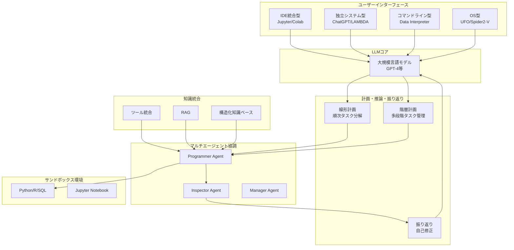

# A Survey on Large Language Model-based Agents for Statistics and Data Science

- **Link**: https://arxiv.org/abs/2412.14222
- **Authors**: Maojun Sun, Ruijian Han, Binyan Jiang, Houduo Qi, Defeng Sun, Yancheng Yuan, Jian Huang
- **Year**: 2025
- **Venue**: American Statistician (2025) 1-14
- **Type**: Academic Paper (Survey)

## Abstract

In recent years, data science agents powered by Large Language Models (LLMs), known as 'data agents,' have shown significant potential to transform the traditional data analysis paradigm. This survey provides an overview of the evolution, capabilities, and applications of LLM-based data agents, highlighting their role in simplifying complex data tasks and lowering the entry barrier for users without related expertise. We explore current trends in the design of LLM-based frameworks, detailing essential features such as planning, reasoning, reflection, multi-agent collaboration, user interface, knowledge integration, and system design, which enable agents to address data-centric problems with minimal human intervention. Furthermore, we analyze several case studies to demonstrate the practical applications of various data agents in real-world scenarios. Finally, we identify key challenges and propose future research directions to advance the development of data agents into intelligent statistical analysis software.

## Abstract（日本語訳）

近年、大規模言語モデル（LLM）を搭載したデータサイエンスエージェント（「データエージェント」）は、従来のデータ分析パラダイムを変革する大きな可能性を示している。本サーベイは、LLMベースのデータエージェントの進化・能力・応用の概要を提供し、複雑なデータタスクの簡素化と専門知識を持たないユーザーの参入障壁の低下における役割を強調する。計画・推論・振り返り・マルチエージェント協調・ユーザーインターフェース・知識統合・システム設計などの必須機能を含むLLMベースフレームワークの設計における現在のトレンドを探る。さらに、実世界シナリオにおける様々なデータエージェントの実用的応用を実証するための複数のケーススタディを分析する。最後に、データエージェントのインテリジェント統計分析ソフトウェアへの発展を推進するための主要な課題と将来の研究方向を特定する。

## 概要

本サーベイは、LLMベースのデータサイエンスエージェント（データエージェント）の設計・能力・応用を包括的に調査した論文であり、American Statisticianに掲載されている。統計学・データサイエンスの観点からLLMエージェントの実用性を評価している点が特徴的である。

主要な貢献は以下の通り：

1. **4つの参入障壁の特定**: 統計知識ギャップ、ソフトウェア制限、ドメイン固有の専門知識、知識統合の困難さ
2. **フレームワーク設計要素の体系化**: 計画（線形/階層型）、推論・振り返り、マルチエージェント協調、UI設計（IDE/独立/CLI/OS型）、知識統合（ツール/RAG/知識ベース）の7つの設計軸を整理
3. **実践的ケーススタディ**: Wine Quality、Auto MPGデータセットを用いた探索的データ分析・回帰診断・ブートストラップ信頼区間・拡張性の4つのケーススタディ
4. **再現性の議論**: モデルレベル・システムレベルの再現性に関する詳細な分析
5. **将来方向**: インテリジェント統計ソフトウェアとしての発展に向けた課題と方向性の提示

## 問題と動機

- **統計知識ギャップ**: 体系的な統計訓練の欠如により、非専門家が適切な分析手法を選択できない。適切な統計手法の理解なしにデータ分析を行うことは困難
- **ソフトウェア制限**: Excelなどの単純なツールは複雑な作業に不十分であり、Python/Rなどの高度な言語にはプログラミングスキルが必要。ツールと能力のギャップが存在
- **ドメイン固有専門知識の壁**: ゲノミクスなどの専門分野では深いドメイン知識が不可欠であり、汎用データサイエンティストでは対応困難
- **知識統合の困難**: ドメイン専門家がプログラミングスキルなしに専門知識を標準ツールに組み込むことができない

## 提案手法

**LLMベースデータエージェントの設計フレームワーク**

本サーベイは、データエージェントの設計に必要な7つの主要要素を体系的に整理している。

### 1. ユーザーインターフェース設計（4つのアプローチ）

- **IDE統合型**: Jupyter/Colab環境に統合。ユーザーがコードを直接レビュー・編集可能（例: Jupyter-AI, MLCopilot, Chapyter）
- **独立システム型**: 専用インターフェースを持つスタンドアロンアプリケーション（例: ChatGPT, LAMBDA, Data Formulator 2）
- **コマンドライン型**: 経験豊富なユーザー向けの高い柔軟性（例: Data Interpreter, TaskWeaver）
- **OS型**: OSレベルで直接操作し、人間のワークフローを模倣（例: UFO, Spider2-V）

### 2. 計画・推論・振り返り

**線形構造計画**: タスクを順次分解（DS-Agent: ケースベース推論で過去のKaggleソリューションから知見を取得・適応）

**階層構造計画**: 多段階のタスク管理
- Data Interpreter: 階層的グラフモデリングで複雑なデータサイエンス問題をサブ問題に分解
- AIDE: ソリューション空間木探索による反復的改善
- SELA: LLMとモンテカルロ木探索（MCTS）を組み合わせたAutoML性能向上
- Agent K v1.0: 自動化・最適化・汎化の複数フェーズにわたる構造化推論フレームワーク

**振り返りメカニズム**: 過去の行動を評価し戦略を調整。コード実行フィードバックに基づく自己反省（Data-Copilot、LAMBDAは成功するか最大試行回数に達するまでリトライ）

### 3. マルチエージェント協調

- LAMBDA: Programmer Agent（コード生成）+ Inspector Agent（エラー処理）により、コンテキスト過負荷を回避
- AutoML-Agent: Manager → Prompt Agent, Operation Agent, Data Agent, Model Agentのパイプライン全体をカバー
- AutoKaggle: Reader, Planner, Developer, Reviewer, Summarizerの各ワークフローフェーズを担当
- AutoGenフレームワーク: MASの汎用プログラミングプラットフォーム

### 4. 知識統合（3つのアプローチ）

- **ツールベース統合**: 専門家のコードを呼び出し可能なツールとして扱う（OpenAgents）
- **RAG（検索拡張生成）**: 関連コードを検索しコンテキスト内に埋め込んでインコンテキスト学習を実現
- **構造化知識ベース（LAMBDA方式）**: 分析コードを説明+実行可能コードに解析して知識ベースに格納。タスク受信時に類似度に基づいて関連知識を検索

## アーキテクチャ / プロセスフロー



```
データエージェントのワークフロー:
┌──────────────────────────────────────────────────────────┐
│ ユーザー入力（自然言語指示）                                │
│    ↓                                                      │
│ 計画フェーズ（線形/階層的タスク分解）                        │
│    ↓                                                      │
│ コード生成（LLMによるPython/R/SQLコード生成）                │
│    ↓                                                      │
│ サンドボックス実行（隔離環境でのコード実行）                  │
│    ↓                                                      │
│ 結果評価 ──失敗→ 振り返り・自己修正 → コード生成に戻る       │
│    ↓ 成功                                                  │
│ 出力（可視化/レポート/モデル）                               │
└──────────────────────────────────────────────────────────┘
```

## Figures & Tables

### Figure 3: 標準エージェントアーキテクチャ
データエージェントの標準的なアーキテクチャを示す図。LLMコアを中心に、計画・推論・振り返りモジュール、サンドボックス環境（Python, R, SQL, Jupyter事前インストール）、ユーザーインターフェースが配置されている。各コンポーネント間のデータフローと制御フローが明示されている。

### Table 1: エージェント特性比較表
| エージェント | 手法 | UI種別 | 計画方式 | Human-in-Loop | 自己修正 | 拡張性 |
|------------|------|--------|---------|--------------|---------|--------|
| ChatGPT-ADA | 対話型 | システム | 線形 | なし | あり | なし |
| LAMBDA | 対話型 | システム | Basic IO | あり | あり | あり |
| Data Interpreter | E2E | CLI | 階層型 | あり | あり | あり |
| TaskWeaver | E2E | CLI/システム | 線形 | なし | あり | あり |
| AutoKaggle | E2E | CLI | 線形 | あり | あり | あり |
| GPT-4o | E2E | システム | — | なし | あり | あり |
| Data Formulator 2 | 対話型 | システム | Basic IO | なし | あり | — |

### Table 2: ケーススタディで使用されたデータセット
| ケース | データセット | 形式 | 目的 |
|-------|------------|------|------|
| 1 | Wine Quality | CSV (4898×11) | EDA、アルコール-品質関係、ML |
| 2 | Auto MPG | CSV (398×7) | 回帰・残差/不均一分散分析 |
| 3 | Wine Quality | CSV (4898×11) | 平均アルコール含量のブートストラップCI |
| 4 | Salary Data | CSV (6750×6) | 年齢グループ別給与の可視化 |
| 5 | Breast Cancer Wisconsin | CSV (569×30) | 悪性/良性の二値分類 |

### Figure（進化タイムライン）: データエージェントの発展
2022年のChandel et al.（Jupyter Notebook内でのコード予測モデル訓練）から始まり、2023年のLLMによる基本データ分析コード生成の発見、専門エージェントの増殖、2024年以降の計画戦略・マルチエージェントシステム・知識統合の進歩まで、データエージェント研究のモメンタムを時系列で示している。

## 実験と評価

### 実験設定

本サーベイでは4つの主要ケーススタディと3つの補足ケーススタディを実施し、実際のデータエージェントの能力を実証的に検証している。

**使用エージェント**: ChatGPT-ADA、LAMBDA、Data Interpreter、GPT-4o
**データセット**: Wine Quality (4,898行×11特徴量)、Auto MPG (398行×7特徴量)、Salary Data (6,750行×6特徴量)、Breast Cancer Wisconsin (569行×30特徴量)

### 主要結果

**ケーススタディ1: 探索的データ分析とモデル構築（Wine Quality）**
- ChatGPT-ADAはステップバイステップの計画立案、データ読み込み、欠損値チェック、アルコール含量と品質の関係可視化を効率的に実行
- LAMBDAはXGBoostを推薦し、5分割交差検証でモデル訓練、ダウンロードリンク提供、会話履歴からの構造化レポート生成を実現
- プログラミング経験のないユーザーでもデータ可視化とML ワークフローを合理化可能

**ケーススタディ2: 残差診断と不均一分散性検定（Auto MPG）**
- LAMBDAはstatsmodelsによる線形モデル適合、残差計算・可視化、Breusch-Pagan不均一分散性検定を実行
- 検定結果: LM統計量とp値から均一分散の仮定違反を検出
- 残差プロットは適合値の増大に伴う残差分散の増加パターンを明確に示した
- 次のステップとしてロバスト標準誤差またはモデル変換を提案

**ケーススタディ3: ブートストラップ信頼区間（Wine Quality）**
- LAMBDAは赤ワインのフィルタリング、1,000回のブートストラップ再抽出、経験的2.5/97.5パーセンタイルによる95%CIの計算を実行
- ヒストグラムにCI境界とサンプル平均のオーバーレイを生成
- パラメトリック仮定に依存しないロバストな不確実性定量化能力を実証

**ケーススタディ4: 拡張性の検証**
- Data Interpreter: ツール統合によるAI会議投稿締切のWebスクレイピング。適合度スコア付きツール推薦の反復プロセスを実証
- LAMBDA: 知識統合によるFPNNN（Fixed Point Non-Negative Neural Network）のMNIST訓練。知識ベースからの関連コード検索・修正・正確な実装を成功

**補足ケーススタディ5: Data Interpreterによる可視化・ML**
- Breast Cancer Wisconsinデータセットで5分割交差検証: 精度0.9649を達成
- エラー発生時（間違ったカラム名）に自動振り返りとコード更新を実行

**再現性に関する知見**:
- プロンプトのフレーズの違いにより異なる推論・実装詳細が生成される
- 「残差を分析」vs「モデル仮定を検証」で同じコア分析だが異なる統計検定やプロットが選択される
- バリエーションはタスク完了を妨げないが、厳密な統計ワークフローでの結果の解釈可能性に影響

## 備考

### 主要ベンチマーク

- **DS-1000**: 7つのPythonデータサイエンスライブラリにわたる1,000の現実的問題。実行ベースの多基準評価
- **MLAgentBench**: 機械学習研究ワークフローに焦点を当てたLLMエージェントパイプライン評価
- **InfiAgent-DABench**: データエージェント能力のエンドツーエンドベンチマーク

### 課題

**LLM能力の課題**:
- GPT-4は学部レベルの数学・統計問題で強力な性能を示すが、大学院レベルのタスクでは苦戦
- 混合入力（チャート・テーブル・コード）の処理が困難
- 完全自動化ワークフローの成功率は依然として低い

**統計分析の課題**:
- 柔軟なパッケージ統合サポートの必要性
- ドメイン専門家の貢献を容易にする仕組みの不足
- 適切な手法へのユーザーガイダンスの改善

**実世界導入の課題**:
- ハードウェア/プライバシーのトレードオフ: API ベースのソリューションはデータプライバシーの懸念を生じる（特にヘルスケア・金融）
- 高並行システム: 大規模な同時サンドボックスインスタンスがシステムリソースを圧迫
- 既存ワークフローとの統合: 現在のエージェントは従来のIDEの柔軟性やデバッグ機能に欠ける

### 将来方向

1. ローカル展開可能な軽量専門モデルの開発
2. 多様なデータタイプにわたる拡張マルチモーダル推論
3. ネイティブバージョン管理・ワークフロー管理の統合
4. ドメイン固有モデル連携フレームワーク
5. 可視化ベース出力の高度な評価メトリクス
6. 自動化とユーザー制御のバランスを取るハイブリッド対話型/E2Eモード
