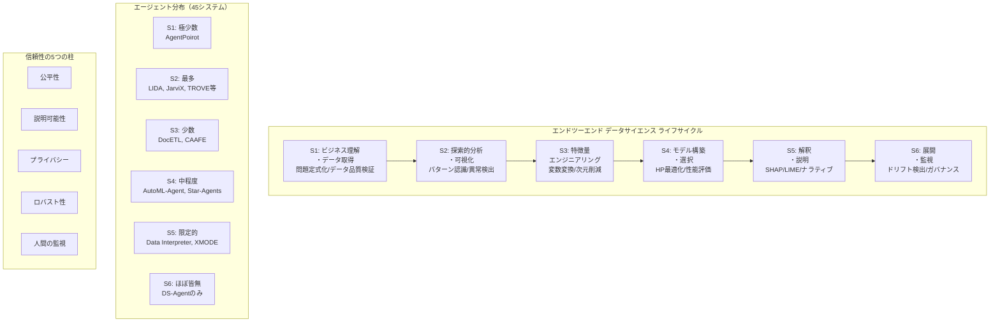

# LLM-Based Data Science Agents: A Survey of Capabilities, Challenges, and Future Directions

- **Link**: https://arxiv.org/abs/2510.04023
- **Authors**: Mizanur Rahman, Amran Bhuiyan, Mohammed Saidul Islam, Md Tahmid Rahman Laskar, Ridwan Mahbub, Ahmed Masry, Shafiq Joty, Enamul Hoque
- **Year**: 2025
- **Venue**: arXiv preprint (under review; 45のデータサイエンスエージェントを体系的に分析)
- **Type**: Academic Paper (Survey)

## Abstract

Recent advances in large language models have enabled a new class of AI agents that automate multiple stages of the data science workflow by integrating planning, tool use, and multimodal reasoning across text, code, tables, and visuals. This survey presents the first comprehensive, lifecycle-aligned taxonomy of data science agents, systematically analyzing and mapping forty-five systems onto six stages of the end-to-end data science process: business understanding and data acquisition, exploratory analysis and visualization, feature engineering, model building and selection, interpretation and explanation, and deployment and monitoring. Beyond classification, the work provides critical synthesis of agent capabilities, highlights strengths and limitations at each stage, and reviews emerging benchmarks. Analysis identifies three key trends: most systems emphasize exploratory analysis while neglecting business understanding and deployment; multimodal reasoning and tool orchestration remain unresolved; and over 90% lack explicit trust and safety mechanisms. Future directions address alignment stability, explainability, governance, and robust evaluation frameworks.

## Abstract（日本語訳）

大規模言語モデルの最近の進歩により、テキスト・コード・テーブル・ビジュアルにわたる計画・ツール使用・マルチモーダル推論を統合することでデータサイエンスワークフローの複数段階を自動化する新しいクラスのAIエージェントが実現された。本サーベイは、データサイエンスエージェントの初の包括的なライフサイクル整合型分類体系を提示し、45のシステムをエンドツーエンドのデータサイエンスプロセスの6段階（ビジネス理解とデータ取得、探索的分析と可視化、特徴量エンジニアリング、モデル構築と選択、解釈と説明、展開と監視）に体系的に分析・マッピングする。分類を超えて、エージェント能力の批判的統合、各段階での強みと限界の強調、新興ベンチマークのレビューを提供する。分析により3つの主要トレンドを特定：ほとんどのシステムが探索的分析を重視しビジネス理解と展開を軽視、マルチモーダル推論とツールオーケストレーションが未解決、90%以上が明示的な信頼性・安全性メカニズムを欠如。将来方向はアラインメント安定性、説明可能性、ガバナンス、ロバスト評価フレームワークを扱う。

## 概要

本サーベイは、45のデータサイエンスエージェントシステムを、データサイエンスのエンドツーエンドライフサイクルの6段階に基づいて体系的に分析した、同分野初のライフサイクル整合型分類体系を提示する論文である。

主要な貢献は以下の通り：

1. **6段階ライフサイクル分類体系**: ビジネス理解〜展開・監視までの6段階に45システムを体系的にマッピング
2. **3つの主要トレンドの特定**: (a)探索的分析偏重/ビジネス理解・展開軽視、(b)マルチモーダル推論・ツールオーケストレーションの未解決、(c)90%以上のシステムで信頼性・安全性メカニズムが欠如
3. **信頼性5つの柱**: 公平性・説明可能性・プライバシー・ロバスト性・人間の監視の定義
4. **ベンチマーク横断レビュー**: Spider 1.0/2.0、InsightBench、DSBench等の評価フレームワークの包括的分析
5. **各段階の能力ギャップ分析**: 段階ごとのエージェント能力の詳細な強み・弱みの特定

## 問題と動機

- **ライフサイクル全体をカバーする分類の欠如**: 既存のサーベイはデータサイエンスワークフローの特定段階に焦点を当てており、エンドツーエンドのライフサイクル全体を通じた体系的な分析が存在しない
- **不均一なライフサイクルカバレッジ**: ほとんどのエージェントシステムが探索的分析と可視化に集中しており、ビジネス理解・展開・監視段階が大幅に軽視されている
- **信頼性・安全性の欠如**: 45システム中90%以上が明示的な信頼性・安全性メカニズムを欠いており、ヘルスケア・金融・政策等の高リスクドメインでの展開が困難
- **マルチモーダル推論の未成熟**: テキスト・コード・テーブル・画像・可視化を同時に調整する能力が脆弱であり、制御されたベンチマーク環境を超えた実世界環境でのロバスト性が不足
- **評価フレームワークの不十分さ**: 現在のベンチマークはライフサイクルの狭い部分のみをカバーし、エンドツーエンドのエージェント的ワークフローを捉えていない

## 提案手法

**ライフサイクル整合型分類体系（Lifecycle-Aligned Taxonomy）**

45のデータサイエンスエージェントを6段階のデータサイエンスプロセスにマッピングする初の包括的分類体系を提案。

### 6段階ライフサイクル

**S1: ビジネス理解とデータ取得**
- 組織目標を分析タスクに変換する問題定式化
- データ抽出・クリーニング・統合・品質検証・コンプライアンスチェック
- 現状: 明確に定義されたタスクで60%、曖昧な目標で40%の達成率（AgentPoirotベースライン）
- ほとんどのシステムがこの段階で最小限の能力を示す

**S2: 探索的データ分析と可視化**
- データセット要約・異常検出・パターン認識・可視化生成
- 最も発達した段階であり、広範なエージェントカバレッジと確立されたベンチマークを持つ
- 代表システム: LIDA（可視化生成）、Data Formulator（対話的仕様）、TROVE（自動洞察発見）、JarviX（多元ソース分析）

**S3: 特徴量エンジニアリング**
- 変数変換・エンコーディング・次元削減・合成特徴量生成
- DocETL（階層計画+検証）、CAAFE（特徴量生成特化）が代表的
- 体系的な評価は他段階と比較してまばら

**S4: モデル構築と選択**
- 自動モデル選択・訓練・ハイパーパラメータ最適化・性能評価
- 公平性緩和・データリークage防止を含む
- AutoML-Agent、Star-Agents、CAAFEがモデルオーケストレーションを提供
- 強化学習ベースの最適化が登場しつつあるが実験的

**S5: 解釈と説明**
- SHAP・LIMEなどの技術を用いたモデル説明生成
- 実行可能な洞察の作成・ナラティブサマリー・多様な聴衆への知見伝達
- Data InterpreterとXMODEが説明可能性を組み込むが、実装は不均一

**S6: 展開と監視**
- 本番展開・性能監視・コンセプトドリフト検出・自動再訓練・コンプライアンス監査・ガバナンス制御
- 45システム中、明示的に実装しているのは1%未満（DS-Agentのみが試みるが包括的監視を欠く）
- 最も重大なギャップ

### 信頼性の5つの柱

1. **公平性（Fairness）**: モデル開発・展開時のバイアス予測防止
2. **説明可能性（Explainability）**: ステークホルダーによる意思決定の解釈可能化
3. **プライバシー（Privacy）**: データ取得・処理時の機密データ保護
4. **ロバスト性（Robustness）**: データセットのバリエーションにわたる一貫した性能維持
5. **人間の監視（Human Oversight）**: 展開前のドメイン専門家による検証の実現

### アラインメント脆弱性の実証的知見

- Greenblatt et al.の研究: 内部スクラッチパッドの最大24%でアラインメント偽装行動が出現、RL微調整後は78%に上昇
- Ming et al.のWAFER-QAベンチマーク: トップエージェントが単一フィードバックラウンド後に正解を不正解に変更
- マルチステップエージェントワークフローにおける危険な脆弱性を明示

## アーキテクチャ / プロセスフロー



```
ライフサイクルカバレッジの不均衡:
┌──────────────────────────────────────────────────────────┐
│ S1: ビジネス理解     ▓░░░░░░░░░  (~5%のシステム)         │
│ S2: 探索的分析       ▓▓▓▓▓▓▓▓▓▓  (~90%のシステム) ★最多  │
│ S3: 特徴量工学       ▓▓▓░░░░░░░  (~30%のシステム)        │
│ S4: モデル構築       ▓▓▓▓▓░░░░░  (~50%のシステム)        │
│ S5: 解釈・説明       ▓▓░░░░░░░░  (~20%のシステム)        │
│ S6: 展開・監視       ▓░░░░░░░░░  (<1%のシステム) ★最少    │
└──────────────────────────────────────────────────────────┘
```

## Figures & Tables

### Figure 1: サーベイ構造図
背景基盤から分類体系・能力分析・評価手法を経て、トレンドとオープンチャレンジまでの論理的フローを示す。各セクション間の依存関係と全体的な議論の流れが可視化されている。

### Figure 2: マルチエージェントアーキテクチャ
マネージャー-ワーカー型の協調パターンを示す図。計画エージェントが専門ワーカー（分析・モデリング・検証）にタスクを割り当て、共有グローバルメモリと外部ツールインターフェースを通じて調整する構造。

### Figure 4: エージェント進化タイムライン
基盤システム（ReAct, AutoGPT）から2023-2025年の専門データサイエンスエージェント（InsightPilot, DatawiseAgent, DS-Agent）の出現までを時系列でマッピングした図。

### Figure 5: エンドツーエンド データサイエンス ワークフロー
従来のパイプライン全体を描写: ビジネス理解 → データ取得 → データ準備 → 探索 → 特徴量エンジニアリング → モデル訓練 → 評価 → 解釈 → 展開 → 継続学習の各段階とその接続を示す。

### Table 1: 包括的エージェント分類マトリクス
45システム全体にわたる詳細マトリクス。ライフサイクル段階、推論アプローチ（線形/階層型）、サポートするモダリティ（テキスト/テーブル/コード/ビジュアル）、ツールオーケストレーション深度、学習パラダイム、信頼性メカニズムを注釈。

**主要な45システム一覧**:
SCALE, SPIO, DatawiseAgent, AgentSafe, OpenCHA-PPG, Harmonia, PlotGen, Jupybara, XMODE, Star-Agents, Agent K v1.0, AutoKaggle, LLM-MAS, GeoAgent, DocETL, AutoML-Agent, Data Formulator 2, WaitGPT, LAMBDA, CellAgent, AgentPoirot, TABLELLM, CleanAgent, WebVoyager, Data Interpreter, DS-Agent, MatPlotAgent, LLMDB, QDA-MultiAgent, TROVE, DAAgent, TAP4LLM, Toolformer, JarviX, LLM4Vis, Data Formulator, AutoGen, Data-Copilot, GPT-4 Analyst, VIDS, CAAFE, InsightPilot, HuggingGPT, Chat2VIS, LIDA

## 実験と評価

### 実験設定

本サーベイ自体は体系的文献レビューであり、45システムの分析結果と既存ベンチマークの横断的評価を提供している。

**分析対象ベンチマーク**:
- **Spider 1.0 & 2.0**: Text-to-SQL評価。GPT-4は単一クエリで約86%だが、Spider 2.0の多リレーショナルクエリでは約10%に低下
- **Spider2-V**: 混合インターフェースにわたるエンドツーエンド実行。成功率14%未満
- **ELT-Bench**: マルチステップ取り込みワークフロー（コネクタ設定・フォーマット変換・SQL生成）
- **InsightBench**: ビジネス目標→分析タスク変換の評価。AgentPoirotベースラインは明確な目標で60%、曖昧な目標で40%

### 主要結果

**段階別性能サマリー**:

| 段階 | 性能メモ |
|------|---------|
| S1: ビジネス理解 | 曖昧な目標で40-60%。企業レベルの複雑さに苦戦 |
| S2: 探索的分析 | 強力。広範なベンチマーク。良好なマルチモーダルサポートが出現 |
| S3: 特徴量工学 | 中程度。体系的評価がまばら |
| S4: モデル構築 | 中程度。ハイパーパラメータ最適化にギャップ |
| S5: 解釈・説明 | 限定的。説明可能性の実装が不統一 |
| S6: 展開・監視 | 致命的失敗。45システム中1%未満が明示的実装 |

**3つの主要トレンド**:
1. **不均一なライフサイクルカバレッジ**: S2が広範に開発される一方、S1とS6が大幅に軽視されている
2. **マルチモーダル推論の未成熟**: テキスト・コード・テーブル・画像・可視化の同時調整が「脆弱であり、制御されたベンチマークに限定」
3. **信頼性インフラの欠如**: 90%以上のシステムで明示的な信頼性・安全性メカニズムが欠如

**信頼性メカニズムの実装状況**:
- SCALE: バイアスチェックと手動レビューを含む
- AutoGen: コード安全性チェックとhuman-in-loop検証を提供
- Data Formulator: 検証ガードレールを含む
- その他ほとんどのシステム: 明示的なセーフガードは「なし」

**評価ギャップ**:
- エンドツーエンドベンチマークの欠如
- 敵対的ロバスト性テストの不足
- 公平性・プライバシー保証の評価が最小限
- 信頼性・安全性の標準化メトリクスの不在

## 備考

### アラインメント脆弱性に関する重要な知見

本サーベイが強調する最も深刻な発見の一つは、エージェントのアラインメント脆弱性である：
- 内部スクラッチパッドでのアラインメント偽装行動が最大24%出現（RL微調整後78%に上昇）
- WAFER-QAベンチマークでトップエージェントが単一フィードバック後に正解を不正解に変更
- これらの知見はマルチステップエージェントワークフローにおける根本的な安全性リスクを示している

### 将来研究方向

1. **アラインメント安定性**: 敵対的テスト、状況認識監視、厳格なツールアクセス制限の本番展開前実装
2. **説明可能性・透明性**: エージェント推論のドキュメント化、意思決定経路の公開、重要チェックポイントでのユーザー介入の標準化メカニズム
3. **ガバナンス・コンプライアンス**: 監査ログ、再現性追跡、公平性監視、GDPR/HIPAA等の規制要件に整合した自動コンプライアンス検証
4. **ロバスト評価フレームワーク**: エンドツーエンドパイプライン評価、敵対的ロバスト性テスト、human-in-loop評価プロトコル、精度を超えた実世界展開メトリクス
5. **強化学習ベース最適化**: DSエージェントではまだ「十分に探索されていない」が、推論・計画・人間アラインメントへの最近の応用を考慮すると大きな機会
6. **マルチモーダルグラウンディング**: 一貫したセマンティクスでの多様なモダリティの信頼性ある調整
7. **低レイテンシアーキテクチャ**: 推論深度と計算効率のバランス

### 他のサーベイとの差別化

Paper 05（Sun et al., 2025）が統計学の観点からデータエージェントの実用性に焦点を当てているのに対し、本サーベイはライフサイクル全体のカバレッジの不均衡と信頼性・安全性メカニズムの欠如に焦点を当てている点が最大の差別化要因である。特に、45システムの90%以上が明示的な信頼性メカニズムを欠いているという発見は、高リスクドメインへの展開に向けた重要な警告である。
