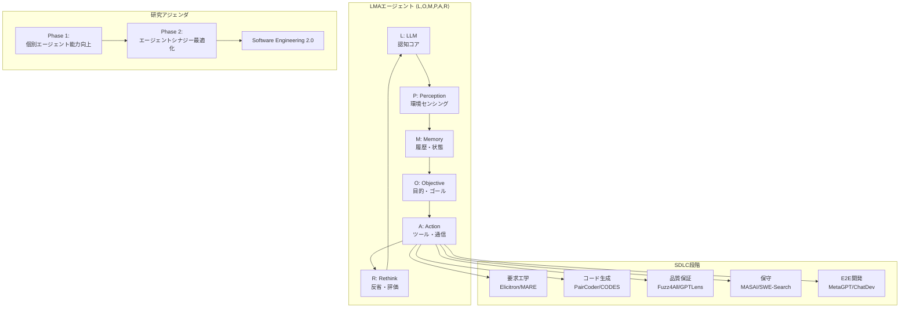

# LLM-Based Multi-Agent Systems for Software Engineering: Literature Review, Vision and the Road Ahead

- **Link**: https://arxiv.org/abs/2404.04834
- **Authors**: Junda He, Christoph Treude, David Lo
- **Year**: 2024
- **Venue**: TOSEM 2030 Special Issue
- **Type**: Academic Paper (Survey / Literature Review)

## Abstract

Integrating Large Language Models (LLMs) into autonomous agents marks a significant shift in the research landscape by offering cognitive abilities that are competitive with human planning and reasoning. This paper explores the transformative potential of integrating Large Language Models into Multi-Agent (LMA) systems for addressing complex challenges in software engineering (SE). By leveraging the collaborative and specialized abilities of multiple agents, LMA systems enable autonomous problem-solving, improve robustness, and provide scalable solutions for managing the complexity of real-world software projects. In this paper, we conduct a systematic review of recent primary studies to map the current landscape of LMA applications across various stages of the software development lifecycle (SDLC). To illustrate current capabilities and limitations, we perform two case studies to demonstrate the effectiveness of state-of-the-art LMA frameworks. Additionally, we identify critical research gaps and propose a comprehensive research agenda focused on enhancing individual agent capabilities and optimizing agent synergy. Our work outlines a forward-looking vision for developing fully autonomous, scalable, and trustworthy LMA systems, laying the foundation for the evolution of Software Engineering 2.0.

## Abstract（日本語訳）

大規模言語モデル（LLM）を自律エージェントに統合することは、人間の計画・推論と競争力のある認知能力を提供することで、研究のランドスケープにおける重大なシフトを示す。本論文は、ソフトウェアエンジニアリング（SE）における複雑な課題に対処するために、大規模言語モデルをマルチエージェント（LMA）システムに統合する変革的な可能性を探る。複数エージェントの協調的・専門的能力を活用することで、LMAシステムは自律的な問題解決を可能にし、ロバスト性を向上させ、実世界のソフトウェアプロジェクトの複雑さを管理するためのスケーラブルなソリューションを提供する。本論文では、ソフトウェア開発ライフサイクル（SDLC）の様々な段階にわたるLMAアプリケーションの現在のランドスケープをマッピングするための最近の一次研究の体系的レビューを実施する。現在の能力と限界を示すために、最先端のLMAフレームワークの有効性を実証する2つのケーススタディを実施する。さらに、重要な研究ギャップを特定し、個別エージェント能力の向上とエージェントシナジーの最適化に焦点を当てた包括的な研究アジェンダを提案する。我々の研究は、完全に自律的でスケーラブルかつ信頼性の高いLMAシステムの開発に向けた将来志向のビジョンを概説し、Software Engineering 2.0の進化の基盤を築く。

## 概要

本論文は、ソフトウェアエンジニアリング（SE）分野におけるLLMベースマルチエージェント（LMA）システムの体系的文献レビューであり、TOSEM 2030 Special Issueに掲載されている。DBLP（750万以上の出版物）からの体系的検索と、前方・後方引用のスノーボーリングにより71の一次研究を分析している。

主要な貢献は以下の通り：

1. **SDLCマッピング**: 要求工学・コード生成・品質保証・保守・エンドツーエンド開発の5つのSDLC段階にわたるLMAアプリケーションの体系的マッピング
2. **ケーススタディ実施**: SnakeゲームとTetrisゲームの開発を通じたChatDevフレームワークの実証的評価
3. **2フェーズ研究アジェンダ**: フェーズ1（個別エージェント能力向上）とフェーズ2（エージェントシナジー最適化）の包括的研究ロードマップ
4. **Software Engineering 2.0ビジョン**: 完全自律・スケーラブル・信頼性の高いLMAシステムによるSE変革の将来像
5. **LMAエージェント形式定義**: ⟨L,O,M,P,A,R⟩タプルによるエージェントの数学的定義

## 問題と動機

- **単一LLMエージェントの限界**: 個別のLLMエージェントは、実世界のソフトウェアプロジェクトの複雑さに対処するには不十分。複数の専門エージェントの協調が必要
- **SE固有の課題の複雑さ**: ソフトウェア開発ライフサイクルは要求分析から保守まで多段階にわたり、各段階で異なる専門知識が必要。LMAによる自律的・スケーラブルな解決策が求められる
- **LLMハルシネーションの緩和**: 単一エージェントでは幻覚的な出力のリスクが高いが、マルチエージェントの議論・検証・相互レビューによりこの問題を軽減可能
- **研究の断片化**: LMAのSE応用に関する研究が急増しているが、体系的な整理と研究ギャップの特定が不足
- **Software Engineering 2.0への道筋**: 現在のLMA能力と完全自律開発との間の具体的なギャップを明確化し、研究の方向性を示す必要がある

## 提案手法

**LMAシステムの形式定義と2フェーズ研究アジェンダ**

### エージェントの形式定義

LLMベースエージェントをタプル⟨L,O,M,P,A,R⟩として定義：
- **L (Large Language Model)**: 認知コア
- **O (Objective)**: 目的・ゴール
- **M (Memory)**: 履歴・現在の状態情報
- **P (Perception)**: 環境センシング・解釈
- **A (Action)**: ツール利用・エージェント間通信
- **R (Rethink)**: 行動後の反省・評価

### オーケストレーション構造

**協調モデル**: 協力型（共有目標）、競争型（個別目標）、階層型（リーダー-フォロワー）、混合型

**通信メカニズム**: 中央集権型、分散型、階層型。交換データはコードスニペット・コミットメッセージ・フォーラム投稿・バグレポート・脆弱性レポート

**計画・実行スタイル**: CPDE（中央集権的計画・分散実行）、DPDE（分散計画・分散実行）

### SDLC段階別のLMAアプリケーション

**要求工学**:
- Elicitron: シミュレートされたユーザーエージェントによるニーズ表現
- MARE: 5エージェントフレームワーク（ステークホルダー・収集者・モデラー・チェッカー・文書化者）
- ユーザーストーリーフレームワーク: 4エージェント（プロダクトオーナー・開発者・QA・マネージャー）

**コード生成**:
- PairCoder: Navigator（要求解釈）+ Driver（実装）
- CODES: RepoSketcher → FileSketcher → SketchFillerの階層構造
- Agent Forest: サンプリング&投票フレームワーク

**品質保証**:
- テスト: Fuzz4All（多言語テスト入力生成）、AXNav（アクセシビリティテスト）
- 脆弱性検出: GPTLens（監査+批評ランキング）、MuCoLD（合意ベース分類）
- バグ検出: ICAA（偽陽性プルーニング+コード意図一貫性チェック）
- 障害局所化: RCAgent（クラウドシステム根本原因分析）、AgentFL（3フェーズアプローチ）

**保守**:
- デバッグ: MASAI, MarsCode, AutoSD（再現→局所化→生成→検証）
- SWE-Search: モンテカルロ木探索による適応的探索
- コードレビュー: 4エージェントシステム（レビュー・バグ検出・コードスメル・最適化）

**エンドツーエンド開発**:
- ウォーターフォール型: MetaGPT（PM→アーキテクト→エンジニア→QA）、ChatDev（CEO→CTO→プログラマー→レビュアー→テスター）
- アジャイル型: AgileCoder（スプリントベース協調）、AgileGen（Gherkin言語仕様+人間-AI協調）
- 動的プロセス: Think-on-Process（カスタムプロセスインスタンス生成）、MegaAgent（動的エージェント役割生成）

## アーキテクチャ / プロセスフロー



```
ChatDevフレームワーク（ウォーターフォール型E2E開発）:
┌──────────────────────────────────────────────────────────┐
│ CEO: プロジェクト方針決定                                  │
│    ↓                                                      │
│ CTO: 技術設計・アーキテクチャ決定                           │
│    ↓                                                      │
│ Programmer: コード実装                                     │
│    ↓                                                      │
│ Reviewer: コードレビュー・品質評価                          │
│    ↓                                                      │
│ Tester: テスト実行・バグ検出                                │
│    ↓                                                      │
│ 成果物: 実行可能なソフトウェア + マニュアル                  │
└──────────────────────────────────────────────────────────┘

2フェーズ研究アジェンダ:
┌─────────────────────────┐    ┌─────────────────────────┐
│ Phase 1:                 │    │ Phase 2:                 │
│ 個別エージェント能力向上  │ →  │ エージェントシナジー最適化 │
│                          │    │                          │
│ RQ1: SE役割の特定・改善   │    │ RQ3: 人間-エージェント協調│
│ RQ2: プロンプト言語設計   │    │ RQ4: 協調影響の定量化    │
│                          │    │ RQ5: 大規模プロジェクト  │
│ ・ロールプレイ能力改善    │    │ RQ6: 産業組織メカニズム  │
│ ・エージェント指向        │    │ RQ7: 動的適応戦略       │
│   プログラミング          │    │ RQ8: プライバシー・      │
│                          │    │   データ共有             │
└─────────────────────────┘    └─────────────────────────┘
```

## Figures & Tables

### Figure 1: ソフトウェア開発におけるマルチエージェントシステム比較
ウォーターフォール型とアジャイル型のアーキテクチャモデルを比較する図。MetaGPT/ChatDevのウォーターフォール型パイプライン（PM→アーキテクト→エンジニア→QA）と、AgileCoder/AgileGenのスプリントベース反復型協調の構造的差異を示す。

### Figure 2 & 3: ケーススタディスクリーンショット
**Snake Game**: 3つの状態（開始位置・ゲームプレイ中・ゲームオーバー）のスクリーンショット。グリッドベースのゲームプレイ、矢印キー操作、ランダムフード出現、成長メカニクス、衝突検出、スコアリングシステムが正常に実装されていることを示す。

**Tetris Game**: 初期状態・アクティブゲームプレイ・ゲームオーバーのスクリーンショット。テトロミノメカニクス・回転・衝突処理は機能するが、行消去のコア機能が欠如していることが視覚的に確認できる。

### Figure 4: 研究アジェンダビジュアル
2フェーズの開発ロードマップを示す図。Phase 1（個別エージェント能力向上: ロールプレイ改善・プロンプト言語設計）からPhase 2（エージェントシナジー最適化: 人間-エージェント協調・評価・スケーリング・動的適応・プライバシー）への進行を示す。

### 文献レビュー統計（暗黙的テーブル）
- 検索データベース: DBLP（750万以上の出版物、1,800ジャーナル、6,700会議）
- Phase 1検索結果: 41の一次研究
- Phase 2（スノーボーリング）: 追加30論文
- 総カバレッジ: 71の最近の一次研究
- 対象期間: 2022年11月（ChatGPTリリース）以降

## 実験と評価

### 実験設定

ChatDevフレームワーク（GPT-3.5-turbo、temperature: 0.2）を使用し、2つのゲーム開発タスクでLMAシステムの現状能力を実証的に評価。

**Snake Game仕様**: グリッドベースゲームプレイ、矢印キー操作、ランダムフード出現、成長メカニクス、衝突検出、スコアリングシステム

**Tetris Game仕様**: テトロミノメカニクス、回転、衝突処理、行消去、ゲームオーバー条件

### 主要結果

**Snake Gameケーススタディ**:
- **成功**: 2回目の試行で完全に機能するプレイ可能なバージョンを生成
- **開発時間**: 平均76秒
- **コスト**: 1回あたり$0.019
- **品質**: すべてのプロンプト要件を満たす（100%要件充足）
- **成果物**: 依存関係と手順を含む包括的マニュアルも自動生成

**Tetris Gameケーススタディ**:
- **成功**: 10回目の試行でプレイ可能なバージョンを生成（最初の9回は失敗）
- **開発時間**: 平均70秒
- **コスト**: 1回あたり$0.020
- **品質**: 約90%の要件充足（行消去のコア機能が欠如）
- **制限**: GUIは正常に生成されるが、より深い論理的推論を必要とする機能で失敗

**重要な知見**:
- 中程度の複雑さのタスク（Snake）は2-3回の試行で信頼性高く完了可能
- 大幅に複雑なタスク（Tetris）は実質的により多くの反復を要する
- 両タスクとも$0.019-0.020/回、70-76秒の実行時間で有望な経済性を示す
- 性能ギャップ: 直接的なゲームメカニクスでは成功するが、深い抽象化と論理的分解を必要とするコア機能で失敗
- 現在のLMAシステムは迅速なプロトタイピングと中程度の複雑さの問題に適しているが、エンタープライズ規模の複雑さには強化が必要

## 備考

### 研究ギャップの詳細

**Phase 1: 個別エージェント能力のギャップ**

*ロールプレイの限界*:
- 汎用LLMがSE固有の微妙な専門知識を欠く
- ChatGPTは脆弱性検出・修復で不備を示す
- セキュリティ監査には現在のモデルにない深いドメイン知識が必要
- 多様なSEロールにわたる特化が不十分

*プロンプト言語の欠陥*:
- 自然言語の曖昧さと不整合
- 既存フレームワーク（DSPy, AutoGen, LangChain）は人間中心の設計
- LLMを主要対象とした専用言語が未設計
- クロスモデルプロンプト適応メカニズムの欠如

**Phase 2: エージェントシナジーのギャップ**

*スケーリング課題*:
- 複雑なタスク分解の困難さ
- エージェント数増加に伴う通信ボトルネック
- 広範な情報に対するメモリ容量の制限
- 複数ラウンドの議論による意思決定の遅延

*動的適応*:
- ほとんどのシステムが固定アーキテクチャと事前定義された役割で動作
- オンザフライの調整メカニズムの欠如
- 新しい専門役割を持つエージェントの動的生成能力が不足
- タスク完了の最適停止点が未定義

*プライバシーとデータ共有*:
- SEコンテキストでのLMAプライバシーに関する既存ソリューションが皆無
- 組織境界を超えた部分情報の課題
- マルチエージェントシステム向けのきめ細かいアクセス制御メカニズムの不足

### Software Engineering 2.0ビジョン

LMAシステムを「Software Engineering 2.0」の基盤として位置付け、以下の3つの主要な利点を定義：

1. **自律的問題解決**: アジャイル・反復的方法論を模倣し、高レベル要件を管理可能なサブタスクに分解して専門チーム（エージェント）に割り当て
2. **ロバスト性と耐障害性**: コードレビューや自動テストに類似した相互検証。マルチエージェント協調が議論・検証メカニズムを通じてLLMハルシネーションを緩和
3. **複雑システムへのスケーラビリティ**: 分散知能がタスク再配分と動的エージェント追加を通じて、増加するコードベース・フレームワーク・依存関係の効果的管理を実現

### 他のサーベイとの関連

- Paper 04（Chen et al., 2024）が汎用的なLLM-MASのアプリケーション分類を提供するのに対し、本論文はSEドメインに特化した深い分析とケーススタディベースの実証を提供
- Paper 06（Rahman et al., 2025）のデータサイエンスライフサイクル整合型アプローチと類似の方法論（SDLC段階へのマッピング）を採用しているが、対象ドメインが異なる
- 71の一次研究に基づく体系的文献レビューとして、最も厳密な方法論を採用している点が特徴的
