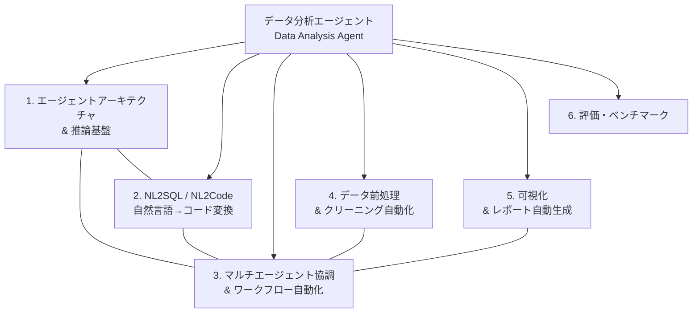

# データ分析エージェント（Data Analysis Agent）

## 研究パラメータ

- **調査タイプ**: 学術論文サーベイ
- **対象期間**: 2024 – 2026
- **生成日**: 2026-03-30
- **入力キーワード**: データ分析エージェント, Data Analysis Agent, LLM-based data analysis, AI agent for data analytics
- **検索言語**: 英語

## 全体像

データ分析エージェントは、LLM（大規模言語モデル）を基盤として、データの収集・前処理・分析・可視化・レポート生成までのデータサイエンスワークフローを自律的に遂行するAIシステムである。2023年後半のGPT-4登場以降、この分野は急速に発展し、2024〜2025年にかけて複数の包括的サーベイ論文が発表された。主な研究潮流として、(1) エージェントアーキテクチャの高度化（計画・推論・リフレクション）、(2) NL2SQL/NL2Codeによる自然言語インターフェース、(3) マルチエージェント協調、(4) 自動データ前処理、(5) 可視化・レポート自動生成、(6) ベンチマーク・評価手法の確立、が挙げられる。この分野は学術研究とOSSフレームワーク開発の両面で活発であり、LangChain・AutoGen・CrewAIなどのフレームワークが実装基盤として広く利用されている。

## 参考サーベイ・レビュー論文

以下のサーベイ論文が発見され、ドメイン分割の参考とした。

| タイトル | 年 | 概要 | リンク |
|---------|------|------|--------|
| A Survey on Large Language Model-based Agents for Statistics and Data Science | 2024 | LLMベースデータエージェントの包括的サーベイ。計画・推論・リフレクション・マルチエージェント協調等の設計特徴を体系化 | [arXiv:2412.14222](https://arxiv.org/abs/2412.14222) |
| LLM/Agent-as-Data-Analyst: A Survey | 2025 | データ分析タスクにおけるLLM/エージェントの技術進化を4つの設計目標で整理：セマンティック対応設計、自律パイプライン、ツール拡張ワークフロー、オープンワールドタスク対応 | [arXiv:2509.23988](https://arxiv.org/abs/2509.23988) |
| Large Language Model-based Data Science Agent: A Survey | 2025 | データサイエンスエージェントの計画メカニズム、コード生成、エラー処理を網羅的にサーベイ | [arXiv:2508.02744](https://arxiv.org/html/2508.02744v1) |
| LLM-Based Data Science Agents: A Survey of Capabilities, Challenges, and Future Directions | 2025 | DS Agentの能力・課題・将来方向に焦点を当てたサーベイ | [arXiv:2510.04023](https://arxiv.org/html/2510.04023v1) |
| Measuring Data Science Automation: A Survey of Evaluation Tools for AI Assistants and Agents | 2025 | データサイエンス自動化の評価ツール・ベンチマークをサーベイ | [arXiv:2506.08800](https://arxiv.org/html/2506.08800v2) |
| Can LLMs Clean Up Your Mess? A Survey of Application-Ready Data Preparation with LLMs | 2026 | LLMによるデータ前処理の体系的レビュー。ルールベースからプロンプト駆動・エージェント型への転換を整理 | [arXiv:2601.17058](https://arxiv.org/html/2601.17058v1) |

## ドメインマップ

## クラスタサマリ

| # | クラスタ名 | キーワード数 | 概要 | 詳細 |
|---|-----------|-------------|------|------|
| 1 | エージェントアーキテクチャ & 推論基盤 | 13 | LLMエージェントの計画・推論・リフレクション・ツール使用等のコアアーキテクチャ設計 | [cluster-01-agent-architecture.md](cluster-01-agent-architecture.md) |
| 2 | NL2SQL / NL2Code（自然言語→コード変換） | 12 | 自然言語からSQL/Pythonコードを生成するインターフェース技術 | [cluster-02-nl2sql-nl2code.md](cluster-02-nl2sql-nl2code.md) |
| 3 | マルチエージェント協調 & ワークフロー自動化 | 11 | 複数エージェントの役割分担・協調によるエンドツーエンドのデータ分析パイプライン | [cluster-03-multi-agent-workflow.md](cluster-03-multi-agent-workflow.md) |
| 4 | データ前処理 & クリーニング自動化 | 10 | LLMを活用したデータクリーニング・変換・標準化の自動化 | [cluster-04-data-preprocessing.md](cluster-04-data-preprocessing.md) |
| 5 | 可視化 & レポート自動生成 | 10 | データに基づくチャート生成・ダッシュボード構築・レポート作成の自動化 | [cluster-05-visualization-reporting.md](cluster-05-visualization-reporting.md) |
| 6 | 評価・ベンチマーク | 10 | データ分析エージェントの性能評価フレームワーク・ベンチマークデータセット | [cluster-06-evaluation-benchmark.md](cluster-06-evaluation-benchmark.md) |
