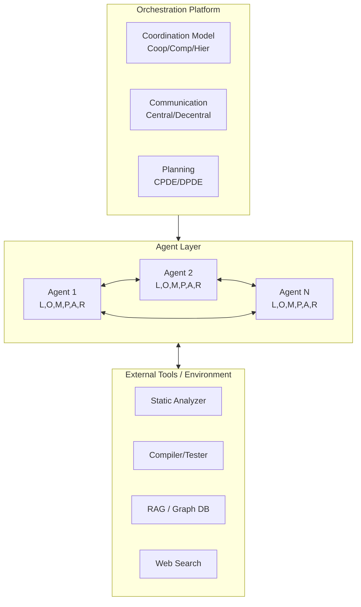
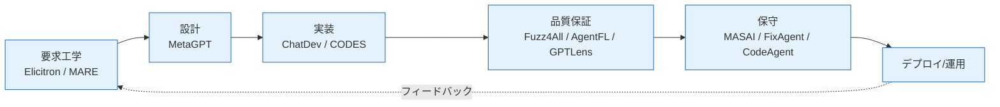
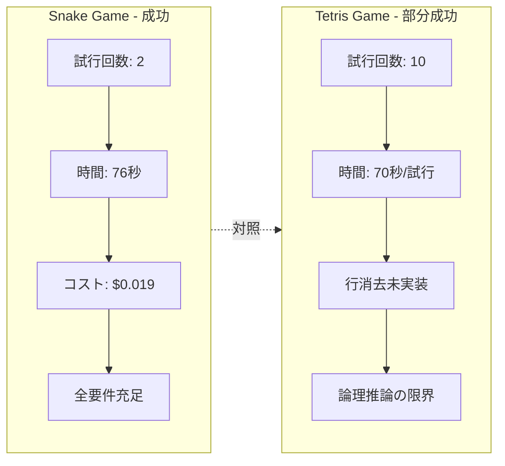
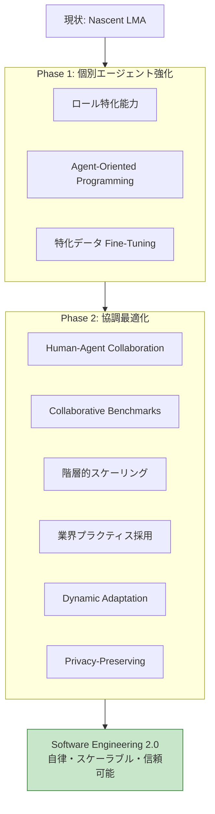

# LLM ベースマルチエージェントシステムによるソフトウェア工学: 文献レビュー・ビジョン・今後の道筋

## Abstract (原文)

> Integrating Large Language Models (LLMs) into autonomous agents marks a significant shift in the research landscape by offering cognitive abilities competitive with human planning and reasoning. This paper envisions the future of LLM-based Multi-Agent (LMA) systems in addressing complex and multi-faceted challenges encountered in software engineering. LMA systems introduce numerous benefits, including enhanced robustness through agent collaboration, the ability to achieve autonomous problem-solving, and scalable solutions to handling the complexity of real-world software projects. In this paper, we conduct a systematic review of recent primary studies to map the current landscape of LMA applications across various stages of the software development lifecycle (SDLC). To illustrate current capabilities and limitations, we perform two case studies to demonstrate the effectiveness of state-of-the-art LMA frameworks. Additionally, we identify critical research gaps and propose a comprehensive research agenda focused on enhancing individual agent capabilities and optimizing agent synergy. Our work outlines a forward-looking vision for developing fully autonomous, scalable, and trustworthy LMA systems, laying the foundation for the evolution of Software Engineering 2.0.

## 1. 書誌情報

| 項目 | 内容 |
|------|------|
| タイトル | LLM-Based Multi-Agent Systems for Software Engineering: Literature Review, Vision and the Road Ahead |
| 著者 | Junda He, Christoph Treude, David Lo |
| 所属 | Singapore Management University, Singapore / University of Melbourne, Australia |
| 発表年 | 2024 |
| 掲載誌 | ACM Transactions on Software Engineering and Methodology (TOSEM) — 2030 Special Issue |
| 種別 | 体系的文献レビュー + ビジョンペーパー |
| arXiv ID | 2404.04834 |
| 対象領域 | LLM エージェント, マルチエージェントシステム (MAS), ソフトウェア工学 (SE) |

## 2. 問題・動機

### 2.1 背景: SE の複雑性と単一エージェントの限界

現代のソフトウェア開発ライフサイクル (SDLC) は、要求定義・設計・実装・品質保証・保守という多段階のタスクにまたがり、それぞれ異なる専門スキルを必要とする。LLM の登場によりコード生成やバグ修正などの単発タスクで大きな進展があったが、著者らは「単一 LLM エージェントでは、現実世界のソフトウェアプロジェクトが抱える多面的で長期的な課題を扱うのに十分ではない」と指摘する。主な問題点は以下に集約される。

1. **文脈長制約**: 単一 LLM はコンテキストウィンドウが有限であり、リポジトリ全体の理解が困難。
2. **専門性の欠如**: セキュリティ監査、要求分析、UX 設計など、タスクごとに異なる深い専門知識が必要。
3. **ロバスト性の低下**: 単一エージェントの判断はハルシネーションや偏りに脆弱。
4. **スケーラビリティ**: 巨大ソフトウェアプロジェクトをモノリシックに扱うとエラー率が累積する。

### 2.2 マルチエージェントアプローチの動機

これらに対し、LLM ベースのマルチエージェントシステム (LMA) は以下を提供する。

- **役割分担による専門化** (Specialization via Role Division)
- **相互検証による堅牢性** (Robustness via Cross-examination)
- **分散処理によるスケーラビリティ** (Scalability via Distributed Reasoning)
- **自律的問題解決** (Autonomous Problem-Solving)

本論文は「Software Engineering 2.0」という長期ビジョンを掲げ、自律的・スケーラブル・信頼可能な LMA システムを SDLC 全体に適用する道筋を描く。

### 2.3 リサーチクエスチョン

著者らは以下の RQ を設定している。

- **RQ1**: LMA システムは SDLC のどの段階にどのように適用されているか?
- **RQ2**: 現行の最先端 LMA フレームワークが持つ能力と限界は何か?
- **RQ3**: 完全自律・信頼可能な LMA を実現するために必要な研究課題は何か?

## 3. コア手法・技術詳細

### 3.1 LLM エージェントの形式的定義

本論文は LLM ベースエージェントを以下の 6 タプルで定式化する。

$$
\text{Agent} = \langle L, O, M, P, A, R \rangle
$$

| 記号 | 意味 | 説明 |
|------|------|------|
| $L$ | LLM (Language Model) | 推論・生成の中核となる基盤モデル |
| $O$ | Objective | エージェントに割り当てられた目的・タスク |
| $M$ | Memory | 短期・長期記憶 (履歴、コンテキスト、学習結果) |
| $P$ | Perception | 環境・入力の観測機構 (コード, ログ, ユーザ発話) |
| $A$ | Action | 外部世界への作用 (コード編集, ツール呼び出し, 通信) |
| $R$ | Role | エージェントが担う役割 (Programmer, Reviewer 等) |

### 3.2 LMA システムの階層構造

LMA 全体は、個々のエージェントを束ねる **オーケストレーションプラットフォーム** によって構成される。オーケストレーション層は以下の 3 側面を管理する。

1. **Coordination Model**: 協調 / 競合 / 階層
2. **Communication Mechanism**: 中央集権型 / 分散型
3. **Planning Strategy**: CPDE (Centralized Planning Decentralized Execution) / DPDE (Decentralized Planning Decentralized Execution)

形式的には、エージェント集合 $\mathcal{A} = \{a_1, a_2, \dots, a_n\}$ とタスク $\mathcal{T}$ が与えられたとき、LMA の最適化問題は以下のように表される。

$$
\max_{\pi_1, \dots, \pi_n} \; \mathbb{E}\!\left[ U(\mathcal{T}) \;\Big|\; \bigcup_{i=1}^{n} \pi_i(a_i), \, C(\mathcal{A}) \right]
$$

ここで $\pi_i$ は各エージェントの方策、$U$ はタスク効用、$C$ はエージェント間コミュニケーションコストを表す。

### 3.3 協調アーキテクチャの分類

著者らは既存 LMA の協調モデルを 3 種に整理する。

- **Waterfall 型**: ChatDev, MetaGPT など。SDLC の段階ごとに専門エージェントを固定配置し、順次パイプライン実行する。
- **Agile 型**: AgileCoder, AgileGen など。スプリントベースの反復サイクルに沿った協調。
- **Dynamic 型**: ToP, MegaAgent などがプロジェクト要求に応じて役割・ワークフローを動的生成する。

### 3.4 SDLC への LMA 適用マッピング

本論文の核心は SDLC 各段階に対応する LMA 事例の網羅的マッピングである (Figures & Tables 節参照)。主要な応用領域は以下の通り。

- **要求工学**: Elicitron (要求抽出), MARE (モデリング), ユーザストーリ生成
- **コード生成**: ChatDev, MetaGPT, CODES, Self-Repair 機構
- **品質保証**: Fuzz4All, AXNav, GPTLens, AgentFL, ICAA
- **保守・デバッグ**: MASAI, AutoSD, FixAgent, CodeAgent
- **End-to-End 開発**: ChatDev, MetaGPT, Co-Learning, ToP

### 3.5 ケーススタディ: 能力と限界の実証

著者らは ChatDev を用いて 2 つのケーススタディを実施した。

**Case 1 — Snake ゲーム (成功)**
- 2 回目の試行で完全動作
- 開発時間: 76 秒
- コスト: $0.019
- 結果: プロンプト要件をすべて充足

**Case 2 — Tetris ゲーム (部分成功)**
- 10 回の反復を要した
- コア機能である行消去ロジックを実装できず
- 平均開発時間 70 秒 / 試行
- 結論: 「深い論理推論と抽象化」が現行 LMA の弱点

## 4. 重要課題の特定

### 4.1 個別エージェント能力の不足

- SE の **専門性** (security auditing, formal verification) を十分に保持していない
- **論理的整合性** を要する複雑タスクで失敗
- ドメイン知識のアップデート機構の欠如

### 4.2 スケーラビリティの壁

エージェント数 $n$ が増加するにつれ、コミュニケーションコストは概ね $O(n^2)$ で増加し、トークン消費と遅延が支配的となる。

$$
C_{\text{comm}}(n) = \sum_{i \neq j} f(m_{ij}) \sim O(n^2)
$$

メッセージ優先度付けや階層的分解が必須であると結論付けている。

### 4.3 評価ベンチマークの欠如

既存ベンチマーク (HumanEval, SWE-Bench 等) は **単一タスクの正答率** を測るもので、マルチエージェント特有の評価軸 (協議・衝突解決・役割適応) を扱えない。

### 4.4 プライバシー・組織横断課題

LMA を複数組織に跨るプロジェクトで運用する際、**データサイロ** と **規制遵守** が未解決課題として指摘されている。

## 5. 研究アジェンダ (Road Ahead)

### Phase 1 — 個別エージェント能力の強化

1. **ロール特化能力の洗練**: 市場分析、ステークホルダ調査、コンピテンシマッピングを通じた役割定義
2. **Agent-Oriented Programming (AOP)**: LLM を主要「読者」とするプログラミング言語の設計
3. **特化データによるファインチューニング**: SE プラクティスの継続的適応

### Phase 2 — エージェント協調の最適化

1. **Human-Agent Collaboration**: 役割特化の介入ポイントと適応型 UI
2. **Collaborative Benchmarks**: 複数エージェント設計決定・ピアレビュー・衝突交渉をシミュレート
3. **階層的タスク分解と共有知識リポジトリ**: スケーラビリティ確保
4. **業界プラクティスの採用**: Domain-Driven Design, Value Stream Mapping, MBSE
5. **Dynamic Adaptation**: 実行時の役割再定義・エージェント生成・リソース再配分
6. **Privacy-Preserving Mechanisms**: Differential Privacy, Federated Learning, SMPC

## 6. Figures & Tables

### Figure 1: LMA システムの階層アーキテクチャ

### Figure 2: SDLC 全段階への LMA マッピング

### Table 1: 主要 LMA フレームワークの比較

| フレームワーク | 協調モデル | 対象 SDLC 段階 | 特徴 | 制約 |
|---------------|------------|----------------|------|------|
| ChatDev | Waterfall | End-to-End | CTO/PM/Dev/Tester 役割 | 複雑論理に弱い |
| MetaGPT | Waterfall | End-to-End | SOP ベース、文書成果物重視 | 固定ワークフロー |
| AgileCoder | Agile | 実装 + QA | スプリント反復 | 小規模タスク中心 |
| MASAI | Dynamic | デバッグ | 自動修正特化 | ドメイン限定 |
| GPTLens | Cooperative | セキュリティ監査 | 監査人 + 批評家 | 偽陽性フィルタ要 |
| Fuzz4All | Cooperative | ファジング | 複数言語対応 | 意味論理解限定 |
| MegaAgent | Dynamic | 汎用 | ロール動的生成 | 評価未成熟 |
| ToP | Dynamic | 汎用 | タスク指向プロセス適応 | ベンチマーク不足 |

### Table 2: エージェント役割と責務のマッピング

| ドメイン | 主要役割 | 責務 | 交換情報 |
|----------|---------|------|----------|
| コード生成 | Orchestrator / Navigator | 高レベル計画, タスク分解 | タスク仕様 |
| コード生成 | Programmer / Driver | 実装, コード記述 | コードスニペット |
| コード生成 | Reviewer / Tester | 品質評価, テスト結果返却 | レビュー, テスト結果 |
| QA | Auditor | 脆弱性検出 | 脆弱性レポート |
| QA | Confirmation Agent | 偽陽性フィルタ | 検証結果 |
| 要求工学 | Stakeholder Simulator | 要求抽出 | ユーザストーリ |
| 要求工学 | Product Owner | 優先度付け | バックログ |
| 保守 | Information Retriever | 文脈・履歴提供 | コミット, Issue |

### Figure 3: ケーススタディ結果比較 (Snake vs. Tetris)

### Table 3: 特定された課題と提案された対策

| 課題カテゴリ | 具体的問題 | 影響 | 提案対策 |
|--------------|-----------|------|---------|
| 個別能力 | SE 専門性不足 | 高品質成果物困難 | 特化ファインチューニング, AOP |
| 論理推論 | 抽象化・長期計画弱い | 複雑タスク失敗 | 階層的タスク分解 |
| スケーラビリティ | $O(n^2)$ 通信コスト | 大規模 PJ 非実用 | メッセージ優先度付け |
| 評価 | 協調ベンチマーク不在 | 性能比較困難 | Collaborative Benchmark 構築 |
| プライバシー | 組織横断データ共有 | 法規制抵触 | DP, FL, SMPC 統合 |
| 人間協調 | 介入点不明確 | 信頼性低下 | Role-adaptive UI |

### Figure 4: Road Ahead 二段階フレームワーク

## 7. 本研究 (Data Analysis Agent / Clustering) への示唆

本レビューは SE 領域を題材としているが、**データ分析エージェント** のマルチエージェント設計にも以下の形で直接適用可能である。

1. **役割分担設計**: 「Orchestrator / Data Engineer / Analyst / Reviewer」といった役割分担は、クラスタリング分析エージェントにそのまま転用できる。
2. **ケーススタディの教訓**: 単純タスク (Snake) は成功するが複雑論理 (Tetris) で失敗するという観察は、データ分析でも「記述統計は安定するが因果推論で破綻する」という既知の弱点と合致する。
3. **協調ベンチマーク**: データ分析タスクにおいても、現状ベンチマークは単発タスク評価に留まっており、本論文が提唱する Collaborative Benchmark の考え方は必須。
4. **Dynamic Role Generation**: ToP / MegaAgent のような動的役割生成は、データセット特性に応じてエージェント構成を自動調整するクラスタリングパイプラインに応用可能。
5. **プライバシー保護機構**: Federated Learning や DP は、医療・金融など機密データ分析での LMA 運用に不可欠。

## 8. 強みと限界

### 強み

- SDLC 全段階を網羅する初の体系的レビュー
- エージェント定義の形式化 $\langle L,O,M,P,A,R \rangle$ による統一的議論
- 実証ケーススタディによる能力・限界の具体的提示
- 二段階の明確な研究アジェンダ提示

### 限界

- レビュー対象が 2024 年前半までに限定され、発展の速い分野では追従が必要
- ケーススタディが 2 件のみで統計的主張は困難
- 定量的比較指標の提示が少なく、定性記述中心
- 産業界における実運用事例の欠如

## 9. 結論

He らは、LLM ベースマルチエージェントシステムがソフトウェア工学の次世代パラダイム「Software Engineering 2.0」の基盤となると主張する。本論文は (1) SDLC 全域にわたる LMA 適用事例の体系的マッピング、(2) エージェントの形式的定式化、(3) ケーススタディによる能力・限界の実証、(4) 二段階研究アジェンダという 4 つの貢献を提供する。現状の LMA は萌芽段階にあり、個別エージェントの専門性強化と協調最適化の両輪で発展させる必要がある。特に、協調ベンチマーク整備、プライバシー保護機構、動的適応機構、および業界プラクティスの導入が鍵となる。

## 10. 参考文献 / 関連リンク

- arXiv: https://arxiv.org/abs/2404.04834
- HTML 版: https://arxiv.org/html/2404.04834
- 引用形式: He, J., Treude, C., & Lo, D. (2024). LLM-Based Multi-Agent Systems for Software Engineering: Literature Review, Vision and the Road Ahead. *ACM TOSEM (2030 Special Issue)*.

## 11. 関連研究

- ChatDev (Qian et al., 2023): Waterfall 型 LMA の代表例
- MetaGPT (Hong et al., 2023): SOP ベースメタプログラミング
- AgentVerse / AutoGen (Microsoft, 2023): 汎用マルチエージェントフレームワーク
- SWE-Agent (Yang et al., 2024): GitHub Issue 解決特化
- Agent-Oriented Programming (Shoham, 1993): 古典的 AOP の再訪
