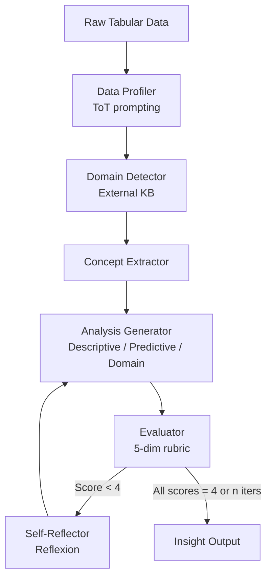
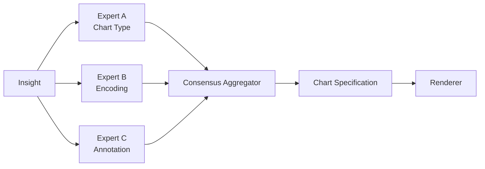
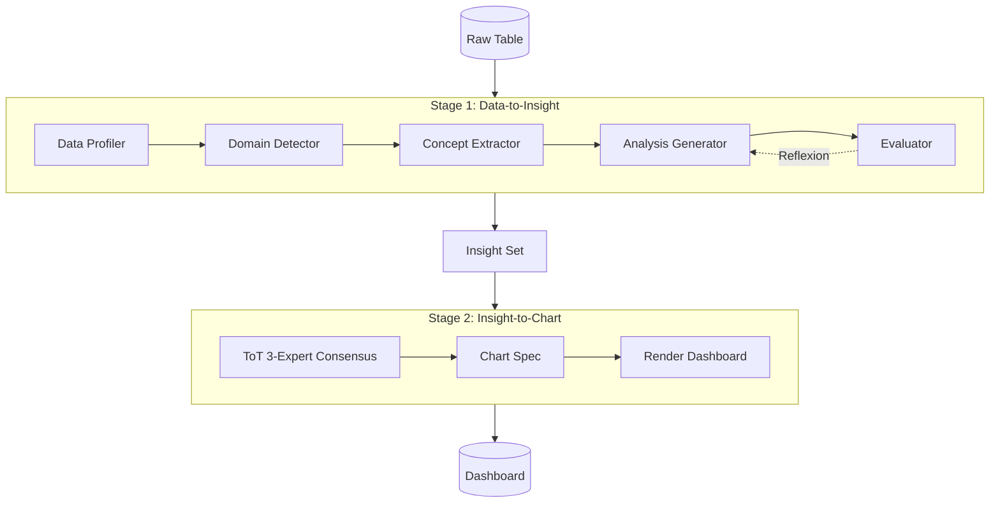
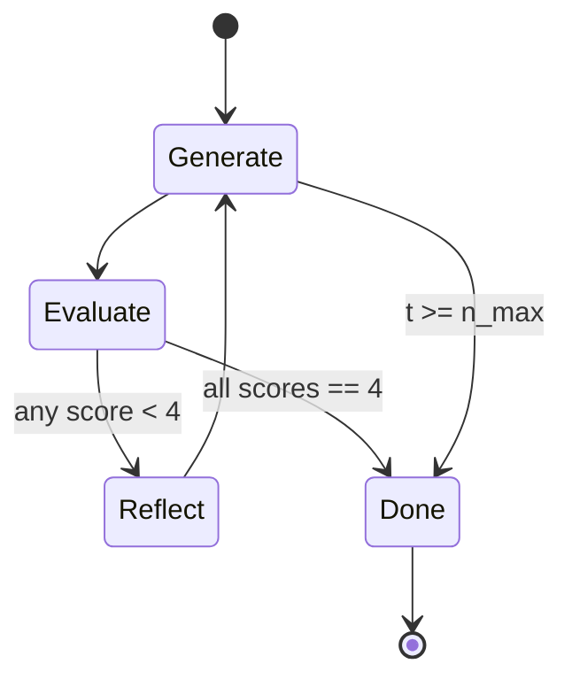
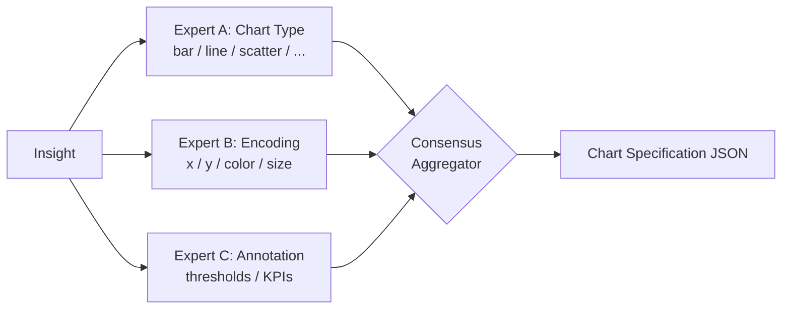

# Data-to-Dashboard: Multi-Agent LLM Framework for Insightful Visualization in Enterprise Analytics

## 書誌情報

| 項目 | 内容 |
|------|------|
| タイトル | Data-to-Dashboard: Multi-Agent LLM Framework for Insightful Visualization in Enterprise Analytics |
| 著者 | Ran Zhang, Mohannad Elhamod |
| 発表年 | 2025年 |
| 発表媒体 | arXiv preprint (cs.AI, 2505.23695) |
| カテゴリ | Multi-Agent LLM / Business Intelligence / Data Visualization |
| 実装 | https://github.com/77luvC/D2D_Data2Dashboard |

## Abstract（原文）

> The paper introduces an agentic system automating data-to-dashboard pipelines. The framework features modular LLM agents capable of domain detection, concept extraction, multi-perspective analysis generation, and iterative self-reflection. Unlike existing chart QA systems, it simulates business analyst reasoning without relying on fixed ontologies or question templates. The system is evaluated on three datasets across different domains and benchmarked against a GPT-4o single-prompt baseline, showing significant improvements in insightfulness, domain relevance, and analytical depth.

## 1. 問題・動機

### 1.1 背景

エンタープライズアナリティクスの現場では、生のテーブルデータからビジネスダッシュボードを構築する際に、以下のような暗黙のステップが連鎖的に発生している。

1. データの統計的プロファイリング
2. ドメイン文脈の同定（例: 金融、マーケティング、IT運用）
3. ビジネス概念（例: チャーン率、ダウンタイム、CAC）への翻訳
4. 多角的視点（記述・予測・ドメイン特化）からの分析
5. 適切な可視化形式（チャート種別・エンコーディング・注釈）の決定

これらは熟練したビジネスアナリストの暗黙知に依存しており、既存のLLMを単発プロンプトで利用しても、表面的な記述統計やテンプレ的な可視化に留まる傾向がある。

### 1.2 既存研究の限界

著者らは、既存の Chart-QA 系・自動可視化系手法に以下の限界を指摘している。

- **固定オントロジー依存**: あらかじめ定義された質問テンプレートやスキーマに依存し、未知のドメインに弱い。
- **クローズドボキャブラリ**: ドメイン語彙が固定されており、新しい業種・新しい指標へ柔軟に対応できない。
- **浅い分析**: 単発プロンプトベースのLLMは表層的な「カラムの説明」に終始し、ビジネス示唆に欠ける。
- **可視化と分析の分離**: insight 生成と chart 生成が独立しており、insight に対する最適なエンコーディング選択が行われない。

### 1.3 リサーチクエスチョン

> 「LLMエージェント群を用いて、ビジネスアナリストの推論プロセスを模倣し、固定オントロジーに依存せず、生データから insight 駆動のダッシュボードを自動構築できるか？」

## 2. コア手法・技術詳細

### 2.1 全体アーキテクチャ

提案手法 **D2D (Data-to-Dashboard)** は、2 段階のパイプラインで構成される。

- **Stage 1: Data-to-Insight** — 生のテーブルデータから、ドメインに即した分析的 insight を抽出
- **Stage 2: Insight-to-Chart** — 抽出した insight を、ドメインに適切な可視化に変換

各 stage は複数の LLM エージェントで構成され、それぞれが専門的な役割を担い、Reflexion 型の自己反省ループで品質を改善する。

### 2.2 エージェント役割定義

| エージェント | 役割 | 主要技法 |
|------------|------|--------|
| Data Profiler | 列型・値域・依存関係・候補キーの推定 | Tree-of-Thought (ToT) prompting |
| Domain Detector | ドメインラベルと一文定義の生成 | Wikipedia 等の外部知識参照 |
| Concept Extractor | データセット主題に関連するビジネス概念の抽出 | 自然言語フレーズ生成 |
| Analysis Generator | 記述・予測・ドメイン特化の3 視点で insight 合成 | Multi-perspective prompting |
| Evaluator | 5 軸 (1-4 scale) でスコアリングと根拠提示 | Rubric-based G-Eval |
| Self-Reflector | 反復的自己改善 | Reflexion framework |

### 2.3 Stage 1: Data-to-Insight パイプライン



#### 2.3.1 Domain と Domain Concept の関係性定義

本論文の重要な概念設計として、ドメインを規範的(prescriptive)ではなく**関係的(relational)**に定義する。

- **Domain**: より広いビジネス文脈（例: finance, operations, incident management）
- **Domain Concept**: ドメイン内の粒度の細かい要素（例: revenue, downtime, churn rate）

これにより、固定されたタクソノミーに頼らず、新規データセットへ柔軟に適応できる。

#### 2.3.2 Analysis Generator の3視点

Analysis Generator は以下の 3 つの解析レンズを並列適用する。

1. **Descriptive (記述的)**: データに何が起きているかを要約
2. **Predictive (予測的)**: 今後何が起こり得るかを示唆
3. **Domain-related (ドメイン特化)**: 当該業種特有の KPI・業界知識に基づく示唆

### 2.4 Evaluator の評価軸とスコア収束

Evaluator は 5 つの次元それぞれに対し $1\text{-}4$ のスケールで評価し、自然言語の justification を返す。スコア更新は Reflexion ループ内で次のように扱われる。

$$
\text{Insight}_{t+1} = \mathrm{Reflect}\bigl(\text{Insight}_t,\; \{s_i^{(t)}\}_{i=1}^{5},\; \{j_i^{(t)}\}_{i=1}^{5}\bigr)
$$

ここで $s_i^{(t)}$ は次元 $i$ のスコア、$j_i^{(t)}$ は justification である。停止条件は、

$$
\forall i \in \{1,\dots,5\}:\; s_i^{(t)} = 4 \quad \lor \quad t \geq n_{\max}
$$

評価次元は以下の 5 つ。

| 次元 | 内容 |
|-----|-----|
| Domain Accuracy | 推定ドメインとデータの整合性 |
| Concept Relevance | 抽出概念がドメインに整合するか |
| Insightfulness | 示唆としての価値 |
| Novelty | 既知の単純集計を超えた新規性 |
| Depth | 分析の階層的な深さ |

### 2.5 Stage 2: Insight-to-Chart パイプライン

Stage 2 は **Tree-of-Thought reasoning + 3-expert consensus mechanism** によって、可視化の意思決定を熟慮的に行う。



3 名の仮想エキスパートはそれぞれ「チャート種別」「視覚的エンコーディング」「ドメイン的に有意な注釈」について案を提示し、コンセンサス機構が最終仕様を統合する。

### 2.6 アルゴリズム概要

```
Algorithm: D2D Pipeline
Input : Raw table T, max iterations n_max
Output: Insight set I*, Chart set C*

1.  P  ← DataProfiler(T)             # ToT
2.  D  ← DomainDetector(P)           # External KB
3.  K  ← ConceptExtractor(P, D)
4.  for t = 1 .. n_max:
5.      I_t ← AnalysisGenerator(P, D, K, multi-lens)
6.      S_t ← Evaluator(I_t)         # 5-dim 1..4
7.      if all(S_t == 4): break
8.      I_t ← SelfReflector(I_t, S_t)
9.  I* ← I_t
10. for each insight i in I*:
11.    C_i ← ToT-Consensus({Expert_A, Expert_B, Expert_C})
12. C* ← Render({C_i})
13. return I*, C*
```

## 3. 実験設定

### 3.1 データセット

| データセット | ドメイン | 規模・特徴 |
|------------|--------|----------|
| Wharton School marketing simulation | マーケティング | 教育用シミュレーションデータ |
| InsightBench | 混合 | ground-truth insight 付きベンチマーク |
| Kaggle finance survey | 金融 | 19.9K downloads の実データ |

### 3.2 比較ベースライン

- **GPT-4o single-prompt baseline**: 単発プロンプトでテーブルから insight を直接生成
- **Kaggle analyst visualizations**: 実在のアナリストによる可視化（finance データセット）
- **InsightBench ground-truth insights**: ベンチマークの正解 insight

### 3.3 評価指標

- **G-Eval**: insightfulness / novelty / depth を 0-1 スコアに正規化
- **Chart characteristics review**: type, legend, axis label の妥当性
- **人手評価**: ドメイン専門家による統一ルーブリックでの妥当性検証

## 4. 主な結果

### 4.1 GPT-4o ベースラインとの比較（InsightBench）

| Metric | GPT-4o Baseline | D2D (Proposed) | Improvement |
|--------|----------------:|---------------:|------------:|
| Insightfulness | 0.78 | 0.88 | +12% |
| Novelty | 0.65 | 0.83 | +28% |
| Depth | 0.75 | 0.99 | +31% |

特に Depth で +31% の改善を示しており、Reflexion ループによる自己反省が分析の階層性向上に寄与している。

### 4.2 Kaggle アナリストとの比較（Finance）

実在の Kaggle 上位アナリストの可視化に対しても、

- Insightfulness: **+147%**
- Novelty: **+77%**
- Depth: **+113%**

の差を示し、人間アナリストの平均的アウトプットを大きく上回る insight 生成が可能であることを示した。

### 4.3 アブレーション的観察

著者らは「ドメインの明示的同定」が決定的な貢献因子であると報告している。

> Explicit domain identification substantially improves generated insights' coverage, structure, and business relevance by triggering appropriate knowledge frames.

つまり Domain Detector を欠くと、Concept Extractor / Analysis Generator が適切な知識フレームを呼び出せず、insight が一般化されすぎる。

## 5. Figures & Tables

### Figure 1: 全体パイプライン (2-stage)



### Figure 2: Reflexion ループの状態遷移



### Table 1: エージェント別の入出力仕様

| Agent | Input | Output | Prompting Strategy |
|-------|-------|--------|--------------------|
| Data Profiler | Raw table | Statistical summary, types, keys | Tree-of-Thought |
| Domain Detector | Profile | Domain label + 1-sentence def | KB-augmented |
| Concept Extractor | Profile + domain | NL business concepts | Few-shot |
| Analysis Generator | Profile + domain + concepts | Insight (3 lenses) | Multi-perspective |
| Evaluator | Insight | 5-dim scores + justification | Rubric G-Eval |
| Self-Reflector | Insight + scores | Revised insight | Reflexion |

### Table 2: 評価次元と尺度

| Dimension | Scale | 説明 |
|-----------|:----:|------|
| Domain Accuracy | 1-4 | 推定ドメインの妥当性 |
| Concept Relevance | 1-4 | 概念とドメインの整合 |
| Insightfulness | 1-4 | 示唆価値 |
| Novelty | 1-4 | 新規性 |
| Depth | 1-4 | 分析の階層的深さ |

### Table 3: 結果サマリ（再掲・拡張）

| Comparison | Insightfulness | Novelty | Depth |
|-----------|---------------:|--------:|------:|
| vs GPT-4o (InsightBench) | +12% | +28% | +31% |
| vs Kaggle Analyst (Finance) | +147% | +77% | +113% |

### Figure 3: Stage 2 の3エキスパート合意機構



## 6. 考察

### 6.1 ドメイン同定の本質的役割

D2D の最大の貢献は、ドメイン同定を「明示的なエージェントタスク」として独立させた点にある。これにより、後続の Concept Extractor と Analysis Generator が業界固有の知識フレームを呼び出せる。LLM は内部に膨大なドメイン知識を持つが、それを呼び出す「キー」が必要であり、Domain Detector がそのキー生成器として機能している。

### 6.2 Reflexion による深さの改善

Depth が +31% 改善したことは、単発生成では得られない「分析の積層性」(insight の上に新たな問いを立てる動き)が、Reflexion 反復で得られていることを示唆する。

### 6.3 関係的ドメイン定義の柔軟性

固定オントロジーを採用しないため、新規業種データに対してもゼロショットで動作可能である。これは BI ツールにおける長年のテンプレート問題を回避する設計上の選択である。

## 7. 限界と今後の課題

| 限界 | 内容 |
|------|------|
| Stage 2 の不完全さ | 時間的制約により可視化生成が不完全。一部チャートは誤った形式で生成された |
| Domain Detector の不安定性 | 多様なデータでドメイン推定が不一致になる場合あり。Self-consistency の導入が必要 |
| 人手評価の限定性 | 評価者数が限定的。統計的に有意な大規模評価が今後の課題 |
| Insight と Chart の品質逆相関 | 高品質な Stage 1 insight が Stage 2 の legend 生成を困難にするケースが観察 |

## 8. 関連研究との位置付け

| カテゴリ | 既存手法 | D2D の差別化 |
|---------|--------|-------------|
| Chart-QA | テンプレート質問駆動 | テンプレート不要・insight 駆動 |
| AutoViz | ヒューリスティック可視化 | LLM ToT 合意による文脈適応 |
| InsightBench | 単発 LLM 生成 | 多エージェント + Reflexion |
| BI tools (Tableau, PowerBI) | 人手作業中心 | エンドツーエンド自動化 |

## 9. データ分析エージェント研究への示唆

本研究は、データ分析エージェントを設計する上で次の重要な指針を提示している。

1. **役割分割の重要性**: 「プロファイリング」「ドメイン同定」「概念抽出」「分析生成」「評価」「自己反省」という責務分割は、分析エージェントの汎用テンプレートとして再利用価値が高い。
2. **ドメイン明示化**: LLM の暗黙知を引き出すための「ドメインキー」生成専門エージェントは、クラスタリング・異常検知タスクにも転用可能。
3. **Reflexion による深さ改善**: 単発生成より深い分析が必要な場面で、評価ルーブリックを伴う反復ループは強力。
4. **関係的概念定義**: 規範的タクソノミーを避けることで、ゼロショットドメイン適応性が得られる。

## 10. まとめ

Data-to-Dashboard は、生のテーブルデータからエンタープライズ向けダッシュボードを構築する一連のプロセスを、6 種のモジュール化 LLM エージェントで自動化する 2 段階フレームワークである。Tree-of-Thought・Reflexion・3-expert consensus を組み合わせることで、GPT-4o 単発プロンプトに対し insightfulness で +12%、novelty で +28%、depth で +31% の改善を達成し、Kaggle 上位アナリストの可視化をも凌駕する insight 生成能力を示した。固定オントロジーに依存しない関係的ドメイン定義は、新規業種への適応性を担保し、今後のデータ分析エージェント設計における重要な指針となる。
