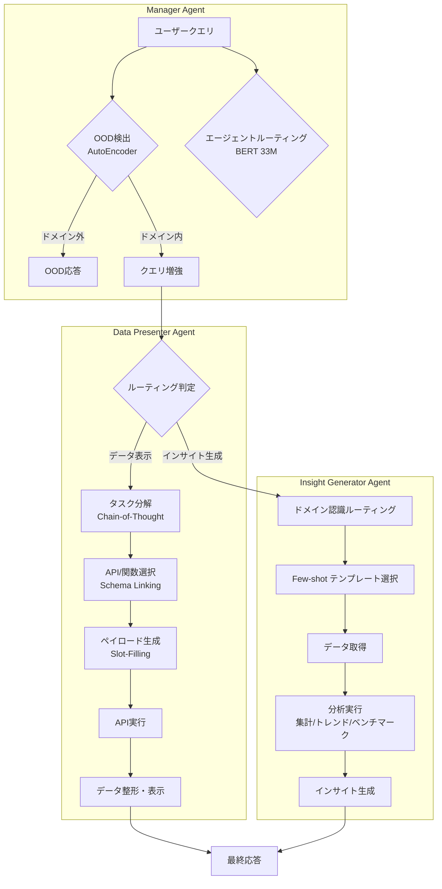

# Insight Agents: An LLM-Based Multi-Agent System for Data Insights

- **Link**: https://arxiv.org/abs/2601.20048
- **Authors**: Jincheng Bai, Zhenyu Zhang, Jennifer Zhang, Zhihuai Zhu
- **Year**: 2026
- **Venue**: SIGIR 2025
- **Type**: Academic Paper (Industry Application)

## Abstract

The paper introduces a conversational multi-agent system designed to help e-commerce sellers access data insights through automated retrieval. The system employs a hierarchical multi-agent structure, consisting of a manager agent and two worker agents: data presentation and insight generation. It combines out-of-domain detection and BERT-based routing for optimization. The deployed system achieved 90% accuracy based on human evaluation, with latency of P90 below 15s.

## Abstract（日本語訳）

本論文は、eコマースの販売者がデータインサイトに自動取得を通じてアクセスすることを支援する対話型マルチエージェントシステムを紹介する。システムはマネージャーエージェントと2つのワーカーエージェント（データ表示とインサイト生成）からなる階層型マルチエージェント構造を採用している。ドメイン外検出とBERTベースルーティングを組み合わせた最適化を行い、デプロイされたシステムは人間評価に基づき90%の精度を達成し、P90レイテンシは15秒以下であった。

## 概要

本論文は、Amazon（米国）のeコマースプラットフォームにおいて、販売者がビジネスデータインサイトにアクセスするための対話型マルチエージェントシステム「Insight Agents（IA）」を提案する。

主要な貢献は以下の通り：

1. **階層型マネージャー・ワーカーアーキテクチャ**: マネージャーエージェントがクエリ処理・ルーティングを担当し、2つの専門ワーカー（Data Presenter、Insight Generator）がデータ取得・分析を実行
2. **軽量専門モデルの活用**: OOD検出にオートエンコーダ、ルーティングにBERTを使用し、LLM呼び出しを最小化しつつ高精度・低レイテンシを実現
3. **Plan-and-Execute型データワークフロー**: RAG原理に基づくタスク分解・API選択・パイロード生成の体系的パイプライン
4. **本番環境での実証**: 89.5%の質問レベル精度、P90レイテンシ13.56秒を達成

従来のText-to-SQLアプローチではなく、APIベースのデータ取得を採用することで、ハルシネーション低減と精度向上を両立している点が特徴的である。

## 問題と動機

- **eコマース販売者の認知負荷**: 販売者は多数のビジネスツールやダッシュボードを横断してデータを探索する必要があり、適切なツールの発見自体が困難
- **記述分析と診断分析の統合的需要**: 販売者は単なる数値表示（「先月のトップ10商品の売上は？」）だけでなく、要約・ベンチマーク比較などの分析的インサイトも求めている
- **LLMベースシステムのレイテンシ問題**: 純粋なLLMベースのルーティングやOOD検出はレイテンシが高く（1.6-2.1秒）、本番環境での要件を満たせない
- **ドメイン外クエリの適切な処理**: eコマースコンテキストにおいて、サポート範囲外のクエリを正確に識別し、不適切な応答を防止する必要性
- **Text-to-SQLの限界**: 構造化されたeコマースデータではAPIベースのアクセスがより適切であり、SQLベースアプローチはスキーマの複雑さやハルシネーションリスクが高い

## 提案手法

### 1. 階層型マネージャー・ワーカーアーキテクチャ

システムは3層構造で構成される：

**マネージャーエージェント**：クエリ処理パイプラインを管理
- OOD検出：ドメイン外クエリのフィルタリング
- エージェントルーティング：適切なワーカーへの振り分け
- クエリ増強：曖昧な時間表現やコンテキストの明確化

**Data Presenterエージェント**：構造化データの取得・表示
**Insight Generatorエージェント**：分析的インサイトの生成

### 2. OOD検出（オートエンコーダ方式）

単一隠れ層のオートエンコーダを使用した再構成誤差ベースの異常検出：

$$H = \sigma(W_1 X + b_1)$$

$$\hat{X} = \sigma(W_2 H + b_2)$$

隠れ層次元は64。OOD閾値は以下で定義：

$$\text{threshold} = \mu_{id} + \lambda \cdot \sigma_{id}$$

ここで $\lambda = 4$。再構成誤差がこの閾値を超えるクエリをドメイン外として検出する。

### 3. BERTベースエージェントルーティング

33Mパラメータの軽量BERTモデルをファインチューニングし、クエリを「Data Presenter」か「Insight Generator」に分類：

- 精度：0.83（LLMベース 0.60 対比 +38%向上）
- レイテンシ：0.31秒（LLMベース 2.14秒 対比 85%削減）

### 4. Data Workflow Planner

RAG原理に基づくPlan-and-Executeパラダイム：

1. **タスク分解（Task Decomposition）**: Chain-of-Thought推論によりクエリを解決可能なサブステップに分解
2. **API/関数選択（Schema Linking）**: クエリエンティティと利用可能なデータAPIのマッピング
3. **ペイロード生成（Slot-Filling）**: APIパラメータの自動充填

### 5. ドメイン認識型インサイト生成

Insight Generatorは以下の分析手法をドメイン知識として動的注入：
- 集計分析（Aggregation）
- 季節性・トレンド分析（Seasonal/Trend Analysis）
- ベンチマーキング（Benchmarking）
- Few-shot学習による所定の解決パスの適用

## アルゴリズム（疑似コード）

```
Algorithm: Insight Agents Query Processing Pipeline
Input: ユーザークエリ q
Output: データインサイト応答 r

1: // Phase 1: マネージャーエージェント処理（並列実行）
2: score_ood ← AutoEncoder.reconstruct_error(q)
3: route_label ← BERT_Router.classify(q)    // 並列実行
4:
5: // Phase 2: OOD判定（早期終了）
6: threshold ← μ_id + λ * σ_id
7: if score_ood > threshold then
8:     return "Out of domain response"
9: end if
10:
11: // Phase 3: クエリ増強
12: q_aug ← QueryAugmenter.clarify(q)  // 時間表現等の解決
13:
14: // Phase 4: ワーカーエージェント実行
15: if route_label == "data_presenter" then
16:     // Data Presenter パイプライン
17:     subtasks ← TaskDecomposer.decompose(q_aug)
18:     for each task in subtasks do
19:         api ← SchemaLinker.select_api(task)
20:         payload ← SlotFiller.generate(task, api)
21:         data ← API.execute(api, payload)
22:     end for
23:     r ← DataPresenter.format(data)
24: else
25:     // Insight Generator パイプライン
26:     domain ← DomainRouter.classify(q_aug)
27:     template ← FewShotSelector.get_template(domain)
28:     data ← DataRetriever.fetch(q_aug)
29:     r ← InsightGenerator.analyze(data, template)
30: end if
31:
32: return r
```

## アーキテクチャ / プロセスフロー



## Figures & Tables

### Table 1: OOD検出モデル比較

| モデル | Precision | Recall | レイテンシ |
|--------|-----------|--------|-----------|
| Auto-encoder（提案手法） | **0.969** | 0.721 | **0.009秒** |
| LLMベース | 0.616 | **0.971** | 1.665秒 |

Auto-encoderはPrecisionで+57%、レイテンシで185倍高速化を実現。Recallの低下はあるが、本番環境ではPrecision重視が適切（ドメイン外の誤検出による機会損失より、ドメイン内の誤分類による不適切応答を回避）。

### Table 2: エージェントルーティング性能比較

| モデル | パラメータ数 | 精度 | レイテンシ |
|--------|------------|------|-----------|
| Fine-tuned BERT（提案手法） | 33M | **0.83** | **0.31秒** |
| LLMベース | ~100B+ | 0.60 | 2.14秒 |

軽量BERTモデルが大規模LLMを精度で38%上回り、レイテンシも85%削減。

### Table 3: 人間評価結果（57件のドメイン内質問）

| メトリック | 平均 | 標準偏差 | 最小 | 最大 | 中央値 |
|-----------|------|---------|------|------|--------|
| Relevancy（関連性） | 0.977 | 0.102 | 0.5 | 1 | 1 |
| Correctness（正確性） | 0.958 | 0.125 | 0.455 | 1 | 1 |
| Completeness（完全性） | 0.993 | 0.045 | 0.714 | 1 | 1 |

質問レベル精度（全メトリック>0.8）：**89.5%**（51/57件）

### Figure 1: レイテンシ分布（概念図）

```
エンドツーエンドレイテンシ分布:
┌─────────────────────────────────────────────────────────────┐
│ OOD検出 (0.009s) ──┐                                        │
│                    ├── 並列処理                             │
│ ルーティング (0.31s) ──┘                                      │
│                                                             │
│ クエリ増強 ──── ワーカー実行 ──── 応答生成                    │
│ (~0.5s)       (~8-12s)       (~1s)                         │
│                                                             │
│ P50: ~8秒    P90: 13.56秒    P99: <15秒                    │
└─────────────────────────────────────────────────────────────┘
```

## 実験と評価

### データセット構成

- 総質問数：301問（178件ドメイン内、123件ドメイン外）
- ドメイン内内訳：Data Presenter 120件、Insight Generator 59件
- LLMによるデータ拡張（スーパーサンプリング）：各カテゴリ300問に拡張
- ベンチマークデータセット：100問（正解ラベル付き）

### 評価方法

Claude 3 Sonnet（Amazon Bedrock経由）を評価モデルとして使用し、以下の3メトリックを測定：
- **Relevance**: クエリキーワードのカバー率
- **Correctness**: 正確なインサイトの割合
- **Completeness**: 必要データポイントのカバー率

### 主要な結果

1. **OOD検出**: オートエンコーダがPrecision 0.969を達成（LLMベース比+57%）、レイテンシ0.009秒
2. **ルーティング**: BERTモデルが精度0.83を達成（LLMベース比+38%）
3. **質問レベル精度**: 89.5%（57件中51件が全メトリック>0.8閾値を達成）
4. **エンドツーエンドP90レイテンシ**: 13.56秒

### 設計上の重要な知見

- **軽量専門モデルの優位性**: OOD検出とルーティングに軽量モデルを使用することで、LLM呼び出しを削減しつつ性能とレイテンシの両方を改善
- **並列処理と早期終了**: OOD検出とルーティングの並列実行＋OOD判定での早期終了により、パイプライン全体のレイテンシを最適化
- **APIベースデータ取得の選択**: Text-to-SQLではなくAPI経由のデータ取得を選択し、精度向上とハルシネーション低減を実現
- **動的ドメイン知識注入**: インサイト生成の精度向上のため、分析手法とドメイン知識をFew-shotテンプレートとして動的に注入

## 備考

- **産業応用の実証**: Amazon USの販売者向けに実際にデプロイされたシステムであり、学術的提案にとどまらない実用性が実証されている
- **軽量モデル戦略**: 大規模LLMへの依存を最小化し、専門タスクに特化した小型モデル（33M BERT、オートエンコーダ）を組み合わせるアプローチは、本番環境でのコスト・レイテンシ制約に対する実践的な解決策
- **Plan-and-Execute vs. ReAct**: 従来のReActパターンではなく、計画→実行の分離型パラダイムを採用し、タスク分解の体系性を向上
- **データ取得戦略**: Text-to-SQLの代わりにAPI呼び出しを選択した判断は、eコマースドメインの特性（構造化API群の存在、データスキーマの頻繁な変更）に適合
- **評価の限界**: ベンチマークが100問と比較的小規模であり、より大規模な評価が今後の課題として残る
- **SIGIR 2025採択**: 情報検索分野のトップ会議での採択は、対話型データ取得システムとしての学術的貢献を裏付ける
