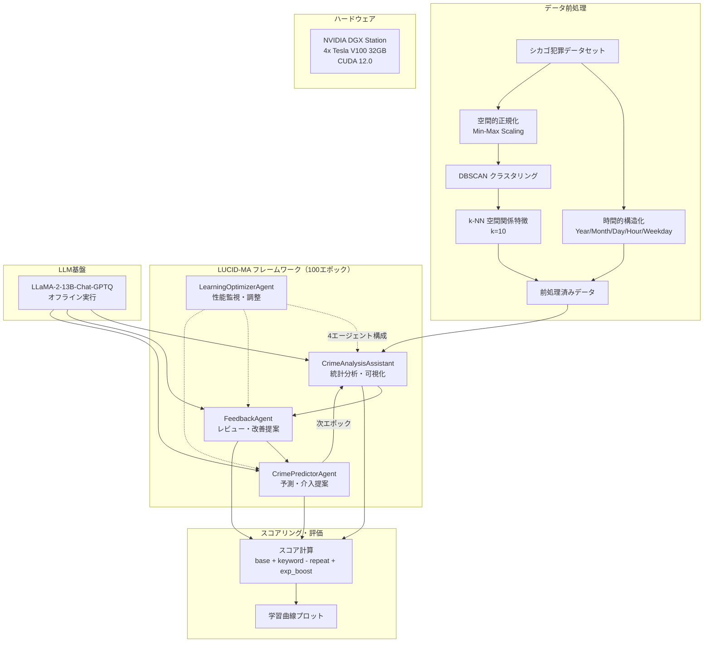

# AutoGen Driven Multi Agent Framework for Iterative Crime Data Analysis and Prediction

- **Link**: https://arxiv.org/abs/2506.11475
- **Authors**: Syeda Kisaa Fatima, Tehreem Zubair, Noman Ahmed, Asifullah Khan
- **Year**: 2025
- **Venue**: arXiv preprint
- **Type**: Academic Paper (Application / Multi-Agent System)

## Abstract

This paper introduces LUCID-MA (Learning and Understanding Crime through Dialogue of Multiple Agents), an innovative AI powered framework where multiple AI agents collaboratively analyze and understand crime data. Our system that consists of three core components: an analysis assistant that highlights spatiotemporal crime patterns; a feedback component that reviews and refines analytical results; and a prediction component that forecasts future crime trends. With a well-designed prompt and the LLaMA-2-13B-Chat-GPTQ model, it runs completely offline and allows the agents undergo self-improvement through 100 rounds of communication with less human interaction. A scoring function is incorporated to evaluate agents' performance, providing visual plots to track learning progress. This work demonstrates the potential of AutoGen-style agents for autonomous, scalable, and iterative analysis in social science domains, maintaining data privacy through offline execution. It also showcases a computational model with emergent intelligence, where the system's global behavior emerges from the interactions of its agents.

## Abstract（日本語訳）

本論文は、LUCID-MA（複数エージェントの対話による犯罪の学習と理解）を紹介する。これは複数のAIエージェントが協調的に犯罪データを分析・理解する革新的なAIフレームワークである。システムは3つのコアコンポーネントで構成される：時空間的犯罪パターンを特定する分析アシスタント、分析結果をレビュー・改善するフィードバックコンポーネント、将来の犯罪傾向を予測する予測コンポーネントである。LLaMA-2-13B-Chat-GTPQモデルと設計されたプロンプトにより、完全オフラインで動作し、100ラウンドの通信を通じて人間の介入を最小限にしつつ自己改善を行う。スコアリング関数によりエージェントの性能を評価し、学習進捗を可視化する。本研究はAutoGenスタイルのエージェントが社会科学ドメインにおいて自律的・スケーラブル・反復的な分析を行う可能性を示し、オフライン実行によるデータプライバシーを維持する。また、エージェント間の相互作用からシステム全体の挙動が創発する創発的知能の計算モデルを示す。

## 概要

本論文は、AutoGenフレームワークに基づくマルチエージェントシステム「LUCID-MA」を提案し、犯罪データの分析・予測タスクにおける反復的協調学習の可能性を実証する。

主要な貢献は以下の通り：

1. **3エージェント協調アーキテクチャ**: CrimeAnalysisAssistant、FeedbackAgent、CrimePredictorAgentの3エージェントが100エポックにわたり反復的に通信・改善
2. **完全オフライン実行**: LLaMA-2-13B-Chat-GPTQ を使用し、クラウドAPIへの依存なしにデータプライバシーを確保
3. **スコアリングによる学習シミュレーション**: キーワードボーナス・繰り返しペナルティ・指数的学習ブーストを組み合わせた評価関数で、エージェントの改善を定量化
4. **アブレーションスタディ**: LearningOptimizerAgentの追加（4エージェント構成）による性能向上を実証
5. **創発的知能の観察**: エージェント間の協調対話から、個々のエージェントの能力を超えた分析深度・自己修正・適応的問題解決が創発

シカゴ犯罪データセットを用いた実験で、バックプロパゲーションやファインチューニングなしに、フィードバックループのみでエージェント性能の持続的改善を確認した。

## 問題と動機

- **従来の犯罪分析手法の限界**: 回帰モデルやシンプルな集計手法は、異なる犯罪タイプやコンテキストへの適用時に大幅な再校正が必要
- **適応的AIシステムの社会科学への応用不足**: 反復的フィードバックによる適応的学習が可能なAIシステムは、主に自然科学分野に集中しており、社会科学（特に犯罪予測）への適用が不十分
- **継続的学習の欠如**: 既存の犯罪予測実装は新規データからの継続的学習を組み込んでおらず、AutoGenがこのギャップを埋める
- **データプライバシーの懸念**: 犯罪データは機密性が高く、クラウドベースのLLMサービスへのデータ送信はプライバシーリスクを伴う
- **人間の継続的監視への依存**: 既存手法は分析プロセスにおいて人間の継続的関与を前提としており、自律的・スケーラブルな分析が困難

## 提案手法

### 1. LUCID-MAフレームワーク

AutoGenベースのマルチエージェント協調学習フレームワークで、以下の3+1エージェントで構成：

**CrimeAnalysisAssistant（分析エージェント）**:
- 前処理済み犯罪データの統計分析
- 頻出犯罪タイプ、時間帯パターンの特定
- ヒートマップ、分布図等の可視化生成

**FeedbackAgent（フィードバックエージェント）**:
- CrimeAnalysisAssistantの出力をレビュー
- 改善提案（ラベリング改善、凡例明確化、分析深化）
- 未探索領域の指摘（性別別分布、月別傾向等）

**CrimePredictorAgent（予測エージェント）**:
- 犯罪ホットスポットの予測
- 高リスク期間の特定
- 予防的介入の提案

**LearningOptimizerAgent（最適化エージェント、拡張構成）**:
- エポック間スコアの監視
- 低性能エージェントの識別・変数調整
- システム全体の多様性維持と学習促進

### 2. データ前処理

シカゴ犯罪データセットに対する前処理パイプライン：

**時間的構造化**:
- Date属性から Year, Month, Day, Hour, Weekday を導出
- マルチスケール時間パターン探索を可能に

**空間的正規化・特徴合成**:
- 緯度・経度をMin-Max正規化（$[0,1]$区間）
- DBSCANによるクラスタリングで犯罪ゾーンを特定
- 正規化座標の合成によるNode特徴の生成

**空間関係特徴の導出**:
- k近傍法（$k=10$）による犯罪の空間的クラスタリング
- 空間的近接度を測定する"relation"特徴の計算

### 3. スコアリング・学習シミュレーション

エージェントの改善を定量的に評価するスコアリング関数：

$$\text{Score}(e) = \text{base} + \text{keyword\_bonus} - \text{repetition\_penalty} + \text{learning\_boost}(e)$$

各要素：
- **ベーススコア**: 分析エージェント = 0.02、その他 = 0.01
- **キーワードボーナス**: "crime", "hotspot", "predict", "suggest" 等の使用で +0.05
- **繰り返しペナルティ**: エポック間での応答重複に -0.05
- **指数的学習ブースト**: $0.5 \times (1 - e^{-0.05 \times \text{epoch}})$

最終スコアは $[0, 1]$ の範囲に正規化される。

## アルゴリズム（疑似コード）

```
Algorithm: LUCID-MA Iterative Learning Framework
Input: 犯罪データセット D, エポック数 N=100
Output: 各エージェントの最終分析結果・予測結果

1: D_processed ← Preprocess(D)  // 時間/空間特徴抽出、DBSCAN
2: Initialize agents: A_analysis, A_feedback, A_predict
3: Initialize scores: S = {agent: [] for agent in agents}
4:
5: for epoch = 1 to N do
6:     // Phase 1: 犯罪分析
7:     analysis_output ← A_analysis.analyze(D_processed, epoch)
8:     S[analysis].append(compute_score(analysis_output, epoch))
9:
10:    // Phase 2: フィードバック生成
11:    feedback ← A_feedback.review(analysis_output)
12:    S[feedback].append(compute_score(feedback, epoch))
13:
14:    // Phase 3: 犯罪予測
15:    prediction ← A_predict.forecast(analysis_output, feedback)
16:    S[predict].append(compute_score(prediction, epoch))
17:
18:    // Phase 4: 学習最適化（4エージェント構成の場合）
19:    if LearningOptimizer is enabled then
20:        A_optimizer.monitor(S)
21:        A_optimizer.adjust_competition(agents)
22:    end if
23:
24:    // 可視化更新
25:    update_learning_plots(S, epoch)
26: end for
27:
28: return final_results, learning_curves

Function compute_score(response, epoch):
    score ← base_score
    score += count_keywords(response) * 0.05
    if is_repeated(response) then
        score -= 0.05
    end if
    score += 0.5 * (1 - exp(-0.05 * epoch))
    return clip(score, 0, 1)
```

## アーキテクチャ / プロセスフロー



## Figures & Tables

### Table 1: 3エージェント構成のスコア推移（100エポック）

| エージェント | 初期スコア | 最終スコア | 主な改善点 |
|------------|-----------|-----------|-----------|
| CrimeAnalysisAssistant | 0.07 | **0.94** | 分析深度・可視化多様性の向上 |
| FeedbackAgent | 0.05 | **0.89** | 表面的→データ駆動型フィードバックへ進化 |
| CrimePredictorAgent | 0.04 | **0.85** | パターン駆動予測・介入提案の実現 |

### Table 2: 4エージェント構成（LearningOptimizerAgent追加）アブレーション結果

| メトリック | ベースライン（3エージェント） | OptimizerAgent追加 | 改善幅 |
|-----------|--------------------------|-------------------|--------|
| CrimeAnalysisAssistant 最終スコア | 0.94 | **0.96** | +0.02 |
| FeedbackAgent 最終スコア | 0.89 | **0.92** | +0.03 |
| CrimePredictorAgent 最終スコア | 0.85 | **0.91** | +0.06 |
| 平均冗長率 | 14.2% | **6.8%** | -7.4% |

LearningOptimizerAgentの追加により、特にCrimePredictorAgentで+0.06の顕著な改善。冗長率も半分以下に低減。

### Figure 1: エージェント性能の進化段階（概念図）

```
CrimeAnalysisAssistant の段階的進化:
┌────────────────────────────────────────────────────────────────────┐
│ Epoch 1-25    │ 基本的出力、冗長、一般的すぎる                       │
│ ■■□□□□□□□□   │ "犯罪件数の単純集計"                                │
├────────────────────────────────────────────────────────────────────┤
│ Epoch 26-50   │ 明確な可視化、適切なファクター選択                    │
│ ■■■■■□□□□□   │ "時間帯別、平日/週末別分析"                          │
├────────────────────────────────────────────────────────────────────┤
│ Epoch 50-100  │ 高度な分析、非自明パターンの発見                      │
│ ■■■■■■■■■□   │ "警察応答時間変動、性別別犯罪パターン、正規化ヒートマップ" │
└────────────────────────────────────────────────────────────────────┘
```

### Figure 2: 計算環境・実行性能

```
実行環境:
┌──────────────────────────────────────────┐
│ NVIDIA DGX Station                       │
│ ├── 4x Tesla V100 (32GB each)           │
│ ├── CUDA 12.0                           │
│ ├── Python 3.8.19 + PyTorch (FP16)     │
│ └── LLaMA-2-13B-Chat-GPTQ              │
├──────────────────────────────────────────┤
│ 実行性能:                                │
│ ├── エポックあたり平均時間: 3-4分        │
│ ├── 可視化生成時間: ~8-10秒              │
│ ├── GPU使用率: 最大54%                   │
│ └── エージェントあたりメモリ: ~3.2-3.4GB  │
└──────────────────────────────────────────┘
```

## 実験と評価

### 実験設定

- **データセット**: シカゴ犯罪データセット（公開データ）
- **モデル**: LLaMA-2-13B-Chat-GPTQ（完全オフライン）
- **ハードウェア**: NVIDIA DGX Station（4x Tesla V100 32GB）、CUDA 12.0
- **エポック数**: 100（各エポックは3エージェントの完全な対話サイクル）
- **精度**: 半精度（FP16）演算

### 分析出力の進化

**CrimeAnalysisAssistant**:
- エポック1-25: 表面的な犯罪レポート要約レベル
- エポック26-50: 時間帯別分析、平日/週末比較等の構造化された可視化
- エポック50-100: 空間クラスタリング、警察応答時間変動、性別別パターンなど高度な分析

**FeedbackAgent**:
- 初期（エポック50）: 不完全な応答、同じ応答の繰り返し
- 後期（エポック99）: 構造化されたフィードバック（欠点・強み・欠落要素の明確な分類）

**CrimePredictorAgent**:
- 初期: 一般的で不正確な予測
- 後期: パターン駆動型の予測、具体的な介入提案を含む詳細な出力

### 創発的知能の観察

1. **創発的分析深度**: 個々のエージェントでは発見不可能な犯罪グループと時間パターンの微細な関連性をシステム全体で発見
2. **自己修正ループ**: FeedbackAgentによる継続的レビューが、人間のピアレビューに類似した品質管理メカニズムとして機能
3. **適応的問題解決**: 予測精度が低いカテゴリに対して、システムが自律的に特徴・変数の再検証を開始
4. **集合的知識構築**: 分散化されつつ同期された知識構築が、犯罪パターンの多次元的理解を促進

### 主要な知見

- フィードバックループのみ（バックプロパゲーション・ファインチューニングなし）でエージェント性能の持続的改善が可能
- LearningOptimizerAgentの追加により、冗長率が14.2%→6.8%に低減し、出力の多様性・品質が向上
- 完全オフライン実行でデータプライバシーを確保しつつ、実用的な分析品質を達成

## 備考

- **AutoGenフレームワークの社会科学応用**: Microsoft AutoGenを犯罪分析に適用した先駆的研究であり、自然科学中心だった適応的AIシステムの社会科学への拡張
- **創発的知能の実証**: エージェント間の反復的対話から創発する集合知（個々のエージェント能力の総和を超えた分析能力）の具体的事例を提示
- **スコアリング関数の妥当性**: 提案されたスコアリング関数はキーワードベースの比較的単純な設計であり、分析品質の真の測定としての妥当性には議論の余地がある
- **モデルの制約**: LLaMA-2-13B-Chat-GTPQは現在の最新モデル（GPT-4、Claude 3等）と比較して性能が限定的であり、より高性能なモデルでの再評価が有益
- **静的データセットの制約**: 100エポックにわたり同一の静的データセットを使用しており、実世界の犯罪データの動的性質（新規犯罪報告の継続的流入）を反映していない
- **将来拡張の可能性**: Vision Transformer（ViT）を統合した視覚エージェント（監視カメラ映像、犯罪現場画像の分析）への拡張が議論されている
- **再現性**: オフライン実行・明確なハードウェア仕様・データセット公開（シカゴ犯罪データ）により、再現性が比較的高い
