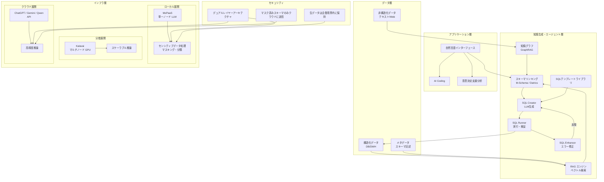

# LLM and Agent-Driven Data Analysis: A Systematic Approach for Enterprise Applications and System-level Deployment

- **Link**: https://arxiv.org/abs/2511.17676
- **Authors**: Xi Wang, Xianyao Ling, Kun Li, Gang Yin, Liang Zhang, Jiang Wu, Annie Wang, Weizhe Wang
- **Year**: 2025
- **Venue**: arXiv preprint
- **Type**: Academic Paper (Survey / System Design)

## Abstract

The rapid progress in Generative AI and Agent technologies is profoundly transforming enterprise data management and analytics. Traditional database applications and system deployment are fundamentally impacted by AI-driven tools, such as Retrieval-Augmented Generation (RAG) and vector database technologies, which provide new pathways for semantic querying over enterprise knowledge bases. In the meantime, data security and compliance are top priorities for organizations adopting AI technologies. For enterprise data analysis, SQL generation powered by large language models (LLMs) and AI agents, has emerged as a key bridge connecting natural language with structured data, effectively lowering the barrier to enterprise data access and improving analytical efficiency. This paper focuses on enterprise data analysis applications and system deployment, covering a range of innovative frameworks, enabling complex query understanding, multi-agent collaboration, security verification, and computational efficiency. Through representative use cases, key challenges related to distributed deployment, data security, and inherent difficulties in SQL generation tasks are discussed.

## Abstract（日本語訳）

生成AIとエージェント技術の急速な進歩は、企業データ管理と分析を根本的に変革している。従来のデータベースアプリケーションとシステム展開は、検索拡張生成（RAG）やベクトルデータベース技術などのAI駆動ツールによって根本的な影響を受けており、企業知識ベースに対するセマンティッククエリの新たな経路を提供している。同時に、AI技術を採用する組織にとってデータセキュリティとコンプライアンスは最重要事項である。企業データ分析において、大規模言語モデル（LLM）とAIエージェントによるSQL生成は、自然言語と構造化データを接続する重要な架け橋として登場し、企業データアクセスの障壁を効果的に低下させ、分析効率を向上させている。本論文はエンタープライズデータ分析アプリケーションとシステム展開に焦点を当て、複雑なクエリ理解、マルチエージェント協調、セキュリティ検証、計算効率を実現する一連の革新的フレームワークをカバーする。代表的なユースケースを通じて、分散展開、データセキュリティ、SQL生成タスクの固有の困難さに関する主要課題を議論する。

## 概要

本論文は、エンタープライズ環境におけるLLMとエージェント技術を活用したデータ分析の体系的アプローチを提示する。清華大学・Cross-strait Tsinghua Research Institute等の研究者による、SQL生成を中心としたエンタープライズAI分析システムの包括的フレームワークである。

主要な貢献は以下の通り：

1. **4層エンタープライズフレームワーク**: インフラ層→データ層→知識生成・エージェント層→アプリケーション層の統一的アーキテクチャを提案
2. **RAG拡張SQL生成**: スキーマ要素のベクトル化・検索による効率的なコンテキスト圧縮と、SQLテンプレートライブラリによる生成精度向上
3. **知識グラフ統合**: GraphRAGによるセマンティック強化と、SQL生成におけるエンティティリンケージ・暗黙的制約の解決
4. **デュアルレイヤーモデルアーキテクチャ**: データセキュリティを確保するローカル・クラウドの二層モデル構造
5. **フィードバック駆動型マルチエージェント**: SQL Creator→Runner→Enhancerの反復ループによる自動修正・改善

学術ベンチマーク（Spider、BIRD）の成果を実際のエンタープライズ展開に橋渡しする実践的視点が特徴的である。

## 問題と動機

- **ビジネスユーザーのSQL障壁**: リアルタイムデータ分析への需要が急増する中、従来のSQL記述は専門スキルを必要とし、エラーが発生しやすく、データ活用の主要なボトルネック
- **自然言語の曖昧性**: 同一用語が異なるビジネスコンテキストで異なる意味を持つセマンティック曖昧性
- **データベーススキーマの複雑性**: エンタープライズ環境では大量のテーブル、非標準化カラム名、欠損メタデータ、暗黙的ビジネスセマンティクスが存在
- **SQL実行結果の予測困難性**: 生成されたSQLの実行結果が期待と異なる場合の検証・修正メカニズムの不足
- **データセキュリティとコンプライアンス**: クラウドベースLLMサービス利用時のセンシティブ情報の漏洩リスクと、ローカル展開の性能制約のトレードオフ
- **既存ベンチマークの限界**: Spider、BIRD等の学術ベンチマークが実際のエンタープライズシナリオの複雑性を十分にカバーしていない

## 提案手法

### 1. 4層エンタープライズフレームワーク

**インフラストラクチャ層**:
- GPUサーバー、ストレージデバイス
- 分散システム展開プラットフォーム（MoPaaS、Kalavai）
- マルチノードGPUクラスタ

**データ層**:
- 構造化データ（データベース、データウェアハウス）
- 非構造化データ（テキスト、ネットワークデータ）
- データクリーニング→構造抽出→メタデータ正規化→スキーマアラインメントの4段階前処理

**知識生成・エージェント層**:
- スキーマリンキング（データベース構造理解）
- 自然言語からのSQL生成
- 知識グラフによる結果検証
- マルチエージェント協調

**アプリケーション層**:
- 自然言語インターフェース（AI Coding）
- 意思決定支援のための包括的分析
- エンタープライズグレードのデータセキュリティ・コンプライアンス

### 2. RAG拡張SQL生成

#### スキーマ要素のベクトル化・検索

カラムレベルの細粒度埋め込み手法：

$$\mathbf{v}_c = \text{Encoder}(\text{table\_name} \oplus \text{column\_name} \oplus \text{description} \oplus \text{value\_examples})$$

オフライン前処理フェーズで全カラム埋め込みを計算し、ベクトルデータベースに格納。推論時に同じエンコーダでユーザークエリをマッピング。

#### SQLテンプレートライブラリ検索

履歴の「質問-SQL」ペアを構造化JSONオブジェクトとして標準化：
- 元の質問
- 抽出エンティティ
- データソース・集計ロジック
- 出力スキーマ

多表現クエリ戦略：同一リクエストに対して複数のセマンティック等価な自然言語バリアントを生成し、各バリアントでベクトル検索を実行。異なる表現が異なる関連テーブルを活性化し、その交差がより高い信頼度の結果を生成。

### 3. 教師あり微調整（SFT）

事前学習モデルパラメータ $\theta$ に対するSFTの目的関数：

$$\mathcal{L}_{\text{SFT}}(\theta) = -\log P(\text{SQL} \mid Q, S; \theta)$$

ここで $Q$ はユーザークエリ、$S$ はデータベーススキーマ。効果的なスキーマ情報 $S$ にはテーブル名・カラム名だけでなく、データ型、キー制約、自然言語記述、値例、テーブル関係を含める必要がある。

### 4. 強化学習とSQL生成

**GRPO（Group Relative Policy Optimization）**:
各自然言語質問に対してN個のSQL候補をサンプリングし、バイナリ実行結果（正解/不正解）に基づくグループ内相対優位性を計算。BIRDベンチマークで実行精度59.97%-71.83%を達成。

**報酬設計**:
- Seq2SQL: 正解実行 +1、不正解 -1、無効SQL -2
- Think2SQL: QATCHフレームワークによる密な報酬信号（セル精度、セルリコール、タプル基数）
- SQL-o1: モンテカルロ木探索（MCTS）＋自己報酬メカニズム

### 5. フィードバック駆動型マルチエージェントアーキテクチャ

SQL生成のための閉ループ反復システム：

- **SQL Creator**: LLMによるSQL生成
- **SQL Runner**: 生成されたSQLの実行・検証
- **SQL Enhancer**: エラー分析と改善

反復ループ: Creator生成→Runner検証→Enhancer改善→Creator再生成（実行可能かつセマンティックに正確なSQLが得られるまで）

### 6. 知識グラフ統合（GraphRAG）

**知識抽出段階**: ソーステキストをセマンティックチャンクに分割し、LLMでエンティティ・関係・記述を自動抽出

**KG構築段階**: 抽出されたエンティティ・関係から予備KGを構築し、コミュニティ検出アルゴリズム（Leidenクラスタリング）でセマンティックコミュニティを形成

**Q&A推論段階**: ユーザークエリ→関連コミュニティ特定→ローカル回答生成（Map-level Answer）→集約モデルによる最終結果合成

### 7. デュアルレイヤーモデルアーキテクチャ

データセキュリティを確保する二層設計：

**ローカル層**: 小規模パラメータモデルの高速・柔軟な処理。センシティブデータのマスキング・分類
**クラウド層**: 大規模パラメータモデルによる高精度分析。抽象化されたスキーマスケルトンのみを受信

原則：生データは企業境界を離れない。クラウドモデルにはマスク済みデータのみを送信。

## アルゴリズム（疑似コード）

```
Algorithm: Enterprise SQL Generation Pipeline
Input: 自然言語クエリ Q, データベーススキーマ S, 知識グラフ KG
Output: SQL実行結果 R

1: // Phase 1: RAGによるスキーマリンキング
2: q_vec ← Encoder(Q)
3: relevant_columns ← VectorDB.search(q_vec, top_k=K)
4: S_filtered ← filter_schema(S, relevant_columns)
5:
6: // Phase 2: SQLテンプレート検索
7: q_variants ← generate_multi_expression(Q)
8: templates ← intersect([VectorDB.search(v) for v in q_variants])
9:
10: // Phase 3: KG強化
11: entities ← KG.extract_entities(Q)
12: kg_context ← KG.community_search(entities)
13:
14: // Phase 4: フィードバック駆動SQL生成ループ
15: context ← combine(S_filtered, templates, kg_context)
16: max_iterations ← 3
17: for i = 1 to max_iterations do
18:     // SQL Creator
19:     sql ← LLM.generate_sql(Q, context)
20:
21:     // SQL Runner
22:     result, error ← Database.execute(sql)
23:     if error is None and validate(result, Q) then
24:         break  // 成功
25:     end if
26:
27:     // SQL Enhancer
28:     context ← context + error_analysis(sql, error)
29: end for
30:
31: // Phase 5: セキュリティ検証
32: R ← security_filter(result)
33: return R
```

## アーキテクチャ / プロセスフロー



## Figures & Tables

### Table 1: SQL生成手法の進化と性能比較

| 手法カテゴリ | 代表例 | アプローチ | ベンチマーク性能 |
|------------|--------|----------|----------------|
| プロンプトエンジニアリング | DAIL-SQL, PET-SQL | 参照強化プロンプト | 初期段階 |
| 教師あり微調整（SFT） | Xiyan-SQL, ROUTE, SENSE | マルチタスク・合成データ拡張 | Spider/BIRD上でGPT-4 zero-shot超え |
| 強化学習（GRPO） | CogniSQL-R1-Zero, Arctic-Text2SQL | グループ相対ポリシー最適化 | BIRD 59.97%-71.83% |
| MCTS探索 | SQL-o1 | モンテカルロ木探索＋自己報酬 | 構造的探索による改善 |
| マルチエージェント | DB-GPT | ロールベース協調（アナリスト/エンジニア/アーキテクト） | エンドツーエンドDB操作 |

### Table 2: デュアルレイヤーモデルアーキテクチャの比較

| 特性 | ローカルモデル | クラウドモデル |
|------|-------------|-------------|
| パラメータ規模 | 小（7B-13B） | 大（100B+） |
| 処理速度 | 高速 | やや遅い（API呼び出し） |
| 分析精度 | 中程度 | 高い |
| データセキュリティ | 高（データ境界内） | 注意が必要 |
| 適用タスク | マスキング、意図認識、構文修正 | 高度な推論、セマンティック強化 |
| 展開プラットフォーム | MoPaaS, Kalavai | ChatGPT, Gemini, Qwen API |

### Figure 1: RAG拡張スキーマリンキングの進化（概念図）

```
進化段階:
┌─────────────────────────────────────────────────────────────────┐
│ Stage 1: メタデータパーシング                                     │
│   テーブル名 + カラム名 → 直接プロンプト注入                       │
│   問題: セマンティック不足、コンテキスト過負荷                      │
├─────────────────────────────────────────────────────────────────┤
│ Stage 2: スキーマ記述生成（M-Schema）                             │
│   テーブル名 + カラム名 + 自然言語記述 + 値例                      │
│   改善: セマンティック深度の向上                                   │
├─────────────────────────────────────────────────────────────────┤
│ Stage 3: RAG拡張セマンティック検索                                 │
│   ベクトル化 → 類似度検索 → 最適サブセット選択（KaSLA）            │
│   + ドメイン知識統合（ビジネスルール、テンプレート）                │
│   改善: 効率的コンテキスト圧縮 + 高精度検索                       │
└─────────────────────────────────────────────────────────────────┘
```

### Figure 2: フィードバック駆動型マルチエージェントSQL生成ループ

```
┌──────────────┐    生成     ┌──────────────┐    検証     ┌──────────────┐
│  SQL Creator │ ─────────→ │  SQL Runner  │ ─────────→ │    成功？     │
│  (LLM生成)   │            │  (実行・検証) │            │              │
└──────┬───────┘            └──────────────┘            └──────┬───────┘
       ↑                                                       │
       │                   ┌──────────────┐                    │ No
       │      改善SQL      │ SQL Enhancer │ ←──────────────────┘
       └───────────────── │ (エラー分析・ │
                          │  修正提案)    │     Yes → 最終結果出力
                          └──────────────┘
```

## 実験と評価

### 対象ベンチマーク

本論文はサーベイ的性質を持つため、独自の実験ではなく、既存フレームワークの性能を横断的に分析：

- **Spider**: 学術的Text-to-SQLベンチマーク
- **BIRD**: エンタープライズ寄りのSQL生成ベンチマーク
- **WikiSQL**: 初期のSQL生成ベンチマーク

### SQL生成における強化学習の成果

- **GRPO方式**: BIRD上でCogniSQL-R1-Zeroが59.97%、Arctic-Text2SQL-R1が71.83%の実行精度
- **密な報酬信号**: Think2SQLのQATCHフレームワークによる部分正解SQLへのインクリメンタルフィードバック
- **MCTS探索**: SQL-o1の探索・展開・シミュレーション・逆伝播による構造的SQL生成

### エンタープライズ展開事例

1. **CarbonChat**: 炭素排出レポートSQL生成における「ハルシネーションマーキング」と「生成検証」モジュール。未裏付け推論の自動フラグ・修正
2. **Datrics SQL**: 頻度ベース集約による候補セットフィルタリング、成功SQL生成結果の永続的保存による経験からの学習
3. **MoPaaS**: 制約付きVRAM下での動的モデル切り替えによるローカルLLM展開
4. **Kalavai**: 複数計算デバイスの分散LLMリソースプールによるスケーラブル推論

### 知識グラフ統合の効果

- クロステーブルSQL自動生成（例：「最高売上商品カテゴリの地域別利益分布」→ 売上記録テーブル+商品カテゴリテーブル+地域利益テーブルの自動連結）
- インタラクティブ探索（ノードクリックによる新規SQLクエリトリガー）
- クエリパストレーシングによる説明可能性向上

## 備考

- **実践的エンタープライズ視点**: 学術ベンチマークの性能だけでなく、データセキュリティ、分散展開、コンプライアンスといった実運用上の課題に焦点を当てている点が他のサーベイとの差別化ポイント
- **デュアルレイヤーアーキテクチャの独自性**: ローカル・クラウドの二層モデル構造によるセキュリティ確保は、エンタープライズAI展開の現実的な解決策を提示
- **清華大学・産業界の共同研究**: 大学と企業（OceanBlue Construction、Kalavai Corp、Beijing Eastern Golden Info Technology）の共同研究であり、理論と実践のバランスが取れている
- **中国語対応**: 論文のPDFメタデータに中国語言語タグが含まれており、中国エンタープライズ環境での適用を主要なターゲットとしている
- **AI Codingパラダイム**: 従来のプログラミングから意図駆動型実行へのシフトとして、自然言語によるエンドツーエンド分析プロセスの実現を提唱
- **セキュリティリスクの認識**: AI生成コードの品質欠陥、セキュリティ脆弱性、データ漏洩リスクを明確に認識し、検証・監視メカニズムの強化を提言
- **今後の課題**: マルチドメイン汎化、自動修復、リソース効率、セキュリティ検証を主要なエンタープライズインテリジェントデータエージェントの必須能力として特定
