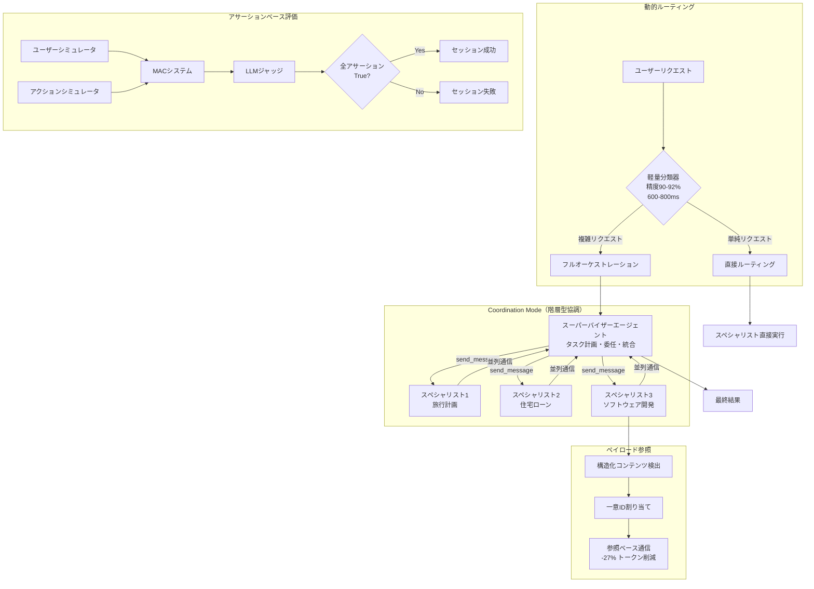

# Towards Effective GenAI Multi-Agent Collaboration: Design and Evaluation for Enterprise Applications

- **Link**: https://arxiv.org/abs/2412.05449
- **Authors**: Raphael Shu, Nilaksh Das, Michelle Yuan, Monica Sunkara, Yi Zhang
- **Year**: 2024
- **Venue**: arXiv preprint (AWS Bedrock Agents Technical Report)
- **Type**: Academic Paper (System Design / Evaluation)

## Abstract

The paper evaluates multi-agent systems using LLMs, focusing on coordination and routing protocols. Key findings include that multi-agent collaboration enhances goal success rates by up to 70% compared to single-agent approaches, payload referencing improves code-task performance by 23%, and routing mechanisms reduce latency. The authors benchmark on enterprise scenarios across three domains.

## Abstract（日本語訳）

本論文はLLMを使用したマルチエージェントシステムを評価し、協調・ルーティングプロトコルに焦点を当てている。主要な発見として、マルチエージェント協調が単一エージェントアプローチと比較してゴール成功率を最大70%向上させること、ペイロード参照がコードタスクの性能を23%改善すること、ルーティングメカニズムがレイテンシを削減することが含まれる。著者らは3つのドメインにわたるエンタープライズシナリオでベンチマークを実施している。

## 概要

本論文は、AWS Bedrock Agentsチームによるマルチエージェント協調（MAC: Multi-Agent Collaboration）フレームワークの設計と評価に関する技術レポートである。エンタープライズアプリケーションにおける実用的なマルチエージェントシステムの構築指針を提供する。

主要な貢献は以下の通り：

1. **階層型協調モデル**: スーパーバイザー・スペシャリスト構造による集中型マルチエージェント協調の設計と実装
2. **ペイロード参照メカニズム**: 大規模コンテンツ（特にコードスニペット）の効率的な交換のための参照ベースの通信最適化
3. **動的エージェントルーティング**: 軽量分類器によるリクエストの直接ルーティングとフルオーケストレーションの振り分け
4. **アサーションベース評価フレームワーク**: ゴールドトラスジェクトリに依存しない、ドメイン固有のアサーションに基づく自動評価手法
5. **90シナリオベンチマーク**: 旅行計画、住宅ローン、ソフトウェア開発の3ドメイン各30シナリオの公開ベンチマーク

Claude 3.5 Sonnetを使用した実験で、MAC全体のGoal Success Rate（GSR）90%を達成し、単一エージェントのベースライン（53-80%）を大幅に上回った。

## 問題と動機

- **複雑なエンタープライズタスクへの対応**: 旅行計画、住宅ローン申請、ソフトウェア開発など、複数の専門領域にまたがるタスクは単一エージェントでは効率的に処理できない
- **エージェント間通信の効率性**: 特にコードスニペット等の大規模構造化コンテンツの交換において、通信オーバーヘッドが性能ボトルネック
- **評価手法の標準化不足**: 既存のマルチエージェントシステム評価は固定的なゴールドトラスジェクトリに依存しており、柔軟性に欠ける
- **ルーティングの最適化**: 全てのリクエストでフルオーケストレーション（スーパーバイザー経由）を行うとレイテンシが増大、単純なリクエストには不要
- **エンタープライズ環境での実用性**: 学術的なマルチエージェント研究と実際のビジネスアプリケーション要件（レイテンシ、信頼性、スケーラビリティ）のギャップ

## 提案手法

### 1. 階層型協調モデル（Coordination Mode）

スーパーバイザーエージェントがスペシャリストエージェントを管理する木構造：

- **スーパーバイザーエージェント**: タスク計画、スペシャリストへの委任、結果統合を担当
- **スペシャリストエージェント**: 各専門ドメインに特化したタスク実行
- **多層階層サポート**: エージェントがスペシャリストとスーパーバイザーを同時に兼務可能、深い委任チェーンを実現

通信は `send_message` ツールを通じた関数呼び出しインターフェースで統一：

$$\text{send\_message}(\text{recipient}, \text{message}, \text{context})$$

ユーザーもエージェントとして扱う統一インターフェースにより、一貫した通信プロトコルを実現。スーパーバイザーは複数スペシャリストと並列に通信可能。

### 2. ペイロード参照メカニズム（Payload Referencing）

大規模構造化コンテンツの効率的交換のための最適化：

1. **構造化コンテンツブロックの検出**: コードスニペット等の大規模コンテンツを自動識別
2. **一意識別子の割り当て**: 各ペイロードにユニークIDを付与
3. **参照ベースの通信**: スーパーバイザーがペイロードを再生成する代わりに参照IDで指定
4. **通信オーバーヘッドの削減**: 平均トークン数の27%相対削減

効果の定量化：

$$\text{Token削減率} = 1 - \frac{\text{参照使用時の平均トークン数}}{\text{参照なしの平均トークン数}} \approx 27\%$$

### 3. 動的エージェントルーティング（Routing Mode）

軽量分類器によるリクエストの振り分け：

- **フルオーケストレーション**: 複雑なリクエスト→スーパーバイザー経由でマルチエージェント処理
- **直接ルーティング**: 単純なリクエスト→適切なスペシャリストに直接転送

分類性能：
- 精度: 90-92%
- 誤エージェント切替率: 0-3%
- ターンレベルルーティングオーバーヘッド: 600-800ms

### 4. アサーションベース評価フレームワーク

従来のゴールドトラスジェクトリに代わる柔軟な評価手法：

**3つの評価コンポーネント**:
1. **ベンチマークデータ**: シナリオ記述、初期問題、アサーションリスト
2. **シミュレーション**: ユーザーシミュレータとアクションシミュレータがMACシステムと対話
3. **自動判定**: LLMジャッジがアサーション準拠を評価

**アサーション型**:
- **ユーザーサイド**: ユーザー視点から観測可能なシステム挙動
- **システムサイド**: 内部エージェント挙動とツール正確性

**成功確率の定義**:

$$\mathbb{E}[X_u^s] = p_{\text{success}}$$

セッションは全アサーションがTrueと評価された場合に成功と判定。

## アルゴリズム（疑似コード）

```
Algorithm: Multi-Agent Collaboration (Coordination Mode)
Input: ユーザーリクエスト R, スーパーバイザー SV, スペシャリスト集合 {SP_1, ..., SP_n}
Output: タスク実行結果

1: // Phase 1: ルーティング判定
2: route_type ← Classifier.classify(R)
3: if route_type == "direct" then
4:     target ← Classifier.select_specialist(R)
5:     return SP_target.execute(R)
6: end if
7:
8: // Phase 2: スーパーバイザーによるタスク計画
9: plan ← SV.plan(R)
10: subtasks ← SV.decompose(plan)
11:
12: // Phase 3: スペシャリストへの委任（並列可能）
13: results ← {}
14: for each subtask in subtasks do  // 並列実行可能
15:     specialist ← SV.select_specialist(subtask)
16:     response ← send_message(specialist, subtask)
17:
18:     // ペイロード参照の適用
19:     if contains_structured_content(response) then
20:         payload_id ← register_payload(response.content)
21:         response.content ← payload_ref(payload_id)
22:     end if
23:
24:     results[subtask] ← response
25: end for
26:
27: // Phase 4: 結果統合
28: final_result ← SV.synthesize(results)
29: return final_result

Algorithm: Assertion-Based Evaluation
Input: シナリオ S, アサーション集合 {a_1, ..., a_m}, MACシステム
Output: Goal Success Rate (GSR)

1: user_sim ← UserSimulator(S)
2: action_sim ← ActionSimulator(S)
3:
4: // シミュレーション実行
5: conversation ← []
6: while not user_sim.is_done() do
7:     user_msg ← user_sim.generate()
8:     system_response ← MAC.process(user_msg)
9:     action_result ← action_sim.execute(system_response.actions)
10:    conversation.append(user_msg, system_response, action_result)
11: end while
12:
13: // アサーション評価
14: success ← True
15: for each assertion a in {a_1, ..., a_m} do
16:     result ← LLM_Judge.evaluate(a, conversation)
17:     if result == False then
18:         success ← False
19:     end if
20: end for
21:
22: return success
```

## アーキテクチャ / プロセスフロー



## Figures & Tables

### Table 1: ドメイン別Goal Success Rate（GSR）比較

| 構成 | 旅行計画 | 住宅ローン | ソフトウェア開発 | 全体 |
|------|---------|-----------|---------------|------|
| MAC（Claude 3.5 Sonnet） | ~90% | ~90% | ~90% | **90%** |
| 単一エージェント | ~80% | ~73% | ~53% | 53-80% |
| MAC（Sonnet 3.5/3.0混合） | - | - | - | 77-90% |
| オープンソースフレームワーク（Claude） | - | - | - | 40-63% |
| オープンソースフレームワーク（GPT-4o mini） | - | - | - | 33-77% |

ソフトウェア開発ドメインで最大37%の改善（53%→90%）。

### Table 2: ペイロード参照の効果（ソフトウェア開発ドメイン）

| メトリック | 参照なし | 参照あり | 改善 |
|-----------|---------|---------|------|
| Goal Success Rate | ベースライン | +23%相対改善 | +23% |
| 通信オーバーヘッド | ベースライン | -27%相対削減 | -27% |
| 通信あたり出力トークン | ベースライン | -30%削減 | -30% |

### Table 3: 自動評価と人間評価の一致率

| ドメイン | 全体一致率 | スーパーバイザーGSR一致率 |
|---------|-----------|----------------------|
| 旅行計画 | **93%** | 高い |
| 住宅ローン | **87%** | 中程度 |
| ソフトウェア開発 | **97%** | 77% |

アサーションベース自動評価は人間ジャッジと85%以上の一致率を達成。

### Figure 1: レイテンシ分布（ドメイン別）

```
ドメイン別通信オーバーヘッド・ユーザー体感レイテンシ:
┌────────────────────────────────────────────────────────┐
│ 旅行計画                                                │
│ ├── 通信オーバーヘッド/ターン: 11-20秒                   │
│ └── ユーザー体感レイテンシ: 中程度                       │
├────────────────────────────────────────────────────────┤
│ 住宅ローン                                              │
│ ├── 通信オーバーヘッド/ターン: 15-30秒                   │
│ └── ユーザー体感レイテンシ: 中-高                       │
├────────────────────────────────────────────────────────┤
│ ソフトウェア開発                                         │
│ ├── 通信オーバーヘッド/ターン: 35-53秒                   │
│ └── ユーザー体感レイテンシ: 35-168秒（最高複雑度）       │
└────────────────────────────────────────────────────────┘

ルーティングモード:
├── 分類精度: 90-92%
├── 誤エージェント切替率: 0-3%
└── ターンレベルオーバーヘッド: 600-800ms
```

## 実験と評価

### 実験設定

- **モデル**: Claude 3.5 Sonnet（主要）、Claude 3.0 Sonnet（混合構成用）
- **プラットフォーム**: AWS Bedrock Agents
- **ドメイン**: 旅行計画、住宅ローン、ソフトウェア開発（各30シナリオ、計90シナリオ）
- **比較対象**: 単一エージェント、オープンソースタスク自動化フレームワーク

### ドメイン別タスク内容

**旅行計画（30シナリオ）**:
- フライト・ホテル予約
- イベント発見
- 予算計画

**住宅ローン（30シナリオ）**:
- ローン申請
- 物件クエリ
- 支払い計算

**ソフトウェア開発（30シナリオ）**:
- コード設計
- 実装
- テスト
- デプロイ

### 主要な結果

1. **GSR向上**: MACはClaude 3.5 Sonnetで全体90%のGSRを達成。単一エージェントの53-80%から最大70%の向上
2. **ペイロード参照の効果**: ソフトウェア開発ドメインでGSR 23%相対改善、通信オーバーヘッド27%削減、出力トークン30%削減
3. **ルーティング性能**: 分類精度90-92%、誤エージェント切替率0-3%
4. **評価フレームワークの信頼性**: 自動評価と人間ジャッジの一致率85%以上（旅行93%、住宅ローン87%、ソフトウェア97%）
5. **既存フレームワークとの比較**: オープンソースフレームワーク（40-63%/33-77%）を大幅に上回る

### レイテンシ分析

- ターンあたり通信オーバーヘッド: ドメイン・モデル構成に応じて11-53秒
- ソフトウェア開発が最高複雑度（35-168秒のユーザー体感レイテンシ）
- ルーティングモードのオーバーヘッド: 600-800ms（実用的範囲）

## 備考

- **AWS Bedrock Agents実装**: 本論文はAWS公式のマルチエージェント協調フレームワークの設計文書であり、クラウドサービスとしての実装が前提
- **ペイロード参照の実用性**: コードスニペット等の構造化コンテンツの参照ベース通信は、実際のソフトウェア開発ワークフローにおいて顕著な効果。将来的にはコード以外のコンテンツへの拡張が課題
- **アサーションベース評価の汎用性**: ゴールドトラスジェクトリに依存しないアサーション評価は、新ドメインへの迅速なベンチマーク構築を可能にし、プロトタイピング時間を大幅短縮
- **90シナリオベンチマークの公開**: 3ドメイン×30シナリオのベンチマーク公開は、マルチエージェントシステムの比較評価のための貴重なリソース
- **単一エージェントとの性能差**: 特にソフトウェア開発ドメインでの37%の改善は、タスクの複雑性が高いほどマルチエージェント協調の効果が顕著であることを示唆
- **レイテンシのトレードオフ**: GSR向上と引き換えにレイテンシが増大する問題は未解決。特にソフトウェア開発の168秒最大レイテンシは実用上の課題
- **分散型協調の未探索**: 現在は集中型（スーパーバイザー主導）のみ。分散型協調メカニズムは今後の研究方向として挙げられている
- **ベンチマーク規模**: 90シナリオは研究初期としては適切だが、より大規模・多様なシナリオでの検証が必要
