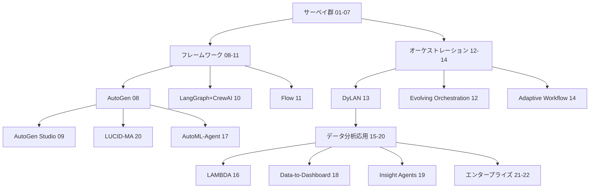

# Multi-Agent Workflow — 詳細レポート索引

LLMベースのマルチエージェント協調 & ワークフロー自動化に関する22本の学術論文の詳細レポート集。

- **入力元**: `resources-multi-agent-workflow.md`
- **生成日**: 2026-04-05
- **詳細レベル**: 詳細（200-400行/件）
- **優先セクション**: コア手法・技術詳細 / 問題・動機

## 学術論文一覧

| # | 領域 | タイトル | 著者 | 年 | レポート |
|---|------|---------|------|-----|---------|
| 1 | サーベイ | Multi-Agent Collaboration Mechanisms: A Survey of LLMs | Tran et al. | 2025 | [01](01-multi-agent-collaboration-mechanisms.md) |
| 2 | サーベイ | LLM-based Multi-Agents: Progress and Challenges | Guo et al. | 2024 | [02](02-llm-multi-agents-progress-challenges.md) |
| 3 | サーベイ | LLM Multi-Agent Systems: Challenges and Open Problems | Han et al. | 2024 | [03](03-llm-mas-challenges-open-problems.md) |
| 4 | サーベイ | A Survey on LLM-based Multi-Agent System | Chen et al. | 2024 | [04](04-survey-llm-multi-agent-system.md) |
| 5 | サーベイ | LLM Agents for Statistics and Data Science | Sun et al. | 2025 | [05](05-survey-llm-agents-statistics.md) |
| 6 | サーベイ | LLM-Based Data Science Agents Survey | Rahman et al. | 2025 | [06](06-llm-data-science-agents-survey.md) |
| 7 | サーベイ | LLM-Based Multi-Agent Systems for Software Engineering | He et al. | 2024 | [07](07-llm-multi-agent-software-engineering.md) |
| 8 | フレームワーク | AutoGen | Wu et al. | 2023 | [08](08-autogen.md) |
| 9 | フレームワーク | AutoGen Studio | Dibia et al. | 2024 | [09](09-autogen-studio.md) |
| 10 | フレームワーク | LangGraph + CrewAI | Duan & Wang | 2024 | [10](10-langgraph-crewai.md) |
| 11 | フレームワーク | Flow: Modularized Agentic Workflow Automation | Niu et al. | 2025 | [11](11-flow-modularized-workflow.md) |
| 12 | オーケストレーション | Multi-Agent Collaboration via Evolving Orchestration | Dang et al. | 2025 | [12](12-evolving-orchestration.md) |
| 13 | オーケストレーション | Dynamic LLM-Powered Agent Network (DyLAN) | Liu et al. | 2024 | [13](13-dynamic-agent-network.md) |
| 14 | オーケストレーション | Adaptive Multi-Agent Reasoning via Workflow Generation | Sami et al. | 2025 | [14](14-adaptive-workflow-generation.md) |
| 15 | データ分析応用 | LLMs as Data Analysts: Multi-Agent Qualitative Analysis | Rasheed et al. | 2024 | [15](15-llm-data-analysts-multi-agent.md) |
| 16 | データ分析応用 | LAMBDA: Large Model Based Data Agent | Sun et al. | 2025 | [16](16-lambda-data-agent.md) |
| 17 | データ分析応用 | AutoML-Agent | Trirat et al. | 2025 | [17](17-automl-agent.md) |
| 18 | データ分析応用 | Data-to-Dashboard | Zhang & Elhamod | 2025 | [18](18-data-to-dashboard.md) |
| 19 | データ分析応用 | Insight Agents | Bai et al. | 2026 | [19](19-insight-agents.md) |
| 20 | データ分析応用 | AutoGen Driven Crime Data Analysis (LUCID-MA) | Fatima et al. | 2025 | [20](20-autogen-crime-data-analysis.md) |
| 21 | エンタープライズ | LLM and Agent-Driven Enterprise Data Analysis | Wang et al. | 2025 | [21](21-llm-agent-enterprise-data-analysis.md) |
| 22 | エンタープライズ | Effective GenAI Multi-Agent Collaboration | Shu et al. | 2024 | [22](22-effective-genai-multi-agent.md) |

## リソース間の関係マップ

**主要な系譜**:
- **AutoGen系列**: 08 (原著) → 09 (ノーコード) → 17/20 (応用)
- **役割分担パターン**: LAMBDA (16, Programmer/Inspector)、MetaGPT系 (07で言及)、Generator/Critic
- **動的構造**: DyLAN (13) → Evolving Orchestration (12) → Adaptive Workflow (14) と進化
- **エンタープライズ実装**: 21, 22 がセキュリティ・スケーラビリティを論じる

## 比較表

| # | アプローチ | 協調タイプ | 構造 | 動的性 | 主要評価 |
|---|-----------|-----------|------|--------|---------|
| 08 | AutoGen | 協力 | 会話型 | 静的 | 多様なタスク |
| 11 | Flow | 協力 | モジュール | 動的 (AOV) | ワークフロー自動化 |
| 12 | Evolving Orch | 協力 | パペティア | RL動的 | NeurIPS 2025 |
| 13 | DyLAN | 協力 | 階層動的 | 動的 | 推論タスク |
| 14 | Adaptive | 協力 | 自動生成 | 動的 | 適応推論 |
| 16 | LAMBDA | 協力 | 2エージェント | 静的 | データ分析 |
| 17 | AutoML-Agent | 協力 | パイプライン | 静的 | ML自動化 |
| 18 | Data-to-Dashboard | 協力 | モジュラー | リフレクション | BIダッシュボード |

## 主要な知見

1. **協力型が支配的**: 22本中ほぼ全てが協力 (Cooperation) 型を採用、競争・共競争は未開拓
2. **AutoGenがデファクト基盤**: 応用論文の多くがAutoGen上に構築
3. **動的オーケストレーションが新潮流**: 静的役割分担から、RL/グラフ/自動生成による動的構造へ
4. **データ分析応用の急増**: 2025年に LAMBDA, AutoML-Agent, Data-to-Dashboard, Insight Agents 等が集中
5. **共通課題**: カスケード幻覚、通信オーバーヘッド、信頼性・安全性メカニズムの欠如 (90%以上)

## 次のステップ

- 各レポートを参照し、設計パターンを抽出
- Agent Architecture クラスタ (`resources-agent-architecture.md`) の詳細レポート化
- 横断的なメタ分析レポートの作成
