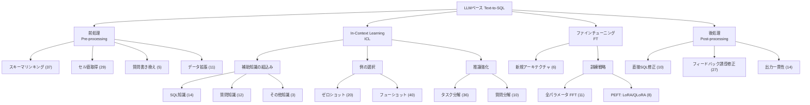
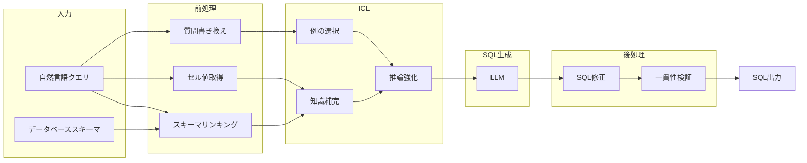
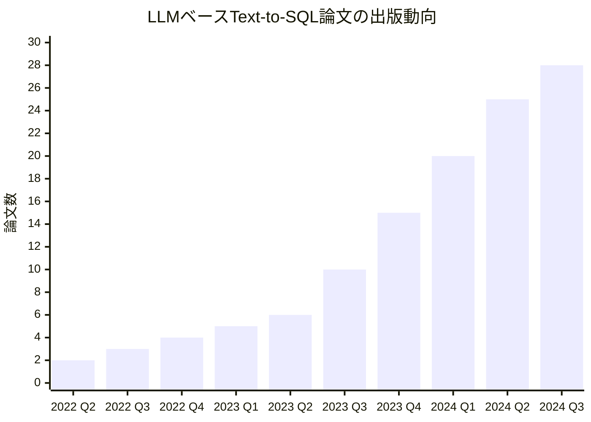

# Exploring the Landscape of Text-to-SQL with Large Language Models: Progresses, Challenges and Opportunities

- **Link**: https://arxiv.org/abs/2505.23838
- **Authors**: Yiming Huang, Jiyu Guo, Wenxin Mao, Cuiyun Gao, Peiyi Han, Chuanyi Liu, Qing Ling
- **Year**: 2025
- **Venue**: ACM Computing Surveys (CSUR) (投稿中, Report No. CSUR-2024-1154)
- **Type**: Academic Paper

## Abstract

Converting natural language (NL) questions into SQL queries, referred to as Text-to-SQL, has emerged as a pivotal technology for facilitating access to relational databases, especially for users without SQL knowledge. Recent advances in large language models (LLMs) have significantly enhanced natural language processing (NLP) systems, including Text-to-SQL. This survey systematically reviews (1) research trends in LLM-based Text-to-SQL approaches, (2) in-depth analysis of existing techniques across diverse perspectives, (3) summarization of datasets and evaluation metrics, and (4) discussion of obstacles and future exploration opportunities.

## Abstract（日本語訳）

自然言語（NL）の質問をSQLクエリに変換するText-to-SQLは、特にSQLの知識を持たないユーザーにとって、リレーショナルデータベースへのアクセスを容易にする重要な技術として台頭している。大規模言語モデル（LLM）の最近の進歩は、Text-to-SQLを含む自然言語処理（NLP）システムを大幅に強化した。本サーベイは、（1）LLMベースのText-to-SQLアプローチにおける研究動向、（2）多様な観点からの既存技術の詳細分析、（3）データセットと評価指標の体系的整理、（4）課題と将来の探索機会に関する議論、を体系的にレビューする。

## 概要

本論文は、2022年4月から2024年10月までに発表された122本の論文（うちLLMベース手法に関する92本）を対象とした、LLMベースText-to-SQLの包括的サーベイである。Text-to-SQLの技術進化を、ルールベース、ニューラルネットワークベース、事前学習モデル（PLM）ベース、LLMベースの4段階に整理し、LLM時代における手法を「前処理」「In-Context Learning（ICL）」「ファインチューニング（FT）」「後処理」の4つのパラダイムに分類する独自のフレームワークを提案している。各パラダイムの下にはスキーマリンキング、セル値取得、質問書き換え、データ拡張、知識補完、例選択、推論強化、モデルアーキテクチャ、訓練戦略、SQL修正、出力一貫性など多数のサブカテゴリが体系化されている。2023年9月以降の出版数の急増や、EMNLP・ACLへの集中的な投稿傾向など、研究コミュニティの動向も定量的に分析されている。LLM固有の課題としてモデル幻覚、制御不能な出力、高い計算資源要求を特定し、今後の研究方向として高品質データセット開発、プロンプトエンジニアリングの高度化、ドメイン横断適応性の向上を提示している。

## 問題設定

本論文は以下の問題に取り組んでいる：

- **LLMベースText-to-SQL研究の体系的整理の欠如**: LLMの急速な発展に伴い、Text-to-SQL関連の論文が急増しているが、多様な手法を統一的な視点で整理した包括的サーベイが不足していた。本論文は4つの研究質問（RQ1: 研究動向、RQ2: 手法分析、RQ3: データセット・評価指標、RQ4: 課題・将来方向）を設定し体系的にレビューする。
- **LLM固有の技術的課題**: LLMはゼロショット・フューショット学習で優れた性能を示す一方、（1）モデル幻覚（事実に反する情報の生成）、（2）確率的性質に起因する出力の非制御性、（3）特にファインチューニング時の高い計算・エネルギー資源要求、という3つの根本的課題を抱えている。
- **スキーマの複雑性と言語的多様性**: 大規模データベースにおけるスキーマの複雑さ、自然言語クエリの多様な表現パターン、自然言語とデータベース内容間の意味的曖昧性への対処が依然として困難である。

## 提案手法

### 分類体系 / フレームワーク

本サーベイは、LLMベースText-to-SQL手法を以下の4パラダイム・多層分類体系で整理している：

#### パラダイム1: 前処理（Pre-processing）

入力データの品質向上を目的とし、4つのサブカテゴリに分類される：

1. **スキーマリンキング**（37研究）: 自然言語の単語・フレーズをデータベース要素にマッピング。Chain-of-Thought推論（DIN-SQL）、ゼロショットランキング（C3）、セレクタベース分解（MAC-SQL）、マルチプロンプト（MCS-SQL）などの手法が含まれる。
2. **セル値取得**（29研究）: 関連するデータベース値を抽出。ランダム埋め込み（PET-SQL）、連続シーケンスマッチング（SQL-PaLM）、GloVe埋め込みによるコサイン類似度（DART-SQL）、BM25インデキシング（SEA-SQL, CodeS）等。
3. **質問書き換え**（5研究）: 自然言語クエリの簡素化・明確化。曖昧語識別（ReBoostSQL）、データベース整合的書き換え（DART-SQL, E-SQL）等。
4. **データ拡張**（11研究）: 合成データの半自動・全自動生成。双方向拡張（CodeS）、マルチタスク学習（StructLM）、クロスデータベース技法（DATAGPT-SQL）等。

#### パラダイム2: In-Context Learning（ICL）

3つのサブカテゴリで構成される：

1. **補助知識の組み込み**: SQLテンプレート・ガイドライン等のSQL知識（14研究）、埋め込みベース類似度等の質問知識（12研究）、ドメイン固有知識（3研究）。
2. **例の選択**: ゼロショットプロンプティング（20研究）とフューショットプロンプティング（40研究）。フューショットではランダム選択、類似度ベース、難易度ベース、ハイブリッド（静的＋動的）等の戦略がある。
3. **推論強化**: タスク分解（36研究）ではDIN-SQLの多段階パイプライン（スキーマリンキング→分類→SQL生成→自己修正）やC3のプロンプティング→校正→一貫性チェック等。質問分解（10研究）ではサブ問題への分割とCoTベース推論が含まれる。

#### パラダイム3: ファインチューニング（FT）

2つのサブカテゴリに分類：

1. **新規モデルアーキテクチャ**（6研究）: Jacobiデコーディング（CLLMs）、マルチエキスパート統合（CCoE）、文法誘導生成（ITERGEN）、知識蒸留（KID）、Mixture of Experts（MoMQ, SQL-GEN）。
2. **モデル訓練戦略**: 全パラメータ微調整（FFT, 11研究）とパラメータ効率的微調整（PEFT, 8研究、LoRA/QLoRA）。

#### パラダイム4: 後処理（Post-processing）

3つのカテゴリで構成：

1. **直接SQL修正**（10研究）: LLMが自律的に構文エラーを検出・修正。
2. **フィードバック誘導SQL修正**（27研究）: 外部フィードバック（実行結果等）を利用した反復改善。
3. **出力一貫性**（14研究）: 自己一貫性（13研究、複数生成パスの集約）とクロス一貫性（1研究、複数生成手法の統合）。

### 主要な知見

1. **出版動向**: 2023年9月以降に出版が急増し、2024年7月-10月で調査対象手法の39%が発表された。EMNLP（20本）とACL（16本）が主要会場であり、全体の40%がArXivプレプリントである。
2. **手法分布**: ICLパラダイムが最も活発（約60手法）で、前処理と後処理がそれぞれ約37手法、FTが約19手法。
3. **スキーマリンキングの重要性**: 前処理において最も多くの研究（37本）がスキーマリンキングに集中しており、正確なデータベース要素の特定がSQL生成品質の鍵であることを示す。
4. **フューショットの優位性**: ICLにおいてフューショットプロンプティング（40研究）がゼロショット（20研究）を大幅に上回り、適切な例の選択が性能向上に不可欠であることが確認された。
5. **フィードバック誘導修正の有効性**: 後処理において外部フィードバックを活用した修正（27研究）が直接修正（10研究）より多く採用されており、実行結果等の外部信号の活用が効果的であることが示された。

## Figures & Tables

### 表1: 出版会場の分布（122論文）

| 会場 | 論文数 | 割合 |
|------|--------|------|
| EMNLP | 20 | 16.4% |
| ACL | 16 | 13.1% |
| NeurIPS | 7 | 5.7% |
| NAACL | 4 | 3.3% |
| VLDB | 3 | 2.5% |
| ICML | 3 | 2.5% |
| ICLR | 3 | 2.5% |
| ArXiv（未出版） | 49 | 40.2% |
| その他（14会場） | 14 | 11.5% |
| **合計** | **122** | **100%** |

### 図1: LLMベースText-to-SQL手法の4パラダイム分類体系

### 表2: Text-to-SQLの技術進化の4段階

| 段階 | 代表手法 | 利点 | 課題 |
|------|----------|------|------|
| ルールベース | パターンマッチング、テンプレート | 高い解釈可能性 | 汎化性能が低い |
| ニューラルネットワークベース | Seq2Seq、Attention | 学習能力の向上 | 大量のラベル付きデータが必要 |
| PLMベース | BERT、T5 | 豊富な文脈理解 | 専門的なファインチューニングが必要 |
| LLMベース | GPT-4、Claude、Llama | 強力な生成能力、ゼロ/フューショット | 幻覚、出力制御困難、高計算資源 |

### 図2: 代表的なText-to-SQLパイプライン

### 表3: 主要な前処理手法の比較

| 手法名 | サブカテゴリ | 主要技術 | 特徴 |
|--------|-------------|----------|------|
| DIN-SQL | スキーマリンキング | Chain-of-Thought推論 | 多段階パイプラインで高精度 |
| C3 | スキーマリンキング | ゼロショットランキング | 追加学習不要 |
| MAC-SQL | スキーマリンキング | セレクタベース分解 | エージェント型アプローチ |
| MCS-SQL | スキーマリンキング | マルチプロンプト | 複数観点からの統合 |
| PET-SQL | セル値取得 | ランダム埋め込み | 汎用的な値マッチング |
| SQL-PaLM | セル値取得 | 連続シーケンスマッチング | 高精度な値特定 |
| DART-SQL | セル値取得/質問書き換え | GloVe + コサイン類似度 | 軽量かつ効果的 |
| CodeS | セル値取得/データ拡張 | BM25 + 双方向拡張 | 検索と拡張の統合 |
| ReBoostSQL | 質問書き換え | 曖昧語識別 | 入力品質の向上 |

### 表4: 研究質問（RQ）と調査対象のマッピング

| 研究質問 | 調査内容 | 対象論文数 |
|----------|----------|-----------|
| RQ1: 研究動向 | 出版日、会場、貢献タイプ | 122 |
| RQ2: 手法分析 | 4パラダイムの詳細分析 | 92 |
| RQ3: データセット・評価指標 | 公開データセット、評価手法 | 26（データセット）、7（指標） |
| RQ4: 課題・将来方向 | 技術的障壁、研究機会 | 全論文横断 |

### 図3: 出版動向の推移（2022年4月-2024年10月）

## 実験・評価

本論文はサーベイ論文であるため、独自の実験は行っていないが、調査対象論文群から以下の評価に関する知見を体系化している：

### 主要評価指標

- **Execution Accuracy（実行精度）**: 生成されたSQLの実行結果が正解と一致する割合。最も広く使用される指標。
- **Exact Match（完全一致）**: 生成SQLと正解SQLが構文的に完全一致する割合。厳格だが、意味的に等価な異なるSQL表現を評価できない。
- **テキスト埋め込みスコアリング**: 意味的類似度に基づく評価。
- **ASTベース比較**: 抽象構文木の構造的等価性に基づく評価。

### パラダイム別の傾向

- **ICLパラダイムの優勢**: 約60手法が分類され、最も活発な研究領域。特にフューショットプロンプティングと推論強化（タスク分解）の組み合わせが高い性能を示す。
- **後処理の重要性**: フィードバック誘導修正（27研究）が直接修正（10研究）を大きく上回り、実行結果による反復改善の有効性が実証されている。
- **自己一貫性の広い採用**: 出力一貫性の13/14研究が自己一貫性（複数パスの多数決）を採用しており、デファクト標準となっている。

### データセットの動向

- 調査期間中に26本の新規データセットが発表。
- 公開・オープンソースのデータセットのみを調査対象としている。
- Spiderが引き続き主要ベンチマークとして機能している。

## 備考

- **調査規模と網羅性**: 122本の論文を体系的に分析した大規模サーベイであり、Web of Science、ScienceDirect、ACM Digital Library、IEEEXplore、Google Scholarの5つのデータベースを横断検索している。検索キーワードは「Text-to-SQL」「Text2SQL」「Natural Language-to-SQL」「NL2SQL」「SQL Generation」。
- **LLM採用の理由**: 本論文はLLMベース手法を採用する3つの理由を明示的に述べている。（1）多様なクエリ構造に対する言語的変動性へのロバスト性、（2）最小限の再学習での拡張されたドメイン汎化能力、（3）継続的なイノベーションを伴う次世代トレンドとしてのポジション。
- **カバー範囲の限界**: 調査期間が2024年10月までであるため、2024年後半から2025年にかけてのGPT-4o、Claude 3.5 Sonnet等の最新モデルを活用した手法は含まれていない可能性がある。
- **関連サーベイとの差別化**: ACM Computing Surveys投稿論文として、他のArXivプレプリントサーベイと比較してより厳密な体系的文献レビュー手法を採用している点が特徴的である。
- **実務への示唆**: 4パラダイムの分類はText-to-SQLシステムの設計・実装時の技術選択ガイドとして実用的に活用可能であり、特にICLパラダイムのフューショットプロンプティングと後処理のフィードバック誘導修正の組み合わせが、追加学習なしで高い性能を実現するための推奨構成として示唆される。
