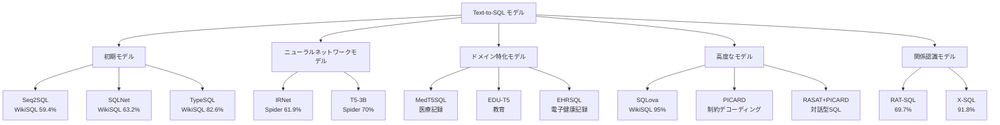
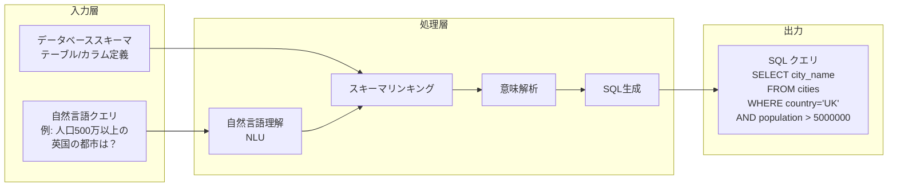
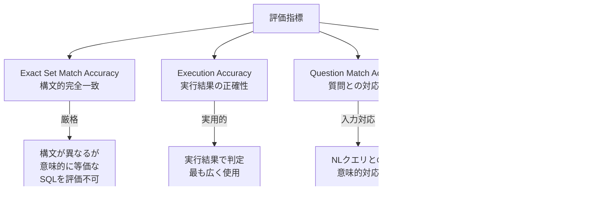

# A Survey of Large Language Model-Based Generative AI for Text-to-SQL: Benchmarks, Applications, Use Cases, and Challenges

- **Link**: https://arxiv.org/abs/2412.05208
- **Authors**: Aditi Singh, Akash Shetty, Abul Ehtesham, Saket Kumar, Tala Talaei Khoei
- **Year**: 2024
- **Venue**: arXiv preprint (Computer Science - Artificial Intelligence, Databases)
- **Type**: Academic Paper

## Abstract

Text-to-SQL systems facilitate smooth interaction with databases by translating natural language queries into Structured Query Language (SQL), bridging the gap between non-technical users and complex database management systems. This survey provides a comprehensive overview of the evolution of AI-driven text-to-SQL systems, highlighting their foundational components, advancements in large language model (LLM) architectures, and the critical role of datasets such as Spider, WikiSQL, and CoSQL in driving progress. We examine the applications of text-to-SQL in domains like healthcare, education, and finance, emphasizing their transformative potential for improving data accessibility. Additionally, we analyze persistent challenges, including domain generalization, query optimization, support for multi-turn conversational interactions, and the limited availability of datasets tailored for NoSQL databases and dynamic real-world scenarios. To address these challenges, we outline future research directions, such as extending text-to-SQL capabilities to support NoSQL databases, designing datasets for dynamic multi-turn interactions, and optimizing systems for real-world scalability and robustness. By surveying current advancements and identifying key gaps, this paper aims to guide the next generation of research and applications in LLM-based text-to-SQL systems.

## Abstract（日本語訳）

Text-to-SQLシステムは、自然言語クエリをStructured Query Language（SQL）に変換することで、非技術者と複雑なデータベース管理システムとの橋渡しをし、データベースとのスムーズなインタラクションを実現する。本サーベイは、AIドリブンなText-to-SQLシステムの進化について包括的な概要を提供し、基盤となるコンポーネント、大規模言語モデル（LLM）アーキテクチャの進歩、およびSpider、WikiSQL、CoSQL等のデータセットが進歩を牽引する重要な役割を強調する。ヘルスケア、教育、金融等のドメインにおけるText-to-SQLの応用を検討し、データアクセシビリティ向上のための変革的可能性を強調する。さらに、ドメイン汎化、クエリ最適化、マルチターン会話インタラクションのサポート、NoSQLデータベースや動的な実世界シナリオに特化したデータセットの限定的な利用可能性など、持続的な課題を分析する。これらの課題に対処するため、NoSQLデータベースサポートへのText-to-SQL機能の拡張、動的マルチターンインタラクション用データセットの設計、実世界のスケーラビリティとロバスト性のためのシステム最適化など、将来の研究方向を概説する。

## 概要

本論文は、LLMベースのText-to-SQLシステムに関する包括的サーベイであり、特にベンチマーク、実用アプリケーション、ユースケース、課題の4つの軸から体系的にまとめている。Text-to-SQLの基盤技術として自然言語理解（NLU）、スキーマリンキング、意味解析、SQL生成の4コンポーネントを定義し、各コンポーネントの技術的詳細を解説している。Seq2SQLからSQLNet、TypeSQL、IRNet、RAT-SQL、SQLova、X-SQLに至るモデルの進化を時系列で追跡し、各モデルの精度をWikiSQL・Spiderベンチマークで比較している。Spider 2.0やBIRDなどの最新データセットの特徴を詳述し、特にNoSQLデータベース向けデータセットの完全な欠如を重大なギャップとして特定している。ヘルスケア（MedT5SQL）、教育（EDU-T5）、金融における業界固有の応用事例を分析し、各ドメインの固有課題と利点を整理している。LinkedInのSQL Botをマルチエージェントシステムの実世界応用例として紹介している点も特筆に値する。

## 問題設定

本論文は以下の問題に取り組んでいる：

- **非技術者のデータベースアクセス障壁**: SQL知識を持たないユーザーにとって、リレーショナルデータベースの操作は依然として高い技術的障壁がある。Text-to-SQLは自然言語クエリを通じてこの障壁を解消する技術であるが、汎用AIモデル（ChatGPT等）では構文的正確性、ドメイン固有の最適化、効率性の面で専門的Text-to-SQLソリューションに劣る。
- **ドメイン横断汎化の困難さ**: 既存モデルは特定のデータベーススキーマ・業界に過適合する傾向があり、未知のスキーマや業界への適応が困難である。特にヘルスケア、金融、教育の各ドメインでは固有の用語体系やデータ構造が存在し、統一的な汎化が課題となる。
- **NoSQLデータベースへの対応の欠如**: 既存のベンチマークと手法はほぼ全てリレーショナルSQL向けであり、MongoDB、Cassandra、Redis等のNoSQLデータベースに対応するモデルもデータセットも存在しない。金融やeコマース等でNoSQLの採用が進む中、この空白は重大な実用上の制約となっている。
- **マルチターン対話サポートの不十分さ**: 実世界では対話的な反復クエリが一般的であるが、多くのモデルは単一ターンの質問にのみ対応しており、文脈維持や参照解決を含むマルチターン対話への対応が不十分である。

## 提案手法

### 分類体系 / フレームワーク

本サーベイは以下のフレームワークでText-to-SQLの全体像を整理している：

#### 基盤コンポーネント（4層構造）

1. **自然言語理解（NLU）**: トークン化、品詞タグ付け、構文解析により自然言語クエリの構造を把握する。
2. **スキーマリンキング**: NLクエリの要素をデータベーススキーマのテーブル名・カラム名にマッピングする。正確なリンキングがSQL生成品質の基盤となる。
3. **意味解析**: 自然言語を中間論理形式に変換する。IRNet等のグラフエンコーダによる中間表現が含まれる。
4. **SQL生成**: 論理形式から実行可能なSQLクエリを生成する最終段階。

#### モデル進化の階層分類

1. **初期モデル**: Seq2SQL（Seq-to-Seq＋強化学習、WikiSQL 59.4%）、SQLNet（スケッチベース＋カラムアテンション、63.2%）、TypeSQL（型認識ニューラルネット、82.6%）
2. **ニューラルネットワークモデル**: IRNet（グラフエンコーダ＋中間表現、Spider 61.9%）、T5-3B（ファインチューニングTransformer、70%）
3. **ドメイン特化モデル**: MedT5SQL（医療記録）、EDU-T5（教育）、EHRSQL（電子健康記録）
4. **高度なモデル**: SQLova（BERT＋カラムアテンション、WikiSQL 95%）、RAT-SQL（関係認識Transformer、69.7%）、X-SQL（BERT＋コンテキスト、91.8%）
5. **制約付きデコーディング**: PICARD（構文的に有効なSQL出力を保証）、RASAT（関係認識自己注意＋T5）

### 主要な知見

1. **専門モデルの優位性**: 汎用LLM（ChatGPT等）よりも、Text-to-SQL専用に設計されたモデルの方が構文正確性、ドメイン最適化、実行効率の全てにおいて優れている。
2. **データセットの進化**: WikiSQL（単純クエリ、8万ペア）からSpider（複雑クエリ、クロスドメイン）、さらにSpider 2.0（企業実世界ワークフロー、632タスク）やBIRD（ダーティデータ、12,751ペア、33.4GB）へと、現実性と複雑性が大幅に向上している。
3. **NoSQLの空白**: 調査した全データセットにおいてNoSQL対応のものが皆無であり、これは業界のデータベース採用動向との重大な乖離を示す。
4. **マルチエージェントの実用化**: LinkedInのSQL Bot（LangChain/LangGraph活用）が、自然言語からSQLへの変換を組織的に実用化した代表事例として紹介されている。

## Figures & Tables

### 表1: Text-to-SQLモデルの性能比較

| モデル | データセット | 訓練手法 | 精度 |
|--------|------------|----------|------|
| Seq2SQL | WikiSQL | Seq-to-Seq + 強化学習 | 59.4% |
| SQLNet | WikiSQL | スケッチベース + カラムアテンション | 63.2% |
| TypeSQL | WikiSQL | 型認識ニューラルネット | 82.6% |
| IRNet | Spider | グラフエンコーダ + 中間表現 | 61.9% |
| T5-3B | Spider/CoSQL | ファインチューニングTransformer | 70.0% |
| RAT-SQL | WikiSQL/Spider | 関係認識Transformer | 69.7% |
| SQLova | WikiSQL | BERT + カラムアテンション | 95.0% |
| X-SQL | WikiSQL | BERT + コンテキスト | 91.8% |
| RASAT+PICARD | CoSQL | 関係認識 + 制約デコーディング | 37.4% (IEX) |
| MedT5SQL | MIMICSQL | BERT + LSTM | 高精度（医療） |
| EDU-T5 | 教育データ | ファインチューニングT5 | 最適化済 |

### 図1: Text-to-SQLモデルの階層分類

### 表2: 主要ベンチマークデータセットの比較

| データセット | 規模 | ドメイン | 言語 | 特徴 | 年 |
|-------------|------|---------|------|------|-----|
| WikiSQL | 80,000+ペア | クロスドメイン | 英語 | 単一テーブル、単純クエリ | 2017 |
| Spider | 大規模 | クロスドメイン | 英語 | 複雑クエリ、JOIN/ネスト対応 | 2018 |
| CoSQL | 30,000+ターン | クロスドメイン | 英語 | 対話型、138ドメイン、200 DB | 2019 |
| CSpider | 10,181質問 | クロスドメイン | 中国語 | Spider中国語版、200 DB | - |
| BIRD | 12,751ペア | 37専門領域 | 英語 | 95 DB、33.4GB、ダーティデータ | 2023 |
| Spider 2.0 | 632ワークフロー | 企業実世界 | 英語 | BigQuery/Snowflake、1,000+列 | - |
| UNITE | 120,000+例 | 統合 | 英語 | 18データセット統合、29,000 DB | - |
| MIMICSQL | 医療特化 | 医療 | 英語 | 患者記録、臨床データ | - |

### 図2: Text-to-SQLシステムの処理パイプライン

### 表3: ドメイン別Text-to-SQL応用の課題と利点

| ドメイン | 主な課題 | 主な利点 |
|---------|---------|---------|
| **ヘルスケア** | 複雑なマルチテーブルスキーマ、医療用語、外部知識の統合、患者データのプライバシー | 患者記録アクセスの簡素化、エビデンスに基づく意思決定の迅速化、管理業務の自動化 |
| **教育** | 多様なデータ形式、クエリの曖昧性、マルチレベル適応 | 学業成績分析、個別学習支援、大規模データセットの処理 |
| **金融** | 多面的取引の複雑性、不正ルールの曖昧性、リアルタイム要件 | 不正検出の強化、リアルタイムインサイト、リスク管理の改善 |
| **一般** | ドメイン汎化、解釈可能性、デバッグ | 汎用SQL生成、アクセシビリティ向上、精度・効率の改善 |

### 表4: SQL vs NoSQLデータセットの利用可能性比較

| カテゴリ | 利用可能なデータセット | 状況 |
|---------|----------------------|------|
| リレーショナルSQL | Spider, Spider 2.0, WikiSQL, BIRD, CoSQL, UNITE等 | 豊富 |
| NoSQL | **なし** | 完全な空白 |
| 対話型SQL | CoSQL, SParC | 限定的 |
| ドメイン特化SQL | MIMICSQL（医療）, EDU-T5データ（教育） | 限定的 |

### 図3: 評価指標の関係性

## 実験・評価

本論文はサーベイ論文であり独自実験は含まないが、調査対象モデルの性能を横断的に分析している。

### WikiSQLベンチマークの進化

WikiSQLにおけるモデル精度の推移は、初期のSeq2SQL（59.4%）からSQLova（95.0%）まで大幅な向上を示している。特にBERTベースの事前学習表現とカラムアテンション機構の組み合わせ（SQLova）が最も高い精度を達成した。X-SQL（91.8%）もBERTスタイルのコンテキスト表現で優れた結果を示している。

### Spiderベンチマークの課題

Spiderベンチマークでは、複雑なクロスドメインクエリ（JOIN、ネスト、GROUP BY、HAVING等）への対応が求められるため、WikiSQLと比較して精度が大幅に低下する。IRNetは61.9%、T5-3Bは70.0%にとどまっている。

### Spider 2.0の実世界課題

Spider 2.0は632の実世界企業ワークフロー（1,000以上の列、100行を超えるマルチクエリ操作）を含み、BigQuery/Snowflakeでホストされている。従来ベンチマークとの大きな難易度の差は、実世界応用への移行における課題の大きさを示している。

### BIRDの新規性

BIRD（12,751ペア、95データベース、33.4GB）は37の専門ドメインを横断し、ダーティデータ（不完全・ノイズを含むデータ）への対応を評価する初のベンチマークとして、実用的な堅牢性の測定に貢献している。

### マルチターン対話評価

CoSQL（30,000以上の対話ターン、10,000以上の注釈付きクエリ、138ドメイン）は対話型SQL生成の代表的ベンチマークであり、RASAT+PICARDの組み合わせがInteraction Match（IEX）37.4%を達成している。この比較的低い数値は、マルチターン対話SQL生成の困難さを示している。

## 備考

- **NoSQLギャップの重要性**: 本論文の最も重要な貢献の一つは、NoSQLデータベース向けのText-to-SQLデータセット・モデルが完全に欠如していることの明示的な指摘である。MongoDB、Cassandra、Redis等のNoSQLデータベースは金融、eコマース、ソーシャルネットワークで広く使用されているにもかかわらず、この分野の研究は空白状態にある。
- **LinkedInのSQL Botの実用事例**: LangChain/LangGraphを活用したマルチエージェントシステムが、組織全体の従業員が自然言語でSQLクエリを実行できるようにした事例は、Text-to-SQLの産業応用の先進例として注目に値する。
- **制約付きデコーディングの重要性**: PICARD（Parsing Incrementally for Constrained Auto-Regressive Decoding）は、生成過程で構文的に無効なSQL出力を排除する手法であり、LLMの確率的生成の弱点を補完するアプローチとして実用的に重要である。
- **Human-in-the-Loopシステムの提案**: 完全自動化システムの限界を認め、ユーザーがSQL出力を検証・編集できるインタラクティブシステムの開発を将来方向として提案している点は、実運用を見据えた現実的な視点である。
- **ドメイン特化モデルの意義**: MedT5SQL（医療）やEDU-T5（教育）等のドメイン特化モデルの存在は、汎用モデルでは対応困難な専門用語・データ構造への対応において専用ファインチューニングが依然として有効であることを示している。
- **関連論文**: 本論文は01（Huang et al., 2025）の4パラダイム分類とは異なる、モデルアーキテクチャ進化の時系列的整理を提供しており、両者を補完的に参照することで全体像の理解が深まる。
