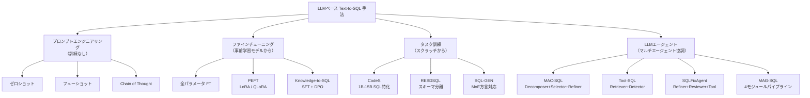
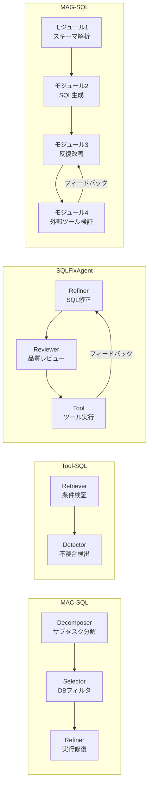

# Large Language Model Enhanced Text-to-SQL Generation: A Survey

- **Link**: https://arxiv.org/abs/2410.06011
- **Authors**: Xiaohu Zhu, Qian Li, Lizhen Cui, Yongkang Liu
- **Year**: 2024
- **Venue**: arXiv preprint (Computer Science - Databases, cs.DB)
- **Type**: Academic Paper

## Abstract

Text-to-SQL generation, which aims at converting natural language queries into SQL commands to interact with databases, is a fundamental task in natural language processing. This task essentially involves text generation, and its development has evolved alongside advancements in language models. Large Language Models (LLMs) have significantly enhanced the capabilities of text-to-SQL systems. In this survey, we classify the existing LLM-based text-to-SQL methods into prompt engineering, fine-tuning, pre-trained (task-training), and Agent groups according to their training strategies. We also provide a comprehensive summary of datasets and evaluation metrics used in text-to-SQL research.

## Abstract（日本語訳）

自然言語クエリをSQLコマンドに変換してデータベースとインタラクションするText-to-SQL生成は、自然言語処理における基本的なタスクである。このタスクは本質的にテキスト生成を含み、その発展は言語モデルの進歩とともに進化してきた。大規模言語モデル（LLM）はText-to-SQLシステムの能力を大幅に向上させた。本サーベイでは、既存のLLMベースText-to-SQL手法を訓練戦略に基づいて、プロンプトエンジニアリング、ファインチューニング、事前学習（タスク訓練）、およびエージェントの4グループに分類する。また、Text-to-SQL研究で使用されるデータセットと評価指標の包括的な要約を提供する。

## 概要

本論文は、LLMが強化するText-to-SQL生成に関するサーベイであり、1973年のLUNARシステムから現代のLLMアプローチに至るまでの歴史的文脈を踏まえつつ、訓練戦略に基づく4分類（プロンプトエンジニアリング、ファインチューニング、タスク訓練、エージェント）のフレームワークを提案している。40以上の手法を体系的にカタログ化し、各手法のバックボーンモデル、アクセス可能性、最適化戦略、クエリ生成戦略、ロバスト性メカニズム、使用データセット、評価指標、スキーマリンキング能力を横断的に比較している。30以上のデータセットを単一ドメイン、クロスドメイン、拡張の3カテゴリに分類し、4つの評価指標（EM、EX、VES、TS）を数式とともに厳密に定義している。Text-to-SQLが直面する5つの主要課題（単語分割・語義曖昧性、データベース規模・多様性、SQLクエリ複雑性、語用論的曖昧性、ロバスト性・効率性）を特定し、各課題に対する既存アプローチの対処状況を分析している。特にエージェントベースの手法（MAC-SQL、Tool-SQL、SQLFixAgent、MAG-SQL）の詳細な分析が本サーベイの特徴的な貢献である。

## 問題設定

本論文は以下の問題に取り組んでいる：

- **Text-to-SQLのテキスト生成問題としての定式化**: Text-to-SQLを条件付き確率 P(Y|Q,S) として形式的に定義し、入力クエリQとデータベーススキーマSから出力SQL Yを生成するシーケンス対シーケンス問題として捉える。エンコーダ-デコーダアーキテクチャの枠組みで各手法の位置づけを明確にしている。
- **単語分割と語義曖昧性の課題**: 中国語等のスペース区切りのない言語における単語分割の困難さと、多義語（例: "bank" = 金融機関 vs. 傾斜地）による意味解釈の曖昧性が、正確なSQL生成を阻害する根本的問題である。
- **データベース規模と多様性への対応**: 実世界のデータベースは数百のテーブルと複雑な関係を含み、スキーマ全体を単一のプロンプトに収容できない。命名規則の不統一（略語、"col1"、"data1"等の非直感的ラベル）やデータ型の異質性（日付: "2024-01-01" vs. "year2024"）も課題となる。
- **SQLクエリの複雑性**: マルチテーブルJOIN（外部キー推論が必要）、ネストされたサブクエリ（階層的推論が必要）、GROUP BY/HAVING/集約関数の組み合わせ、ドメイン固有のSQL関数（正規表現マッチング等）への対応が高い精度を阻む要因となっている。
- **ロバスト性と効率性の両立**: スペルミス、文法エラー、不完全な文に対する頑健性と、大規模データベースにおけるクエリ実行効率を同時に達成することが求められている。

## 提案手法

### 分類体系 / フレームワーク

本サーベイは、LLMベースText-to-SQL手法を訓練戦略に基づく以下の4カテゴリに分類する：

#### カテゴリ1: プロンプトエンジニアリング（訓練なし）

LLMの事前学習済み知識を活用し、追加の訓練を行わずにプロンプト設計のみでSQL生成を行う手法群。

1. **ゼロショット**: タスク例を提示せず直接プロンプティング。強力な事前学習モデルが前提。
2. **フューショット**: 2-8個の代表例を提示し、複雑なタスクで「著しく改善された性能を示す」。
3. **Chain of Thought（CoT）**: 「ステップバイステップで考えましょう」プロンプトにより多段階推論を活性化。

**代表手法**:
- **SC-prompt**: 構造段階（スケルトン生成）→内容段階（値埋め込み）の2段階アプローチ
- **MCS-SQL**: スキーマリンキング→並列SQL生成→回答選択の3フェーズ
- **SQL-PaLM**: 類似度と多様性のバランスを取ったデモ選択
- **DIN-SQL**: スキーマリンキング→分類→SQL生成→自己修正の多段階パイプライン（Spider 85.3%）

#### カテゴリ2: ファインチューニング（事前学習モデルからの訓練）

事前学習済みLLMの重みを更新することでタスク特化性能を向上させる手法群。

1. **全パラメータファインチューニング**: 全重みを更新。計算コストが高いが精度を最大化。
2. **パラメータ効率的ファインチューニング（PEFT）**: LoRA/QLoRAによりベースモデルを凍結し、アダプタ層のみを訓練。
3. **Knowledge-to-SQL**: 教師あり学習後にDirect Preference Optimization（DPO）を適用するハイブリッド手法。

#### カテゴリ3: タスク訓練（スクラッチからの訓練）

SQL生成に特化した事前学習を行う手法群。

- **CodeS**: SQL特化の事前学習を行ったオープンソース1B-15Bパラメータモデル群。
- **RESDSQL**: スキーマリンキングとスケルトン解析を分離（decouple）。
- **SQL-GEN**: Mixture of Experts（MoE）によりSQL方言固有のモジュールにルーティング。

#### カテゴリ4: LLMエージェント（マルチエージェント協調）

複数の専門エージェントが協調してSQL生成・修正を行う手法群。本サーベイの特に詳細な分析対象。

- **MAC-SQL**: 3エージェント構成 — Decomposer（サブタスク分解）、Selector（データベースフィルタリング）、Refiner（実行による修復）
- **Tool-SQL**: Retriever（条件検証）+ Detector（不整合検出）の2エージェント構成
- **SQLFixAgent**: 3エージェント協調 — Refiner（修正）、Reviewer（レビュー）、Tool（ツール実行）
- **MAG-SQL**: 4モジュールパイプライン — 反復生成と外部ツール改善の統合

### 主要な知見

1. **訓練戦略による性能特性の差異**: プロンプトエンジニアリングは追加訓練不要で迅速にデプロイ可能だが、ファインチューニングやタスク訓練はより高い精度を達成可能。エージェントベースは複雑なクエリに対する自己修正能力で優位。
2. **DIN-SQLの高性能**: Spider 85.3%、BIRD 55.9%の実行精度を達成し、多段階パイプライン（スキーマリンキング→分類→SQL生成→自己修正）の有効性を実証。
3. **エージェントベース手法の台頭**: MAC-SQL、Tool-SQL、SQLFixAgent、MAG-SQL等のマルチエージェント手法が、エラー検出・修正の自動化により複雑クエリへの対応力を向上させている。
4. **データセットの多様化**: 30以上のデータセットが存在するが、中国語（DuSQL、CSpider、CHASE）やダーティデータ（BIRD）、ロバスト性テスト（Spider-SYN、ADVETA）等の特化データセットの重要性が増している。
5. **評価指標の多面化**: EM（構文一致）とEX（実行結果一致）に加え、VES（実行効率）とTS（テストスイート精度）が導入され、実用性と意味的正確性の両面から評価が行われるようになった。

## Figures & Tables

### 表1: 主要データセットの統計情報

| データセット | 訓練 | 検証 | テスト | ターン | ドメイン | 言語 | 年 |
|-------------|------|------|--------|--------|---------|------|-----|
| ATIS | 4,473 | 497 | 448 | 単一 | 単一 | 英語 | 1990 |
| GeoQuery | - | - | 880 | 単一 | 単一 | 英語 | 1996 |
| Scholar | - | - | 816 | 単一 | 単一 | 英語 | - |
| WikiSQL | 56,355 | 8,421 | 15,878 | 単一 | 横断 | 英語 | 2017 |
| Spider | - | - | - | 単一 | 横断 | 英語 | 2018 |
| SParC | 9,025 | 1,203 | 2,498 | 複数 | 横断 | 英語 | 2018 |
| CoSQL | 2,164 | 292 | 551 | 複数 | 横断 | 英語 | 2019 |
| DuSQL | 18,602 | 2,039 | 3,156 | 単一 | 横断 | 中国語 | 2020 |
| KaggleDBQA | - | - | 272 | 単一 | 横断 | 英語 | 2021 |
| BIRD | 8,659 | 1,034 | 2,147 | 単一 | 横断 | 英語 | 2023 |
| EHRSQL | 5,124 | 1,163 | 1,167 | 複数 | 単一 | 英語 | 2023 |
| BEAVER | - | - | - | 単一 | 横断 | 英語 | 2024 |

### 図1: LLMベースText-to-SQL手法の訓練戦略分類

### 表2: 4つの評価指標の比較

| 指標 | 略称 | 評価対象 | 数式 | 特徴 |
|------|------|---------|------|------|
| Exact Matching Accuracy | EM | 構文的一致 | (1/N) Σ I(Yi_hat = Yi) | 厳格、同義SQL非対応 |
| Execution Accuracy | EX | 実行結果一致 | (1/N) Σ I(f(Qi,Si) = Ai) | 意味的評価、最も実用的 |
| Valid Efficiency Score | VES | 正確性 + 実行効率 | (1/N) Σ [I(Qi_gen = Qi_gold) · (T_gold/T_gen)] | 実行時間比率を考慮 |
| Test-Suite Accuracy | TS | 意味的正確性上限 | (1/N) Σ I(f(Qi,Di) = Ri) | 合成DB群で検証 |

### 図2: エージェントベース手法の比較アーキテクチャ

### 表3: Text-to-SQLの5つの主要課題

| 課題カテゴリ | 具体的問題 | 影響 | 対処手法例 |
|-------------|-----------|------|-----------|
| 単語分割・語義曖昧性 | 中国語の単語境界、多義語（"bank"等） | 意味解析の誤り | DuSQL、CSpider等の中国語データセット |
| データベース規模・多様性 | 数百テーブル、非直感的命名、データ型不統一 | スキーマリンキング失敗 | スキーマプルーニング、BM25インデキシング |
| SQLクエリ複雑性 | マルチJOIN、ネスト、GROUP BY/HAVING | 生成精度低下 | タスク分解、マルチエージェント |
| 語用論的曖昧性 | 文脈依存解釈、代名詞解決、省略 | マルチターンでのエラー蓄積 | CoSQL、SParCによる対話型学習 |
| ロバスト性・効率性 | スペルミス、文法エラー、大規模DB実行効率 | 実運用での信頼性低下 | Spider-SYN、ADVETA、VES指標 |

### 表4: 拡張・ロバスト性テスト用データセット

| データセット | ベース | テスト対象 | 特徴 |
|-------------|--------|-----------|------|
| Spider-SYN | Spider | 同義語置換 | スキーマリンキングのロバスト性 |
| Spider-DK | Spider | ドメイン知識 | 暗黙カラム、条件生成 |
| Spider-SS&CG | Spider | 複雑性段階 | スキーマ簡略化→複雑化 |
| Spider-Realistic | Spider | 実世界クエリ | 現実的な質問パターン |
| CSpider | Spider | 中国語 | 言語間語彙埋め込み課題 |
| TrustSQL | - | 回答不可能性 | 回答不能な質問への棄権能力 |
| ADVETA | - | テーブル摂動 | テーブル変更に対する頑健性 |

## 実験・評価

### 代表的ベンチマーク結果

本サーベイで収集された主要な実験結果は以下の通りである：

- **DIN-SQL**: Spiderデータセットで実行精度（EX）85.3%を達成。BIRDデータセットでは55.9%。多段階パイプライン（スキーマリンキング→分類→SQL生成→自己修正）の有効性を実証した代表的手法。
- **ChatGPT-4**: Spiderデータセットで「トップ性能」を達成したと報告されており、大規模LLMの直接活用の可能性を示す。
- **Spider vs. BIRD の精度差**: DIN-SQLにおけるSpider 85.3% vs. BIRD 55.9%の差（約30ポイント）は、BIRDが含むダーティデータ、外部知識要求、実世界の複雑性がText-to-SQLの精度に与える影響の大きさを定量的に示している。

### データセット特性の比較

- **Spider**: 200以上のデータベース、138ドメイン、平均5.1テーブル/データベース。クロスドメイン複雑クエリの標準ベンチマーク。
- **WikiSQL**: 80,654訓練例、26,521データベース。単一テーブル・単純クエリ中心。
- **BIRD**: ダーティデータと効率性課題を強調。難易度レベル（simple/moderate/challenging）を導入。
- **BEAVER（2024）**: 企業データウェアハウスの複雑性を反映した最新ベンチマーク。匿名化された実世界データを使用。

### 評価指標の実用的差異

- **EM vs. EX**: EMは構文的一致を要求するため、意味的に等価だが構文が異なるSQLを不正解と判定する。EXは実行結果で判定するためより実用的だが、偶然の一致リスクがある。
- **VES**: 正確性と実行効率の両方を考慮する唯一の指標。大規模データベースでの実運用を想定した評価に有用。
- **TS**: 多様な合成データベースに対してテストすることで、意味的正確性の上限を推定。コードカバレッジの観点からの評価。

## 備考

- **歴史的視座の広さ**: 1973年のLUNARシステムからの歴史を踏まえており、ルールベース→LSTM/Transformer→LLMという技術進化の文脈でLLMベース手法を位置づけている点が特徴的である。
- **形式的問題定義**: P(Y|Q,S) としての条件付き確率定義と、エンコーダ-デコーダアーキテクチャの枠組みを提示することで、各手法の理論的位置づけを明確にしている。他のサーベイ（01, 02）と比較してより形式的なアプローチをとっている。
- **エージェントベース手法の詳細分析**: MAC-SQL、Tool-SQL、SQLFixAgent、MAG-SQLの4つのエージェントベース手法を詳細に分析しており、この点が本サーベイの差別化要因となっている。特にSQLFixAgentの3エージェント協調（Refiner-Reviewer-Tool）の反復ループ構造は、自己修正能力の実現方法として参考になる。
- **VES指標の紹介**: Valid Efficiency Score（VES）は正確性と実行効率を統合した指標であり、BIRDデータセットとともに導入された比較的新しい評価基準である。大規模データベースでの実運用において、正確さだけでなく効率性も重要であるという認識を反映している。
- **ロバスト性データセットの体系化**: Spider-SYN、Spider-DK、Spider-SS&CG、Spider-Realistic、TrustSQL、ADVETA等のロバスト性テスト用データセットを体系的に整理しており、モデル評価の多角化に貢献している。
- **3つのサーベイの関係性**: 01（Huang et al., 2025）は4パラダイム（前処理/ICL/FT/後処理）、02（Singh et al., 2024）はモデルアーキテクチャ進化と応用ドメイン、本論文（03）は訓練戦略（プロンプト/FT/タスク訓練/エージェント）という異なる分類軸を提供しており、3論文を組み合わせることでText-to-SQL研究の多面的理解が可能となる。
