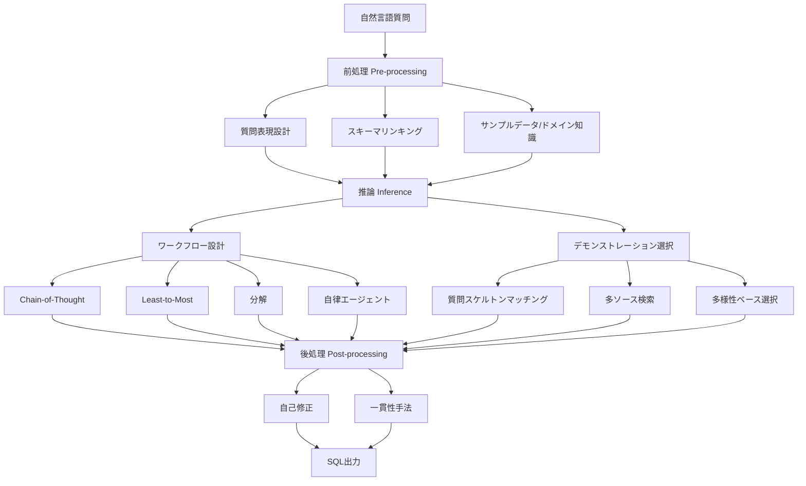
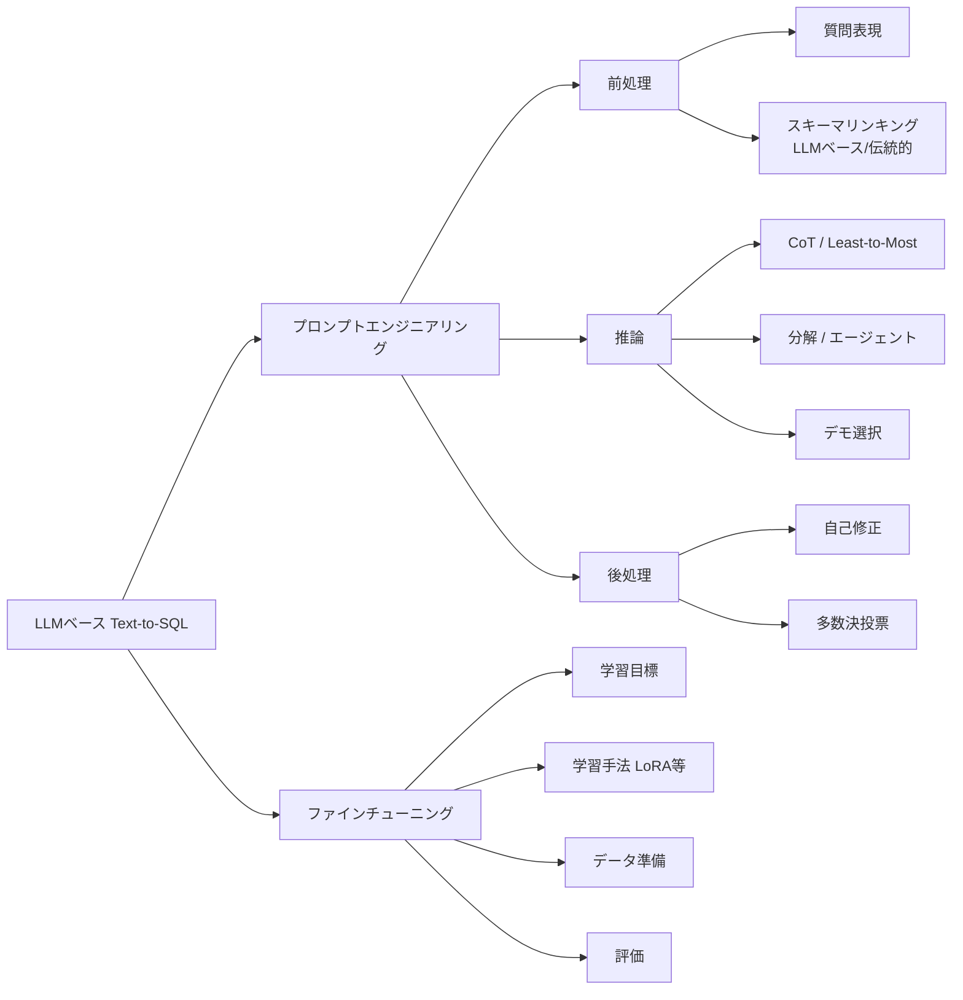

# A Survey on Employing Large Language Models for Text-to-SQL Tasks

- **Link**: https://arxiv.org/abs/2407.15186
- **Authors**: Liang Shi, Zhengju Tang, Nan Zhang, Xiaotong Zhang, Zhi Yang
- **Year**: 2024
- **Venue**: ACM Computing Surveys (CSUR)
- **Type**: Academic Paper

## Abstract

With the development of the Large Language Models (LLMs), a large range of LLM-based Text-to-SQL (Text2SQL) methods have emerged. This survey provides a comprehensive review of LLM-based Text2SQL studies. We first enumerate classic benchmarks and evaluation metrics. For the two mainstream methods, prompt engineering and finetuning, we introduce a comprehensive taxonomy and offer practical insights into each subcategory. We present an overall analysis of the above methods and various models evaluated on well-known datasets and extract some characteristics. Finally, we discuss the challenges and future directions in this field.

## Abstract（日本語訳）

大規模言語モデル（LLM）の発展に伴い、LLMベースのText-to-SQL（Text2SQL）手法が数多く登場している。本サーベイは、LLMベースのText2SQL研究を包括的にレビューする。まず、代表的なベンチマークと評価指標を列挙する。主流の2つの手法であるプロンプトエンジニアリングとファインチューニングについて、包括的な分類体系を導入し、各サブカテゴリに対する実践的な知見を提供する。上記の手法と、著名なデータセットで評価された各種モデルの全体的な分析を示し、いくつかの特性を抽出する。最後に、この分野における課題と将来の方向性について議論する。

## 概要

本論文は、LLMを用いたText-to-SQLタスクに関する包括的なサーベイである。Text-to-SQLとは、自然言語の質問をSQL文に変換するタスクであり、データベースへのアクセスを民主化する重要な技術である。本サーベイは、LLMベースの手法を「プロンプトエンジニアリング」と「ファインチューニング」の2大アプローチに分類し、それぞれについて体系的な分類法を提案している。プロンプトエンジニアリングは、前処理（質問表現・スキーマリンキング）、推論（ワークフロー設計・デモンストレーション選択）、後処理（自己修正・一貫性手法）の3段階に整理される。ベンチマークデータセットはPre-LLM時代（WikiSQL、Spider等）とLLM時代（BIRD、Spider 2.0等）に分類され、評価指標としてExact Match、Execution Accuracy、Test-suite Accuracy等が検討されている。GPT-4でもBIRDデータセットでの実行精度は54.89%に留まり、人間の92.96%との大きなギャップが存在することが明らかにされている。ドメイン知識の必要性やプライバシー問題、エンタープライズスキーマの複雑さなど、実用化に向けた課題も詳細に議論されている。

## 問題設定

本サーベイが取り組む主要な問題は以下の通りである。

- **LLMベースText-to-SQL手法の体系的整理の欠如**: LLMの急速な発展により多数の手法が提案されているが、プロンプトエンジニアリングとファインチューニングの両方を網羅的に分類・整理した研究が不足していた。本サーベイでは、前処理・推論・後処理の3段階に基づく包括的な分類体系を提案している。

- **ベンチマークと評価指標の整理不足**: Pre-LLM時代とLLM時代でベンチマークの特性が大きく異なるが、これらを統一的に整理し、各評価指標の長所・短所を明確にした研究が不足していた。

- **性能ギャップと実用化課題の明確化**: 最先端のLLMでもBIRDデータセットで約55%の精度に留まり、人間の性能（約93%）との間に大きなギャップが存在する。この課題の原因分析と解決の方向性を示すことが求められていた。

- **ロバスト性の不足**: 最もロバストなモデルでも、摂動テスト（Dr.Spider）において全体で14%、最も困難な摂動では50.7%の性能低下が報告されており、実用環境での信頼性が課題である。

## 提案手法

### 分類体系 / フレームワーク

本サーベイでは、LLMベースのText-to-SQL手法を以下の2大カテゴリに分類している。

**1. プロンプトエンジニアリング（3段階）**

- **前処理（Pre-processing）**: 質問表現の設計（OpenAIテンプレート vs CREATE TABLE形式）、スキーマリンキング（LLMベース vs 伝統的手法）、サンプルデータやドメイン知識の付与
- **推論（Inference）**: ワークフロー設計（Chain-of-Thought、Least-to-Most、分解、自律エージェント）、デモンストレーション選択（質問スケルトンマッチング、多ソース検索、多様性ベース選択）
- **後処理（Post-processing）**: 自己修正（スキーマ拡張、エラーログ統合、SQL Critic）、一貫性手法（多数決投票、Self-Consistency）

**2. ファインチューニング**

- 学習目標（直接SQL生成 + 中間ステップ補助目標）
- 学習手法（LoRA等のパラメータ効率的手法）
- データ準備（合成データ、拡張手法）
- 評価方法

### 主要な知見

1. **構造化レイアウトの優位性**: 「構造化レイアウトは非構造化レイアウトよりも優れており、異なる構造化レイアウト間では同等の性能を示す」ことが確認された。

2. **Chain-of-Thought/分解推論の主流化**: 「大部分の研究がChain-of-Thoughtまたは分解推論を基礎的なワークフローとして採用している」ことが明らかになった。

3. **質問スケルトンの有効性**: ドメイン固有の用語をマスクした質問スケルトンは、「元の質問よりも質問の意図をより効果的に捕捉できる」。

4. **後処理の安定化効果**: 後処理は「LLMベースText-to-SQL手法の性能と安定性を向上させる」。

5. **スキーマリンキングの重要性の変化**: 「モデルのSQL生成能力が向上するにつれて、無関係なカラムへの感度が低下し」、スキーマリンキングの重要性が経時的に減少する傾向がある。

## Figures & Tables

### Table 1: 主要ベンチマークデータセット比較

| データセット | 年 | 例数 | データベース数 | 特徴 |
|:---|:---:|---:|---:|:---|
| WikiSQL | 2017 | 80,654 | 24,241 | 単一テーブル、大規模 |
| Spider 1.0 | 2018 | 10,181 | 200 | 138ドメイン、クロスドメイン |
| CSpider | 2019 | 9,691 | - | 中国語翻訳版 |
| KaggleDBQA | 2021 | 272 | 8 | 実データベース |
| BIRD | 2023 | 12,751 | 95 | 33.4GB、ノイズ有り |
| Dr.Spider | 2023 | 15,000+ | - | 17種の摂動テスト |
| Spider 2.0 | 2024 | 600 | - | クラウド/ローカルDB |

### Table 2: 評価指標の比較

| 指標 | 略称 | 評価方法 | 長所 | 短所 |
|:---|:---:|:---|:---|:---|
| Exact Set Match | EM | SQL文字列比較 | 厳密な評価 | 過小評価の傾向 |
| Execution Accuracy | EX | 実行結果比較 | 実用的 | 過大評価の可能性 |
| Test-suite Accuracy | TS | テストスイート評価 | 網羅的 | テストスイート構築コスト |
| Valid Efficiency Score | VES | 実行効率含む | 効率性も評価 | 複雑な計算 |
| ESM+ | ESM+ | 拡張EM | JOIN等の改善ルール | 完全ではない |

### Figure 1: プロンプトエンジニアリングの3段階フレームワーク



### Figure 2: Text-to-SQL手法の全体分類体系



### Figure 3: BIRDデータセットにおける性能ギャップ

```
性能比較（Execution Accuracy on BIRD）

人間の性能:       ████████████████████████████████████████████████ 92.96%
GPT-4:           ███████████████████████████ 54.89%
                 |----|----|----|----|----|----|----|----|----|----|
                 0%   10%  20%  30%  40%  50%  60%  70%  80%  90% 100%

ギャップ: 38.07ポイント
→ LLMベース手法にはまだ大幅な改善余地がある
```

### Table 3: モデル分類と主要モデル

| カテゴリ | モデル | 特徴 |
|:---|:---|:---|
| クローズドソース | GPT-4, GPT-3.5, Codex, Claude | 高性能だがAPI依存 |
| オープンソース | LLaMA系, Mistral, CodeLLaMA | カスタマイズ可能、プライバシー保護 |

### Figure 4: ロバスト性テスト結果（Dr.Spider）

```
摂動タイプ別の性能低下率

全体平均:        ██████████████ 14%
最難摂動:        █████████████████████████████████████████████████ 50.7%
                 |----|----|----|----|----|----|
                 0%   10%  20%  30%  40%  50%  60%

→ 最もロバストなモデルでも摂動に対して脆弱
→ 実世界のノイズ・曖昧性への対応が急務
```

## 実験・評価

本サーベイでは、複数のベンチマークにおける各手法の性能を比較分析している。

**BIRDデータセットでの主要結果:**
- GPT-4のExecution Accuracy: 54.89%（人間: 92.96%）
- 性能ギャップ: 約38ポイント
- ドメイン固有のベンチマーク（天体物理学、政策立案、がん研究）では、Spiderで訓練されたモデルの性能が大幅に低下

**Dr.Spiderでのロバスト性評価:**
- 17種類の摂動テストを実施
- 最もロバストなモデルでも全体で14%の性能低下
- 最も困難な摂動では50.7%の性能低下

**スキーマリンキングに関する知見:**
- LLMベースの手法（C3のテーブル→カラム戦略）と伝統的手法（BERT/RoBERTaベースの類似度検索）の比較
- モデル能力の向上に伴いスキーマリンキングの重要性は相対的に低下

**ワークフロー設計の比較:**
- Chain-of-Thoughtと分解推論が基礎的ワークフローとして最も多く採用
- 自律エージェント（Spider-Agent等）は推論時間を延長するが、マルチターン対話による改善効果あり

**オープンソース vs クローズドソースモデル:**
- クローズドソースモデル（GPT-4）がプロンプトエンジニアリングで優位
- オープンソースモデル（CodeLLaMA等）はファインチューニングで競争力を発揮
- 近年、オープンソースモデルの採用が増加傾向

## 備考

- **実践的ガイドライン**: 構造化レイアウト（CREATE TABLE形式）の使用、3行程度のサンプルデータの付与、質問スケルトンによるデモンストレーション選択が推奨される。
- **コスト考慮**: プロンプトエンジニアリングはAPI呼び出しコストが発生するが、ファインチューニングは計算リソースが必要。トレードオフを考慮した手法選択が重要。
- **プライバシー問題**: データベーススキーマの外部API送信に伴うプライバシーリスクが実用化の障壁となっている。オープンソースモデルのファインチューニングが代替策となりうる。
- **将来の方向性**: 自律エージェント開発、ドメイン知識の統合、データガバナンス、コンテキストウィンドウを超える複雑なエンタープライズスキーマへの対応が重要課題として挙げられている。
- **急速な進化**: 手法の急速な進化により、ベンチマーク結果がすぐに陳腐化するため、継続的な評価が必要であると著者らは強調している。
