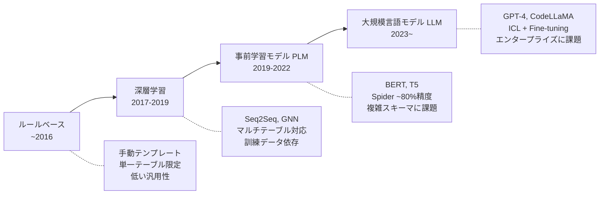
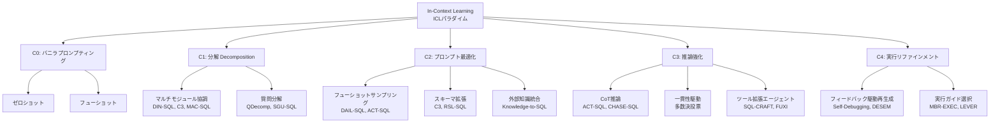
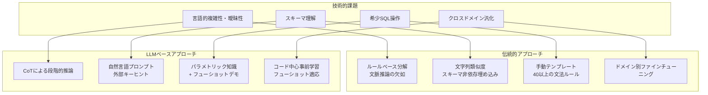
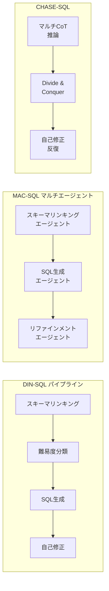

# Next-Generation Database Interfaces: A Survey of LLM-based Text-to-SQL

- **Link**: https://arxiv.org/abs/2406.08426
- **Authors**: Zijin Hong, Zheng Yuan, Qinggang Zhang, Hao Chen, Junnan Dong, Feiran Huang, Xiao Huang
- **Year**: 2024
- **Venue**: IEEE Transactions on Knowledge and Data Engineering (TKDE 2025)
- **Type**: Academic Paper

## Abstract

Generating accurate SQL from users' natural language questions remains a long-standing challenge. While traditional systems and pre-trained language models have made progress, they struggle with complex databases. Large language models offer new opportunities for this task. This survey comprehensively reviews LLM-based text-to-SQL approaches, covering technical challenges, datasets, metrics, and recent advances. The authors maintain a community repository with relevant research resources and open-source projects.

## Abstract（日本語訳）

ユーザーの自然言語質問から正確なSQLを生成することは、長年の課題であり続けている。従来のシステムや事前学習済み言語モデルは進歩を遂げてきたが、複雑なデータベースへの対応に苦戦している。大規模言語モデルはこのタスクに新たな機会を提供する。本サーベイは、LLMベースのText-to-SQLアプローチを包括的にレビューし、技術的課題、データセット、評価指標、最新の進歩を網羅する。著者らは関連する研究リソースとオープンソースプロジェクトを含むコミュニティリポジトリを維持している。

## 概要

本論文は、LLMベースのText-to-SQLに関する包括的なサーベイであり、自然言語データベースインタフェース（NLIDB）の次世代を展望するものである。SQLは最も広く使われるプログラミング言語の一つであり、プロ開発者の51.52%が使用しているが、非技術者にとってはアクセス障壁が高い。本サーベイは、ルールベース手法から深層学習、事前学習モデル、そしてLLMに至る進化の過程を整理し、LLMベースの手法をIn-Context Learning（ICL）とFine-Tuning（FT）の2大パラダイムに分類する。ICLはさらにC0（バニラプロンプティング）からC4（実行リファインメント）までの5カテゴリに体系化される。特に注目すべき知見として、最先端モデルでもエンタープライズタスク（Spider 2.0）では約21.3%の成功率に留まり、学術ベンチマークとの巨大なギャップが存在することが報告されている。計算効率、データプライバシー、解釈可能性など、実用化に向けた課題も詳細に議論されている。

## 問題設定

本サーベイが対象とする問題は以下の通りである。

- **言語的複雑性と曖昧性**: 自然言語にはネストされた節、共参照、曖昧な表現が含まれ、正確なSQL変換を困難にしている。例えば、同一の質問が複数の解釈を持ちうるケースが頻繁に発生する。

- **スキーマ理解の困難さ**: データベーススキーマは複雑であり、ドメインによって大きく異なる。テーブル間の関係、カラム名の意味、外部キーの構造などを正確に理解する必要がある。

- **希少・複雑なSQL操作**: ネストされたサブクエリ、外部結合、ウィンドウ関数などは訓練データに出現頻度が低く、モデルが正確に生成することが困難である。

- **クロスドメイン汎化**: あるドメインで訓練されたモデルが、別のドメインに移行した際に性能が大幅に低下する問題が存在する。

- **エンタープライズ環境との乖離**: 学術ベンチマークと実世界のエンタープライズデータベースとの間に巨大なギャップがあり、最先端モデルでもエンタープライズタスクでは約21.3%の成功率に留まっている。

## 提案手法

### 分類体系 / フレームワーク

本サーベイでは、LLMベースText-to-SQL手法を2大パラダイムに分類し、ICLについては5段階のカテゴリ体系を提案している。

**パラダイム1: In-Context Learning（ICL）**

ICLの一般的定式化: Y = pi(I, Q, S | theta)
- I: タスク指示、Q: ユーザー質問、S: データベーススキーマ/コンテンツ、pi: 凍結パラメータthetaのLLM

5つのカテゴリ:

- **C0: バニラプロンプティング**: ゼロショット（例示なし）とフューショット（k個の例示付き）。プロンプト設計が性能に大きく影響し、外部キーが効果的なスキーマ表現であることが判明。

- **C1: 分解（Decomposition）**: マルチモジュール協調（DIN-SQL: 4段階パイプライン、C3: 3モジュール、MAC-SQL/CHESS: マルチエージェント）と質問分解（QDecomp: Least-to-Most、SGU-SQL: グラフベース構造リンキング）。

- **C2: プロンプト最適化**: 高度なフューショットサンプリング（DAIL-SQL: ドメイン固有トークンのマスキング+ユークリッド距離ランキング）、スキーマ拡張（C3: 質問関連スキーマのフィルタリング）、外部知識統合。

- **C3: 推論強化**: Chain-of-Thought推論（ACT-SQL: CoT例の自動生成、CHASE-SQL: マルチパス推論）、一貫性駆動推論（多数決投票）、ツール拡張エージェント推論（SQL-CRAFT: Program-of-Thoughts、FUXI: 専用ツール）。

- **C4: 実行リファインメント**: フィードバック駆動再生成（Self-Debugging: NL説明による自律的エラー修正、DESEM: エラータイプ別プロンプト）、実行ガイド選択（MBR-EXEC: ベイズリスク最小化、LEVER: 検証器訓練）。

**パラダイム2: Fine-Tuning（FT）**

SFTの定式化: L_SFT = -sum log Pr(y_t | P, y<t)

4つのサブカテゴリ:
- **アーキテクチャ強化**: CLLMs等のSQL特化デコーディング
- **事前学習**: CodeLLaMA、StarCoder等のコード特化LLM、CodeSの3段階増分事前学習
- **データ拡張**: DAIL-SQLのサンプリング戦略、CodeSの双方向生成
- **マルチタスクチューニング**: DTS-SQLの2段階フレームワーク、SHAREの3逐次モデル

### 主要な知見

1. **パラダイムシフトの進行**: 孤立した改善から、複数の最適化戦略を統合するハイブリッドフレームワークへの移行が進んでいる。

2. **オープンソース vs プロプライエタリの非対称性**: GPT-4等のプロプライエタリLLMがICLで優位、オープンソースモデル（CodeLLaMA）はFTで力を発揮するという根本的な非対称性が存在する。

3. **データ品質の危機**: 「無から有を作る（Making bricks without straw）」現象として、訓練データの品質が洗練された手法よりもモデル性能を直接的に決定する。

4. **スケーラビリティギャップ**: エンタープライズデータベース（Spider 2.0）は巨大な能力ギャップを露呈し、最先端手法でも21.3%の成功率に留まる。

5. **ハイブリッドな未来**: 最適なアプローチはシンボリック検証（文法制約）とLLMの創造性を組み合わせ、プログラム合成の「生成→検証」パラダイムを反映するものとなる。

## Figures & Tables

### Figure 1: Text-to-SQL手法の進化タイムライン

### Table 1: 主要データセット比較

| データセット | 公開年 | 例数 | DB数 | 特徴カテゴリ |
|:---|:---:|---:|---:|:---|
| WikiSQL | 2017.8 | 80,654 | 26,521 | クロスドメイン |
| Spider | 2018.9 | 10,181 | 200 | クロスドメイン |
| Spider-SYN | - | - | - | ロバスト性（同義語置換） |
| Spider-DK | - | - | - | ドメイン知識拡張 |
| CSpider | - | - | - | クロスリンガル（中国語） |
| Dr. Spider | - | - | - | ロバスト性（17種摂動） |
| BIRD | 2023.5 | 12,751 | 95 | 知識拡張、ノイズデータ |
| Spider 2.0 | 2024.11 | 632 | 213 | 長コンテキスト、エンタープライズ |
| BULL | - | - | - | 特化ドメイン（金融） |

### Figure 2: ICL手法の5カテゴリ分類体系

### Table 2: ICL vs FTパラダイムの比較

| 観点 | ICL | Fine-Tuning |
|:---|:---|:---|
| 使用モデル | プロプライエタリLLM（GPT-4） | オープンソース（CodeLLaMA） |
| カスタマイズ性 | 低（プロンプト設計のみ） | 高（モデル重み更新） |
| 制御性 | 低い | 高い |
| 計算コスト | 推論時API呼び出し | 訓練時計算リソース |
| プライバシー | 外部APIにデータ送信 | ローカル実行可能 |
| 柔軟性 | 高い（即座に適応） | 低い（再訓練が必要） |
| 性能 | ベンチマーク上位 | 競争力あり（特化タスク） |
| 将来展望 | 動的適応の管理 | 専門能力の開発 |

### Figure 3: 技術的課題と各アプローチの対応

### Table 3: データセット特徴カテゴリの分類

| カテゴリ | 説明 | 代表的データセット |
|:---|:---|:---|
| クロスドメイン | 複数業界のDB | WikiSQL, Spider, BIRD |
| 知識拡張 | 外部知識アノテーション | BIRD, SQUALL |
| コンテキスト依存 | 対話的クエリ | CoSQL, SParC |
| ロバスト性 | 敵対的摂動 | Dr.Spider, Spider-SYN |
| クロスリンガル | 非英語対応 | CSpider, DuSQL |
| 長コンテキスト | エンタープライズスキーマ | Spider 2.0, BIRD-CRITIC |
| 特化ドメイン | 特定業界ベンチマーク | BULL（金融） |

### Figure 4: 代表的手法の構成パイプライン

## 実験・評価

本サーベイでは、各パラダイムとカテゴリの手法を複数のベンチマークで比較分析している。

**エンタープライズタスクでの性能:**
- Spider 2.0（エンタープライズレベルベンチマーク）において、最先端モデルの成功率はわずか約21.3%
- 初期ベンチマーク（Spider等）での高性能とは対照的な結果

**ロバスト性の課題:**
- 同義語データセットでは約40%の不正確な実行が発生（約10%の性能低下）
- データ品質の問題（テーブル/カラム名と実際のコンテンツの不一致）が精度を大きく制限

**ICLカテゴリ間の比較:**
- C1（分解）: 複雑クエリに有効だが「カスケードエラーリスク」を導入
- C2（プロンプト最適化）: 入力品質を向上させるが「固有の推論限界」に直面
- C3（推論強化）: 論理的一貫性を改善するが「計算オーバーヘッドが大幅に増加」
- C4（実行リファインメント）: 実行時の妥当性を確保するが「データベースアクセス可能性に大きく依存」

**FTパラダイムの課題:**
- アーキテクチャ強化: レイテンシ削減だがリソース集約的
- 事前学習: 堅牢なSQL基盤だが計算コスト大
- データ拡張: 効率改善だが「合成パターンへの過学習リスク」
- マルチタスクチューニング: 推論力向上だが収束が複雑化

**計算効率の課題:**
- LLM生成はPLMベース手法と比較して「顕著に遅い」
- コンテキスト長に対して二次的にスケールするため、低リソースデバイスでのエッジ展開に不適

## 備考

- **コミュニティリポジトリ**: 著者らは https://github.com/DEEP-PolyU/Awesome-LLM-based-Text2SQL で論文、ベンチマーク、オープンソース実装を継続的に更新している。

- **ICL vs FTの共生関係**: 最適解は両パラダイムの単純な選択ではなく、FTが専門能力を開発し、ICLが動的適応を管理するという共生的な関係として発展すると予測されている。

- **ハイブリッド統合のトレンド**: SuperSQL、Spider-Agent、ReFoRCE等の最新手法は、C1-C4の複数カテゴリを統合するハイブリッドアプローチへの収束を示している。

- **「生成→検証」パラダイム**: シンボリック検証（文法制約）とLLMの創造性を組み合わせたプログラム合成的アプローチが最適解として注目されている。

- **SQLの普及率**: プロ開発者の51.52%がSQLを使用しており、Text-to-SQLの実用化は非技術者のデータアクセス民主化に直結する重要な課題である。

- **データプライバシー**: プロプライエタリAPIへのデータベーススキーマ送信に伴うプライバシー懸念は、特に医療・金融等の規制業界で大きな障壁となっている。
