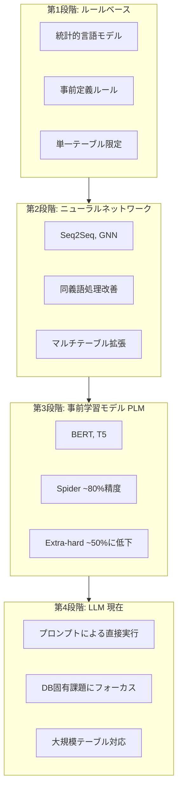
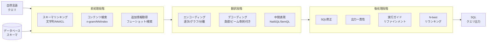
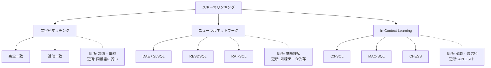
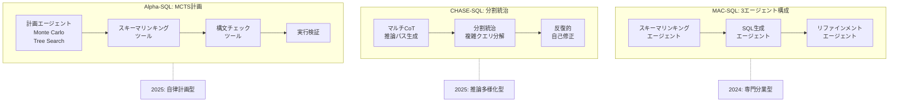

# A Survey of Text-to-SQL in the Era of LLMs: Where are we, and where are we going?

- **Link**: https://arxiv.org/abs/2408.05109
- **Authors**: Xinyu Liu, Shuyu Shen, Boyan Li, Peixian Ma, Runzhi Jiang, Yuxin Zhang, Ju Fan, Guoliang Li, Nan Tang, Yuyu Luo
- **Year**: 2024
- **Venue**: IEEE Transactions on Knowledge and Data Engineering (TKDE), July 2025
- **Type**: Academic Paper

## Abstract

The paper addresses converting natural language queries into SQL queries to reduce database access barriers. It reviews techniques that handle NL ambiguity, schema mapping, and database instances. Coverage spans four areas: (1) Model approaches for translation; (2) Data collection, synthesis, and benchmarking; (3) Evaluation metrics and granularities; (4) Error analysis methodologies. The authors provide development guidance and discuss emerging challenges in the LLM era.

## Abstract（日本語訳）

本論文は、データベースアクセスの障壁を低減するために、自然言語クエリをSQLクエリに変換する技術を取り扱う。自然言語の曖昧性、スキーママッピング、データベースインスタンスの処理に関する技術をレビューする。対象範囲は4つの領域にまたがる：(1) 翻訳のためのモデルアプローチ、(2) データ収集・合成・ベンチマーク、(3) 評価指標と粒度、(4) エラー分析手法。著者らは開発ガイダンスを提供し、LLM時代における新たな課題を議論する。

## 概要

本論文は、LLM時代におけるText-to-SQLの現状と今後の方向性を包括的に調査したサーベイである。「我々はどこにいて、どこに向かっているのか」という問いを軸に、Text-to-SQLタスクの全ライフサイクル（モデル、データ、評価、エラー分析）を網羅的にカバーする点が特徴的である。自然言語の曖昧性（語彙的曖昧性、構文的曖昧性、不十分な特定化）を根本的な課題として位置づけ、複雑なデータベース構造との相互作用を体系的に分析している。モデルアプローチとしては、前処理（スキーマリンキング、データベースコンテンツ検索）、翻訳（エンコーディング、デコーディング、プロンプト設計）、後処理（SQL修正、一貫性確保、実行ガイドリファインメント）の3段階パイプラインを提案している。ルールベースからニューラルネットワーク、事前学習モデル、そしてLLMに至る4段階の進化を整理し、各段階の限界と突破点を明確にしている。さらに、エラー分析の2レベル分類法を提案し、スキーマリンキングエラー、値検索エラー、翻訳ロジックエラー、構文エラーの体系的な分類を行っている点が他のサーベイとの差別化要素となっている。

## 問題設定

本サーベイが取り組む核心的問題は以下の通りである。

- **自然言語の本質的曖昧性**: 語彙的曖昧性（多義語）、構文的曖昧性（複数の構文解析が可能な文）、不十分な特定化（「Labor Day」が国によって異なる日付を指す等）の3種類の曖昧性が正確なSQL変換を根本的に困難にしている。

- **複雑なデータベースの課題**: 複雑なテーブル間関係、曖昧な属性/値、ドメイン固有のスキーマ設計、大規模でノイズの多いデータベースコンテンツが、スキーマ理解を困難にしている。

- **翻訳の複雑性**: 自由形式の自然言語と制約付きSQL構文の間のギャップ、1つの自然言語クエリに対して複数のSQLクエリが対応しうる一対多マッピング、スキーマ依存性の変動が課題である。

- **コスト効率と信頼性のトレードオフ**: LLMの使用に伴うAPIコスト、モデル効率とSQL実行最適化、不十分かつノイズの多い訓練データ、そしてシステムの信頼性確保が実用化における重要課題である。

- **エラー分析手法の不足**: 既存研究ではモデル性能の向上に焦点が当てられがちであり、エラーの根本原因を体系的に分析・分類する手法が不足していた。

## 提案手法

### 分類体系 / フレームワーク

本サーベイでは、Text-to-SQLの全ライフサイクルを以下の4つの柱で体系化している。

**柱1: モデルアプローチ（3段階パイプライン）**

**1. 前処理段階**

- **スキーマリンキング**（3アプローチ）:
  - 文字列マッチングベース: 完全一致/近似一致
  - ニューラルネットワークベース: DAE, SLSQL, RESDSQLによるランキング強化エンコーディング
  - In-Context Learning: LLMの推論能力を活用した動的スキーマリンキング（C3-SQL, MAC-SQL, CHESS）

- **データベースコンテンツ検索**（3アプローチ）:
  - 文字列マッチング: n-gram、アンカーテキストマッチング
  - ニューラルネットワーク: TABERTのアテンション機構、RAT-SQLの関係モデリング
  - インデックス戦略: LSH, BM25による粗→細マッチング

- **追加情報取得**:
  - サンプルベース: フューショット例、ドメイン知識統合
  - 検索ベース: 知識ベースからの類似度ベース選択（PET-SQL, REGROUP）

**2. 翻訳段階**

- **エンコーディング戦略**:
  - 逐次型: NLとスキーマをトークン列として処理
  - グラフベース: 関係構造を保持（RAT-SQL, Graphix-T5）
  - 分離型: 異なるコンポーネントのモジュラーエンコーディング（TKK, SC-Prompt）

- **デコーディング戦略**:
  - 貪欲探索: 効率的だがエラー伝播のリスク
  - ビームサーチ: k個の最良候補を探索
  - 制約付き逐次生成: 各ステップでSQL文法を強制（PICARD）

- **タスク固有プロンプト**:
  - Chain-of-Thought: 推論過程の透明化
  - 分解: SELECT, FROM, WHERE句への分割

- **中間表現**:
  - SQL風構文言語（NatSQL, SemQL, QDMR）
  - SQL風スケッチ構造（部分クエリテンプレート）

**3. 後処理段階**
  - SQL修正戦略
  - サンプリングによる出力一貫性確保
  - クエリ結果を用いた実行ガイドリファインメント
  - N-bestリランキング

**柱2: データ収集・合成・ベンチマーク**
- データベースの複雑性による分類（単一/複数データベース）
- SQL複雑性による分類（単純クエリ〜ネストクエリ）
- ドメイン多様性と規模のバリエーション

**柱3: 評価指標と粒度**
- 実行精度（Execution Accuracy）
- 完全一致（Exact Match）
- コンポーネントベース指標
- 粒度別評価（SQL特性、NLバリアント、ドメイン）

**柱4: エラー分析手法**
- 2レベル分類法によるエラーの体系的分析
- スキーマリンキングエラー、値検索エラー、翻訳ロジックエラー、構文エラーの分類

### 主要な知見

1. **モジュラー設計の有効性**: タスクの異なる側面を専門的に処理するモジュラー設計が、単一モデルアプローチよりも効果的である。

2. **前処理の重要性**: 特にスキーマリンキングと値検索が、Text-to-SQLの全体性能に決定的な影響を与える。

3. **多角的評価の必要性**: 単一の評価指標では不十分であり、複数の次元とエラーパターンを考慮した評価が必要である。

4. **マルチエージェント協調の台頭**: MAC-SQL（3エージェント）、CHASE-SQL（分割統治+反復リファインメント）、Alpha-SQL（Monte Carlo Tree Searchによる計画中心的自律フレームワーク）など、最新手法はマルチエージェント協調を採用している。

5. **学術ベンチマーク vs 実世界の乖離**: ベンチマークでの高性能が実世界での有効性を保証しないという根本的な問題が存在する。

## Figures & Tables

### Figure 1: Text-to-SQLの4段階進化

### Table 1: 主要Text-to-SQLシステムの構成比較

| システム | 年 | ファインチューニング | 前処理 | エンコード/デコード | 後処理 |
|:---|:---:|:---:|:---|:---|:---|
| DAIL-SQL | 2023 | - | フューショット選択 | GPT-4プロンプト | 一貫性投票 |
| CodeS | 2024 | 3段階事前学習 | スキーマリンキング | StarCoderベース | - |
| MAC-SQL | 2024 | - | 専用エージェント | マルチエージェント | リファインメント |
| CHASE-SQL | 2025 | - | スキーマ拡張 | マルチCoT | 自己修正 |
| Alpha-SQL | 2025 | - | 計画エージェント | MCTS探索 | 検証 |
| XiYan-SQL | 2025 | SFT | 基本構文 | 生成強化 | - |

### Figure 2: 3段階モジュラーパイプライン

### Table 2: エラー分析の2レベル分類法

| レベル1カテゴリ | レベル2サブカテゴリ | 説明 | 典型的な原因 |
|:---|:---|:---|:---|
| スキーマリンキングエラー | テーブル選択誤り | 誤ったテーブルの選択 | スキーマの曖昧性 |
| | カラム選択誤り | 誤ったカラムの選択 | 類似カラム名 |
| | 結合関係誤り | 誤ったJOIN条件 | 外部キー理解の不足 |
| 値検索エラー | リテラル値誤り | WHERE句の値が不正確 | DB内容の未参照 |
| | 値型不一致 | データ型の不一致 | 型推論の失敗 |
| 翻訳ロジックエラー | 集約関数誤り | COUNT/SUM等の誤用 | NLの曖昧性 |
| | 条件論理誤り | AND/OR/NOT等の誤り | 複雑な条件構造 |
| | ネスト構造誤り | サブクエリの誤構成 | 階層的推論の困難 |
| 構文エラー | SQL文法違反 | 実行不可能なSQL | 文法制約の欠如 |

### Figure 3: スキーマリンキングの3アプローチ比較

### Table 3: 評価指標の分類

| カテゴリ | 指標 | 評価対象 | 特徴 |
|:---|:---|:---|:---|
| コンテンツマッチング | Component Matching (CM) | SQLコンポーネント別F1 | SELECT/WHERE/GROUP BY等を個別評価 |
| | Exact Match (EM) | SQL文字列全体 | 厳密だが表記揺れに弱い |
| 実行ベース | Execution Accuracy (EX) | 実行結果の正確性 | 実用的だが偽陽性リスク |
| | Valid Efficiency Score (VES) | 精度+実行効率 | 効率性も考慮 |
| 粒度別 | SQL特性別 | 難易度・構造別分析 | 詳細な弱点把握 |
| | NLバリアント別 | 自然言語の多様性 | ロバスト性評価 |
| | ドメイン別 | 分野別精度 | 汎化性能評価 |

### Figure 4: マルチエージェント協調アーキテクチャの進化

## 実験・評価

本サーベイでは、30以上のText-to-SQLシステムを複数のベンチマークで比較分析している。

**Spiderベンチマークでの進化:**
- PLMベース手法: 約80%の精度（Extra-hardケースでは約50%に低下）
- LLMベース手法: プロンプトエンジニアリングにより大幅な改善
- 最新手法（Alpha-SQL、CHASE-SQL等）が最高精度を達成

**BIRDベンチマークでの課題:**
- 大規模データベース（95 DB）でのドメイン知識要求
- ノイズのあるデータベース値への対応
- 外部知識のグラウンディングが必要

**評価の多角的アプローチ:**
- 実行精度（EX）: 最も一般的な指標だが偽陽性のリスク
- 完全一致（EM）: 厳密だが表記揺れに対して過度に厳しい
- コンポーネントベース: SELECT/WHERE/GROUP BY等の個別評価で弱点を特定
- VES: 精度と効率の両面を評価する統合指標

**エラー分析の知見:**
- スキーマリンキングエラーが最も頻繁に発生
- 値検索エラーはデータベースコンテンツの参照不足が主因
- 翻訳ロジックエラーは複雑なネスト構造で顕著
- マルチエージェント手法はエラーの早期検出と修正に有効

**デコーディング戦略の比較:**
- 貪欲探索: 高速だがエラー伝播のリスクが高い
- ビームサーチ: より広い探索空間だが計算コスト増
- PICARD等の制約付き生成: SQL文法違反を防止するが柔軟性が低下

**モジュール選択の意思決定フロー:**
- 訓練データの可用性に応じた前処理モジュールの選択
- データベースの複雑さに基づくエンコーディング戦略の決定
- 計算リソースと精度/レイテンシのトレードオフ

## 備考

- **Text-to-SQL Handbook**: 著者らはGitHubリポジトリでText-to-SQL Handbookをオンライン公開しており、分野の進歩に合わせて継続的に更新している。

- **エラー分析の実践的価値**: 本サーベイの独自の貢献であるエラー分析の2レベル分類法は、モデル改善の方向性を具体的に示す実践的なガイドとして活用できる。スキーマリンキングエラーの高頻度は、前処理の改善が全体精度向上の鍵であることを示唆している。

- **中間表現の有用性**: NatSQL、SemQL等のSQL風中間表現は、自然言語とSQLの間のギャップを橋渡しする効果的な手段であり、特に複雑なクエリの生成精度を改善する。

- **制約付きデコーディングの推奨**: PICARD等の手法はSQL文法を各生成ステップで強制することで構文エラーを排除するが、柔軟性の低下とのトレードオフが存在する。

- **オープンワールドText-to-SQL**: 未知のデータベースやドメインへの対応は今後の重要課題であり、メタ学習やフューショット適応の発展が期待される。

- **コスト効率**: LLMのAPIコストと計算リソースの制約は、特に大規模エンタープライズ環境での展開において重要な考慮事項である。ローカルモデルのファインチューニングがコスト効率の面で有利となる場面が増えている。

- **SQL効率の最適化**: 正確さだけでなく、生成されるSQLの実行効率も今後の評価で重要視される方向にあり、VES指標の普及がこのトレンドを反映している。
