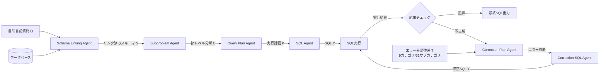

# SQL-of-Thought: Multi-agentic Text-to-SQL with Guided Error Correction

- **Link**: https://arxiv.org/abs/2509.00581
- **Authors**: Saumya Chaturvedi, Aman Chadha, Laurent Bindschaedler
- **Year**: 2025
- **Venue**: NeurIPS 2025, DL4C (Deep Learning for Code) Workshop
- **Type**: Academic Paper

## Abstract

Converting natural language queries into SQL queries is a crucial challenge in both industry and academia, aiming to increase access to databases and large-scale applications. This work examines how in-context learning and chain-of-thought can be utilized to develop a robust solution for text-to-SQL systems. We propose SQL-of-Thought: a multi-agent framework that decomposes the Text2SQL task into schema linking, subproblem identification, query plan generation, SQL generation, and a guided correction loop. Unlike prior systems that rely only on execution-based static correction, we introduce taxonomy-guided dynamic error modification informed by in-context learning. SQL-of-Thought achieves state-of-the-art results on the Spider dataset and its variants, combining guided error taxonomy with reasoning-based query planning.

## Abstract（日本語訳）

自然言語クエリをSQLクエリに変換することは、データベースへのアクセスを拡大し大規模アプリケーションを支援するため、産業界と学術界の双方において重要な課題である。本研究では、in-context learningとchain-of-thoughtを活用してText-to-SQLシステムの堅牢な解決策を開発する方法を検討する。我々はSQL-of-Thoughtを提案する。これはText2SQLタスクをスキーマリンキング、サブ問題の特定、クエリプラン生成、SQL生成、および誘導型修正ループに分解するマルチエージェントフレームワークである。実行ベースの静的修正のみに依存する従来のシステムとは異なり、in-context learningに基づく分類体系誘導型の動的エラー修正を導入する。SQL-of-ThoughtはSpiderデータセットおよびその変種において最先端の結果を達成し、誘導型エラー分類体系と推論ベースのクエリプランニングを組み合わせている。

## 概要

SQL-of-Thoughtは、自然言語からSQLへの変換タスクを複数の専門エージェントに分解するマルチエージェントフレームワークである。従来のText-to-SQLシステムの多くは、生成されたSQLの実行結果のみに基づく静的なエラー修正に依存していたが、本手法では9カテゴリ31サブカテゴリからなるエラー分類体系（taxonomy）を用いた動的修正メカニズムを導入する。フレームワークは5つのコアエージェント（スキーマリンキング、サブ問題分解、クエリプラン、SQL生成、修正ループ）で構成され、各エージェントが特化した役割を担う。特に、生成されたSQLの95〜99%が構文的には正しいにもかかわらず論理的に誤っているという知見に基づき、分類体系誘導型の修正がこの主要な失敗モードに対処する。Spiderデータセットで91.59%の実行精度を達成し、従来のSOTAを大幅に上回る。Claude 3 Opusをバックボーンとした場合、100サンプルのサブセットで95%の精度に到達し、エラー修正なしの場合と比較して10%の改善を示す。

## 問題設定

- **構文的に正しいが論理的に誤ったSQLの修正困難性**: 高度なLLMシステムにおいて、生成されるSQLの95〜99%は構文的に正しいため、実行ベースのフィードバック（実行成功/失敗）だけでは論理的な誤りを検出・修正できない。従来の静的修正手法では、構文は通るが意味的に不正確なクエリに対処できない。
- **複雑なクエリの分解と推論の欠如**: 既存手法の多くは、自然言語から直接SQLを一括生成するため、複数のJOIN、サブクエリ、集約関数を含む複雑なクエリでエラーが頻発する。段階的な推論プロセス（chain-of-thought）を欠いているため、クエリの構造的理解が不十分になる。
- **エラー修正の体系化の不足**: 従来のエラー修正は実行結果の正誤のみに基づいており、エラーの種類（スキーマリンキング、JOIN、フィルタ条件、集約ロジックなど）に応じた体系的な診断・修正が行われていない。

## 提案手法

**SQL-of-Thought**

SQL-of-Thoughtは、Text-to-SQLタスクを以下の形式で定式化する：

$$Y = \text{LLM}(Q, S, C, P, T \mid \theta)$$

ここで、$Q$は自然言語質問、$S$はリンクされたスキーマ、$C$は節レベルのサブ問題、$P$はクエリプラン、$T$はエラー分類体系を表す。

フレームワークは5つの専門エージェントから構成される：

1. **Schema Linking Agent**: データベーススキーマから関連するテーブル、カラム、主キー、外部キー、JOIN関係を特定する
2. **Subproblem Agent**: クエリをWHERE、GROUP BY、JOIN、DISTINCT、ORDER BY、HAVING、EXCEPT、LIMIT、UNIONなどの節レベルの単位にJSON形式で分解する
3. **Query Plan Agent**: 明示的なchain-of-thought推論によるステップバイステップの実行計画を生成する（実行可能なSQLの生成は制限される）
4. **SQL Agent**: クエリプランから実行可能なSQLを生成し、構文的妥当性のための後処理を行う
5. **Correction Plan & Correction SQL Agents**: エラー分類体系を用いた誘導型エラー修正ループを実装する

**エラー分類体系の構成**（9カテゴリ31サブカテゴリ）：
- 構文エラー（無効なエイリアス、不正なSQL）
- スキーマリンキングエラー（欠落/曖昧なカラム、不正な外部キー）
- JOIN関連の誤り
- フィルタ条件エラー（不正なWHEREカラム、型の不一致）
- 集約ロジックの失敗（GROUP BYの欠落、HAVINGの誤用）
- 値表現エラー
- サブクエリ構成の問題
- 集合演算（UNION、INTERSECT、EXCEPT）
- 構造的な見落とし（ORDER BY、LIMITの欠落）

**主要な数式**:

$$Y = \text{LLM}(Q, S, C, P, T \mid \theta)$$

$$\text{EA}(y, \hat{y}) = \mathbb{1}[\text{exec}(y) = \text{exec}(\hat{y})]$$

ここで、$\text{EA}$は実行精度（Execution Accuracy）であり、生成クエリ$y$と正解クエリ$\hat{y}$の実行結果を比較する。

**特徴**:
- 分類体系誘導型動的エラー修正により、構文的に正しいが論理的に誤ったクエリを効果的に修正
- Query Planエージェントが実行可能なSQLの生成を制限されることで、推論と生成の役割を明確に分離
- in-context learningを活用したエラーパターンの学習と適用
- モデル非依存のフレームワーク設計（Claude、GPT-4、GPT-3.5などに適用可能）

## アルゴリズム（擬似コード）

```
Algorithm: SQL-of-Thought Pipeline
Input: 自然言語質問 Q, データベーススキーマ DB, エラー分類体系 T
Output: 実行可能なSQLクエリ Y

1. Schema Linking:
   S ← SchemaLinkingAgent(Q, DB)
   // 関連テーブル、カラム、PK、FK、JOIN関係を抽出

2. Subproblem Decomposition:
   C ← SubproblemAgent(Q, S)
   // 節レベル（WHERE, GROUP BY, JOIN等）にJSON分解

3. Query Plan Generation:
   P ← QueryPlanAgent(Q, S, C)
   // Chain-of-thought推論による実行計画（SQLコード生成なし）

4. SQL Generation:
   Y ← SQLAgent(Q, S, C, P)
   // クエリプランから実行可能なSQL生成 + 構文後処理

5. Guided Correction Loop:
   result ← Execute(Y, DB)
   IF result is incorrect THEN
     FOR attempt = 1 TO max_attempts DO
       error_plan ← CorrectionPlanAgent(Y, result, T)
       // 分類体系に基づくエラー診断
       Y' ← CorrectionSQLAgent(Y, error_plan, S, C, P)
       result' ← Execute(Y', DB)
       IF result' is correct THEN
         RETURN Y'
       END IF
       Y ← Y'
       result ← result'
     END FOR
   END IF

6. RETURN Y
```

## アーキテクチャ / プロセスフロー



## Figures & Tables

### Table 1: Spiderベンチマークにおける主要結果比較

| 手法 | モデル | Spider EA (%) |
|------|--------|--------------|
| **SQL-of-Thought** | **Claude 3 Opus** | **91.59** |
| CHASE-SQL | GPT-4 | 87.6 |
| Tool-SQL | GPT-4 | 86.9 |
| MAC-SQL | GPT-4 | 86.8 |
| DAIL-SQL + SC | GPT-4 | 83.6 |
| DIN-SQL | GPT-4 | 82.8 |

### Table 2: Spider変種データセットにおける実行精度

| ベンチマーク | 実行精度 (%) |
|-------------|-------------|
| Spider (dev) | 91.59 |
| Spider-Realistic | 90.16 |
| Spider-SYN | 82.01 |
| 有効SQL生成率 | 94〜99 |

### Table 3: モデル別アブレーション結果（100サンプルサブセット）

| モデル | SQL-of-Thought (%) | エラー修正なし (%) | クエリプランなし (%) |
|--------|--------------------|--------------------|---------------------|
| Claude 3 Opus | 95 | 85 | 90 |
| GPT-5 | 89 | 85 | 88 |
| GPT-4o Mini | 87 | 72 | 79 |
| GPT-3.5 | 67 | 59 | 73 |

### Table 4: コスト分析

| 構成 | 実行時間 | コスト | 精度 (%) |
|------|---------|-------|----------|
| Claude 3 Opus（全エージェント） | 5時間 | $42.58 | 91.59 |
| ハイブリッド（Claude + GPT-4o） | - | ~$30 | 85.0 |
| オープンソース（Llama-3.1-8B） | 3倍の遅延 | 低コスト | ~45.3 |

### Figure 1: エラー分類体系の概要

```
エラー分類体系（9カテゴリ / 31サブカテゴリ）
├── 1. 構文エラー: 無効エイリアス, 不正SQL
├── 2. スキーマリンキングエラー: 欠落カラム, 曖昧カラム, 不正FK
├── 3. JOIN関連エラー: 不正テーブル結合
├── 4. フィルタ条件エラー: 不正WHEREカラム, 型不一致
├── 5. 集約ロジックエラー: GROUP BY欠落, HAVING誤用
├── 6. 値表現エラー: フォーマット不一致
├── 7. サブクエリエラー: 構成の誤り
├── 8. 集合演算エラー: UNION/INTERSECT/EXCEPT
└── 9. 構造的見落とし: ORDER BY/LIMIT欠落
```

### Figure 2: 各コンポーネントの精度への寄与

```
完全パイプライン:         ████████████████████ 95% (Claude 3 Opus)
エラー修正なし:           ████████████████░░░░ 85% (-10%)
クエリプランなし:         ██████████████████░░ 90% (-5%)
分類体系なし（非誘導型）:  エラー繰り返し増加
```

## 実験・評価

### セットアップ

**データセット**:
- Spider dev split: 1,034組のText-SQLペア、20データベース
- Spider-Realistic: 508サンプル（カラム名が自然言語質問から削除された変種）
- Spider-SYN: 同義語置換された変種

**評価指標**: 実行精度（Execution Accuracy, EA）— 生成クエリの実行結果と正解の実行結果を比較。文字列の完全一致ではなく意味的等価性を評価。

**ハードウェア**: NVIDIA H100 GPU 2基（各80GB HBM）、PyTorch 2.5.1

**ベースライン**: CHASE-SQL、Tool-SQL、MAC-SQL、DAIL-SQL、DIN-SQLなど（いずれもGPT-4ベース）

### 主要結果

SQL-of-ThoughtはSpider devセットで**91.59%**の実行精度を達成し、GPT-4ベースの従来SOTA（CHASE-SQL: 87.6%）を**約4ポイント**上回った。Spider-Realisticでは90.16%、Spider-SYNでは82.01%を記録し、カラム名の欠落や同義語置換などの困難な条件下でもロバストな性能を示した。

100サンプルサブセットでの詳細分析では、Claude 3 Opusが95%、GPT-5が89%、GPT-4o Miniが87%を達成。特にGPT-4o Miniでは、エラー修正なしの場合（72%）と比較して15ポイントの改善が見られ、修正ループの効果が顕著であった。

### アブレーション研究

- **エラー修正ループの除去**: 精度が10%低下（Claude 3 Opus: 95%→85%）。最も影響が大きいコンポーネント。
- **クエリプラン生成の省略**: 精度が5%低下（Claude 3 Opus: 95%→90%）。推論ステップの重要性を示す。
- **分類体系なしの非誘導型修正**: エラーの繰り返しが増加し、効率的な修正が困難に。
- **温度パラメータ > 0（GPT-4o）**: プラン忠実度の低下が観察された。
- **複数修正エージェントの集約**: 矛盾する修正提案により失敗。
- **試行間の履歴保持**: コンテキストの拡大によりコストが増加し、精度が低下。

## 備考

- 本手法の重要な知見として、高度なLLMが生成するSQLの95〜99%が構文的に正しいことが挙げられる。これは、実行ベースフィードバック（成功/失敗）だけでは不十分であり、論理的エラーに特化した修正メカニズムの必要性を示唆する。
- エラー分類体系は手動で設計されており、新しいエラーパターンへの自動拡張は今後の課題である。
- オープンソースモデル（Llama-3.1-8B、Qwen2.5-1.5B）では約45.3%の精度にとどまり、幻覚の問題が深刻であった。プロプライエタリモデルとのギャップは依然として大きい。
- ハイブリッド構成（推論集約型エージェントにClaude、その他にGPT-4o）により、コストを約30%削減しつつ85%の精度を維持できることが示された。
