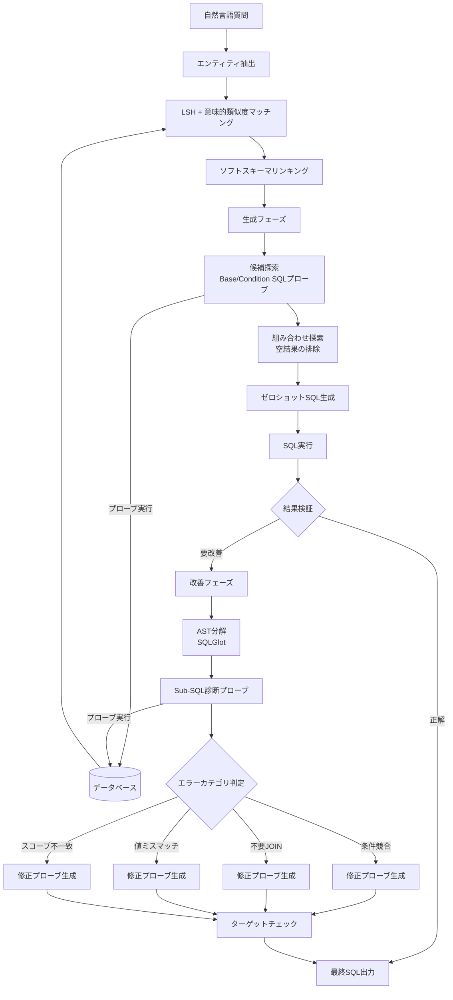

# SDE-SQL: Enhancing Text-to-SQL Generation in Large Language Models via Self-Driven Exploration with SQL Probes

- **Link**: https://arxiv.org/abs/2506.07245
- **Authors**: Wenxuan Xie, Yaxun Dai, Wenhao Jiang
- **Year**: 2025
- **Venue**: arXiv (cs.CL)
- **Type**: Academic Paper

## Abstract

Recent LLM advances have improved Text-to-SQL performance, but prior approaches rely on static, pre-processed database information at inference time. We propose SDE-SQL, enabling large language models to perform self-driven exploration of databases during inference by generating and executing SQL probes for active data retrieval. Operating in zero-shot settings without in-context examples, the framework achieves an 8.02% relative improvement in execution accuracy on the BIRD benchmark using Qwen2.5-72B-Instruct, establishing new state-of-the-art results among open-source models without supervised fine-tuning or ensembling.

## Abstract（日本語訳）

近年のLLMの進歩によりText-to-SQLの性能は向上しているが、従来のアプローチは推論時に静的で事前処理されたデータベース情報に依存している。我々はSDE-SQLを提案する。これはLLMが推論中にSQLプローブを生成・実行することでデータベースの自律的探索を行う手法である。in-contextの例示なしのゼロショット設定で動作し、Qwen2.5-72B-Instructを用いたBIRDベンチマークにおいて実行精度で8.02%の相対的改善を達成し、教師ありファインチューニングやアンサンブルなしのオープンソースモデルの中で新たな最先端結果を確立した。

## 概要

SDE-SQLは、Text-to-SQLタスクにおいてLLMがデータベースと動的に対話することを可能にするフレームワークである。従来のアプローチがスキーマ情報やサンプルデータを静的に提供するのに対し、SDE-SQLはSQLプローブと呼ばれる補助的なクエリを生成・実行し、データベースの内容を能動的に探索する。この探索は生成フェーズと改善フェーズの2段階で行われる。生成フェーズでは候補カラムと条件の組み合わせをツリー構造で探索し、改善フェーズでは抽象構文木（AST）に基づくエラー診断とカテゴリ別の修正プローブを適用する。さらに、エンティティベースのソフトスキーマリンキングにより入力長を削減しつつ関連情報の保持を実現する。ゼロショット設定でBIRDベンチマークにおいて67.67%の実行精度を達成し、ベースラインのQwen2.5-72B-Instruct（60.17%）から8.02%の相対的改善を示す。教師ありファインチューニングを追加することで68.19%まで向上する。

## 問題設定

- **静的データベース情報への依存**: 従来のText-to-SQLシステムは、推論時にスキーマ情報、サンプル行、値のリストなどの事前処理されたデータベース情報を静的にLLMに提供する。しかし、この静的アプローチではデータベースの実際の内容（値の分布、フォーマット、NULL値の存在など）を十分に把握できず、特に条件節の値指定やカラム選択で誤りが生じやすい。
- **SQLの対話的特性の未活用**: SQLは本質的に対話的な言語であり、クエリの実行結果から新たな洞察を得てクエリを改善できる。しかし、従来手法の多くはSQLを静的な出力として扱い、中間クエリの実行結果をフィードバックとして活用していない。この対話的特性を活用することで、LLMがデータベースの構造と内容をより深く理解し、正確なSQLを生成できる可能性がある。
- **エラー修正の非体系的アプローチ**: 既存の修正手法は、生成されたSQL全体を再生成するか、実行エラーメッセージのみに基づいて修正を試みる。SQLの構成要素ごとに問題を切り分け、対象を絞った診断プローブを用いる体系的な修正は行われていない。

## 提案手法

**SDE-SQL (Self-Driven Exploration SQL)**

SDE-SQLは、SQLプローブを用いたデータベースの自律的探索を中心としたフレームワークであり、以下の4つの主要コンポーネントで構成される。

### 1. エンティティベースのスキーマリンキング

- **値検索（Value Retrieval）**: few-shot学習で自然言語質問からエンティティを抽出し、Locality Sensitive Hashing（LSH）と意味的類似度により類似するデータベース値をマッチング
- **ソフトスキーマリンキング**: one-shotプロンプティングで関連カラムを選択し、非選択カラムは名前と型のみを最小限に保持。入力長を削減しつつ許容範囲を維持

### 2. 生成フェーズ — 2段階の探索

**ステージ1: 候補探索（Candidates Exploration）**
- Base SQLプローブを生成してクエリ対象の候補カラムを列挙
- 各基本プローブに個別の条件候補を追加したCondition SQLプローブを作成
- ツリー構造として表現され、各root-to-leafパスが特定のCondition SQLプローブに対応
- 条件記述候補（Condition Description Candidates）を生成

**ステージ2: 組み合わせ探索（Combinations Exploration）**
- 前段階の結果に基づき候補範囲を絞り込み
- 空の結果を返す不適切な候補組み合わせを排除
- ゼロショットでのSQL生成を実現（in-context例示や質問分解なし）

### 3. 改善フェーズ — 3段階のプロセス

**ステージ1: エラー原因の特定**
- SQLGlotを用いて失敗したSQLを抽象構文木（AST）に分解
- 診断プローブとしてSub-SQLを生成し、問題箇所を分離
- 実行結果をLLMの診断に提供

**ステージ2: 解決策の探索**
5つのエラーカテゴリに対応：
1. 条件の競合・重複
2. 不要なテーブルJOIN
3. カラムと値のミスマッチ
4. サブクエリのスコープ不一致
5. 各仮説に対する対象SQLプローブの生成

**ステージ3: ターゲットチェック**
- SELECT句が元の質問のターゲットと整合しているか検証
- 実行に影響しない不要なカラムを除去

### 4. 教師ありファインチューニング（SFT）

- BIRDトレーニングセットの正解SQL生成サンプルで訓練
- 探索フェーズのSQLプローブ生成と、探索結果を用いた予測フェーズの2コンポーネントを抽出
- 9,428データポイントから5,231の有効サンプルを抽出

**主要な数式**:

$$\text{EA} = \frac{1}{N} \sum_{i=1}^{N} \mathbb{1}[\text{exec}(y_i) = \text{exec}(\hat{y}_i)]$$

ここで、$\text{EA}$は実行精度（Execution Accuracy）、$y_i$は生成SQL、$\hat{y}_i$は正解SQL、$\text{exec}(\cdot)$はSQLの実行結果を表す。

$$\text{LSH}(v_q, v_{db}) = P[\text{h}(v_q) = \text{h}(v_{db})] = 1 - \frac{\theta(v_q, v_{db})}{\pi}$$

ここで、$\text{LSH}$はLocality Sensitive Hashingによる類似度推定、$\theta$は2つのベクトル間の角度を表す。

**特徴**:
- SQLの対話的特性を活用した初のデータベース探索フレームワーク
- 生成フェーズと改善フェーズで一貫した探索メカニズムを適用
- ゼロショット設定で強力な性能を達成（in-context例示不要）
- AST分解による体系的なエラー診断と5カテゴリの対象絞りプローブ

## アルゴリズム（擬似コード）

```
Algorithm: SDE-SQL Pipeline
Input: 自然言語質問 Q, データベース DB
Output: SQLクエリ Y

== スキーマリンキングフェーズ ==
1. entities ← ExtractEntities(Q)          // few-shot学習でエンティティ抽出
2. matched_values ← LSH_Match(entities, DB)  // LSH+意味的類似度でDB値マッチング
3. S_soft ← SoftSchemaLink(Q, DB.schema, matched_values)
   // 関連カラム: フル情報、非関連カラム: 名前+型のみ

== 生成フェーズ ==
4. // ステージ1: 候補探索
   base_probes ← GenerateBaseProbes(Q, S_soft)
   FOR each base_probe IN base_probes DO
     results ← Execute(base_probe, DB)
     cond_probes ← GenerateConditionProbes(base_probe, Q)
     FOR each cond_probe IN cond_probes DO
       cond_results ← Execute(cond_probe, DB)
       candidates ← candidates ∪ {(cond_probe, cond_results)}
     END FOR
   END FOR

5. // ステージ2: 組み合わせ探索
   valid_combos ← FilterEmptyResults(candidates)
   Y ← GenerateSQL(Q, S_soft, valid_combos)  // ゼロショット生成

== 改善フェーズ ==
6. result ← Execute(Y, DB)
   IF NeedsRefinement(result, Q) THEN
     // ステージ1: エラー原因特定
     ast ← ParseAST(Y)  // SQLGlotでAST分解
     sub_sqls ← GenerateSubSQLs(ast)
     diagnostics ← {Execute(s, DB) FOR s IN sub_sqls}

     // ステージ2: 解決策探索
     error_category ← DiagnoseError(Y, diagnostics)
     repair_probes ← GenerateRepairProbes(error_category, Y)
     repair_results ← {Execute(p, DB) FOR p IN repair_probes}
     Y' ← RepairSQL(Y, repair_results, error_category)

     // ステージ3: ターゲットチェック
     Y_final ← ValidateTargets(Y', Q)
     RETURN Y_final
   END IF

7. RETURN Y
```

## アーキテクチャ / プロセスフロー



## Figures & Tables

### Table 1: BIRDベンチマークにおける主要結果比較

| 手法 | モデル | 実行精度 (%) |
|------|--------|-------------|
| GPT-4o | - | 75.36 |
| **SDE-SQL + SFT** | **Qwen2.5-72B** | **68.19** |
| **SDE-SQL (zero-shot)** | **Qwen2.5-72B** | **67.67** |
| XiYan-SQL | - | - |
| MAC-SQL | GPT-4 | - |
| CHASE-SQL | GPT-4 | - |
| Vanilla | Qwen2.5-72B-Instruct | 60.17 |

### Table 2: アブレーション研究結果（BIRD Devセット）

| 構成 | Simple (%) | Moderate (%) | Challenging (%) | All (%) | 差分 |
|------|-----------|-------------|----------------|---------|------|
| Full SDE-SQL | 74.92 | 57.76 | 53.10 | 67.67 | - |
| w/o ソフトスキーマリンカー | 73.51 | 58.84 | 50.34 | 66.88 | -0.79 |
| w/o 生成前探索 | 72.97 | 56.46 | 48.97 | 65.71 | -1.96 |
| w/o 改善モジュール | 72.97 | 55.60 | 48.97 | 65.45 | -2.22 |
| w/o 改善時探索 | 72.86 | 56.68 | 51.72 | 65.97 | -1.70 |
| w/o ターゲットチェック | 73.19 | 57.76 | 49.66 | 66.30 | -1.37 |
| w/o 両探索フェーズ | 72.11 | 54.31 | 48.28 | 64.47 | -3.20 |
| SFT追加 | 74.70 | 58.84 | 56.55 | 68.19 | +0.52 |

### Table 3: Spiderデータセットにおける性能比較

| 手法 | Dev EX (%) | Test EX (%) |
|------|-----------|------------|
| SDE-SQL + SFT | 87.5 | 88.5 |
| SDE-SQL (zero-shot) | 87.3 | 88.3 |
| Qwen2.5-72B-Instruct | 73.9 | 84.0 |

### Table 4: ファインチューニングの訓練設定

| パラメータ | 値 |
|-----------|-----|
| バッチサイズ（デバイスあたり） | 1 |
| 勾配累積ステップ | 8 |
| 学習率 | 1.0e-4 |
| エポック数 | 2.0 |
| スケジューラ | Cosine |
| LoRAランク | 16 |
| ハードウェア | NVIDIA A800 GPU 8基 |
| 訓練時間 | 24時間 |
| 有効サンプル数 | 5,231 / 9,428 |

### Figure 1: SQLプローブのツリー構造

```
                    質問: "2020年以降に設立された東京の企業の売上は？"
                                    |
                    ┌───────────────┼───────────────┐
              Base Probe 1     Base Probe 2     Base Probe 3
           SELECT revenue    SELECT sales     SELECT amount
           FROM companies    FROM companies   FROM companies
                |                  |                |
          ┌─────┼─────┐     ┌─────┼─────┐         ...
       Cond 1  Cond 2  ... Cond 1  Cond 2
     WHERE     WHERE      WHERE     WHERE
     city=     year>      city=     year>
     '東京'    2020       '東京'    2020

     各 root-to-leaf パス = 1つの Condition SQL Probe
```

### Figure 2: 各コンポーネントの精度への寄与（BIRD All）

```
Full SDE-SQL:           ████████████████████████████████████ 67.67%
w/o ソフトスキーマ:      ███████████████████████████████████░ 66.88% (-0.79)
w/o 生成前探索:          █████████████████████████████████░░ 65.71% (-1.96)
w/o 改善モジュール:      ████████████████████████████████░░░ 65.45% (-2.22)
w/o 両探索フェーズ:      ██████████████████████████████░░░░ 64.47% (-3.20)
+ SFT:                  █████████████████████████████████████ 68.19% (+0.52)
```

## 実験・評価

### セットアップ

**データセット**:
- BIRD: 95の実世界データベース、12,751のQAペア。Simple / Moderate / Challengingの3難易度に分類
- Spider: 200データベース、10,181の質問

**評価指標**: 実行精度（Execution Accuracy, EX）— 生成SQLの実行結果と正解SQLの実行結果を比較

**ベースライン**: GPT-4、GPT-4o、Gemini、DIN-SQL、DAIL-SQL、CodeS、XiYan-SQL、MAC-SQL、CHASE-SQLなど

**ハードウェア**: NVIDIA A800 GPU 8基

### 主要結果

SDE-SQLは、ゼロショット設定でQwen2.5-72B-Instructを用いたBIRDベンチマークにおいて**67.67%**の実行精度を達成した。これはベースラインのVanilla Qwen2.5-72B-Instruct（60.17%）に対して**8.02%の相対的改善**（7.50ポイントの絶対的改善）に相当する。教師ありファインチューニング（SFT）を追加することで**68.19%**まで向上した。

Spiderデータセットでは、ゼロショットでDev 87.3% / Test 88.3%、SFT追加でDev 87.5% / Test 88.5%を達成し、ベースライン（Dev 73.9% / Test 84.0%）を大幅に上回った。

特筆すべきは、SDE-SQLが教師ありファインチューニングやアンサンブルを用いずに、オープンソースモデルの中で最先端の結果を達成した点である。

### アブレーション研究

各コンポーネントの寄与を分析するアブレーション実験により、以下の知見が得られた：

1. **改善モジュールの除去**が最大の精度低下（-2.22%）を引き起こし、エラー修正の重要性を示す
2. **生成前探索の除去**（-1.96%）も大きな影響があり、候補探索による情報収集の価値を裏付ける
3. **両探索フェーズの同時除去**で-3.20%の低下となり、探索メカニズム全体がフレームワークの中核であることを確認
4. **ターゲットチェック**の寄与（-1.37%）は、SELECT句の検証が精度向上に有効であることを示す
5. **SFTの追加**（+0.52%）は適度な改善をもたらし、プロンプトベースのアプローチが既に高い水準にあることを示唆
6. **難易度別の分析**では、Challenging問題でのコンポーネント除去の影響が特に大きい（w/o改善モジュールで-4.13%）

## 備考

- SDE-SQLの核心的な洞察は、SQLが本質的に対話的な言語であるという点にある。従来手法がSQLを「静的な出力」として扱っていたのに対し、SQLプローブを「探索ツール」として活用する発想は新規性が高い。
- 手動で設計されたプロンプトへの依存が制限事項として挙げられており、プロンプト設計の品質が性能に直接影響する。
- 時間の経過に応じた探索戦略の適応的改善メカニズムが存在しないため、同じ種類の問題に対して毎回同じ探索パスを辿る可能性がある。
- LoRAランク16でのファインチューニングにより、フルパラメータ調整なしで効果的な学習が可能であることが示された。
- GPT-4o（75.36%）との差は依然として存在するが、SDE-SQLはオープンソースモデルのみで達成された結果として注目に値する。
