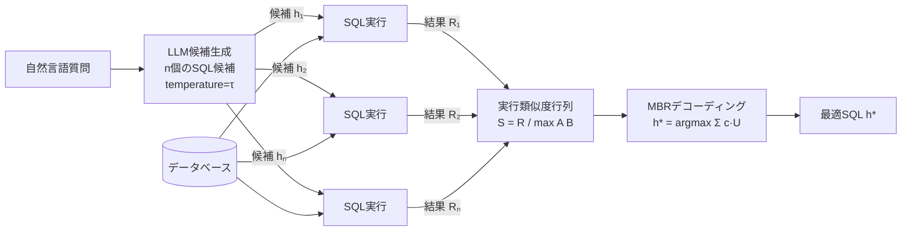
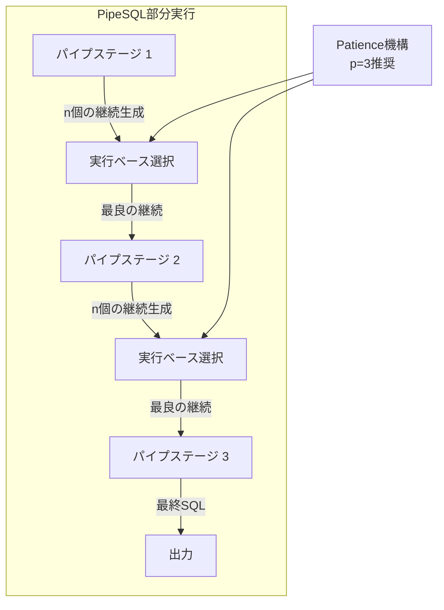

# Query and Conquer: Execution-Guided SQL Generation

- **Link**: https://arxiv.org/abs/2503.24364
- **Authors**: Lukasz Borchmann, Marek Wydmuch
- **Year**: 2025
- **Venue**: arXiv (cs.CL)
- **Type**: Academic Paper

## Abstract

We present a novel technique for generating complex outputs that enhances performance in text-to-SQL tasks. The approach utilizes execution results to identify the most semantically appropriate query among several candidates. This enables smaller, more economical models to outperform resource-intensive reasoning approaches including o1, o3-mini, and DeepSeek R1, while simultaneously reducing inference expenses by up to 30 times. The method integrates seamlessly with current models and offers a pragmatic, scalable solution for advancing SQL generation technology.

## Abstract（日本語訳）

我々は、Text-to-SQLタスクにおける性能を向上させる複雑な出力生成のための新しい技術を提案する。本アプローチは実行結果を利用して、複数の候補の中から最も意味的に適切なクエリを特定する。これにより、小規模で経済的なモデルがo1、o3-mini、DeepSeek R1を含むリソース集約的な推論アプローチを上回ることが可能となり、同時に推論コストを最大30倍削減する。本手法は既存のモデルとシームレスに統合でき、SQL生成技術の発展のための実用的かつスケーラブルなソリューションを提供する。

## 概要

Query and Conquerは、Text-to-SQLタスクにおいてMinimum Bayes Risk（MBR）デコーディングの枠組みを応用し、実行結果に基づく自己一貫性（execution-guided self-consistency）によりSQL生成の品質を向上させる手法である。従来のself-consistencyが構文的類似度に基づいて候補を選択するのに対し、本手法は実際のクエリ実行結果を比較することで意味的等価性を判定する。具体的には、複数のSQL候補を生成し、各候補を実行した結果のテーブル間の類似度を計算して、全候補の中で平均的に最も近い結果を返すクエリを選択する。さらに、PipeSQLのprefix-executable特性を活用した部分実行可能性（partial executability）により、生成途中の段階でも実行ベースの一貫性チェックを行う。7Bパラメータのモデルがo1レベルの性能を達成しつつ推論コストを30分の1に削減するという顕著な費用対効果を実証した。SQL以外のコード生成（Python）にも有効であることを示し、手法の汎用性を裏付けている。

## 問題設定

- **構文的類似度による候補選択の限界**: 従来のself-consistencyアプローチは、生成された複数のSQL候補から多数決で最終候補を選択する。しかし、構文的に異なるSQLが意味的に等価な結果を返すケースが多く（例：JOINの順序、サブクエリとCTEの使い分けなど）、構文ベースの類似度では候補の品質を正確に評価できない。
- **大規模推論モデルのコスト問題**: o1、o3-mini、DeepSeek R1などの推論特化モデルは高い精度を達成するが、推論コストが非常に高い。小規模モデルで同等の性能を達成する手法が求められているが、単純な多数決では小規模モデルの精度限界を突破できない。
- **逐次的エラー修正の非効率性**: マルチエージェント型のエラー修正パイプラインは逐次処理が必要であり、並列化が困難である。候補生成と選択を並列化可能な手法が、実用的なスケーラビリティの観点から望ましい。

## 提案手法

**Execution-Guided Self-Consistency（実行誘導型自己一貫性）**

本手法は、Minimum Bayes Risk（MBR）デコーディングの枠組みに基づき、SQL候補の実行結果を利用して最適な候補を選択する。

**核心的アイデア**: 「考えられるすべての生成結果の中で、平均的に最も近い結果を返す生成を選択する」— ここで「近さ」はドメインに適した関数（実行結果の類似度）で測定される。

### 1. 実行類似度メトリクス

**厳密実行類似度（Exact Execution Similarity）**:
クエリの実行結果をテーブル（行と列）として比較する。セルのリコールに基づく類似度：

$$S(A, B) = \frac{R}{\max(|A|, |B|)}$$

ここで、$R$は全カラムにわたるマッチする値の最小頻度の合計であり、$|A|$, $|B|$は各テーブルのセル数を表す。

**近似実行類似度（Approximate Execution Similarity）**:
実際の実行結果ではなくEXPLAINクエリの実行計画を比較する。レイテンシに敏感なアプリケーション向け。

### 2. MBRデコーディングフレームワーク

$$h^* = \arg\max_{h \in \mathcal{H}} \sum_{h' \in \mathcal{H}} c(h') \cdot U(h, h')$$

ここで、$c(h')$は仮説$h'$の出現回数、$U(h, h')$は実行等価性による効用関数を表す。ゼロイチ効用（完全一致）を超えた段階的類似度スコアに拡張される。

### 3. PipeSQLによる部分実行可能性

PipeSQL方言のprefix-executable特性を利用し、`|>`で終わる各クエリセグメントが独立して実行可能であることを活用：

1. 各パイプステージでn個の継続を生成
2. 実行ベースの一貫性チェックを適用して最適な選択肢を選択
3. 合意点から生成を継続
4. **Patienceパラメータ**: 一時的な発散を許容し、複数ステップ（推奨n=3）にわたる棄却確認を要求

**主要な数式**:

$$S(A, B) = \frac{R}{\max(|A|, |B|)}$$

$$h^* = \arg\max_{h \in \mathcal{H}} \sum_{h' \in \mathcal{H}} c(h') \cdot U(h, h')$$

**特徴**:
- モデル非依存：任意のLLMの出力に対して後処理として適用可能
- 候補生成は完全に並列化可能（逐次的エラー修正と対照的）
- 実行結果の比較はCPUメモリで処理され、GPU負荷を増加させない
- SQL以外のコード生成（Python）にも適用可能な汎用性
- 小規模モデルでの費用対効果が特に顕著

## アルゴリズム（擬似コード）

```
Algorithm: Execution-Guided Self-Consistency
Input: 自然言語質問 Q, データベース DB, サンプル数 n, 温度 τ
Output: 最適SQLクエリ h*

1. 候補生成（並列実行可能）:
   FOR i = 1 TO n DO (in parallel)
     h_i ← LLM.generate(Q, temperature=τ)
   END FOR
   H ← {h_1, h_2, ..., h_n}

2. 候補実行:
   FOR each h_i IN H DO
     result_i ← Execute(h_i, DB)
   END FOR

3. 実行類似度行列の計算:
   FOR each pair (h_i, h_j) IN H × H DO
     U(h_i, h_j) ← ExecutionSimilarity(result_i, result_j)
     // S(A,B) = R / max(|A|, |B|)
   END FOR

4. MBRデコーディングによる最適候補選択:
   FOR each h_i IN H DO
     score_i ← Σ_{h_j ∈ H} c(h_j) · U(h_i, h_j)
   END FOR
   h* ← argmax_{h_i} score_i

5. RETURN h*

---

Algorithm: Partial Executability with PipeSQL
Input: 質問 Q, DB, パイプステージ数 k, サンプル数 n, patience p
Output: 最適SQLクエリ

1. prefix ← ""
2. FOR stage = 1 TO k DO
     continuations ← {LLM.generate(prefix, n) で次の |> セグメントを生成}
     results ← {Execute(prefix + cont, DB) FOR cont IN continuations}
     best ← MBR_Select(continuations, results)

     // Patience機構: 一時的な発散を許容
     IF best が p ステップ連続で棄却確認された THEN
       prefix ← prefix + best
     END IF
   END FOR
3. RETURN prefix
```

## アーキテクチャ / プロセスフロー





## Figures & Tables

### Table 1: BIRD-SQLベンチマーク主要結果（検証サブセット、30サンプル、temp=0.7）

| モデル | Greedy (%) | Exec@30 (%) | 改善幅 |
|--------|-----------|------------|--------|
| Qwen 2.5 Coder 7B | 44.1 | 54.8 | +10.7 |
| GPT-4o mini | 46.9 | 51.6 | +4.7 |
| o1 2024-12-17 | 53.9 | - | ベースライン |
| o3-mini 2025-01-31 | 52.1 | - | ベースライン |
| Llama 3.1 70B | 53.7 | 57.2 | +3.5 |
| Llama 3.1 405B | 54.2 | 57.2 | +3.0 |
| Qwen 2.5 Coder 32B | 55.0 | 57.6 | +2.6 |

**注目**: 7BのQwen 2.5 Coderが実行誘導により54.8%を達成し、o1（53.9%）を上回りつつ推論コストは30分の1。

### Table 2: PipeSQL部分実行可能性の結果

| モデル | Greedy (%) | Exec@10 (%) | +Partial (%) | +Patience (%) |
|--------|-----------|------------|-------------|--------------|
| Qwen Coder 7B | 27.1 | 41.6 | 42.8 | 44.3 |
| Llama 8B | 11.6 | 14.8 | 22.8 | 24.7 |
| Qwen Coder 32B | 40.3 | 53.8 | 53.2 | 55.2 |
| Llama 405B | 37.4 | 54.0 | 53.4 | 56.7 |

### Table 3: SQL以外のコード生成への適用（Python）

| ベンチマーク | モデル | Greedy (%) | Exec@10 (%) | 改善幅 |
|-------------|--------|-----------|------------|--------|
| HumanEval+ | Llama 3.1 8B | 61.6 | 66.1 | +4.5 |
| MBPP+ | Llama 3.1 8B | 55.3 | 68.0 | +12.7 |
| MBPP+ | Mistral Large | 65.9 | 75.3 | +9.4 |

### Table 4: クロスモデル一貫性の結果

| モデル組み合わせ | 精度 (%) |
|-----------------|---------|
| Qwen Coder 32B 単独 | 57.6 |
| Qwen 32B + Llama 70B | 61.3 |
| Qwen 32B + Llama 70B + Gemini Flash | 62.6 |

### Figure 1: サンプル数と精度の関係

```
精度 (%)
  58 |                                    ●────●────●
  56 |                          ●────●───●
  54 |                    ●────●
  52 |              ●────●
  50 |        ●────●
  48 |   ●───●
  46 |  ●
  44 | ●
     +─────────────────────────────────────────────→
     1   3   5   10  15  20  25  30  40  50  60  70
                        サンプル数

  ・3サンプルから改善が顕著に
  ・15サンプルで精度-コストのバランスが良好
  ・50以上でプラトーだが、微増は継続
```

### Figure 2: エラーカテゴリ別の削減効果

```
エラー削減率 (DeepSeek Coder)
スキーマリンキング: ████████████████████████████████████████ 40%
射影エラー:        ████████████████████ 20%
テーブルJOIN:      ████████████████████ 20%
論理形式:          ███████████ 11%
```

## 実験・評価

### セットアップ

**データセット**:
- BIRD-SQL: Text-to-SQLベンチマーク（SQLiteバックエンド）
- HumanEval+、MBPP+: Pythonコード生成ベンチマーク（汎用性検証用）
- BigQuery: PipeSQL実験用のデータベースバックエンド

**評価指標**: 実行精度（Execution Accuracy）— 生成コードの実行結果と正解の実行結果を比較

**ベースライン**:
- Greedyデコーディング（単一パス）
- SQL正規化による多数決（Maj@10）
- ビームサーチ（Beam@10）
- Pass@kオラクル（理論的上限）
- 大規模推論モデル: o1、o3-mini、DeepSeek R1、Gemini 2.0 Thinking

**モデル**: Qwen 2.5 Coder（7B/32B）、Llama 3.1（8B/70B/405B）、GPT-4o mini、Mistral Large

### 主要結果

本手法の最も顕著な成果は、**7BパラメータのQwen 2.5 CoderがExec@30で54.8%を達成し、o1（53.9%）を上回った**ことである。推論コストはo1の約30分の1に抑えられており、実用的な費用対効果を実証した。

Qwen 2.5 Coder 32Bでは57.6%（Greedy 55.0%から+2.6ポイント）、Llama 3.1 70Bでは57.2%（Greedy 53.7%から+3.5ポイント）を達成した。ベースライン精度が低いモデルほど改善幅が大きく、7B Qwenでは+10.7ポイントの改善が見られた。

PipeSQL部分実行可能性の実験では、Patience機構の追加によりさらなる改善が確認された（Llama 405B: 54.0%→56.7%）。ただし、PipeSQLのベースラインスコアはSQLiteと比較して5〜20ポイント低下しており、方言への不慣れが影響している。

**汎用性の検証**: Pythonコード生成ベンチマークでも有効性が確認された。MBPP+でLlama 3.1 8Bが55.3%→68.0%（+12.7ポイント）と大幅な改善を示し、実行誘導型自己一貫性がSQL固有ではなく、実行可能なコード生成全般に適用可能であることが示された。

**クロスモデル一貫性**: 複数モデルからのサンプルを組み合わせることで、総サンプル予算を増やさずに0.5〜1.0ポイントの追加改善が得られた（Qwen 32B + Llama 70B + Gemini Flash: 62.6%）。

### アブレーション研究

1. **サンプル数の影響**: 3サンプルから改善が現れ始め、15サンプルで良好な精度-コストバランスとなる。50サンプル以降はプラトーに近づくが微増は継続する。
2. **温度パラメータの影響**: 高温度は少サンプル時の性能を低下させるが、候補の多様性を増加させ、大サンプル予算での結果を改善する。
3. **エラーカテゴリ別の削減効果**: スキーマリンキングエラーが最も効果的に削減され（40%）、次いで射影エラーとテーブルJOINエラー（各20%）、論理形式エラー（11%）が続く。
4. **近似実行類似度**: EXPLAINクエリによる近似は、レイテンシを大幅に削減しつつ、実行精度の低下は限定的である。
5. **Patience機構の効果**: PipeSQLにおいてPatience（p=3）の追加により、Exec@10と比較して1〜2ポイントの追加改善が一貫して観察された。

## 備考

- 本手法の最大の強みは「モデル非依存性」と「並列化可能性」にある。既存のいかなるLLMにも後処理として適用でき、候補生成は完全に並列化可能であるため、マルチエージェント型の逐次パイプラインと比較してスケーラビリティに優れる。
- 実行結果の比較はCPUメモリで処理されるため、LLMインフラで通常未活用のCPUリソースを有効活用できる。
- ベースライン精度が高いモデルでは改善幅が縮小する傾向があり（収穫逓減）、既に高精度なモデルへの適用効果は限定的である可能性がある。
- PipeSQLとstandard SQLタスク間の比較が限定的であり、方言の違いによる性能差の詳細な分析は今後の課題である。
- コスト効率の観点から、7Bモデル+実行誘導が大規模推論モデルの実用的な代替手段となり得ることを示した点は、産業応用において重要な意味を持つ。
