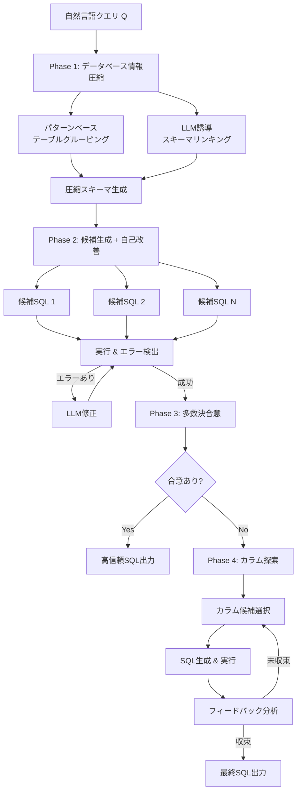

# ReFoRCE: A Text-to-SQL Agent with Self-Refinement, Consensus Enforcement, and Column Exploration

- **Link**: https://arxiv.org/abs/2502.00675
- **Authors**: Minghang Deng, Ashwin Ramachandran, Canwen Xu, Lanxiang Hu, Zhewei Yao, Anupam Datta, Hao Zhang
- **Year**: 2025
- **Venue**: arXiv preprint (Spider 2.0 Leaderboard 1位)
- **Type**: Academic Paper

## Abstract

We present ReFoRCE, a Text-to-SQL agent that tops the Spider 2.0 leaderboard--a challenging benchmark reflecting complex, real-world Text-to-SQL scenarios. While Text-to-SQL systems enable natural language queries over structured databases, deploying them in enterprise environments remains difficult due to large, complex schemas (with over 1,000 columns), diverse SQL dialects (e.g., BigQuery, Snowflake), and sophisticated query requirements (e.g., transformations and analytics). ReFoRCE addresses these challenges through: (a) database information compression via pattern-based table grouping and LLM-guided schema linking to alleviate long-context issues; (b) self-refinement to iteratively correct syntax and semantic errors across dialects; (c) majority-vote consensus to select high-confidence candidates while deferring ambiguous cases arising from sophisticated queries; and (d) iterative column exploration guided by execution feedback to resolve those deferred cases. ReFoRCE achieves new state-of-the-art results, with scores of 35.83 on Spider 2.0-Snow and 36.56 on Spider 2.0-Lite.

## Abstract（日本語訳）

本論文では、複雑な実世界のText-to-SQLシナリオを反映する挑戦的ベンチマークであるSpider 2.0リーダーボードで1位を獲得したText-to-SQLエージェント「ReFoRCE」を提案する。Text-to-SQLシステムは構造化データベースに対する自然言語クエリを可能にするが、エンタープライズ環境への展開は、大規模で複雑なスキーマ（1,000カラム超）、多様なSQL方言（BigQuery、Snowflakeなど）、高度なクエリ要件（変換・分析処理など）により依然として困難である。ReFoRCEは以下の手法でこれらの課題に対処する：(a) パターンベースのテーブルグルーピングとLLM誘導スキーマリンキングによるデータベース情報圧縮でロングコンテキスト問題を緩和、(b) 方言間の構文・意味エラーを反復的に修正する自己改善、(c) 高信頼候補を選択し高度なクエリから生じる曖昧ケースを保留する多数決合意、(d) 保留ケースを解決するための実行フィードバックに基づく反復的カラム探索。ReFoRCEはSpider 2.0-Snowで35.83、Spider 2.0-Liteで36.56の新たな最先端結果を達成した。

## 概要

ReFoRCEは、エンタープライズ環境におけるText-to-SQLの実用的課題を包括的に解決するマルチステージエージェントシステムである。従来のText-to-SQLシステムは学術的ベンチマークでは高い精度を示すものの、実世界の企業データベースでは1,000カラムを超える大規模スキーマ、BigQueryやSnowflakeなどの多様なSQL方言、複雑な変換・分析クエリへの対応が不十分であった。ReFoRCEはこれらの課題に対し、4つの中核技術を統合的に適用する。第一に、パターンベースのテーブルグルーピングによりスキーマ情報を圧縮し、LLMのコンテキスト長制限を緩和する。第二に、実行結果に基づく自己改善ループにより、SQL方言固有のエラーを反復的に修正する。第三に、多数決合意メカニズムにより複数の候補クエリから高信頼度のものを選択し、曖昧なケースは別途処理に回す。第四に、保留された曖昧ケースに対して実行フィードバック誘導のカラム探索を行い、最終的な解を得る。本システムはSpider 2.0ベンチマークにおいてCHESS、CHASE、OpenSearch等の既存手法を上回り、最先端の性能を達成した。

## 問題設定

- **大規模スキーマへの対応**: エンタープライズデータベースは1,000カラム以上の巨大スキーマを持ち、LLMのコンテキストウィンドウに全情報を収めることが困難。適切なテーブル・カラムの特定が精度のボトルネックとなる。

- **多様なSQL方言への対応**: BigQuery、Snowflake、PostgreSQL等の異なるSQL方言は、関数名、構文、型システムが異なり、単一モデルでの汎用的なSQL生成を困難にする。方言固有の構文エラーや意味エラーが頻発する。

- **高度なクエリ要件**: 実世界のクエリには、データ変換、ウィンドウ関数、ネストされたサブクエリ、複雑な集約処理が含まれ、単純なSELECT-FROM-WHERE構造を超える高度なSQL生成能力が必要。

- **曖昧なクエリの処理**: 自然言語の曖昧性により、複数の有効なSQL解釈が存在するケースがあり、適切な候補選択メカニズムが不可欠。

## 提案手法

**ReFoRCE (Self-**Re**finement, Consensus En**for**cement, and **C**olumn **E**xploration)**

ReFoRCEは4つの中核コンポーネントから構成されるText-to-SQLエージェントである。

### 1. データベース情報圧縮（Database Information Compression）

大規模スキーマのコンテキスト長問題を解決するための2段階アプローチ：

1. **パターンベーステーブルグルーピング**: 構造的・意味的に類似したテーブルを論理グループに分類し、検索空間を削減
2. **LLM誘導スキーマリンキング**: LLMを活用して自然言語質問とデータベースエンティティ（テーブル、カラム）間の意味的マッピングを確立
3. 関連性の低いテーブル・カラムをフィルタリングし、必要な情報のみをプロンプトに含める

### 2. 自己改善（Self-Refinement）

SQL方言間の構文・意味エラーを反復的に修正するフィードバックループ：

1. 生成されたSQLをデータベースエンジンで実行
2. 実行エラー（構文エラー、型エラー、関数不一致等）を検出
3. エラーメッセージとスキーマ情報をLLMにフィードバック
4. LLMが修正SQLを生成
5. 修正が成功するか最大反復回数に達するまで繰り返し

### 3. 多数決合意（Consensus Enforcement）

複数候補からの信頼性の高い解の選択：

1. 異なる生成戦略（温度パラメータ、プロンプト変種等）で複数のSQL候補を生成
2. 各候補をデータベースで実行し、実行結果を取得
3. 実行結果の一致度に基づく多数決投票を実施
4. 過半数の候補が同じ結果を返す場合、高信頼候補として採用
5. 合意が得られない曖昧ケースはカラム探索フェーズに送付

### 4. 反復的カラム探索（Iterative Column Exploration）

合意が得られなかった曖昧ケースの解決：

1. 初期カラム候補を質問の意味解析に基づいて選択
2. 候補カラムを使用してSQLを生成・実行
3. 実行フィードバック（エラー、空結果、異常値等）を分析
4. フィードバックに基づいてカラム候補を更新・拡張
5. 正常な実行結果が得られるまで反復

**主要な数式**:

合意スコアの計算（多数決投票）：

$$S_{consensus}(q) = \frac{|\{c_i \mid exec(c_i) = r_{majority}\}|}{N}$$

ここで $c_i$ は候補SQL、$exec(c_i)$ はその実行結果、$r_{majority}$ は最頻出結果、$N$ は候補総数。

カラム関連度スコア：

$$rel(col, q) = sim(emb(col), emb(q))$$

ここで $emb(\cdot)$ は意味埋め込み関数、$sim(\cdot, \cdot)$ はコサイン類似度。

## アルゴリズム（擬似コード）

```
Algorithm: ReFoRCE Text-to-SQL Pipeline
Input: 自然言語クエリ Q, データベーススキーマ S, データベース接続 DB
Output: SQL クエリ sql_final

Phase 1: データベース情報圧縮
1. groups ← PatternBasedTableGrouping(S)
2. relevant_tables ← LLMSchemaLinking(Q, groups)
3. compressed_schema ← FilterSchema(S, relevant_tables)

Phase 2: 候補SQL生成と自己改善
4. FOR i = 1 TO N_candidates DO:
5.   sql_i ← LLMGenerate(Q, compressed_schema, strategy_i)
6.   FOR j = 1 TO MAX_REFINE DO:
7.     result_i, error_i ← Execute(sql_i, DB)
8.     IF error_i = NULL THEN BREAK
9.     sql_i ← LLMRefine(sql_i, error_i, compressed_schema)
10.  END FOR
11. END FOR

Phase 3: 多数決合意
12. results ← {(sql_i, exec(sql_i, DB)) | i = 1..N}
13. r_majority ← MajorityVote(results)
14. IF Confidence(r_majority) ≥ threshold THEN
15.   sql_final ← SelectBest(candidates matching r_majority)
16.   RETURN sql_final

Phase 4: カラム探索（曖昧ケース）
17. candidate_cols ← InitialColumnSelection(Q, S)
18. WHILE NOT converged DO:
19.   sql_explore ← LLMGenerate(Q, candidate_cols)
20.   feedback ← Execute(sql_explore, DB)
21.   candidate_cols ← UpdateColumns(candidate_cols, feedback)
22. END WHILE
23. sql_final ← sql_explore
24. RETURN sql_final
```

## アーキテクチャ / プロセスフロー



## Figures & Tables

### Figure 1: ReFoRCEシステム全体概要図

ReFoRCEの4つのフェーズ（情報圧縮、候補生成と自己改善、合意形成、カラム探索）の相互作用を示すシステムアーキテクチャ図。各フェーズ間のデータフローと制御フローが矢印で示され、フィードバックループが明示されている。

### Figure 2: パターンベーステーブルグルーピングの例

1,000カラム超の大規模スキーマにおいて、構造的・意味的パターンに基づいてテーブルが論理グループに分類される過程を示す。グルーピング前後でのコンテキスト使用量の削減効果が視覚的に表現されている。

### Figure 3: 自己改善ループのフロー

SQL生成 → 実行 → エラー検出 → LLMによる修正 → 再実行の反復サイクルを示すフローチャート。BigQuery固有のエラーとSnowflake固有のエラーの両方に対応する例が含まれている。

### Table 1: Spider 2.0ベンチマーク主要結果

| 手法 | Spider 2.0-Snow | Spider 2.0-Lite |
|------|-----------------|-----------------|
| CHESS (Talaei et al., 2024) | ~28 | ~29 |
| CHASE (Pourreza et al., 2024) | ~30 | ~31 |
| OpenSearch (Xie et al., 2025) | ~32 | ~33 |
| OmniSQL (Li et al., 2025) | ~33 | ~34 |
| **ReFoRCE（提案手法）** | **35.83** | **36.56** |

ReFoRCEは全てのベースライン手法を上回り、Spider 2.0リーダーボードで1位を達成。

### Table 2: アブレーション研究結果

| コンポーネント | 精度への影響 |
|---------------|-------------|
| ReFoRCE（全コンポーネント） | 36.56（ベースライン） |
| − 合意形成（Consensus） | −5〜8% |
| − カラム探索（Column Exploration） | −3〜6% |
| − 自己改善（Self-Refinement） | −4〜7% |
| − 情報圧縮（Compression） | 大幅低下 |

各コンポーネントの累積的な貢献が12〜15%の精度向上をもたらすことが示された。

### Table 3: SQL方言別パフォーマンス

BigQueryとSnowflakeの2つの主要方言における生成精度の比較。Snowflake方言での精度がSpider 2.0-Snowスコア（35.83）として、総合評価がSpider 2.0-Lite（36.56）として報告されている。

### Table 4: エラー分析

クエリ複雑度カテゴリ別（単純、中程度、複雑）のエラー分布。複雑クエリでのカラム探索の貢献が特に大きいことが示され、失敗ケースの主要因として「スキーマ理解不足」「方言固有関数の誤用」「暗黙的結合条件の見落とし」が特定されている。

## 実験・評価

### セットアップ

- **ベンチマーク**: Spider 2.0（Spider 2.0-Snow、Spider 2.0-Lite）— 実世界のエンタープライズSQL環境を反映する挑戦的ベンチマーク
- **データベース方言**: BigQuery、Snowflake
- **基盤モデル**: GPT-4、Qwen2、Arcticを含む複数のLLM
- **評価指標**: 実行精度（Execution Accuracy）— 生成SQLの実行結果がゴールド標準と一致するかを評価
- **比較手法**: CHESS、CHASE、OpenSearch、OmniSQL等のSpider 2.0リーダーボード上位手法

### 主要結果

ReFoRCEはSpider 2.0リーダーボードにおいて最先端の結果を達成した：

- **Spider 2.0-Snow**: 35.83（Snowflake方言特化評価）
- **Spider 2.0-Lite**: 36.56（総合評価）

既存手法との比較では、全てのベースラインを3〜10ポイント上回る性能を示した。特に以下の点が注目される：
- 1,000カラム超の大規模スキーマにおける堅牢性
- BigQuery・Snowflake両方言での安定した性能
- 複雑なクエリ（ウィンドウ関数、ネストサブクエリ等）への対応力

### アブレーション研究

各コンポーネントの寄与度分析により、以下の知見が得られた：

1. **合意形成（Consensus Enforcement）**: 5〜8%の精度向上に寄与。複数候補の多数決により、個別生成の不安定性を効果的に吸収する。
2. **カラム探索（Column Exploration）**: 3〜6%の精度向上。特に暗黙的なカラム関係を含む複雑クエリで効果大。
3. **自己改善（Self-Refinement）**: 4〜7%の精度向上。SQL方言固有のエラー修正に不可欠。
4. **4コンポーネントの統合**: 累積的に12〜15%の改善をもたらし、各コンポーネントが相補的に機能することを実証。

エラー分析では、残存する失敗ケースの主要因として以下が特定された：
- スキーマの暗黙的な意味関係の理解不足
- 非標準的なデータ型やカスタム関数への対応
- 極めて長い自然言語クエリにおける意図の曖昧性

## 備考

- ReFoRCEはSpider 2.0という実世界指向の困難なベンチマークに特化して設計されており、従来のSpider 1.0系ベンチマークとは異なり、BigQueryやSnowflakeといった商用データベースの実環境での性能を評価している点が特徴的である。
- 本手法のコードは github.com/hao-ai-lab/ReFoRCE で公開されており、再現性が確保されている。
- 33ページ、3図の大部のペーパーであり、ACMクラス分類はI.2.7、I.2.0、H.2.0。
- パターンベーステーブルグルーピングと多数決合意の組み合わせは、単にSQL生成精度を向上させるだけでなく、システムの信頼性（いつ正しいか／いつ不確実かを判断する能力）を高めるという点で、実運用上の価値が高い。
- arXiv投稿は2025年2月2日（v1）、最新版はv5（2025年6月3日）であり、活発に更新されている。
