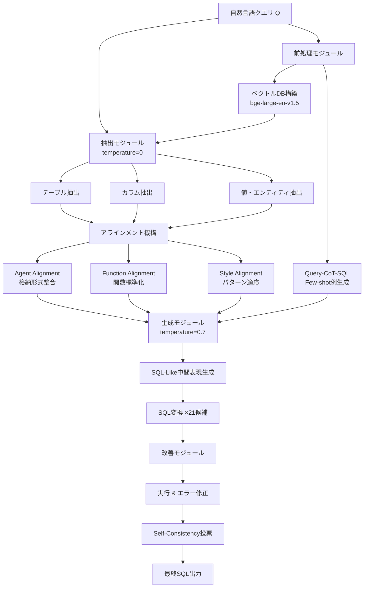

# OpenSearch-SQL: Enhancing Text-to-SQL with Dynamic Few-shot and Consistency Alignment

- **Link**: https://arxiv.org/abs/2502.14913
- **Authors**: Xiangjin Xie, Guangwei Xu, Lingyan Zhao, Ruijie Guo
- **Year**: 2025
- **Venue**: arXiv preprint (BIRD Leaderboard 1位達成時)
- **Type**: Academic Paper

## Abstract

The researchers address limitations in multi-agent LLM approaches to Text-to-SQL tasks by proposing a system with four modules: Preprocessing, Extraction, Generation, and Refinement, along with an Alignment module based on a consistency alignment mechanism. They introduce an intermediate language called SQL-Like and employ a dynamic few-shot strategy in the form of self-taught Query-CoT-SQL. The method achieved execution accuracy of 69.3% on BIRD development set, 72.28% on test set, and 69.36% reward-based validity efficiency score—all ranking first at submission time.

## Abstract（日本語訳）

研究者らは、Text-to-SQLタスクにおけるマルチエージェントLLMアプローチの限界に対処するため、前処理、抽出、生成、改善の4モジュールと、整合性アラインメントメカニズムに基づくアラインメントモジュールを備えたシステムを提案する。SQL-Likeと呼ばれる中間言語を導入し、自己学習型Query-CoT-SQLの形式による動的few-shot戦略を採用する。本手法はBIRD開発セットで実行精度69.3%、テストセットで72.28%、報酬ベースの有効効率スコア69.36%を達成し、投稿時点で全て1位にランクインした。

## 概要

OpenSearch-SQLは、Text-to-SQLタスクにおける3つの根本的課題—フレームワークの不完全性、マルチエージェントの幻覚（ハルシネーション）、指示の不整合—を体系的に解決するマルチエージェント協調フレームワークである。本システムの最大の特徴は、整合性アラインメントメカニズムの導入であり、後段エージェントが前段エージェントの出力を正しく活用することを保証する。また、SQL-Likeという中間表現言語を設計し、LLMがSQL構文の詳細ではなくクエリロジックに集中できるようにする。さらに、Query-CoT-SQLと呼ばれる自己学習型の動的few-shot戦略により、推論連鎖情報で強化されたfew-shot例を提供する。本手法はファインチューニングなしでGPT-4oを基盤モデルとして使用し、BIRDベンチマークで投稿時点での最高精度を達成した。Spiderデータセットでも87.1%の実行精度を記録している。

## 問題設定

- **フレームワークの不完全性**: 既存のマルチエージェントText-to-SQLフレームワークには、データベース情報の検証、エラー修正メカニズム、few-shotメカニズムが欠如しており、生成品質に上限がある。

- **マルチエージェントのハルシネーション**: 後段で実行されるエージェントが、先行エージェントの出力を使用しない、または部分的にしか使用しない問題が発生し、エラーが蓄積する。例えば、抽出エージェントが正しいカラムを特定しても、生成エージェントがそれを無視してしまう。

- **指示の不整合**: 中間言語や指示構成に関する研究が不十分であり、LLMへの指示がSQL生成の品質に直結するにもかかわらず、体系的な最適化が行われていない。

## 提案手法

**OpenSearch-SQL**

OpenSearch-SQLは、前処理・抽出・生成・改善の4つの逐次モジュールと、モジュール間の整合性を保証するアラインメント機構から構成される。

### モジュール1: 前処理（Preprocessing）

1. カラム値とカラム名のベクトルデータベースを構築（bge-large-en-v1.5使用）
2. 訓練データからQuery-CoT-SQL形式のfew-shot例を生成
3. LLMを用いてCoT（Chain-of-Thought）情報を補完

### モジュール2: 抽出（Extraction）

1. データベースからクエリに関連するテーブル、カラム、値、エンティティを選択
2. ベクトル検索による候補のリトリーバル
3. LLMによる関連性フィルタリング

### モジュール3: 生成（Generation）

1. 動的few-shot例とQuery-CoT-SQL形式を活用
2. SQL-Like中間表現を経由した段階的SQL生成
3. 温度パラメータ0.7で21個の候補SQLを生成（Self-Consistency）

### モジュール4: 改善（Refinement）

1. 候補SQLをデータベースで実行
2. 実行エラーの検出と修正
3. 自己整合性（Self-Consistency）投票による最適候補の選択

### アラインメント機構（Consistency Alignment）

3種類のアラインメントエージェントがモジュール間の整合性を保証：

1. **Agent Alignment**: データベースのカラム・値が実際の格納形式と一致することを保証（例：`'John'` → `'JOHN'`）
2. **Function Alignment**: SQL集約関数の標準化（不適切なネストやAGG使用の修正）
3. **Style Alignment**: データセット固有のパターンへの適応（IS NOT NULL規約、MAX vs. LIMIT 1等）

**主要な数式**:

アラインメント関数：

$$A_{Alignment}(x + A'(x)) = A(x) - A'(x)$$

自己整合性による投票選択：

$$SQL_{best} = \underset{SQL_i \in K}{\operatorname{argmin}} \; t_i \quad \text{s.t.} \; ans_i = \underset{ans}{\operatorname{argmax}} \sum_{j} \mathbb{1}[ans_j = ans]$$

ここで $K = \{(SQL_i, ans_i, t_i)\}$ はSQL候補、実行結果、実行時間の三つ組集合。

### SQL-Like中間言語

SQL-Like は、JOINや関数フォーマット等の具体的な構文要素を抽象化し、LLMがSQLのロジックに集中できるようにする中間表現：

```
Natural Language → SQL-Like → Final SQL
```

SQL-Likeでは結合条件やフォーマットの詳細が省略され、SELECT句、WHERE句、GROUP BY句等の論理構造のみが保持される。

### Query-CoT-SQL動的few-shot

従来のQuery-SQL形式：
```
/* Answer the following: {question} */
#SQL: {SQL}
```

強化されたQuery-CoT-SQL形式：
```
/* Answer the following: {question} */
#reason: [論理分析]
#columns: [使用する全カラム]
#values: [フィルタ条件]
#SELECT: [SELECT内容]
#SQL-like: [中間表現]
#SQL: {SQL}
```

## アルゴリズム（擬似コード）

```
Algorithm: OpenSearch-SQL Pipeline
Input: 自然言語クエリ Q, データベース DB, 訓練セット D_train
Output: 最終SQL sql_final

Phase 0: 前処理
1. VecDB_col ← BuildVectorDB(DB.columns, bge-large-en-v1.5)
2. VecDB_val ← BuildVectorDB(DB.values, bge-large-en-v1.5)
3. FewShot ← GenerateQueryCoTSQL(D_train, LLM)

Phase 1: 抽出（temperature=0）
4. tables ← ExtractRelevantTables(Q, DB.schema)
5. columns ← ExtractRelevantColumns(Q, tables, VecDB_col)
6. values ← ExtractRelevantValues(Q, VecDB_val)
7. entities ← ExtractEntities(Q)

Phase 2: アラインメント
8. columns ← AgentAlignment(columns, DB)      // 格納形式との整合
9. functions ← FunctionAlignment(Q)            // 関数使用の標準化
10. style ← StyleAlignment(Q, DB)              // データセット固有パターン

Phase 3: 生成（temperature=0.7, N=21）
11. examples ← DynamicFewShotRetrieval(Q, FewShot, k=5~7)
12. FOR i = 1 TO 21 DO:
13.   sql_like_i ← LLMGenerate(Q, columns, values, examples, "SQL-Like")
14.   sql_i ← LLMConvert(sql_like_i, "SQL")
15. END FOR

Phase 4: 改善
16. FOR i = 1 TO 21 DO:
17.   ans_i, t_i, err_i ← Execute(sql_i, DB)
18.   IF err_i ≠ NULL THEN sql_i ← ErrorCorrection(sql_i, err_i)
19. END FOR

Phase 5: 投票選択
20. K ← {(sql_i, ans_i, t_i) | i = 1..21}
21. ans_majority ← MajorityVote({ans_i})
22. sql_final ← argmin_{sql_i: ans_i = ans_majority} t_i
23. RETURN sql_final
```

## アーキテクチャ / プロセスフロー



## Figures & Tables

### Figure 1: OpenSearch-SQLシステムアーキテクチャ

4つのモジュール（前処理、抽出、生成、改善）とアラインメント機構の全体構成を示す図。各モジュール間のデータフロー、アラインメントエージェントの介入ポイント、Self-Consistency投票の流れが包括的に描かれている。

### Figure 2: Query-CoT-SQL形式の例示

従来のQuery-SQL形式との比較で、Query-CoT-SQLの6つの構成要素（reason、columns、values、SELECT、SQL-like、SQL）がどのように推論情報を付加するかを具体的なクエリ例で示している。

### Table 1: BIRDベンチマーク主要結果

| 手法 | Dev EX (%) | Test EX (%) | Test R-VES (%) |
|------|-----------|-------------|----------------|
| 先行手法群 | - | - | - |
| **OpenSearch-SQL** | **69.3** | **72.28** | **69.36** |

投稿時点で開発セット・テストセット・R-VESの全3指標で1位を達成。

### Table 2: Spiderベンチマーク結果

| 手法 | 実行精度 (%) |
|------|-------------|
| OpenSearch-SQL | 87.1 |

Spiderデータセットでも高い精度を達成し、手法の汎用性を実証。

### Table 3: アブレーション研究（Mini-Devセット）

| 構成要素の除去 | EX変化 |
|---------------|--------|
| − 抽出モジュール | −3.2% |
| − Few-shot | −4.6% |
| − CoT（Chain-of-Thought） | −1.4% |
| − アラインメント | −1.0% |

Few-shotの除去が最大のインパクト（−4.6%）を持ち、動的few-shot戦略の重要性が確認された。

### Table 4: 難易度別Self-Consistency効果

| 難易度 | Self-Consistency無し | Self-Consistency有り | 改善幅 |
|--------|---------------------|---------------------|--------|
| Simple | 高 | より高 | 小 |
| Moderate | 中 | より高 | 中 |
| **Difficult** | 低 | 大幅改善 | **+7.64%** |

困難なクエリにおいてSelf-Consistency & Voteが最大の改善効果（絶対差7.64%）を示した。

### Table 5: 実行コストの内訳

| コンポーネント | 時間 | トークン数 |
|---------------|------|-----------|
| 抽出 | 4-9秒 | 5k-10k |
| 生成 | 5-15秒 | 4k-8k |
| 改善 | 0-25秒 | 0-5k |
| **合計** | **7-60秒** | **9k-25k** |

### Table 6: Query-CoT-SQL vs. Query-SQL比較

| Few-shot形式 | 生成フェーズEX |
|-------------|---------------|
| Query-SQL | ベースライン |
| Query-CoT-SQL | +1.4% |

推論連鎖情報の付加により、生成フェーズ単体で1.4%の改善。

## 実験・評価

### セットアップ

- **ベンチマーク**: BIRD（開発セット + テストセット）、Spider
- **基盤モデル**: GPT-4o-0513（ファインチューニングなし）
- **埋め込みモデル**: bge-large-en-v1.5（リトリーバル用）
- **温度設定**: 抽出フェーズ=0、生成・改善フェーズ=0.7
- **Few-shot数**: 5〜7例が最適
- **Self-Consistency候補数**: 21（GPT-4o使用時）
- **評価指標**: 実行精度（EX）、報酬ベース有効効率スコア（R-VES）

### 主要結果

OpenSearch-SQLはBIRDベンチマークにおいて投稿時点で全指標1位を達成：

- **開発セット EX**: 69.3% — 開発セットにおける最高精度
- **テストセット EX**: 72.28% — テストセットにおける最高精度
- **テストセット R-VES**: 69.36% — 効率性を加味した総合評価で最高スコア

Spiderデータセットでも87.1%の実行精度を達成し、異なるベンチマーク間での汎化能力を実証。ファインチューニングを使用していない点は、手法のポータビリティとデータベースシステム間での移植性を示す重要な特徴である。

### アブレーション研究

Mini-Devセットを用いた詳細な構成要素分析により以下の知見が得られた：

1. **動的Few-shotの重要性**: Few-shotの除去は最大の精度低下（−4.6%）をもたらし、本手法の中核的貢献がfew-shot戦略にあることを確認。
2. **抽出モジュールの寄与**: −3.2%の影響を持ち、正確なテーブル・カラム選択がSQL生成の基盤であることを再確認。
3. **CoTの効果**: −1.4%の改善で、推論連鎖の明示的な表現がLLMの生成品質向上に寄与。
4. **アラインメントの効果**: −1.0%と最小ではあるが、マルチエージェント間の整合性保証は安定性に寄与。
5. **難易度別分析**: Self-Consistencyは困難な問題で最大の効果（+7.64%）を発揮し、容易な問題での効果は限定的。

## 備考

- OpenSearch-SQLは、ファインチューニングなしでBIRDリーダーボード1位を達成した最初のシステムの一つであり、プロンプトエンジニアリングとマルチエージェント協調の可能性を示す重要な成果である。
- SQL-Like中間言語の導入は、LLMがSQL構文の詳細（JOIN形式、関数フォーマット等）に惑わされることなくクエリロジックに集中できるという実践的洞察に基づいている。
- 21候補のSelf-Consistency生成はコスト面で高価（合計9k-25kトークン、7-60秒）であるが、困難なクエリでの7.64%改善はそのコストを正当化する。
- 整合性アラインメントの概念は、マルチエージェントシステム全般における「エージェント間の出力整合性」という普遍的課題への解決策として、Text-to-SQL以外の応用も期待される。
- カテゴリ: cs.CL, cs.AI, cs.IR。15ページの論文。
