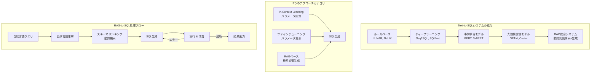

# From Natural Language to SQL: Review of LLM-based Text-to-SQL Systems

- **Link**: https://arxiv.org/abs/2410.01066
- **Authors**: Ali Mohammadjafari, Anthony S. Maida, Raju Gottumukkala
- **Year**: 2024
- **Venue**: arXiv preprint
- **Type**: Academic Paper（サーベイ論文）

## Abstract

LLMs when used with Retrieval Augmented Generation (RAG), are greatly improving the SOTA of translating natural language queries to structured and correct SQL. Unlike previous reviews, this survey provides a comprehensive study of the evolution of LLM-based text-to-SQL systems, from early rule-based models to advanced LLM approaches that use (RAG) systems. We discuss benchmarks, evaluation methods, and evaluation metrics. Also, we uniquely study the use of Graph RAGs for better contextual accuracy and schema linking in these systems. Finally, we highlight key challenges such as computational efficiency, model robustness, and data privacy toward improvements of LLM-based text-to-SQL systems.

## Abstract（日本語訳）

LLMをRetrieval Augmented Generation（RAG）と組み合わせることで、自然言語クエリを構造化された正確なSQLに変換する最先端技術が大幅に向上している。従来のレビューとは異なり、本サーベイはLLMベースのText-to-SQLシステムの進化を、初期のルールベースモデルからRAGシステムを活用する先進的LLMアプローチまで包括的に研究する。ベンチマーク、評価方法、評価指標について議論する。また、これらのシステムにおけるコンテキスト精度とスキーマリンキングの向上のためのGraph RAGの使用を独自に研究する。最後に、LLMベースのText-to-SQLシステムの改善に向けた計算効率、モデルの堅牢性、データプライバシーなどの主要課題を強調する。

## 概要

本論文は、Text-to-SQLシステムの進化を網羅的にレビューするサーベイ論文である。ルールベースアプローチからディープラーニング、事前学習モデル、大規模言語モデル（LLM）、そしてRAG統合システムに至る技術的発展を時系列で整理する。本サーベイの最大の独自貢献は、Graph RAGのText-to-SQLへの応用に関する初の体系的調査であり、グラフ構造によるスキーマ理解とコンテキスト精度の向上メカニズムを詳細に分析する。また、In-Context Learning、ファインチューニング、RAGベースの3つのアプローチカテゴリを軸とした分類体系を提示し、14のRAGベース手法、15のIn-Context Learning手法、7のファインチューニング手法を比較評価する。ベンチマーク（Spider、BIRD、WikiSQL等）と評価指標（EM、EX、CM、VES）の包括的整理も本論文の重要な貢献である。最後に、スケーラビリティ、動的スキーマ適応、曖昧性解消、倫理・プライバシーなど6つの主要課題を特定し、今後の研究方向を示す。

## 問題設定

- **言語的曖昧性と複雑性**: 自然言語クエリにはネスト節、代名詞、曖昧な用語が含まれ、正確なSQL変換を困難にする。複雑な言語構造（関係節、省略、暗黙的参照等）の解析が不十分。

- **スキーマ理解の限界**: 複雑で領域依存のデータベーススキーマの正確なマッピングが困難。テーブル・カラム間の関係、外部キー制約、暗黙的な結合条件の理解が不完全。

- **稀少・複雑なSQL操作**: ネストされたサブクエリ、マルチテーブル結合、ウィンドウ関数、CTEなどの高度なSQL構造の生成精度が低い。

- **クロスドメイン汎化**: あるドメインで学習したモデルが別のドメインのデータベースで性能低下を起こす。ドメイン固有の用語や構造への適応が課題。

## 提案手法

**包括的分類体系と技術的分析**

本サーベイでは、LLMベースのText-to-SQLシステムを3つの主要カテゴリに分類し、各カテゴリの技術的特徴を体系的に分析する。

### カテゴリ1: In-Context Learning（モデルパラメータ固定）

モデルパラメータを更新せず、プロンプト設計によりSQL生成を制御：

$$Y = f(Q, S, I; \theta)$$

ここで $Y$ は生成SQL、$Q$ は自然言語クエリ、$S$ はスキーマ、$I$ は中間推論、$\theta$ は固定された事前学習パラメータ。

サブカテゴリ：
1. **ゼロショット / フューショット学習**: 例なし／少数例によるSQL生成
2. **分解技法**: 複雑クエリの部分問題への分割
3. **プロンプト最適化**: プロンプト構造の体系的改善
4. **推論強化**: Chain-of-Thought等の推論チェーン活用
5. **実行改善**: 実行フィードバックに基づくSQL修正

### カテゴリ2: ファインチューニング（パラメータ更新）

タスク固有データでモデルパラメータを更新：

$$\theta' = g(\theta, D)$$

ここで $\theta'$ は更新後パラメータ、$D$ はタスク固有データセット。

サブカテゴリ：
1. **事前学習手法**: 大規模コーパスでの事前学習
2. **分解アプローチ**: サブタスクへの分割学習
3. **データ拡張**: 学習データの合成・拡張
4. **強化アーキテクチャ**: モデル構造の改良

### カテゴリ3: RAGベース（検索拡張生成）

動的な知識検索と生成の組み合わせ：

1. **動的検索**: クエリに応じたスキーマ情報の動的取得
2. **知識強化検索**: 外部知識ベースとの統合
3. **スキーマ拡張プロンプティング**: 検索スキーマ情報によるプロンプト構築
4. **コンテキスト対応検索**: 文脈を考慮した情報取得
5. **堅牢性強化**: 摂動耐性の向上

### Graph RAGの独自分析

Graph RAGはナレッジグラフを構築し、スキーマ要素を階層構造で組織化：

- **三重グラフ構築**: エンティティ、属性、関係をリンク
- **モジュラリティ検出**: Leidenアルゴリズムによるグラフのサブグラフ分割
- **デュアル検索戦略**: トップダウン（コンテキスト対応）+ ボトムアップ（効率重視）
- **マルチホップ推論**: 複数のグラフコミュニティを横断した情報統合

**主要な数式**:

In-Context Learning:
$$Y = f(Q, S, I; \theta)$$

ファインチューニング:
$$\theta' = g(\theta, D)$$

## アルゴリズム（擬似コード）

```
Algorithm: RAG-based Text-to-SQL Pipeline (一般的フロー)
Input: 自然言語クエリ Q, データベーススキーマ S, 知識ベース KB
Output: SQL クエリ Y

1. // 自然言語理解
2. intent ← ParseIntent(Q)
3. entities ← ExtractEntities(Q)

4. // スキーマリンキング（RAG拡張）
5. relevant_schema ← Retrieve(Q, S, KB)  // 動的スキーマ検索
6. linked_elements ← SchemaLink(entities, relevant_schema)

7. // SQL生成
8. IF method = "In-Context" THEN
9.   examples ← RetrieveFewShot(Q, ExampleDB)
10.  Y ← LLM.generate(Q, linked_elements, examples; θ)
11. ELSE IF method = "Fine-tuned" THEN
12.  Y ← FineTunedLLM.generate(Q, linked_elements; θ')
13. ELSE IF method = "Graph-RAG" THEN
14.  graph ← ConstructKnowledgeGraph(S, KB)
15.  context ← GraphTraversal(Q, graph)
16.  Y ← LLM.generate(Q, context; θ)
17. END IF

18. // 実行・改善
19. result, error ← Execute(Y, DB)
20. IF error THEN
21.   Y ← RefineSQL(Y, error, linked_elements)
22. END IF

23. RETURN Y
```

## アーキテクチャ / プロセスフロー



## Figures & Tables

### Figure 1: Text-to-SQLシステムの進化タイムライン

ルールベースアプローチ（初期）からLLMおよびRAG統合に至る技術的進化を時系列で示す図。各時代の代表的手法（LUNAR → Seq2SQL → BERT-SQL → GPT-4 → RAG統合）と、それぞれの技術的特徴・限界が年代とともに記載されている。

### Figure 2: 従来のLLMベースText-to-SQL処理フロー

4つの主要ステージを示す：自然言語理解 → スキーマ理解 → SQL生成 → SQL実行。ユーザ入力からデータベース結果までの逐次フローが図示されている。

### Figure 3: RAG-to-SQL高レベルワークフロー

RAGメカニズムを組み込んだ強化アーキテクチャ。動的コンテキスト検索の統合ポイントと、従来のLLMベースフローとの差異が明示されている。

### Figure 4: 研究アプローチの分類体系

LLMベースText-to-SQL技術の階層的分類構造。In-Context Learning、ファインチューニング、RAGベースの3大カテゴリとその各サブカテゴリが木構造で表現されている。

### Figure 5: 評価指標カテゴリ

Content Matching（コンポーネントマッチング、完全一致）とExecution-based（実行精度、有効効率スコア）の2大カテゴリと4つの主要指標の関係を示す図。

### Table I: LLM vs. RAG統合アプローチの比較

| フェーズ | 従来LLM | RAG統合 |
|---------|---------|---------|
| 自然言語理解 | 事前学習知識に依存 | 検索されたスキーマ記述を活用 |
| スキーマリンキング | LLMの学習データに依存 | メタデータの動的検索 |
| SQL生成 | In-Context/ファインチューニング | 検索例 + 反復改善 |
| 実行 | 生の結果取得 | エラーベース改善ループ |

4フェーズ × 2アプローチの詳細比較。

### Table II: データセットタイプの比較

7つのデータセットカテゴリ（クロスドメイン、知識拡張、コンテキスト依存、堅牢性、意味解析、多言語、実世界応用）について、焦点、RAGとの関係、強み、弱み、課題、代表例を網羅的に分析。

### Table III: 最先端RAG手法の詳細

14のRAGベースシステムの詳細比較。使用LLM、対象データベース、評価指標、カテゴリ、サブカテゴリ、新規性、弱点、参考文献を含む。

### Table IV: In-Context Learning手法一覧

15の手法をリリース日順（2023年5月〜2024年8月）に整理。ゼロショット/フューショット、分解、プロンプト最適化、推論強化、実行改善のカテゴリ別に分類。

### Table V: ファインチューニング手法一覧

7つの手法を事前学習、分解、データ拡張、強化アーキテクチャのカテゴリ別に整理（2023年11月〜2024年8月）。

### Table VI: 3アプローチの総合比較

| 側面 | In-Context | ファインチューニング | RAGベース |
|------|-----------|-------------------|----------|
| 汎化能力 | 限定的 | ドメイン固有 | 高い |
| ドメイン適応性 | 中程度 | 低い | 高い |
| 効率性 | 推論速い | 学習遅い/推論速い | 検索オーバーヘッド |
| 実装複雑度 | 中程度 | 高い | 高い |

## 実験・評価

### セットアップ

本サーベイは実験論文ではなく、既存研究の体系的レビューである。以下のベンチマークと評価指標を分析対象とする。

**主要ベンチマーク**:
- **Spider**: クロスドメインベンチマーク、複雑なクエリと多様なスキーマ
- **BIRD**: 外部ドメイン知識の統合を評価
- **WikiSQL**: 大規模単一ドメインベンチマーク
- **CoSQL / SParC**: 対話型・マルチターンText-to-SQL
- **Spider-Syn / Spider-Realistic**: 堅牢性評価（同義語、現実的曖昧性）
- **ADVETA**: 敵対的テーブル摂動

**評価指標**:
- **Component Matching (CM)**: SQL構成要素（SELECT、FROM、WHERE等）の個別評価
- **Exact Matching (EM)**: 構造・順序の完全一致
- **Execution Accuracy (EX)**: 実行結果の正確性
- **Valid Efficiency Score (VES)**: 計算効率性の評価

### 主要結果

サーベイから得られた主要な知見：

1. **RAG統合の優位性**: RAGベースアプローチは、ゼロショット・フューショットシナリオで最も高い汎化能力を示す。動的なスキーマ情報検索により、未知のデータベースへの適応が可能。

2. **Graph RAGの可能性**: テーブル・カラム間の関係をグラフ構造で捕捉することで、フラットなスキーマ記述に比べてスキーマリンキング精度が向上。マルチホップ推論により複雑なクエリへの対応力が強化される。

3. **ファインチューニングの限界**: ドメイン固有の高精度を達成するが、新ドメインへの適応には再学習が必要。最近はアーキテクチャ変更よりデータ拡張が主流。

4. **In-Context Learningの実用性**: 迅速な展開が可能だが、プロンプト設計への依存度が高く、ハルシネーションリスクがある。

### アブレーション研究

本サーベイにはアブレーション研究は含まれないが、レビュー対象論文から以下の傾向を特定：

- スキーマリンキングの品質がSQL生成精度を最も大きく左右する
- 実行フィードバックによる反復改善は、全アプローチカテゴリで有効
- few-shot例の品質と関連性が、量よりも重要
- データ拡張はファインチューニングの効果を大幅に増加させる

## 備考

- 本サーベイはGraph RAGのText-to-SQL応用を体系的に調査した初の論文として位置付けられる。グラフ構造によるスキーマ理解の強化は、従来のフラットなスキーマ表現の限界を超える有望なアプローチである。
- 15ページ、5図、5テーブルの構成。カテゴリはcs.CL, cs.AI。
- 6つの主要課題として以下を特定：(1) スケーラビリティと計算効率、(2) スキーマ変更への動的適応、(3) コンテキスト精度と曖昧性解消、(4) RAGとファインチューニングのバランス、(5) 倫理・プライバシー・解釈可能性、(6) Human-in-the-Loopとインタラクティブクエリ。
- 特に「動的スキーマ変更への適応」は実運用上の重要課題であり、現在のシステムはスキーマ変更時に完全な再学習が必要となる点が指摘されている。インクリメンタル学習技術の導入が今後の研究方向として示唆される。
- 2024年10月1日投稿（v1）、2025年2月4日更新（v2）。
