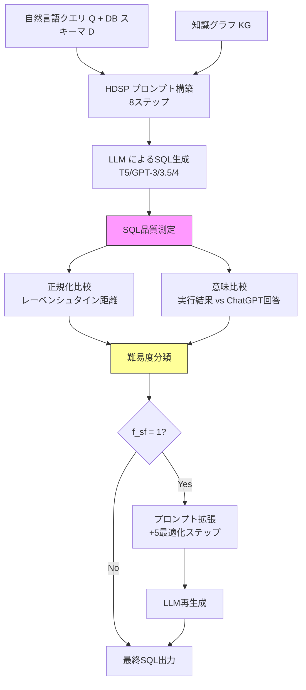

# Enhancing LLM Fine-tuning for Text-to-SQLs by SQL Quality Measurement

- **Link**: https://arxiv.org/abs/2410.01869
- **Authors**: Shouvon Sarker, Xishuang Dong, Xiangfang Li, Lijun Qian
- **Year**: 2024
- **Venue**: arXiv preprint
- **Type**: Academic Paper

## Abstract

The paper addresses how non-specialist users can query relational databases using natural language through Text-to-SQL systems. It proposes a novel methodology using SQL Quality Measurement to enhance performance, establishing a SQL quality evaluation mechanism to assess the generated SQL queries against predefined criteria and actual database responses. This feedback loop facilitates model refinement based on both syntactic and semantic accuracy. The approach was tested on the BIRD benchmark, measuring Execution Accuracy and Valid Efficiency Score across difficulty levels, demonstrating competitive results relative to established models.

## Abstract（日本語訳）

本論文は、非専門家ユーザーがText-to-SQLシステムを通じて自然言語でリレーショナルデータベースにクエリを実行する方法を取り扱う。SQL品質測定を用いてパフォーマンスを向上させる新規手法を提案し、生成されたSQLクエリを事前定義された基準と実際のデータベース応答に対して評価するSQL品質評価メカニズムを確立する。このフィードバックループは、構文的および意味的精度の両方に基づくモデル改善を促進する。本アプローチはBIRDベンチマークでテストされ、難易度レベル別の実行精度（Execution Accuracy）と有効効率スコア（Valid Efficiency Score）を測定し、既存モデルに対して競争力のある結果を示した。

## 概要

本論文は、LLMのText-to-SQLファインチューニングにおいて、生成SQLの品質を定量的に測定し、そのフィードバックを用いてプロンプトを適応的に拡張する手法を提案する。中核的なアイデアは、正規化比較（Normalized Comparison）による構文的類似度評価と、意味比較（Semantic Comparison）による実行結果の正確性評価を組み合わせたSQL品質測定メカニズムである。品質測定の結果に基づいてクエリの難易度を自動分類し、困難なクエリに対してはHuman-Designed Step-by-Step Prompt（HDSP）を拡張する追加ステップが自動的に挿入される。この適応的プロンプト拡張メカニズムにより、T5、GPT-3、GPT-3.5、GPT-4の各モデルにおいてBIRDベンチマーク上で一貫した性能向上が実現された。特にGPT-4では、知識グラフ統合・フィードバック・HDSPの全組み合わせで49.87%の実行精度を達成し、ベースライン（30.90%）から約19ポイントの改善を示した。

## 問題設定

- **非専門家のデータベースアクセス**: SQLの知識を持たないビジネスユーザーが自然言語でデータベースにクエリを実行するニーズが高まっているが、生成SQLの品質保証メカニズムが不十分。

- **構文的正確性と意味的正確性のギャップ**: 生成されたSQLが構文的に正しくても、意図した意味（正しいデータの取得）を実現しない場合がある。逆に、構造が異なっても機能的に等価なSQLも存在し、単純なテキスト比較では品質評価が困難。

- **難易度に応じた適応的処理の欠如**: 従来のText-to-SQLシステムは全てのクエリに同一のプロンプト・処理パイプラインを適用し、クエリの複雑度に応じた適応的な対応が行われていない。

- **ファインチューニングにおける品質フィードバックの不在**: LLMのファインチューニングにおいて、生成SQLの品質を体系的に測定し、その結果をモデル改善に活用するメカニズムが確立されていない。

## 提案手法

**SQL Quality Measurement（SQL品質測定）ベースの適応的ファインチューニング**

本手法は、SQL品質測定、難易度分類、適応的プロンプト拡張の3段階から構成される。

### ステップ1: SQL品質測定

2つの相補的な評価基準による品質定量化：

**正規化比較（Normalized Comparison）**:

生成SQL（$\hat{Y}$）とゴールド標準SQL（$Y$）間のレーベンシュタイン距離に基づく構文的類似度：

$$f_{nc}(\hat{Y}, Y) = 1 - \frac{L(f_{Norm}(\hat{Y}), f_{Norm}(Y))}{\max(|f_{Norm}(\hat{Y})|, |f_{Norm}(Y)|)}$$

ここで $L(\cdot, \cdot)$ はレーベンシュタイン距離、$f_{Norm}(\cdot)$ はSQL正規化関数。

**意味比較（Semantic Comparison）**:

生成SQLの実行結果がChatGPT導出の期待回答と一致するかの二値判定：

$$f_{sc}(\hat{A}, A') = \begin{cases} 1 & \text{if } R(\hat{A}) = R(A') \\ 0 & \text{otherwise} \end{cases}$$

ここで $R(\cdot)$ は結果型（answer type）の抽出関数。

### ステップ2: 難易度分類

カラム数と正規化比較スコアに基づく自動難易度分類：

$$f_{diff} = \begin{cases} 0 \text{ (simple)} & \text{if } f_{nc} < t_{nc} \text{ and } N_{col} \leq 5 \\ 1 \text{ (moderate)} & \text{if } f_{nc} < t_{nc} \text{ and } 5 < N_{col} < 10 \\ 2 \text{ (difficult)} & \text{if } f_{nc} < t_{nc} \text{ and } N_{col} \geq 10 \end{cases}$$

### ステップ3: 適応的プロンプト拡張

特定フィードバック活性化関数 $f_{sf}$ が1を返す条件：
- 構文一致するが意味不一致の場合
- 正規化比較が失敗し中程度の難易度の場合
- 正規化比較が失敗し高難易度の場合

$f_{sf} = 1$ の場合、基本のHDSP（8ステップ）に5つの追加最適化ステップが挿入される。

### Human-Designed Step-by-Step Prompt (HDSP)

**基本8ステップ**:
1. スキーマ理解
2. 結合条件の特定
3. カラム選択
4. フィルタ条件の設定
5. 集約評価
6. 順序決定
7. クエリ構成
8. 最終合成

**追加5ステップ**（$f_{sf} = 1$ 時に活性化）:
9. 複雑結合の処理
10. データ変換の適用
11. クエリ最適化
12. セキュリティ考慮
13. テストプロトコル

### コア生成確率

$$P_M(\hat{Y}|P(Q,D)) = \prod_{i=1}^{|\hat{Y}|} P_M(\hat{Y}_i|\theta, P(Q,D), K, \hat{Y}_{1:i-1})$$

ここで $\theta$ はモデルパラメータ、$P(Q,D)$ はプロンプト（クエリ $Q$ とデータベース $D$ を含む）、$K$ は外部知識グラフ。

## アルゴリズム（擬似コード）

```
Algorithm: SQL Quality Measurement-based Adaptive Fine-tuning
Input: 自然言語クエリ Q, データベーススキーマ D, 知識グラフ K,
       閾値 t_nc, モデル M
Output: 最終SQL Ŷ_final

Phase 1: 初期SQL生成
1. prompt ← ConstructHDSP(Q, D, K, steps=8)
2. Ŷ ← M.generate(prompt)

Phase 2: SQL品質測定
3. // 正規化比較
4. nc_score ← 1 - Levenshtein(Norm(Ŷ), Norm(Y_gold)) / max(|Norm(Ŷ)|, |Norm(Y_gold)|)

5. // 意味比較
6. Â ← Execute(Ŷ, DB)
7. A' ← ChatGPT.answer(Q)
8. sc_score ← (ResultType(Â) == ResultType(A')) ? 1 : 0

Phase 3: 難易度分類
9. N_col ← CountColumns(D, Q)
10. IF nc_score < t_nc AND N_col ≤ 5 THEN diff ← 0  // simple
11. ELSE IF nc_score < t_nc AND N_col < 10 THEN diff ← 1  // moderate
12. ELSE IF nc_score < t_nc AND N_col ≥ 10 THEN diff ← 2  // difficult

Phase 4: フィードバック活性化判定
13. IF (nc_score ≥ t_nc AND sc_score = 0) OR
       (nc_score < t_nc AND diff ≥ 1) THEN
14.   f_sf ← 1  // 追加ステップ活性化
15. ELSE
16.   f_sf ← 0
17. END IF

Phase 5: 適応的プロンプト拡張（f_sf = 1の場合）
18. IF f_sf = 1 THEN
19.   prompt_ext ← ExtendHDSP(prompt, additional_steps=5)
20.   Ŷ_final ← M.generate(prompt_ext)
21. ELSE
22.   Ŷ_final ← Ŷ
23. END IF

24. RETURN Ŷ_final
```

## アーキテクチャ / プロセスフロー



## Figures & Tables

### Figure 1: 完全ワークフロー図

プロンプトエンジニアリング、SQL品質測定フィードバック、自動プロンプト改善サイクルの統合ワークフローを示す。入力（自然言語クエリ + データベーススキーマ）からSQL生成、品質評価、フィードバックループ、最終出力までの全体フローが描かれている。

### Figure 2: 8ステップHDSPプロンプト構造

逐次的なクエリ構築ガイダンスのための8つのステップ（スキーマ理解→結合特定→カラム選択→フィルタ条件→集約評価→順序決定→クエリ構成→最終合成）の構造を示す図。各ステップの入出力関係が明示されている。

### Figure 3: フィードバック活性化メカニズムのフロー

品質指標に基づいてプロンプト拡張が活性化される条件分岐を示すフローチャート。正規化比較と意味比較の結果から、難易度分類（simple/moderate/difficult）を経て、$f_{sf}$ の値が決定される過程が図示されている。

### Figure 4: BIRDデータセットサンプル例

実世界のクエリ複雑度を示すBIRDベンチマークのサンプル。自然言語クエリ、対応するデータベーススキーマ、ゴールド標準SQL、外部知識が含まれ、タスクの具体的な困難さを例示している。

### Figure 5: EXとVESの性能比較棒グラフ

モデル構成別（T5、GPT-3、GPT-3.5、GPT-4の各バリエーション）のEXとVES性能を棒グラフで比較。GPT-4の優位性が視覚的に示される一方、フィードバック機構によるVES低下も明示されている。

### Table 1: 全体性能比較（BIRDベンチマーク）

| モデル構成 | EX (%) | VES (%) |
|-----------|--------|---------|
| T5-3B + KG | 23.34 | 25.57 |
| GPT-3 + KG | 37.22 | 43.81 |
| GPT-3.5 + KG | 39.48 | 41.39 |
| GPT-3.5 + KG + Feedback | 40.48 | 42.68 |
| GPT-3.5 + KG + Feedback + HDSP | 41.16 | 41.37 |
| GPT-4 + KG | 46.35 | 49.77 |
| GPT-4 + KG + HDSP | 47.06 | 47.26 |
| GPT-4 + KG + Feedback | 47.86 | 47.35 |
| **GPT-4 + KG + Feedback + HDSP** | **49.87** | **47.32** |

GPT-4 + KG + Feedback + HDSPの組み合わせがEXで最高精度（49.87%）を達成。ただしVESはフィードバック・HDSP追加により低下傾向。

### Table 2: 難易度別EXスコア（GPTモデル）

| 構成 | Simple (%) | Moderate (%) | Difficult (%) |
|------|-----------|-------------|--------------|
| GPT-4 + KG | 55.44 | 36.66 | 18.48 |
| GPT-4 + KG + Feedback | 56.86 | 24.87 | 33.64 |
| GPT-4 + KG + Feedback + HDSP | **62.86** | **26.83** | **35.68** |

Simpleクエリで+7.42%、Difficultクエリで+17.20%の大幅改善。Moderateは-9.83%と低下。

### Table 3: 難易度別VESスコア（GPTモデル）

| 構成 | Simple (%) | Moderate (%) | Difficult (%) |
|------|-----------|-------------|--------------|
| GPT-4 + KG | 60.31 | 34.76 | 20.08 |
| GPT-4 + KG + Feedback + HDSP | 61.98 | 23.82 | 31.87 |

VESではDifficultクエリで+11.79%の改善を確認するも、Moderateでは-10.94%と低下。

## 実験・評価

### セットアップ

- **ベンチマーク**: BIRD（Big Bench for Large-scale Database Grounded Text-to-SQL Evaluation）
- **評価指標**: 実行精度（EX）、有効効率スコア（VES）
- **テストモデル**: T5-Base、T5-Large、T5-3B、GPT-3、GPT-3.5、GPT-4
- **知識統合**: 外部知識グラフ（KG）をプロンプトに組み込み
- **難易度レベル**: Simple（$N_{col} \leq 5$）、Moderate（$5 < N_{col} < 10$）、Difficult（$N_{col} \geq 10$）
- **比較構成**: ベースラインモデル、+KG、+KG+Feedback、+KG+HDSP、+KG+Feedback+HDSP

### 主要結果

1. **GPT-4の優位性**: 全構成においてGPT-4が最高精度を達成。ベースライン30.90%から全コンポーネント統合で49.87%へ、約19ポイントの改善。

2. **フィードバックメカニズムの効果**: ベースラインモデルに対してフィードバック単体の追加が最も大きな改善をもたらす。GPT-4 + KGに対してフィードバック追加で+1.51%（EX）。

3. **HDSPの追加効果**: フィードバックとの組み合わせでさらなる改善を実現。GPT-4 + KG + Feedbackに対してHDSP追加で+2.01%（EX）。

4. **EX vs. VESのトレードオフ**: フィードバックとHDSPの追加はEXを向上させるが、VESは低下する傾向。これは追加ステップによるSQL複雑化が実行効率に影響するためと考察される。

### アブレーション研究

**難易度別分析**（GPT-4ベース）:

- **Simpleクエリ**: フィードバック+HDSPにより55.44% → 62.86%（+7.42%）。基本的なスキーマ理解と結合の最適化が効果的。

- **Moderateクエリ**: 36.66% → 26.83%（-9.83%）。中程度の複雑度でフィードバックが過剰な修正を誘発し、性能低下を招く。追加ステップが必ずしも有益ではない難易度帯が存在することを示唆。

- **Difficultクエリ**: 18.48% → 35.68%（+17.20%）。最大の改善幅。複雑な結合、データ変換、最適化に関する追加ステップが、高難易度クエリで特に効果的に機能。

**モデル間比較**:
- T5系列: KG統合による改善が最も大きい（6.32% → 23.34%）
- GPT-3: ベースライン24.05% → KG統合37.22%（+13.17%）
- GPT-3.5: ベースライン26.01% → 全コンポーネント41.16%（+15.15%）
- GPT-4: ベースライン30.90% → 全コンポーネント49.87%（+18.97%）

## 備考

- 本手法の最大の特徴は、SQL品質測定を「事後評価」ではなく「適応的プロンプト改善のトリガー」として活用する点にある。これにより、固定的なプロンプトでは対応困難なクエリに対して動的な対応が可能となる。
- Moderateクエリでの性能低下（-9.83%）は重要な知見であり、フィードバックメカニズムが全ての難易度帯で一様に有効ではないことを示す。中程度の複雑度では、追加ステップが不要な情報やノイズを導入する可能性がある。
- 正規化比較にレーベンシュタイン距離を使用する設計は、SQLの構造的等価性（例：SELECT順序の違い、エイリアスの有無）を十分に捕捉できない可能性がある。AST（抽象構文木）ベースの類似度がより適切な代替指標となりうる。
- VESの低下傾向は実用上の重要な課題であり、精度向上と実行効率のトレードオフの管理が今後の研究課題として残る。
- カテゴリ: cs.DB, cs.AI, cs.SE。ChatGPTを意味比較の基準回答生成に使用している点は、外部依存性の観点から留意が必要。
