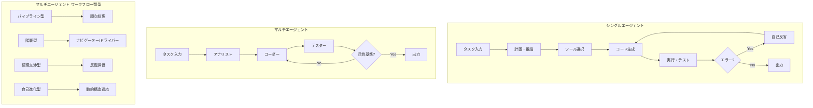
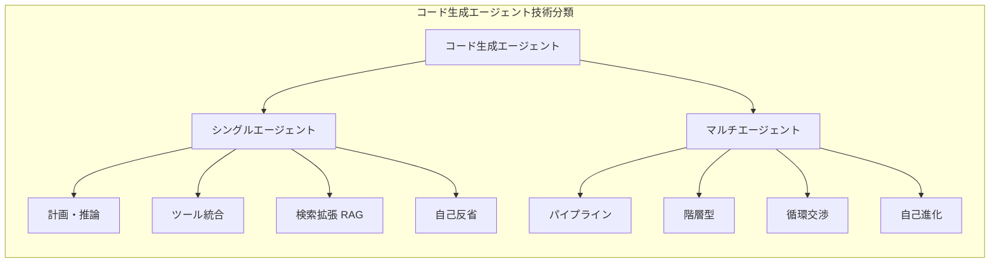

# A Survey on Code Generation with LLM-based Agents

- **Link**: https://arxiv.org/abs/2508.00083
- **Authors**: Yihong Dong, Xue Jiang, Jiaru Qian, Tian Wang, Kechi Zhang, Zhi Jin, Ge Li
- **Year**: 2025
- **Venue**: arXiv (cs.SE, cs.AI, cs.CL, cs.LG)
- **Type**: Academic Paper (Survey)

## Abstract

Code generation agents powered by large language models (LLMs) are revolutionizing the software development paradigm. This survey emphasizes three distinguishing features of code generation agents: autonomy enabling independent workflow management from task decomposition through debugging; expanded task scope covering the complete software development lifecycle rather than isolated code snippets; and a research shift toward engineering practicality including system reliability and tool integration over algorithmic innovation. The authors conducted systematic literature retrieval across major databases (ACM, IEEE, SpringerLink, Google Scholar, DBLP, CNKI) from 2022 to June 2025, ultimately analyzing 100 high-quality core papers from 447 candidates. The survey traces technological development, categorizes core techniques including single and multi-agent architectures, details applications across the SDLC, summarizes evaluation benchmarks, catalogs representative tools, and identifies research directions addressing current challenges.

## Abstract（日本語訳）

大規模言語モデル（LLM）を活用したコード生成エージェントは、ソフトウェア開発のパラダイムを革新している。本サーベイでは、コード生成エージェントの3つの特徴を強調する：タスク分解からデバッグまでの独立したワークフロー管理を可能にする自律性、孤立したコードスニペットではなくソフトウェア開発ライフサイクル全体をカバーする拡張されたタスク範囲、そしてアルゴリズムの革新よりもシステムの信頼性やツール統合を含むエンジニアリングの実用性への研究シフトである。著者らは2022年から2025年6月までの主要データベース（ACM、IEEE、SpringerLink、Google Scholar、DBLP、CNKI）を対象に体系的な文献検索を行い、447件の候補から100件の高品質なコア論文を分析した。本サーベイは技術発展の変遷を辿り、シングルエージェントおよびマルチエージェントアーキテクチャを含むコア技術を分類し、SDLC全体にわたるアプリケーションを詳述し、評価ベンチマークを要約し、代表的なツールをカタログ化し、現在の課題に対処する研究方向性を特定する。

## 概要

本論文は、LLMベースのコード生成エージェントに関する包括的なサーベイである。従来のLLMによるコード生成が個別の関数やスニペットの生成に留まっていたのに対し、エージェントベースのアプローチは要件定義からデバッグまでのソフトウェア開発ライフサイクル全体を自律的に管理できる点で根本的に異なる。著者らは447件の候補論文から100件のコア論文を精選し、シングルエージェント手法（計画・推論、ツール統合、検索拡張、自己反省）とマルチエージェントシステム（パイプライン型、階層型、循環型、自己進化型）の両方を体系的に分類した。さらに、SWE-Bench、HumanEval、MBPPなどの主要ベンチマークにおける評価結果を整理し、コード生成エージェントの現状と課題を明らかにしている。本サーベイは、開発者の役割が「コード作成者」から「タスク定義者・プロセス監督者・最終結果レビュアー」へと変革するという根本的なパラダイムシフトを指摘している。

## 問題設定

- **従来のLLMコード生成の限界**: 既存のLLMは単一の関数やコードスニペットの生成には優れるが、実際のソフトウェア開発で求められるファイル間のコンテキスト理解、動的デバッグ、反復的自己修正といった能力が不足している
- **ソフトウェア開発ライフサイクル全体のカバレッジ不足**: 従来研究は個別タスク（コード補完、バグ修正等）に焦点を当てており、要件定義からテスト、デプロイまでの統合的なワークフロー管理ができていない
- **エンジニアリング実用性の欠如**: 学術研究はアルゴリズム改善に注力する一方、実際のプロダクション環境で必要なシステム信頼性、プロセス管理、ツール統合への対応が遅れている
- **評価体系の不完全性**: 現行ベンチマークは実世界のソフトウェア開発の複雑さを十分に反映しておらず、エージェントの実用性を正確に測定できていない

## 提案手法

**体系的分類フレームワーク**

本サーベイは新たなシステムを提案するものではなく、既存技術の包括的な分類体系を提供する。コード生成エージェントの技術をシングルエージェントとマルチエージェントの2大カテゴリに分類し、それぞれの下位技術を体系化している。

### シングルエージェント手法

1. **計画・推論（Planning & Reasoning）**: Self-Planning、CodeChain、CodeActなどのチェーン型手法から、CodeTree、DARSなどのツリー構造型手法まで。DARSはSWE-Bench Liteで47% Pass@1を達成
2. **ツール統合（Tool Integration）**: ToolCoder、ToolGen、CodeAgentが検索・ドキュメント・インタプリタを統合
3. **検索拡張（Retrieval Enhancement）**: RepoHyper、CodeNav、知識グラフベースのRAG手法。cASTは抽象構文木ベースのチャンキングで意味的に一貫したブロック分割を実現
4. **自己反省・改善（Reflection & Self-Improvement）**: Self-Refine、Self-Debug、Self-Editによる反復的コード品質向上

### マルチエージェントシステム

1. **パイプライン型**: Self-Collaborationの3段階分業（アナリスト→コーダー→テスター）
2. **階層型**: PairCoderのナビゲーター/ドライバーモデル
3. **循環交渉型**: MapCoderの反復的評価・最適化サイクル
4. **自己進化型**: SEW、EvoMACによる動的構造適応

### SDLC全体への適用

- 自動コード生成（関数レベル、リポジトリレベル、エンドツーエンド）
- デバッグ・プログラム修復（MAGISはSWE-Benchで13.94%のIssue解決率）
- テストコード生成（TestPilotは25のnpmパッケージで52.8%のブランチカバレッジ）
- コードリファクタリング（構造的・性能最適化）
- 要件明確化（曖昧性検出、対話的ダイアログ）

## アルゴリズム（擬似コード）

```
Algorithm: LLM-based Code Generation Agent Core Loop
Input: Task specification T, Tool set Tools, Code repository R
Output: Generated/modified code C

1: procedure AGENT_LOOP(T, Tools, R)
2:   context ← PERCEIVE(T, R)           // 環境認識
3:   plan ← PLAN(context)                // タスク分解・計画策定
4:   memory ← INIT_MEMORY()
5:   
6:   while not TASK_COMPLETE(plan) do
7:     subtask ← GET_NEXT_SUBTASK(plan)
8:     
9:     // ツール選択・実行
10:    tool ← SELECT_TOOL(subtask, Tools)
11:    code ← GENERATE_CODE(subtask, context, memory)
12:    result ← EXECUTE(code, tool)
13:    
14:    // 自己反省・修正
15:    if HAS_ERROR(result) then
16:      diagnosis ← REFLECT(result, code, memory)
17:      code ← REFINE(code, diagnosis)
18:      result ← EXECUTE(code, tool)
19:    end if
20:    
21:    memory ← UPDATE_MEMORY(memory, subtask, result)
22:    plan ← UPDATE_PLAN(plan, result)    // 動的計画更新
23:  end while
24:  
25:  return AGGREGATE_RESULTS(memory)
26: end procedure
```

```
Algorithm: Multi-Agent Collaborative Code Generation
Input: Task T, Agent roles {Analyst, Coder, Tester, ...}
Output: Verified code C

1: procedure MULTI_AGENT_PIPELINE(T, Agents)
2:   // Phase 1: 要件分析
3:   spec ← Analyst.ANALYZE(T)
4:   
5:   // Phase 2: コード生成
6:   code ← Coder.GENERATE(spec)
7:   
8:   // Phase 3: テスト・検証
9:   test_results ← Tester.VERIFY(code, spec)
10:  
11:  // Phase 4: 反復改善
12:  while not QUALITY_THRESHOLD_MET(test_results) do
13:    feedback ← Tester.PROVIDE_FEEDBACK(test_results)
14:    code ← Coder.REFINE(code, feedback)
15:    test_results ← Tester.VERIFY(code, spec)
16:  end while
17:  
18:  return code
19: end procedure
```

## アーキテクチャ / プロセスフロー





## Figures & Tables

### Figure 1: 論文分布と出版動向
コード生成エージェントに関する論文は2023年に出現し始め、年々増加傾向にある。トップティア会議（ICSE、ASE、FSE、ISSTA、TOSEM）および学際的会議（ACL、ICLR、NeurIPS、ICML、AAAI）に掲載されている。447件の候補から100件のコア論文が選定された。

### Figure 2: 技術発展のタイムライン
コード生成エージェントの主要技術（計画、ツール統合、反省、マルチエージェント）の時系列的発展を示す。2023年初頭のSelf-Planningから2025年のEvoMAC、DARSまでの技術進化が可視化されている。

### Figure 3: シングルエージェントコード生成手法の概要
シングルエージェントの4つの主要技術カテゴリ（計画・推論、ツール統合、検索拡張、自己反省）とそれぞれの代表的手法を示すマップ。

### Figure 4: マルチエージェントコード生成システムの概要
マルチエージェントシステムの3つの側面（ワークフロー設計、コンテキスト管理、協調最適化）と具体的なアプローチを図示。Blackboardモデル（Self-Collaboration）、von Neumannアーキテクチャ（L2MAC）、神経生物学的着想（Cogito）などが含まれる。

### Figure 5: SDLC全体にわたるアプリケーション分類
コード生成エージェントの適用領域を5カテゴリ（自動コード生成、デバッグ・修復、テスト生成、リファクタリング、要件明確化）に分類した包括的タクソノミー。

### Table: 主要ベンチマーク結果サマリー

| ベンチマーク | 手法 | 結果 |
|---|---|---|
| SWE-Bench Lite | DARS | 47% Pass@1 |
| SWE-Bench | MAGIS | 13.94% Issue解決率 |
| npm 25パッケージ | TestPilot | 52.8% ブランチカバレッジ |
| Defects4J | RepairAgent | 164バグ修正 |
| セキュリティ評価 | AutoSafeCoder | 脆弱性率~13%削減 |

## 実験・評価

### セットアップ

本サーベイは体系的文献レビューとして、以下のデータベースから論文を収集した：
- ACM Digital Library、IEEE Xplore、SpringerLink、Google Scholar、DBLP、CNKI
- 対象期間: 2022年～2025年6月
- 初期候補: 447件 → 品質フィルタリング後: 100件のコア論文

### 主要結果

**シングルエージェントの到達点**:
- 関数レベル: CodeChainがモジュラーアプローチで改善、CodeTreeが複雑タスクの失敗率を低減
- リポジトリレベル: DARSが従来の線形/ランダム手法に対してSWE-Bench Liteで47% Pass@1を達成
- デバッグ: RepairAgentがDefects4Jで164件の実バグを修正

**マルチエージェントの到達点**:
- Self-Collaborationの3段階パイプラインがベースラインを大幅に上回る
- PairCoderの階層型モデルが複雑なプロジェクトで効果的
- EvoMACの自己進化型アーキテクチャが動的タスク適応を実現

**研究課題の特定**:
1. コア能力の限界（推論深度不足、ハルシネーション、コンテキストウィンドウ制約）
2. 堅牢性・更新性（マルチステップでのエラー伝播）
3. オープン環境でのツール統合（プライベートコードベース、カスタムビルドプロセス）
4. 信頼性・セキュリティ（論理的欠陥、性能問題、セキュリティ脆弱性）
5. 評価体系の完全性（現行ベンチマークの不十分さ）

## 備考

- 本サーベイはコード生成エージェント分野の最も包括的なレビューの一つであり、447件から厳選した100件の論文を分析している
- 開発者の役割変革（コード作成者 → タスク定義者・プロセス監督者）という重要なパラダイムシフトを指摘
- 研究の重点が「アルゴリズム革新」から「エンジニアリング実用性」（システム信頼性、プロセス管理、ツール統合）へ移行していることを明確化
- マルチエージェントシステムの分類（パイプライン/階層/循環/自己進化）は、今後のエージェント設計の指針となる
- Work in progress (V2) であり、今後の更新が予定されている
