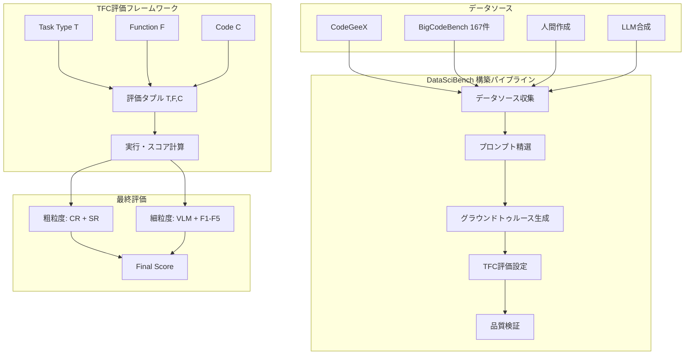
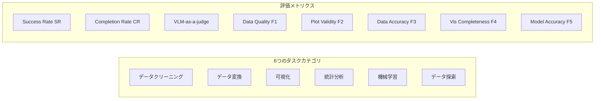

# DataSciBench: An LLM Agent Benchmark for Data Science

- **Link**: https://arxiv.org/abs/2502.13897
- **Authors**: Dan Zhang, Sining Zhoubian, Min Cai, Fengzu Li, Lekang Yang, Wei Wang, Tianjiao Dong, Ziniu Hu, Jie Tang, Yisong Yue
- **Year**: 2025
- **Venue**: arXiv (cs.CL)
- **Type**: Academic Paper

## Abstract

This paper presents DataSciBench, a comprehensive benchmark for evaluating Large Language Model (LLM) capabilities in data science. The benchmark is constructed based on natural and challenging prompts addressing uncertain ground truth and evaluation metrics. DataSciBench features 222 curated prompts with 519 ground truth test cases, evaluating 23 models (6 API-based, 8 general open-source, 9 code-specialized open-source) across 6 data science task types. The authors employ a semi-automated pipeline with LLM-based consistency checks and human review to generate reliable ground truth, and introduce a Task-Function-Code (TFC) framework for assessing code execution against programmatic rules. Results show API-based models outperform open-source alternatives, with GPT-4o achieving 64.51% and Deepseek-Coder-33B-Instruct achieving the highest performance among open-source options at 56.76%.

## Abstract（日本語訳）

本論文は、データサイエンスにおける大規模言語モデル（LLM）の能力を評価するための包括的なベンチマークであるDataSciBenchを提案する。本ベンチマークは、不確実なグラウンドトゥルースと評価メトリクスに対処する自然で挑戦的なプロンプトに基づいて構築されている。DataSciBenchは222件の精選されたプロンプトと519件のグラウンドトゥルーステストケースを特徴とし、6つのデータサイエンスタスクタイプにわたって23モデル（APIベース6件、汎用オープンソース8件、コード特化オープンソース9件）を評価する。著者らはLLMベースの一貫性チェックと人間によるレビューを組み合わせた半自動パイプラインを用いて信頼性の高いグラウンドトゥルースを生成し、プログラム的ルールに対するコード実行を評価するためのTask-Function-Code（TFC）フレームワークを導入する。結果として、APIベースモデルがオープンソースを大幅に上回り、GPT-4oが64.51%、オープンソースではDeepseek-Coder-33B-Instructが56.76%で最高性能を達成した。

## 概要

DataSciBenchは、既存のベンチマークが「単一タスク、容易に取得可能なグラウンドトゥルース、単純な評価メトリクス」に偏重している問題に対処するために設計されたデータサイエンス評価フレームワークである。実世界のデータサイエンスでは、複数のステップにまたがる推論、多様な出力形式（表、グラフ、モデル等）、不確実なグラウンドトゥルースへの対処が求められるが、既存ベンチマークはこれらの複雑性を十分に捉えていない。本ベンチマークは、CodeGeeXプラットフォームからの実データ、BigCodeBenchからの精選データ、人間作成データ、LLM合成データを組み合わせた222件のプロンプトで構成される。評価にはTask-Function-Code（TFC）フレームワークを導入し、タスク種別・評価関数・実行コードの3要素を統合することで、多様な出力を標準化されたブール/小数メトリクスに変換する。23モデルの包括的評価により、APIベースモデルの優位性、推論能力とデータサイエンス能力の乖離、大規模特化モデルの意外な性能低下など、重要な知見が得られた。

## 問題設定

- **既存ベンチマークの限界**: 従来のベンチマーク（HumanEval、MBPP等）は単一のコード生成タスクに焦点を当てており、データサイエンスの複雑なマルチステップワークフローを評価できない
- **グラウンドトゥルースの不確実性**: データサイエンスタスクでは正解が一意に定まらない場合が多く（例：クラスタリング、可視化）、従来のテストケースベースの評価が適用困難
- **評価メトリクスの多様性**: データ品質、可視化の正確性、モデル精度など、タスクによって異なる評価基準を統一的に扱うフレームワークが存在しない
- **指示追従能力の未評価**: LLMが推論能力を持っていても、データサイエンスタスクで求められる詳細な指示への正確な追従ができていない点が十分に評価されていない

## 提案手法

**Task-Function-Code（TFC）フレームワーク**

TFCは評価タプル (T, F, C) として構造化される：

- **T（Task Type）**: 6つのデータサイエンスタスクカテゴリ
- **F（Function）**: 25種類の集約評価関数
- **C（Code）**: プログラム的に実行可能な評価コード

このフレームワークにより、多様な出力形式を統一的なブール値（0/1）または小数値（0-1）のメトリクスに変換する。例えば、シルエットスコアの閾値は0.5に設定される。

**主要な数式**:

最終スコア計算式:
$$\text{Final Score} = 0.65 \times CR + 0.05 \times SR + 0.05 \times VLM + 0.05 \times \sum_{i=1}^{5} F_i$$

ここで:
- CR (Completion Rate): ステップごとのスコア（各ステップ0-2点、最大2T点）
- SR (Success Rate): 10回実行での完全成功率
- VLM: GPT-4o-miniによる視覚評価
- F1-F5: 細粒度評価メトリクス（データ品質、プロット妥当性、データ精度、可視化完全性、モデル精度）

**データセット構築パイプライン**:

1. **収集**: CodeGeeXプラットフォーム、BigCodeBench（167件）、人間作成、LLM合成の4ソースから222件を収集
2. **品質保証**: 3段階の専門家レビュー（正確性、標準化フォーマット、データセット可用性）
3. **グラウンドトゥルース生成**: マルチサンプリングによる一貫性検証、非BCBプロンプトは3名の著者の合意による相互検証

## アルゴリズム（擬似コード）

```
Algorithm: DataSciBench TFC Evaluation Framework
Input: Model output O, Task type T, Ground truth GT
Output: Evaluation score S ∈ [0, 1]

1: procedure TFC_EVALUATE(O, T, GT)
2:   // Step 1: タスクタイプに基づく評価関数の選択
3:   F ← SELECT_FUNCTION(T)  // 25種類の集約関数から選択
4:   
5:   // Step 2: プログラム的評価コードの生成・実行
6:   C ← GENERATE_EVAL_CODE(F, GT)
7:   raw_score ← EXECUTE(C, O)
8:   
9:   // Step 3: スコアの正規化
10:  normalized ← NORMALIZE(raw_score, F.threshold)
11:  
12:  return normalized
13: end procedure

14: procedure COMPUTE_FINAL_SCORE(model, prompts)
15:   CR ← 0, SR ← 0, VLM ← 0, F_scores ← [0]*5
16:   
17:   for each prompt p in prompts do
18:     // 粗粒度評価
19:     CR += STEP_SCORE(model, p) / (2 * |steps(p)|)
20:     SR += SUCCESS_RATE(model, p, runs=10)
21:     
22:     // 細粒度評価
23:     VLM += VLM_JUDGE(model.output(p))       // GPT-4o-mini
24:     F_scores[0] += DATA_QUALITY_F1(model, p)
25:     F_scores[1] += PLOT_VALIDITY(model, p)
26:     F_scores[2] += DATA_ACCURACY_MSE(model, p)
27:     F_scores[3] += VIS_COMPLETENESS(model, p)
28:     F_scores[4] += MODEL_ACCURACY(model, p)
29:   end for
30:   
31:   // 最終スコア
32:   S ← 0.65*CR + 0.05*SR + 0.05*VLM + 0.05*SUM(F_scores)
33:   return S / |prompts|
34: end procedure
```

## アーキテクチャ / プロセスフロー





## Figures & Tables

### Figure 2: DataSciBenchフレームワーク全体像
プロンプト精選、TFC検証、モデル評価の3つの統合コンポーネントから成るフレームワークの全体構造を示す。各コンポーネントがパイプライン的に接続され、入力プロンプトからモデルスコアまでの一貫した評価フローを実現している。

### Figure 3: タスクタイプと集約関数の分布
6つのタスクタイプと25の集約関数がベンチマーク全体にどのように分布しているかを可視化。データ探索・可視化タスクが最も多く、機械学習タスクが最も少ない分布パターンが確認できる。

### Table 1: 関連ベンチマークとの比較

| ベンチマーク | 評価方式 | タスク複雑度 | GT生成 |
|---|---|---|---|
| HumanEval | テストケース | 単一関数 | 手動 |
| MBPP | テストケース | 単一関数 | 手動 |
| BigCodeBench | テストケース | マルチステップ | 手動 |
| **DataSciBench** | **集約メトリクス + プログラム的ルール** | **マルチステップ** | **半自動** |

DataSciBenchは「集約メトリクスとプログラム的ルール」を使用する点で既存ベンチマークと差別化される。

### Table 2: 全体結果（主要モデル抜粋）

| モデル | カテゴリ | 最終スコア |
|---|---|---|
| GPT-4o | API | 64.51% |
| GPT-4-Turbo | API | 54.65% |
| Claude-3.5-Sonnet | API | 52.29% |
| o1-mini | API | 29.77% |
| GLM-4-Flash | API | 30.74% |
| Deepseek-Coder-33B | コード特化OS | 56.76% |
| Qwen2.5-Coder-7B | コード特化OS | 47.67% |
| Qwen2.5-7B | 汎用OS | 45.99% |
| Deepseek-Coder-6.7B | コード特化OS | 38.45% |
| CodeLlama-34B | コード特化OS | 1.33% |

### Table 3: 関連ベンチマークとの相関

| 比較対象 | ピアソン相関 |
|---|---|
| LiveCodeBench | 0.853 |
| BigCodeBench | 0.823 |

DataSciBenchのスコアは既存のコード生成ベンチマークと高い相関を示すが、o1-miniのような異常値（推論は得意だがデータサイエンスは苦手）を検出できる点で差別化される。

## 実験・評価

### セットアップ

- **評価対象**: 23モデル（APIベース6、汎用オープンソース8、コード特化オープンソース9）
- **プロンプト数**: 222件、519件のグラウンドトゥルーステストケース
- **タスクカテゴリ**: 6種類のデータサイエンスタスク
- **実行回数**: Success Rate算出のため各プロンプト10回実行
- **評価メトリクス**: 粗粒度（CR, SR）+ 細粒度（VLM, F1-F5）の組み合わせ

### 主要結果

**APIモデル vs オープンソース**:
- GPT-4oが64.51%で全体最高。GPT-4-Turboを9.86ポイント上回る
- オープンソースではDeepseek-Coder-33Bが56.76%で最高、APIモデルのGPT-4-Turboに匹敵
- Claude-3.5-Sonnetは52.29%で中位

**推論能力 vs データサイエンス能力の乖離**:
- o1-miniは推論ベンチマークでは高性能だが、DataSciBenchでは29.77%と低迷
- 「推論タスクに習熟したモデルが、詳細な指示への正確な追従を要するデータサイエンスタスクで一貫して優れるとは限らない」

**大規模モデルの逆転現象**:
- CodeLlama-34B（1.33%）がCodeLlama-7Bを大幅に下回る異常事態
- 訓練データのフォーマットバイアスにより、指示追従の柔軟性が制限されたことが原因

**ベンチマーク間の相関**:
- LiveCodeBenchとの相関: 0.853、BigCodeBenchとの相関: 0.823
- 高い相関を示しつつも、データサイエンス固有の能力差異を検出可能

## 備考

- DataSciBenchはデータサイエンス領域に特化した初の包括的ベンチマークであり、マルチタスク複雑性に対応
- TFCフレームワークは評価関数の定義を体系化し、不確実なグラウンドトゥルースへの対処を可能にした
- o1-miniの低性能は、推論能力がデータサイエンス能力を保証しないことの実証的証拠として重要
- コードとデータはGitHub（github.com/THUDM/DataSciBench）で公開
- 40ページ、7図、6表の包括的な論文構成
- 222プロンプトの内訳: BigCodeBenchからの精選167件 + その他55件
