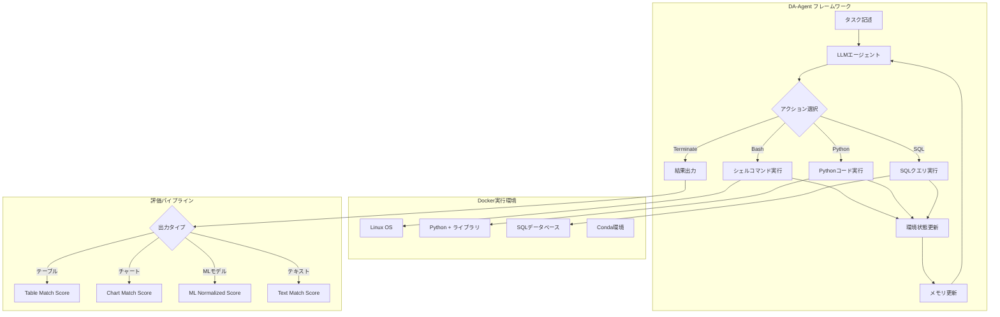
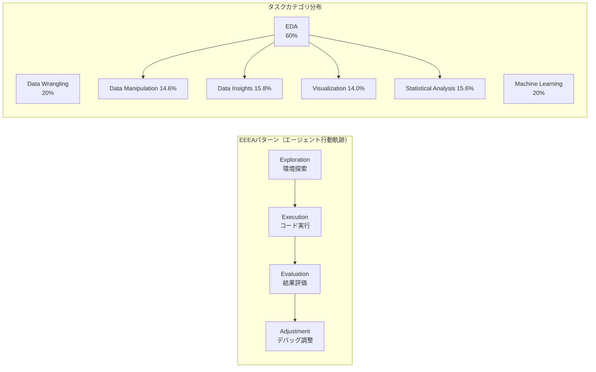

# DA-Code: Agent Data Science Code Generation Benchmark for Large Language Models

- **Link**: https://arxiv.org/abs/2410.07331
- **Authors**: Yiming Huang, Jianwen Luo, Yan Yu, Yitong Zhang, Fangyu Lei, Yifan Wei, Shizhu He, Lifu Huang, Xiao Liu, Jun Zhao, Kang Liu
- **Year**: 2024
- **Venue**: EMNLP 2024
- **Type**: Academic Paper

## Abstract

We introduce DA-Code, a code generation benchmark designed to assess LLMs on agent-based data science tasks. This benchmark features three key characteristics: first, the tasks require advanced coding skills in grounding and planning, making them challenging for LLMs; second, the examples are based on real and diverse data, covering complex data wrangling and analytics tasks; and third, the tasks necessitate the use of complex data science programming languages, including Python, SQL, and Bash. We set up the benchmark with 500 tasks, evaluate different LLMs and agent frameworks on it, and find that even the best-performing model, GPT-4o, achieves only 33.3% accuracy on the benchmark. We further propose DA-Agent, a baseline agent framework that outperforms existing ones. Our results highlight the limitations of current LLMs in handling complex data science tasks and the potential for further improvement. The benchmark is available at https://da-code-bench.github.io.

## Abstract（日本語訳）

我々はDA-Codeを紹介する。これはエージェントベースのデータサイエンスタスクにおけるLLMを評価するために設計されたコード生成ベンチマークである。本ベンチマークは3つの主要な特徴を持つ：第一に、タスクはグラウンディングと計画における高度なコーディングスキルを要求し、LLMにとって挑戦的である。第二に、例題は実際の多様なデータに基づいており、複雑なデータラングリングと分析タスクをカバーする。第三に、タスクはPython、SQL、Bashを含む複雑なデータサイエンスプログラミング言語の使用を必要とする。我々は500タスクでベンチマークを構築し、異なるLLMとエージェントフレームワークを評価した結果、最高性能モデルであるGPT-4oでさえ33.3%の精度しか達成できないことを発見した。さらに、既存フレームワークを上回るベースラインエージェントフレームワークDA-Agentを提案する。

## 概要

DA-Codeは、エージェントベースのデータサイエンスコード生成を評価するための500タスクのベンチマークである。既存ベンチマーク（DS-1000、Arcade等）がコード補完や単一ステップのタスクに焦点を当てているのに対し、DA-Codeは自律的な推論・計画を要する複雑なデータサイエンスタスクを対象とする。各タスクは平均5.7ファイル、平均85行のソリューションコードを必要とし、実世界のKaggle・GitHubデータセットから構築されている。タスクはデータラングリング（20%）、探索的データ分析（60%）、機械学習（20%）の3カテゴリに分類され、Easy/Medium/Hardの3難易度レベルで構成される。DA-Agentフレームワークは、Docker環境でBash/Python/SQLのマルチ言語アクション空間を提供し、99.5%の完了率を達成する。しかし、最先端モデルでも30%台の精度に留まり、LLMの複雑なデータサイエンス能力における大きな改善余地を示している。

## 問題設定

- **既存ベンチマークの単純さ**: DS-1000やArcadeなどの既存ベンチマークは、コード補完や短いコードスニペット（2-20行）の生成に焦点を当てており、実世界のデータサイエンスワークフローの複雑さを反映していない
- **エージェント的能力の未評価**: 従来のベンチマークは自律的な計画立案、環境探索、動的デバッグといったエージェント的能力を必要としない。実際のデータサイエンティストは多数のファイルを探索し、試行錯誤を繰り返す
- **多言語・多モーダルの欠如**: 実世界のデータサイエンスはPython、SQL、Bashを横断的に使用するが、既存ベンチマークはPythonのみに限定されることが多い
- **実データの複雑性**: 実データはノイズ、欠損値、複雑なスキーマを含むが、既存ベンチマークはクリーンなデータを前提としている

## 提案手法

**DA-Agent フレームワーク**

DA-Agentは、Docker環境上に構築されたエージェントフレームワークであり、以下の要素で構成される。

### タスク定式化

エージェントのデータサイエンスタスクは以下の3プロセスで定式化される：

1. **行動生成（Action Generation）**: メモリ m_t と状態 s_t から次の行動 a_{t+1} とコードを生成
2. **行動実行（Action Execution）**: 環境が行動を処理し、状態を更新して観測を返す
3. **メモリ更新（Memory Update）**: 履歴情報をメモリウィンドウサイズ k に制約して更新

### アクション空間

4種類のアクションが定義されている：

- **Bash(command)**: システム操作（ファイル探索、パッケージインストール等）
- **Python(save_path, code)**: データ処理・分析（pandas、sklearn等のライブラリ使用）
- **SQL(file_path, command, output)**: データベースクエリ
- **Terminate(output)**: タスク完了マーカー

### 応答タイプ

- 標準出力（成功時）
- エラーメッセージ（デバッグ用）
- 出力なしの実行成功
- 不受理アクション（フォーマット不一致）
- 実行タイムアウト（300秒超過）

### 評価メトリクス

3種類のスコアリング手法：

1. **Table Match Score**: 参照との完全一致（バイナリ: 0/1）
2. **Chart Match Score**: 数値データ(D)とプロット設定(I)の両方を比較（バイナリ）
3. **ML Normalized Score**: 正規化式 Score = min(1, max(0, (ŝ - S_baseline)/(S_best - S_baseline)))

**主要な数式**:

$$\text{ML Score} = \min(1, \max(0, \frac{\hat{s} - S_{\text{baseline}}}{S_{\text{best}} - S_{\text{baseline}}}))$$

ここで ŝ はモデルの予測スコア、S_baseline はベースライン性能、S_best は最良性能である。

## アルゴリズム（擬似コード）

```
Algorithm: DA-Agent Framework
Input: Task description T, Data files D, Memory window k
Output: Task result R

1: procedure DA_AGENT(T, D, k)
2:   env ← INIT_DOCKER_ENV(D)          // Docker環境初期化
3:   memory ← []
4:   state ← env.OBSERVE()
5:   
6:   while not TERMINATED do
7:     // Phase 1: 環境探索 (Exploration)
8:     action ← LLM.GENERATE(T, state, memory[-k:])
9:     
10:    // Phase 2: アクション選択・実行
11:    switch action.type:
12:      case "Bash":
13:        result ← env.EXEC_BASH(action.command)
14:      case "Python":
15:        result ← env.EXEC_PYTHON(action.code, action.save_path)
16:      case "SQL":
17:        result ← env.EXEC_SQL(action.file_path, action.command)
18:      case "Terminate":
19:        R ← action.output
20:        break
21:    
22:    // Phase 3: 状態更新
23:    state ← env.OBSERVE()
24:    
25:    // Phase 4: メモリ更新（ウィンドウ制約）
26:    memory.APPEND((action, result))
27:    if |memory| > k then
28:      memory ← memory[-k:]
29:    end if
30:    
31:    // タイムアウトチェック
32:    if ELAPSED_TIME > 300s then
33:      return TIMEOUT_ERROR
34:    end if
35:  end while
36:  
37:  return R
38: end procedure
```

```
Algorithm: DA-Code Benchmark Evaluation
Input: Model M, Tasks {T_1,...,T_500}, DA-Agent framework
Output: Overall score S

1: procedure EVALUATE(M, Tasks)
2:   scores ← []
3:   for each task T_i in Tasks do
4:     result ← DA_AGENT(T_i, M)
5:     
6:     switch T_i.output_type:
7:       case "table":
8:         s ← TABLE_MATCH(result, T_i.ground_truth)
9:       case "chart":
10:        s ← CHART_MATCH(result.data, result.config, 
11:                         T_i.gt_data, T_i.gt_config)
12:      case "ml_model":
13:        s ← ML_NORMALIZE(result.metric, T_i.baseline, T_i.best)
14:      case "text":
15:        s ← TEXT_MATCH(result, T_i.ground_truth)
16:    
17:    scores.APPEND(s)
18:  end for
19:  
20:  return MEAN(scores)
21: end procedure
```

## アーキテクチャ / プロセスフロー





## Figures & Tables

### Table 1: 既存ベンチマークとの比較

| ベンチマーク | 実行環境 | 計画要求 | 平均ファイル数 | 平均ソリューション行数 |
|---|---|---|---|---|
| DS-1000 | なし | なし | 1 | 2-5行 |
| Arcade | なし | なし | 1-2 | 5-10行 |
| BigCodeBench | あり | 低 | 1-4.8 | 10-20行 |
| **DA-Code** | **Docker** | **高** | **5.7** | **85行** |

DA-Codeは実行環境の制御可能性、計画要求の高さ、ファイル数・ソリューション複雑度において既存ベンチマークを大幅に上回る。

### Table 2: ベンチマーク統計

| 項目 | 値 |
|---|---|
| 総タスク数 | 500 |
| Easy | 105 (22.8%) |
| Medium | 292 (57.3%) |
| Hard | 103 (19.9%) |
| 平均ファイル数/タスク | 5.7 |
| 平均ソリューション行数 | 85 |

### Table 3: モデル別主要結果

| モデル | 全体スコア | DW | ML | EDA | Easy | Medium | Hard |
|---|---|---|---|---|---|---|---|
| GPT-4o | 33.3% | 48.0% | 21.3% | 46.2% | 25.6% | 21.7% | 29.1% |
| GPT-4 | 30.4% | 48.4% | 24.6% | 45.4% | 27.8% | 23.4% | 30.5% |
| Claude-3-Opus | 29.3% | 46.8% | 20.7% | 44.7% | 23.8% | 19.0% | 27.6% |
| Qwen2.5-72B | 24.9% | 41.8% | 15.4% | 31.9% | 19.4% | 22.3% | 22.6% |
| Deepseek-Coder-V2.5 | 25.1% | 34.1% | 14.7% | 32.8% | 18.7% | 14.1% | 20.7% |
| Mixtral-8x22B | 14.8% | 31.6% | 10.2% | 17.6% | 16.8% | 8.6% | 15.4% |

### Table 4: アブレーション研究（DA-Code-100サブセット、GPT-4使用）

| 構成 | スコア | 完了率 |
|---|---|---|
| ベースライン DA-Agent | 31.5% | 99.5% |
| 参照計画あり | 39.7% | 97.7% |
| 最大履歴 = 10 | 32.3% | 98.2% |
| 最大履歴 = 5 | 30.8% | 95.4% |

参照計画の提供により+8.2ポイントの大幅改善が確認され、計画能力が主要ボトルネックであることが示された。

### Table 5: フレームワーク比較（GPT-4、100タスクサブセット）

| フレームワーク | スコア | 完了率 |
|---|---|---|
| X-Agent | 6.7% | 38.7% |
| AutoGen | 18.6% | 78.8% |
| OpenDevin | 26.2% | 96.0% |
| **DA-Agent** | **31.5%** | **99.5%** |

DA-Agentが全指標で最高性能を達成。特に完了率99.5%は他フレームワークを大幅に上回る。

### Figure: EEEAパターン分析
エージェントの行動軌跡パターン（Exploration→Execution→Evaluation→Adjustment）の分析結果。高性能モデルはタスク後半でファイル操作を減少させデバッグを増加させる一方、低性能モデルは探索フェーズに留まり続ける傾向がある。

## 実験・評価

### セットアップ

- **タスク数**: 500タスク（3難易度レベル、3カテゴリ）
- **評価モデル**: GPT-4、GPT-4o、Claude-3-Opus、Qwen2.5-72B、Deepseek-Coder-V2.5、Mixtral-8x22B等
- **比較フレームワーク**: X-Agent、AutoGen、OpenDevin、DA-Agent
- **実行環境**: Docker（Linux、Python、SQL、Conda）
- **タイムアウト**: 300秒/アクション
- **アノテーター**: 10名のデータサイエンス専門家
- **品質保証**: クロスバリデーション + レッドチームテスト

### 主要結果

**全体的な性能ギャップ**:
- 最先端モデル（GPT-4o）でも33.3%の精度に留まり、LLMの複雑なデータサイエンス能力の大幅な限界を示す
- オープンソースモデルはさらに低く、Mixtral-8x22Bは14.8%

**難易度別分析**:
- GPT-4: Easy 27.8% → Medium 23.4% → Hard 30.5%（Hardでの逆転はタスク構成の影響）
- 全体的に難易度上昇に伴い性能が低下し、3段階分類の妥当性を検証

**タスクタイプ別分析**:
- データラングリングがML/EDAに比べて低性能（訓練データの偏り）
- 実行可能コード生成率はGPT-4で76.8%だが、全体精度は30%台（実行vs推論の乖離）

**計画能力の重要性**:
- 参照計画の提供で+8.2ポイント改善、計画立案が主要ボトルネック
- 最初の5-10ステップで成功率が頭打ち、追加ステップでは回復困難

**フレームワーク比較**:
- DA-Agentが31.5%/99.5%で最高性能
- X-Agentは6.7%/38.7%と大幅に低迷（環境との接続問題）

## 備考

- DA-Codeは EMNLP 2024 に採択された、エージェントベースデータサイエンスベンチマークの重要な研究
- 500タスクの規模と平均85行のソリューション複雑度は既存ベンチマークを大幅に上回る
- EEEAパターン（Exploration→Execution→Evaluation→Adjustment）の発見は、エージェント行動分析の新たな視座を提供
- 最先端モデルでも30%台の精度は、データサイエンスエージェントの研究がまだ初期段階にあることを示す
- 計画能力の改善が最も効果的な介入ポイント（+8.2%）であることは、今後のエージェント設計への重要な示唆
- ベンチマークはhttps://da-code-bench.github.ioで公開
- 10名の専門アノテーターによる品質保証とレッドチームテストにより高い信頼性を確保
