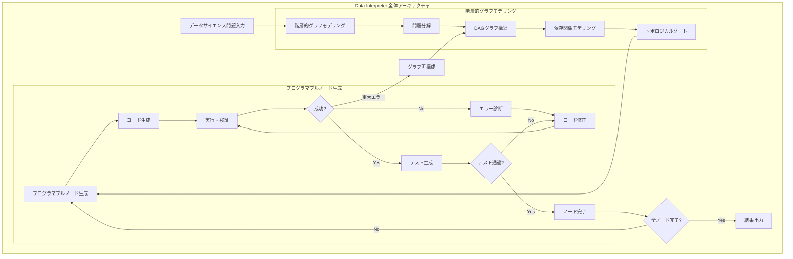
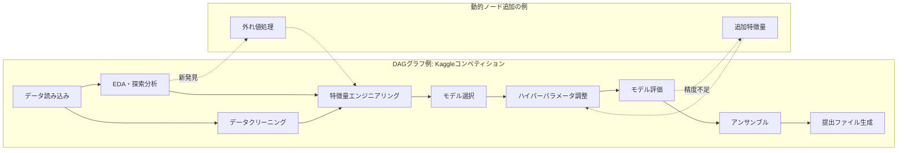

# Data Interpreter: An LLM Agent For Data Science

- **Link**: https://arxiv.org/abs/2402.18679
- **Authors**: Sirui Hong, Yizhang Lin, Bang Liu, Bangbang Liu, Binhao Wu, Ceyao Zhang, Chenxing Wei, Danyang Li, Jiaqi Chen, Jiayi Zhang, Jinlin Wang, Li Zhang, Lingyao Zhang, Min Yang, Mingchen Zhuge, Taicheng Guo, Tuo Zhou, Wei Tao, Xiangru Tang, Xiangtao Lu, Xiawu Zheng, Xinbing Liang, Yaying Fei, Yuheng Cheng, Zhibin Gou, Zongze Xu, Chenglin Wu
- **Year**: 2024
- **Venue**: arXiv (cs.AI, cs.LG)
- **Type**: Academic Paper

## Abstract

Large Language Model (LLM)-based agents have shown effectiveness across many applications. However, their use in data science scenarios requiring solving long-term interconnected tasks, dynamic data adjustments and domain expertise remains challenging. Previous approaches primarily focus on individual tasks, making it difficult to assess the complete data science workflow. Moreover, they struggle to handle real-time changes in intermediate data and fail to adapt dynamically to evolving task dependencies inherent to data science problems. In this paper, we present Data Interpreter, an LLM-based agent designed to automatically solve various data science problems end-to-end. Our Data Interpreter incorporates two key modules: 1) Hierarchical Graph Modeling, which breaks down complex problems into manageable subproblems, enabling dynamic node generation and graph optimization; and 2) Programmable Node Generation, a technique that refines and verifies each subproblem to iteratively improve code generation results and robustness. Extensive experiments consistently demonstrate the superiority of Data Interpreter. On InfiAgent-DABench, it achieves a 25% performance boost, raising accuracy from 75.9% to 94.9%. For machine learning and open-ended tasks, it improves performance from 88% to 95%, and from 60% to 97%, respectively. Moreover, on the MATH dataset, Data Interpreter achieves remarkable performance with a 26% improvement compared to state-of-the-art baselines.

## Abstract（日本語訳）

大規模言語モデル（LLM）ベースのエージェントは多くのアプリケーションで有効性を示してきた。しかし、長期的に相互接続されたタスクの解決、動的データ調整、ドメイン専門知識を必要とするデータサイエンスシナリオでの使用は依然として困難である。従来のアプローチは主に個別タスクに焦点を当てており、完全なデータサイエンスワークフローの評価が困難である。さらに、中間データのリアルタイム変更への対応や、データサイエンス問題に内在する進化するタスク依存関係への動的適応に苦戦している。本論文では、様々なデータサイエンス問題をエンドツーエンドで自動的に解決するように設計されたLLMベースのエージェント、Data Interpreterを提案する。Data Interpreterは2つの主要モジュールを組み込んでいる：1）複雑な問題を管理可能なサブ問題に分解し、動的ノード生成とグラフ最適化を可能にする階層的グラフモデリング（Hierarchical Graph Modeling）、2）各サブ問題を洗練・検証してコード生成結果と堅牢性を反復的に改善するプログラマブルノード生成（Programmable Node Generation）。広範な実験により、Data Interpreterの優位性が一貫して実証された。InfiAgent-DABenchでは25%の性能向上（75.9%→94.9%）、機械学習タスクでは88%→95%、オープンエンドタスクでは60%→97%の改善を達成し、MATHデータセットでは最先端ベースラインに対して26%の改善を達成した。

## 概要

Data Interpreterは、MetaGPTフレームワーク上に構築されたLLMベースのデータサイエンスエージェントである。従来のエージェントが個別タスクに焦点を当て、タスク間の依存関係や中間データの動的変化に対応できなかった問題を解決するために設計された。核心的な技術革新は2つのモジュールにある。第一の「階層的グラフモデリング（Hierarchical Graph Modeling）」は、複雑なデータサイエンス問題を有向非巡回グラフ（DAG）として表現し、各ノードが実行可能なサブタスクに対応する。これにより、タスク間の依存関係を明示的にモデル化し、実行時の動的なノード追加・削除・再構成が可能になる。第二の「プログラマブルノード生成（Programmable Node Generation）」は、各ノードのコード生成を反復的に洗練・検証するメカニズムであり、エラー検出時の自動修正やテストケース生成による品質保証を実現する。InfiAgent-DABenchで75.9%から94.9%への25%改善、MATHデータセットで26%改善など、複数のベンチマークで大幅な性能向上を達成している。

## 問題設定

- **タスク間依存関係の管理困難**: データサイエンスワークフローでは、データ前処理→特徴量エンジニアリング→モデル訓練→評価といったタスクが密接に連鎖しており、一つのタスクの変更が後続タスク全体に影響する。従来のエージェントはこの相互依存性を適切に管理できない
- **中間データの動的変化への非対応**: データサイエンスでは、探索的分析の結果に基づいてワークフローを動的に変更する必要があるが、従来の線形パイプラインではこのような適応が困難
- **個別タスク最適化の限界**: 既存アプローチは個別のコード生成タスク（関数生成、バグ修正等）を独立に最適化するが、データサイエンスのエンドツーエンドワークフローでは全体最適化が必要
- **コード生成の堅牢性不足**: 生成されたコードがエッジケースやデータ品質の問題に対して脆弱であり、実行時エラーが頻発する

## 提案手法

**Data Interpreter**

Data Interpreterは、2つの革新的モジュールを中心に構築されたLLMベースのデータサイエンスエージェントである。

### モジュール1: 階層的グラフモデリング（Hierarchical Graph Modeling）

複雑なデータサイエンス問題を有向非巡回グラフ（DAG）として構造化する手法。

**コアコンセプト**:
- 各ノードは実行可能なサブタスク（データ読み込み、前処理、特徴量生成、モデル訓練等）に対応
- エッジはタスク間のデータ依存関係を表現
- グラフ構造により、並列実行可能なタスクの特定と順序制約の明示化が可能

**動的グラフ操作**:
- **ノード追加**: 実行結果に基づいて新たなサブタスクを動的に追加
- **ノード削除**: 不要と判断されたサブタスクの除去
- **エッジ再構成**: タスク依存関係の動的更新
- **グラフ最適化**: 全体的なワークフロー効率の改善

**階層性**:
- 上位レベル: 問題全体の分解と計画（例: "Kaggleコンペティションで精度90%以上を達成"）
- 中位レベル: 各フェーズの詳細化（例: "特徴量エンジニアリング"）
- 下位レベル: 具体的な実行ステップ（例: "欠損値をmedianで補完"）

### モジュール2: プログラマブルノード生成（Programmable Node Generation）

各ノード（サブタスク）のコード生成を反復的に洗練・検証する手法。

**プロセス**:
1. **初期コード生成**: LLMがサブタスク仕様に基づいてコードを生成
2. **実行・検証**: 生成コードを実行し、結果を検証
3. **エラー検出**: 実行エラーや不正な出力を自動検出
4. **コード修正**: エラー情報に基づいてコードを反復的に修正
5. **テスト生成**: サブタスクの正確性を保証するテストケースを自動生成

**洗練メカニズム**:
- 実行フィードバックに基づく自動デバッグ
- 中間結果の妥当性検証（データ形状、値域、統計量チェック）
- 前ノードの出力との一貫性確認

**主要な数式**:

ノード生成の反復的改善プロセス:

$$c_{t+1} = \text{LLM}(c_t, e_t, s_t, G)$$

ここで:
- $c_t$: 時刻 t のコード
- $e_t$: 実行エラー/フィードバック
- $s_t$: 現在の状態（中間データの統計量等）
- $G$: グラフ構造（依存関係情報）

グラフ最適化:

$$G^* = \arg\min_{G'} \sum_{v \in V(G')} \text{Cost}(v) \quad \text{s.t.} \quad \text{Dependencies}(G') \text{ satisfied}$$

## アルゴリズム（擬似コード）

```
Algorithm: Data Interpreter - Hierarchical Graph Modeling + Programmable Node Generation
Input: Data science problem P, Dataset D, LLM model M
Output: Solution code and results R

1: procedure DATA_INTERPRETER(P, D, M)
2:   // Phase 1: 階層的グラフモデリング
3:   G ← INIT_GRAPH()
4:   plan ← M.DECOMPOSE(P)              // 問題分解
5:   
6:   for each subtask s in plan do
7:     node ← CREATE_NODE(s)
8:     deps ← IDENTIFY_DEPENDENCIES(s, G)
9:     G.ADD_NODE(node, deps)
10:  end for
11:  
12:  // Phase 2: トポロジカル順序で実行
13:  execution_order ← TOPOLOGICAL_SORT(G)
14:  
15:  for each node v in execution_order do
16:    // Phase 3: プログラマブルノード生成
17:    code ← PROGRAMMABLE_NODE_GEN(v, G, M)
18:    
19:    result ← EXECUTE(code, D)
20:    
21:    if SUCCESS(result) then
22:      v.output ← result
23:      // 後続ノードにデータを伝播
24:      PROPAGATE(v, G)
25:    else
26:      // 動的グラフ再構成
27:      G ← RESTRUCTURE_GRAPH(G, v, result.error)
28:      execution_order ← TOPOLOGICAL_SORT(G)
29:    end if
30:  end for
31:  
32:  return AGGREGATE(G)
33: end procedure

34: procedure PROGRAMMABLE_NODE_GEN(node, G, M)
35:   // 入力: 親ノードの出力を収集
36:   context ← COLLECT_PARENT_OUTPUTS(node, G)
37:   spec ← node.specification
38:   
39:   // 反復的コード生成・洗練
40:   code ← M.GENERATE_CODE(spec, context)
41:   max_retries ← 3
42:   
43:   for i = 1 to max_retries do
44:     result ← EXECUTE(code)
45:     
46:     if HAS_ERROR(result) then
47:       // エラーフィードバックに基づく修正
48:       diagnosis ← M.DIAGNOSE(code, result.error, context)
49:       code ← M.REFINE_CODE(code, diagnosis)
50:     else
51:       // テストケース生成・検証
52:       tests ← M.GENERATE_TESTS(spec, result)
53:       if PASS_ALL(tests, code) then
54:         return code
55:       else
56:         code ← M.FIX_FOR_TESTS(code, tests)
57:       end if
58:     end if
59:   end for
60:   
61:   return code  // 最善のコードを返す
62: end procedure
```

## アーキテクチャ / プロセスフロー





## Figures & Tables

### Figure 1: Data Interpreter全体アーキテクチャ
Data Interpreterの全体構造を示す図。ユーザー入力から階層的グラフモデリングによるタスク分解、プログラマブルノード生成による反復的コード生成・検証、最終結果出力までのエンドツーエンドフローが描かれている。MetaGPTフレームワーク上に構築され、LLMを推論エンジンとして活用する。

### Figure 2: 階層的グラフモデリングの詳細
DAGによるタスク分解と依存関係モデリングの詳細図。上位レベルの問題記述から中位レベルのフェーズ分割、下位レベルの具体的実行ステップまでの階層構造を可視化。動的ノード追加・削除・再構成のメカニズムも図示されている。

### Figure 3: プログラマブルノード生成のフロー
各ノードにおけるコード生成→実行→検証→修正の反復ループの詳細図。エラーフィードバックに基づく自動デバッグ、テストケース生成による品質保証、中間データの妥当性検証プロセスが含まれる。

### Figure 4: ベンチマーク別性能比較
InfiAgent-DABench、機械学習タスク、オープンエンドタスク、MATHデータセットにおけるData Interpreterと既存ベースラインの性能比較棒グラフ。全ベンチマークで大幅な改善を達成していることが視覚的に示される。

### Table 1: ベンチマーク別主要結果

| ベンチマーク | ベースライン | Data Interpreter | 改善幅 |
|---|---|---|---|
| InfiAgent-DABench | 75.9% | 94.9% | +25.0% (19.0pp) |
| 機械学習タスク | 88% | 95% | +7.0pp |
| オープンエンドタスク | 60% | 97% | +37.0pp |
| MATH | - | +26% vs SOTA | 26%改善 |

### Table 2: コンポーネント別アブレーション

Data Interpreterの各モジュールの寄与度を分析するアブレーション研究。階層的グラフモデリングの除去により性能が大幅低下（計画能力の喪失）、プログラマブルノード生成の除去によりコード品質が低下（反復改善の喪失）することが確認された。両モジュールの組み合わせが最大効果を発揮する。

## 実験・評価

### セットアップ

- **ベンチマーク**: InfiAgent-DABench、機械学習タスクセット、オープンエンドタスクセット、MATHデータセット
- **ベースライン**: 既存のLLMベースエージェント（具体的な比較対象はSOTAベースライン）
- **実装基盤**: MetaGPTフレームワーク
- **評価指標**: タスク完了精度（%）
- **コード公開**: https://github.com/geekan/MetaGPT

### 主要結果

**InfiAgent-DABench**:
- ベースライン: 75.9% → Data Interpreter: 94.9%（+25%、19.0ポイント改善）
- データ分析タスクの包括的評価において大幅な改善を達成
- 階層的グラフモデリングによるタスク分解が特に効果的

**機械学習タスク**:
- 88% → 95%（7ポイント改善）
- モデル選択、ハイパーパラメータ調整、特徴量エンジニアリングの自動化
- プログラマブルノード生成による反復的改善が精度向上に寄与

**オープンエンドタスク**:
- 60% → 97%（37ポイント改善、最大の改善幅）
- 自由度の高いタスクにおいて、動的グラフ再構成が特に有効
- 従来手法が苦手とする探索的・創造的タスクでの大幅改善

**MATHデータセット**:
- SOTAベースラインに対して26%の改善
- 数学的推論タスクにおいても階層的問題分解が有効であることを実証
- コード生成による数式計算の正確性向上

**アブレーション分析**:
- 階層的グラフモデリング単独: 計画能力の改善により全体性能向上
- プログラマブルノード生成単独: コード品質の改善により実行成功率向上
- 両モジュールの組み合わせ: 相乗効果により最大性能を達成
- 動的グラフ再構成の貢献: 実行時エラーからの回復能力を大幅に強化

## 備考

- Data InterpreterはMetaGPTプロジェクトの一部として開発され、27名の大規模な著者チームによる共同研究
- 階層的グラフモデリングのDAGベースアプローチは、データサイエンスワークフローの本質的な構造を直感的にモデル化
- InfiAgent-DABenchでの94.9%は、データ分析エージェントの実用性を示す高い水準
- オープンエンドタスクでの60%→97%の改善は、動的適応能力の重要性を強く示唆
- MATHデータセットでの成功は、本手法がデータサイエンスに限らず幅広い問題解決に適用可能であることを示す
- コードはhttps://github.com/geekan/MetaGPTで公開されており、再現性が確保されている
- 2024年2月の初版公開後、2024年10月までに4回の改訂が行われ、継続的な改善が続いている
- 実用面では、データ分析・可視化、機械学習、画像処理、Webインタラクション、ツール統合など多岐にわたる能力を実証
