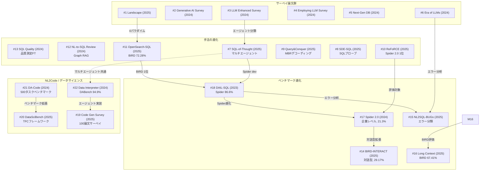

# NL2SQL / NL2Code — 詳細レポート一覧

## パラメータ

- **分析リソース数**: 22件
- **リソース種別**: 学術論文
- **生成日**: 2026-04-05
- **入力元**: research-gather出力（resources-nl2sql-nl2code.md）
- **重視セクション**: コア手法・技術詳細、問題・動機
- **詳細レベル**: 詳細（200〜400行/レポート）

---

## レポート一覧

### Text-to-SQL サーベイ（6件）

| # | タイトル | 著者 | 年 | Venue | 概要 | レポート |
|---|---------|------|-----|-------|------|---------|
| 1 | Exploring the Landscape of Text-to-SQL with LLMs | Huang et al. | 2025 | arXiv | 122論文分析、前処理/ICL/FT/後処理の4パラダイム分類 | [詳細](01-landscape-text2sql-llm.md) |
| 2 | A Survey of LLM-Based Generative AI for Text-to-SQL | Singh et al. | 2024 | arXiv | ベンチマーク・応用・ユースケース重視、ドメイン別分析 | [詳細](02-generative-ai-text2sql-survey.md) |
| 3 | Large Language Model Enhanced Text-to-SQL Generation: A Survey | Zhu et al. | 2024 | arXiv | 訓練戦略ベース4分類（プロンプト/FT/タスク訓練/エージェント）、92論文 | [詳細](03-llm-enhanced-text2sql-survey.md) |
| 4 | A Survey on Employing LLMs for Text-to-SQL Tasks | Shi et al. | 2024 | ACM Computing Surveys | プロンプト3段階+FT分類、BIRDでGPT-4精度54.89% vs 人間92.96% | [詳細](04-employing-llm-text2sql-survey.md) |
| 5 | Next-Generation Database Interfaces | Hong et al. | 2024 | IEEE TKDE 2025 | ICL 5カテゴリ体系（C0-C4）、FT 4サブカテゴリ | [詳細](05-next-gen-db-interfaces.md) |
| 6 | A Survey of Text-to-SQL in the Era of LLMs | Liu et al. | 2024 | IEEE TKDE 2025 | 全ライフサイクル4柱フレームワーク、エラー分析2レベル分類 | [詳細](06-text2sql-era-llms.md) |

### Text-to-SQL 手法（7件）

| # | タイトル | 著者 | 年 | Venue | 概要 | レポート |
|---|---------|------|-----|-------|------|---------|
| 7 | SQL-of-Thought | Chaturvedi et al. | 2025 | arXiv | マルチエージェント5分割、誘導型エラー修正、Spider dev EA 91.59% | [詳細](07-sql-of-thought.md) |
| 8 | SDE-SQL | — | 2025 | arXiv | SQLプローブ自律探索、LSHスキーマリンキング、BIRD +8.02%改善 | [詳細](08-sde-sql.md) |
| 9 | Query and Conquer | Borchmann et al. | 2025 | arXiv | MBRデコーディング実行誘導、7Bモデルがo1超え・コスト1/30 | [詳細](09-query-and-conquer.md) |
| 10 | ReFoRCE | Deng et al. | 2025 | arXiv | Spider 2.0リーダーボード1位、4コンポーネント統合エージェント | [詳細](10-reforce.md) |
| 11 | OpenSearch-SQL | Xie et al. | 2025 | arXiv | 整合性アライメント+Query-CoT-SQL、BIRDテスト72.28%で1位 | [詳細](11-opensearch-sql.md) |
| 12 | From Natural Language to SQL | Mohammadjafari et al. | 2024 | arXiv | ICL/FT/RAGの3分類、Graph RAG体系的調査 | [詳細](12-nl-to-sql-review.md) |
| 13 | Enhancing LLM Fine-tuning by SQL Quality Measurement | Sarker et al. | 2024 | arXiv | SQL品質測定適応的FT、Difficultクエリ+17.20%改善 | [詳細](13-sql-quality-measurement.md) |

### Text-to-SQL ベンチマーク（5件）

| # | タイトル | 著者 | 年 | Venue | 概要 | レポート |
|---|---------|------|-----|-------|------|---------|
| 14 | BIRD-INTERACT | Huo et al. | 2025 | ICLR 2026 Oral | 動的インタラクション評価900タスク、GPT-5でも最大29.17% | [詳細](14-bird-interact.md) |
| 15 | NL2SQL-BUGs | — | 2025 | SIGKDD 2025 | セマンティックエラー9カテゴリ・31サブカテゴリ、2,018件 | [詳細](15-nl2sql-bugs.md) |
| 16 | Is Long Context All You Need? | — | 2025 | VLDB 2025 | ロングコンテキストでスキーマリンキング不要、BIRD 67.41% | [詳細](16-long-context-nl2sql.md) |
| 17 | Spider 2.0 | Lei et al. | 2024 | ICLR 2025 Oral | 企業レベル632タスク、o1-preview 21.3%（Spider 1.0: 91.2%） | [詳細](17-spider-2.md) |
| 18 | DAIL-SQL (Text-to-SQL Empowered by LLMs) | — | 2023 | VLDB 2024 | プロンプト体系的ベンチマーク、Spider 86.6%、1,600トークン/質問 | [詳細](18-dail-sql.md) |

### NL2Code / データサイエンス（4件）

| # | タイトル | 著者 | 年 | Venue | 概要 | レポート |
|---|---------|------|-----|-------|------|---------|
| 19 | A Survey on Code Generation with LLM-based Agents | Dong et al. | 2025 | arXiv | 100論文サーベイ、シングル/マルチエージェント分類 | [詳細](19-code-gen-agent-survey.md) |
| 20 | DataSciBench | Zhang et al. | 2025 | arXiv | TFCフレームワーク、222プロンプト、GPT-4o 64.51%最高 | [詳細](20-datascibench.md) |
| 21 | DA-Code | Huang et al. | 2024 | EMNLP 2024 | 500タスクエージェントベンチマーク、GPT-4o 33.3% | [詳細](21-da-code.md) |
| 22 | Data Interpreter | Hong et al. | 2024 | arXiv | 階層的グラフモデリング、DABench 75.9%→94.9%（+25%） | [詳細](22-data-interpreter.md) |

---

## リソース間関係マップ

### 関係の要約

| 関係タイプ | 詳細 |
|-----------|------|
| **ベンチマーク進化** | Spider 1.0 (#18) → Spider 2.0 (#17) → BIRD-INTERACT (#14) と段階的に難易度・現実性が向上 |
| **手法→ベンチマーク** | ReFoRCE (#10) は Spider 2.0 (#17) で1位、OpenSearch-SQL (#11) は BIRD (#18系) で1位 |
| **サーベイ→手法** | 6本のサーベイ (#1-#6) が手法・ベンチマーク論文を体系的に整理。#3はエージェント型手法を詳細分類 |
| **エラー分析** | NL2SQL-BUGs (#15) のエラー分類は SQL-of-Thought (#7) の誘導型修正と対応 |
| **ロングコンテキスト** | #16 はスキーマリンキング不要というパラダイムシフトを提示。従来手法 (#8, #11) と対照的 |
| **NL2Code拡張** | Data Interpreter (#22) と SQL-of-Thought (#7) はマルチエージェント設計を共有 |

---

## 比較テーブル

### Text-to-SQL 手法比較

| 手法 | アプローチ | ベースモデル | Spider EA | BIRD EA | 主要技術 | コスト効率 |
|------|-----------|-------------|-----------|---------|---------|-----------|
| SQL-of-Thought (#7) | マルチエージェント | GPT-4 | 91.59% | — | 5エージェント協調、エラー分類修正 | 中 |
| SDE-SQL (#8) | 探索型 | GPT-4o | — | 67.67% | SQLプローブ、LSHスキーマリンキング | 中 |
| Query and Conquer (#9) | MBRデコーディング | Qwen 2.5 7B | — | — | 実行誘導自己一貫性 | 高（o1の1/30） |
| ReFoRCE (#10) | エージェント | GPT-4o | — | — | 自己改善+合意+カラム探索 | 低（Spider 2.0対象） |
| OpenSearch-SQL (#11) | SFT+ICL | Qwen2.5-Coder-32B | — | 72.28% | 整合性アライメント、Query-CoT-SQL | 中 |
| DAIL-SQL (#18) | プロンプト | GPT-4 | 86.6% | — | 体系的プロンプト最適化 | 高（1,600トークン） |

### ベンチマーク比較

| ベンチマーク | 年 | タスク数 | 難易度 | 最高精度 | 特徴 |
|-------------|-----|---------|--------|---------|------|
| Spider 1.0 (#18) | 2018 | 1,034 | 中 | 91.2% (o1) | 標準的な単一DB、学術的 |
| BIRD (#11参照) | 2023 | 12,962 | 高 | 72.28% | 大規模DB（33.4GB）、外部知識 |
| Spider 2.0 (#17) | 2024 | 632 | 非常に高 | 21.3% (o1) | 企業レベル、BigQuery/Snowflake |
| BIRD-INTERACT (#14) | 2025 | 900 | 非常に高 | 29.17% (GPT-5) | 対話型マルチターン、CRUD |
| NL2SQL-BUGs (#15) | 2025 | 2,018 | — | 75.16% (検出) | セマンティックエラー検出特化 |

### NL2Code ベンチマーク比較

| ベンチマーク | 年 | タスク数 | 最高精度 | 評価対象 |
|-------------|-----|---------|---------|---------|
| DA-Code (#21) | 2024 | 500 | 33.3% (GPT-4o) | エージェントベースデータサイエンス |
| DataSciBench (#20) | 2025 | 222 | 64.51% (GPT-4o) | データサイエンスAPI呼び出し |
| InfiAgent-DABench (#22参照) | 2024 | — | 94.9% (Data Interpreter) | データ分析エージェント |

### 手法パラダイム比較

| パラダイム | 代表手法 | 長所 | 短所 | 適用場面 |
|-----------|---------|------|------|---------|
| プロンプトエンジニアリング | DAIL-SQL (#18) | 低コスト、汎用性 | 複雑クエリに弱い | プロトタイプ、簡単なSQL |
| ファインチューニング | OpenSearch-SQL (#11), CodeS | 高精度、ドメイン特化 | データ・計算コスト | 本番運用、特定ドメイン |
| エージェント型 | SQL-of-Thought (#7), ReFoRCE (#10) | 複雑タスク対応、自己修正 | 高レイテンシ、高コスト | 企業レベル、複雑クエリ |
| 実行誘導 | Query and Conquer (#9) | コスト効率、小モデル可 | 実行環境必要 | コスト制約あり環境 |
| ロングコンテキスト | Long Context (#16) | スキーマリンキング不要 | 大規模スキーマ限界 | 中規模DB、迅速な推論 |

---

## 追加調査候補

以下は本レポート群の参考文献やコンテキストから発見した、調査価値の高い関連リソースです。

### 高優先度

| # | タイトル | 理由 |
|---|---------|------|
| 1 | **MAC-SQL** (arXiv:2312.11242) | マルチエージェントText-to-SQLの先駆的研究。SQL-of-Thought (#7) の先行研究 |
| 2 | **DIN-SQL** (NeurIPS 2023) | 問題分解によるICLアプローチ。多くの後続研究が参照 |
| 3 | **CHESS** (arXiv:2405.16755) | コンテキスト活用型Text-to-SQL。BIRDで高精度を達成 |
| 4 | **Spider 2.0-Lite リーダーボード最新結果** | ReFoRCE (#10) 以降の新手法の動向把握 |
| 5 | **Agentic Retrieval-Augmented Generation Survey** (arXiv:2501.09136) | RAGベースのSQL生成との関連。クラスタ1との橋渡し |

### 中優先度

| # | タイトル | 理由 |
|---|---------|------|
| 6 | **C3: Zero-shot Text-to-SQL** | ChatGPT時代の初期アプローチ。歴史的文脈の理解 |
| 7 | **SQLFixAgent** | エラー修正に特化したエージェント。NL2SQL-BUGs (#15) との関連 |
| 8 | **Tool-SQL** | ツール使用によるText-to-SQL。エージェント型手法の一環 |
| 9 | **MetaGPT** (arXiv:2308.00352) | Data Interpreter (#22) の基盤フレームワーク |
| 10 | **InfiAgent-DABench** (arXiv:2401.05507) | Data Interpreter (#22) の評価ベンチマーク |

### 関連技術トレンド

| トレンド | 関連論文 | 注目ポイント |
|---------|---------|-------------|
| **マルチエージェントSQL** | #7, #10 | 2025年に急増。専門化エージェントの協調設計 |
| **小型モデルの台頭** | #9 | 7Bモデルでo1レベル達成。コスト削減の可能性 |
| **対話型評価** | #14 | 単発→マルチターンへの評価パラダイム転換 |
| **ロングコンテキスト活用** | #16 | スキーマリンキング工程の省略可能性 |
| **エラー分類体系** | #15, #7 | エラー駆動型改善アプローチの体系化 |

---

## 全体的な知見

### 研究の成熟度

Text-to-SQLは、Spider 1.0のような学術ベンチマークではLLMにより90%超の精度に到達し「解決済み」に近づいているが、実世界の企業環境（Spider 2.0: 21.3%、BIRD-INTERACT: 29.17%）では依然として大きな課題が残る。この「ベンチマーク飽和 vs 実世界ギャップ」が現在の研究の中心的テンションとなっている。

### 技術的方向性

1. **エージェント型アーキテクチャ**: 単一モデル推論からマルチエージェント協調へのパラダイムシフトが2025年に加速
2. **コスト効率**: Query and Conquer (#9) に代表される、小型モデル+実行誘導による高効率アプローチ
3. **評価の多様化**: 静的ベンチマークから対話型・エラー分類型への進化
4. **NL2Code統合**: Text-to-SQL技術がデータサイエンス全般のコード生成に波及
