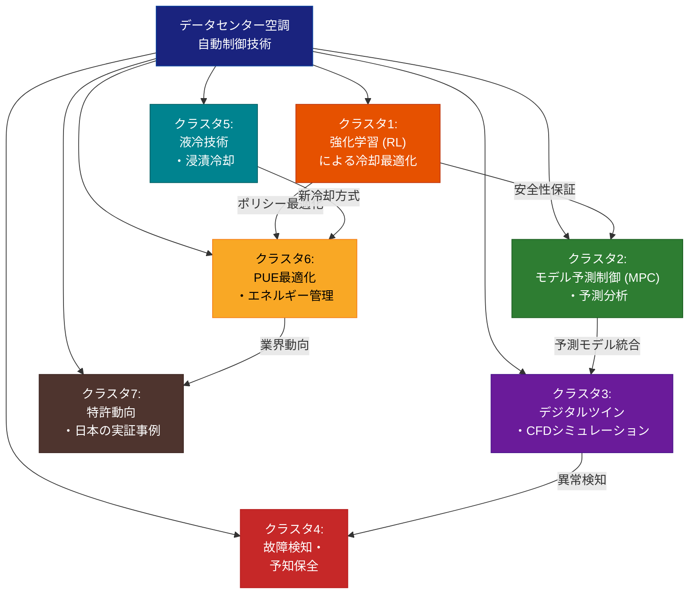

# データセンター空調自動制御技術 ドメインマップ

## 調査パラメータ

- **調査タイプ**: 学術論文サーベイ + 特許調査 + 技術トレンド分析
- **対象期間**: 2022年〜2026年
- **生成日**: 2026-03-30
- **入力キーワード**: データセンター、空調、自動制御、HVAC、cooling、AI、特許、最新論文
- **検索言語**: 英語 + 日本語

## 全体像

データセンター冷却はAIワークロードの急増に伴い技術的転換期にある。GPU/TPUは1チップあたり最大1000Wを消費し、従来の空冷では対応困難な高密度発熱環境が常態化しつつある。制御技術面では、Google DeepMindの深層ニューラルネットワークによる冷却エネルギー40%削減が業界のマイルストーンとなり、強化学習（RL）やモデル予測制御（MPC）の実環境適用が急速に進展している。冷却方式では特許出願の構成比が空冷69%→9%、液冷24%→84%と劇的に変化しており、二相浸漬冷却でPUE 1.08以下の達成が報告されている。日本ではNTTグループ（Smart DASHで30%省エネ）、ダイキン工業（DDCS社買収による液冷参入）、IIJ（PUE 1.2目標のAI空調制御）が主要プレイヤーであり、2029年の省エネ義務化が業界全体の技術採用を加速させている。市場規模はUSD 18.4B（2024年）から USD 49.9B（2034年）への成長が予測される。

## 参考サーベイ・レビュー論文

| タイトル | 年 | 概要 | リンク |
|---------|------|------|--------|
| RL for Data Center Energy Efficiency: Systematic Literature Review | 2025 | 65件の論文をレビューしたRL×DC省エネの体系的文献レビュー | [Applied Energy](https://www.sciencedirect.com/science/article/pii/S0306261925004647) |
| A survey on data center cooling systems: Technology, power consumption modeling and control strategy optimization | 2021 | DC冷却システムの技術・消費電力モデル・制御戦略の包括的サーベイ | [ResearchGate](https://www.researchgate.net/publication/353601573) |
| A Review on AI-Driven Optimization of Data Center Energy Efficiency and Thermal Management | 2024 | AIによるDC省エネ・熱管理最適化のレビュー | [IJAS](https://j.ideasspread.org/ijas/article/view/426) |
| Liquid Cooling of Data Centers: A Necessity Facing Challenges | 2024 | DC液冷技術の必要性と課題のレビュー | [Applied Thermal Engineering](https://www.sciencedirect.com/science/article/abs/pii/S1359431124007804) |
| Analysis of Cooling Technologies in the Data Center Sector on the Basis of Patent Applications | 2024 | 2000-2023年のDC冷却特許分析（空冷→液冷シフトを定量化） | [MDPI Energies](https://www.mdpi.com/1996-1073/17/15/3615) |
| Accelerating Liquid Cooling Adoption: Necessity, Challenges and Solutions | 2025 | 液冷採用加速に向けた課題と解決策 | [Tsinghua](https://www.sciopen.com/article/10.26599/TRCN.2025.9550014) |

## ドメインマップ

## クラスタ一覧

| # | クラスタ名 | キーワード数 | 概要 |
|---|-----------|------------|------|
| 1 | [強化学習 (RL) による冷却最適化](./01-reinforcement-learning.md) | 13 | Offline RL、DRL、マルチエージェントRL等によるDC冷却制御、最も活発な研究領域 |
| 2 | [モデル予測制御 (MPC) ・予測分析](./02-model-predictive-control.md) | 10 | MPC、LSTM予測、データ駆動型制御による15-25%省エネ |
| 3 | [デジタルツイン・CFDシミュレーション](./03-digital-twin-cfd.md) | 12 | リアルタイムデジタルツイン、CFD気流管理、仮想検証プラットフォーム |
| 4 | [故障検知・予知保全](./04-fault-detection-maintenance.md) | 10 | ML/DLベースの異常検知、予知保全、ダウンタイム35%削減 |
| 5 | [液冷技術・浸漬冷却](./05-liquid-immersion-cooling.md) | 13 | 直接液冷、二相浸漬冷却、エッジDC冷却、PUE 1.08以下 |
| 6 | [PUE最適化・エネルギー管理](./06-pue-optimization.md) | 11 | DNN/ML PUE予測、多変量協調最適化、再生エネ統合 |
| 7 | [特許動向・日本の実証事例](./07-patents-japan-cases.md) | 12 | 空冷→液冷特許シフト、NTT/ダイキン/IIJの実証、2029年規制 |

## クロスカッティングテーマ

| テーマ | 関連クラスタ |
|-------|------------|
| Sim-to-real転移（シミュレーションと実環境のギャップ） | RL, MPC, デジタルツイン |
| 安全性保証（温度制約下の制御） | RL (Offline RL), MPC |
| AIワークロード対応（高密度発熱） | 液冷, PUE最適化, エッジDC |
| データ駆動 vs 物理モデルのハイブリッド化 | MPC, デジタルツイン, PUE最適化 |
| 日本の規制環境（2029年省エネ義務化） | 特許動向, PUE最適化 |
| 空冷→液冷パラダイムシフト | 液冷技術, 特許動向, CFD |

## 性能ベンチマーク比較

| 技術 | 省エネ効果 | 成熟度 | 代表事例 |
|------|-----------|--------|---------|
| RL冷却制御 | PUE 1.51→1.33 (12%改善) | 高（実展開あり） | Google DeepMind, Meta, AIR |
| MPC | 冷却エネルギー15-25%削減 | 高 | 大学・研究機関多数 |
| デジタルツイン | 冷却エネルギー15-40%削減 | 中〜高 | Google, Telefonica, Cadence |
| 予知保全 | ダウンタイム35%削減 | 中 | Vertiv, EkkoSense |
| 液冷（浸漬） | 空冷比30-50%削減, PUE<1.08 | 中（急成長） | NTTデータ, Delta, LiquidStack |
| PUE最適化 (ML/DL) | PUE<1.2達成可能 | 高 | Google, NTT Facilities |
| CFD気流管理 | 熱KPI 18-75%改善 | 高 | CoolSim, SimScale |
