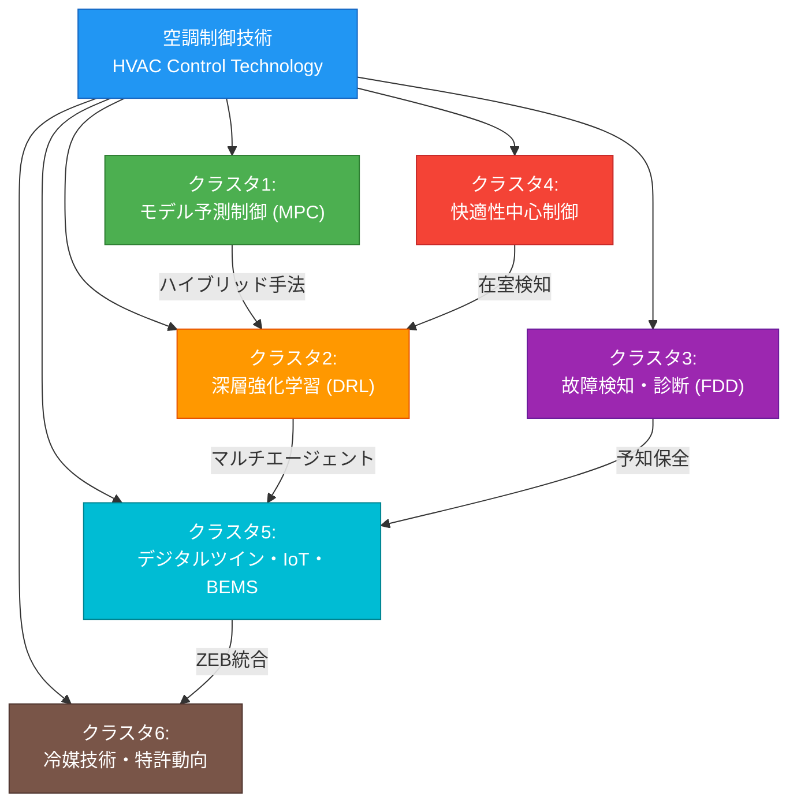

# 空調制御技術 ドメインマップ

## 調査パラメータ

- **調査タイプ**: 学術論文サーベイ + 特許調査
- **対象期間**: 2022年〜2026年
- **生成日**: 2026-03-30
- **入力キーワード**: 空調制御、HVAC control、air conditioning control、AI、特許、最新論文
- **検索言語**: 英語 + 日本語

## 全体像

空調制御（HVAC control）は建物のエネルギー消費の40〜50%を占める重要な技術領域であり、近年はAI/機械学習の導入により大きな変革期を迎えている。従来のPID制御やルールベース制御から、モデル予測制御（MPC）や深層強化学習（DRL）といった高度な制御手法への移行が進んでおり、エネルギー消費の20〜40%削減が報告されている。特許出願面では、日本ではダイキン工業と三菱電機が突出しており、低GWP冷媒技術やAI制御技術に関する出願が活発である。デジタルツインやIoTとの統合、ZEB（ゼロエネルギービル）実現に向けた制御最適化も主要なトレンドとして浮上している。

## 参考サーベイ・レビュー論文

| タイトル | 年 | 概要 | リンク |
|---------|------|------|--------|
| A comprehensive review of the applications of machine learning for HVAC | 2023 | HVAC分野のML応用を包括的にレビュー | [ScienceDirect](https://www.sciencedirect.com/science/article/pii/S2949881323000239) |
| Model predictive control of HVAC systems: A state-of-the-art review | 2022 | 161件のMPC論文をレビューし分類 | [ScienceDirect](https://www.sciencedirect.com/science/article/abs/pii/S2352710222010750) |
| RL for HVAC control in intelligent buildings: A technical and conceptual review | 2024 | 強化学習によるHVAC制御の技術的レビュー | [ScienceDirect](https://www.sciencedirect.com/science/article/pii/S235271022401653X) |
| AI in HVAC fault detection and diagnosis: A systematic review | 2024 | AIベースの故障検知・診断の体系的レビュー | [ScienceDirect](https://www.sciencedirect.com/science/article/pii/S277297022400004X) |
| State-of-the-art of digital twin concept in HVAC+R systems | 2025 | HVAC+Rにおけるデジタルツインの最新動向 | [ScienceDirect](https://www.sciencedirect.com/science/article/pii/S1364032125012742) |
| Artificial Intelligence Approaches to Energy Management in HVAC Systems | 2025 | HVAC省エネにおけるAIアプローチの体系的レビュー | [MDPI](https://www.mdpi.com/2075-5309/15/7/1008) |

## ドメインマップ

## クラスタ一覧

| # | クラスタ名 | キーワード数 | 概要 |
|---|-----------|------------|------|
| 1 | [モデル予測制御 (MPC)](./01-model-predictive-control.md) | 12 | 物理モデル・データ駆動モデルによる最適制御、業界標準手法 |
| 2 | [深層強化学習 (DRL) と転移学習](./02-deep-reinforcement-learning.md) | 15 | DRL/MARL/転移学習による適応的制御、最も活発な研究領域 |
| 3 | [故障検知・診断 (FDD)](./03-fault-detection-diagnosis.md) | 11 | 機械学習による異常検知・故障診断、運用効率の改善 |
| 4 | [快適性中心制御・在室者適応](./04-occupant-centric-comfort.md) | 10 | 在室者の快適性を最優先した制御戦略、パーソナル空調 |
| 5 | [デジタルツイン・IoT・BEMS統合](./05-digital-twin-iot-bems.md) | 13 | デジタルツイン、IoTセンサー網、ビルエネルギー管理システム |
| 6 | [冷媒技術・特許動向・ZEB](./06-refrigerant-patents-zeb.md) | 12 | 低GWP冷媒、VRF技術、日本の特許出願動向、ZEB実現技術 |

## クロスカッティングテーマ

| テーマ | 関連クラスタ |
|-------|------------|
| シミュレーションと実環境のギャップ (Sim-to-real) | MPC, DRL, デジタルツイン |
| スケーラビリティ・汎化性能 | DRL転移学習, MARL, FDD |
| データ不足への対処 | FDD (少数ショット), DRL (サンプル効率) |
| 多目的最適化 (省エネ vs 快適性) | 全クラスタ共通 |
| 実世界展開の障壁 | MPC, DRL (広範な産業採用はまだ限定的) |
| ハイブリッド手法 (MPC+RL, 物理+ML) | MPC, DRL, BEMS |

## 主要シミュレーション環境

| 名称 | 説明 |
|------|------|
| **EnergyPlus** | DOE開発の建物エネルギーシミュレーション |
| **BOPTEST** | Building Optimization Performance Testフレームワーク |
| **Sinergym** | EnergyPlusのOpenAI Gymラッパー |
| **CityLearn** | マルチビルRL環境 |
