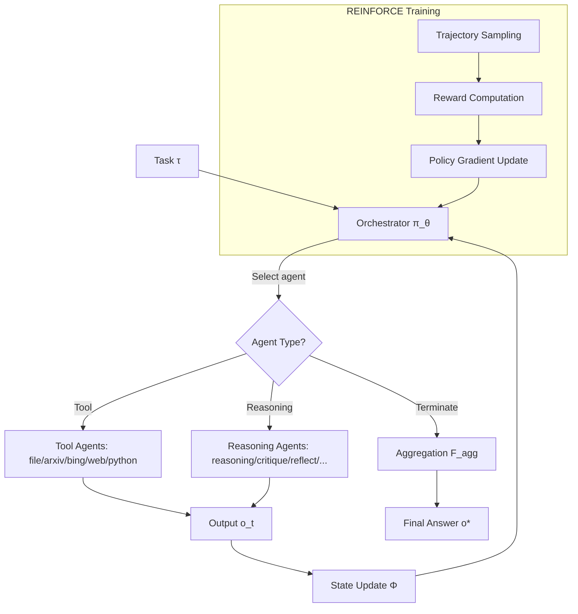

# Multi-Agent Collaboration via Evolving Orchestration

- **Link**: https://arxiv.org/abs/2505.19591
- **Authors**: Yufan Dang, Chen Qian, Xueheng Luo, Jingru Fan, Zihao Xie, Ruijie Shi, Weize Chen, Cheng Yang, Xiaoyin Che, Ye Tian, Xuantang Xiong, Lei Han, Zhiyuan Liu, Maosong Sun
- **Year**: 2025
- **Venue**: NeurIPS 2025
- **Type**: Academic Paper

## Abstract

Large language models have demonstrated strong performance on many tasks, but their single-model design limits scalability and efficiency for complex problem-solving. While multi-agent systems using LLMs show promise, most rely on fixed organizational frameworks that lack adaptability as problems grow more complex. The authors introduce a "puppeteer-style" approach featuring a centralized orchestrator that dynamically directs specialized agents based on task progression. This orchestrator learns through reinforcement learning to flexibly sequence and prioritize agents, supporting adaptive collective reasoning. Testing on various scenarios demonstrates enhanced performance with reduced computational expense. Key findings show that improvements emerge from the development of more streamlined, cyclical reasoning patterns guided by orchestrator training.

## Abstract（日本語訳）

大規模言語モデルは多くのタスクで高い性能を示してきたが、単一モデル設計はスケーラビリティと効率性の面で複雑な問題解決を制限している。LLMを活用したマルチエージェントシステムは有望であるものの、大半は固定的な組織フレームワークに依存しており、問題が複雑化するにつれて適応性を欠く。著者らは、タスクの進行に基づいて特化エージェントを動的に指揮する中央オーケストレータを特徴とする「人形遣い（パペティア）スタイル」のアプローチを導入する。このオーケストレータは強化学習を通じて、エージェントの柔軟な順序付けと優先順位付けを学習し、適応的な集団推論を支援する。様々なシナリオでのテストにより、計算コストを削減しつつ性能が向上することが実証された。主要な知見として、オーケストレータの訓練により、より合理化された循環的な推論パターンの発展から改善が生まれることが示された。

## 概要

本論文は、マルチエージェントLLMシステムにおける固定的な組織構造の限界を克服するため、「パペティア（人形遣い）」スタイルの動的オーケストレーションフレームワークを提案する。中心的なアイデアは、学習可能なポリシーネットワークが各推論ステップでどのエージェントを活性化するかを動的に決定し、マルチエージェント協調を逐次的意思決定問題として定式化することである。REINFORCEアルゴリズムによる強化学習を通じて、オーケストレータは正確性と計算効率の最適なバランスを学習する。実験では、閉ドメイン（GSM-Hard、MMLU-Pro）と開ドメイン（SRDD、CommonGen-Hard）の両タスクにおいて、既存のシングルエージェント・マルチエージェント手法を上回る性能を達成した。特筆すべきは、訓練を通じてトポロジーが自発的にコンパクト化・循環化し、効率的な推論パターンが創発的に出現する点である。

## 問題と動機

- **固定組織構造の限界**: 既存のマルチエージェントシステム（MacNet、EvoAgentなど）は、事前に定義された静的なDAG（有向非巡回グラフ）や固定的な通信パターンに依存している。問題の複雑度が変化しても組織構造が適応できず、単純なタスクでは過剰な計算コスト、複雑なタスクでは能力不足が生じる。

- **スケーラビリティの壁**: 単一LLMモデルの設計では、推論の深さや幅に本質的な限界がある。Chain-of-Thoughtのような手法は単一のモデル内での逐次推論に制約され、多角的な視点からの協調的推論が不可能である。

- **計算効率と性能のトレードオフ**: 多くのマルチエージェント手法は性能向上のために大量のトークンを消費する。特にMCTS（モンテカルロ木探索）ベースのAFlowのような手法は、探索空間の拡大に伴い計算コストが急増する問題がある。

- **エージェント間通信の最適化不在**: 従来手法ではエージェント間の情報フローが事前定義されており、タスクの進行状況に応じてどのエージェントがいつ情報を交換すべきかを動的に最適化する機構が欠如している。

## 提案手法

**Puppeteer: 進化的オーケストレーションによるマルチエージェント協調**

### 中核アイデア

マルチエージェント協調を、中央のオーケストレータ（パペティア）が逐次的にエージェント（パペット）を選択・活性化する意思決定プロセスとして定式化する。各タイムステップでオーケストレータは現在のシステム状態とタスク仕様に基づいて次に活性化するエージェントを確率的に選択し、エージェントの出力によりシステム状態が更新される。

### エージェント定義

各エージェント a = (m, r, t) は以下の3つの要素で特徴付けられる:
- m: 基盤モデル（例: LLaMA-3.1-8B, GPT-4-Turbo等）
- r: 推論パターン/プロンプト戦略（reasoning, critique, reflect等）
- t: 利用可能な外部ツールの集合

### 逐次的意思決定の定式化

システムは有向グラフ G = (V, E) として形式化される。各タイムステップ t において:

**エージェント選択（式1）:**
```
a_t ~ π(S_t, τ) = P(a | S_t, τ)
```

**エージェント実行と状態更新（式2）:**
```
o_t = f_{a_t}(s_t(a_t), S_t)
S_{t+1} = Φ(S_t, o_t)
```

**マルコフ性の保証（式3）:**
```
P(a_{t+1} | S_0,...,S_{t+1}, τ) = P(a_{t+1} | S_{t+1}, τ)
```

**終了と集約（式4）:**
```
o* = F_agg({o_0, o_1,..., o_T})
```

### 強化学習による進化

REINFORCEアルゴリズムを用いてオーケストレータのポリシーパラメータ θ を最適化する。

**目的関数と勾配推定（式5）:**
```
J(θ) = E_{πθ}[R(τ)]
∇_θ J(θ) ≈ (1/N) Σ_{n=1}^N (Σ_{t=1}^T ∇_θ log π_θ(a_t|S_t)) · R(τ)
```

**報酬設計（式6）:**
```
R_t = r - λ·C_T           (t = T のとき)
R_t = γ·R_{t+1} - λ·C_t   (t < T のとき)

C_t = F·log(1 + t/φ)
```

ここで:
- r: タスク報酬（閉ドメインでは{0,1}の正誤、開ドメインでは[0,1]の品質スコア）
- λ: 効率性と正確性のトレードオフパラメータ
- γ: 割引率
- F: FLOPs/トークンメトリクス
- φ: 最大ステップ予算

### 既存手法との本質的な違い

1. **MacNet**: 静的DAG → Puppeteerは動的有向グラフ（循環を含む）
2. **EvoAgent**: 進化的アルゴリズムでエージェントを生成 → Puppeteerはオーケストレーション自体を学習
3. **AFlow**: MCTS探索 → PuppeteerはRL直接最適化
4. **Self-Refine**: 単一エージェント自己修正 → Puppeteerは多様なエージェント間の協調

### エージェントの種類

**ツール使用エージェント（5種）:**
- read_file: ファイル読み取り・抽出
- search_arxiv: 学術論文検索
- search_bing: Web情報検索
- access_website: URL解析・データ抽出
- run_python: コード実行・結果生成

**推論パターンエージェント（8種）:**
- reasoning: 論理的統合
- critique: 欠陥特定・フィードバック
- reflect: メタ認知分析
- question: サブ質問生成
- summarize: 中間結果要約
- conclude: 最終統合
- modify: エラー修正
- planning: タスク分解

## アルゴリズム（疑似コード）

```
Algorithm: Puppeteer - Evolving Orchestration

入力: タスク τ, エージェント集合 A = {a_1,...,a_K}, ポリシー π_θ
出力: 最終回答 o*

# 推論フェーズ
1: S_0 ← InitializeState(τ)
2: for t = 0, 1, 2, ... do
3:     a_t ~ π_θ(·| S_t, τ)              // オーケストレータがエージェント選択
4:     if a_t == TERMINATE then break      // 終了エージェント選択時
5:     o_t ← f_{a_t}(s_t(a_t), S_t)      // エージェント実行
6:     S_{t+1} ← Φ(S_t, o_t)             // 状態更新
7: end for
8: o* ← F_agg({o_0,...,o_T})              // 多数決投票で集約
9: return o*

# 訓練フェーズ (REINFORCE)
1: for episode = 1, ..., N do
2:     τ_n ← SampleTrajectory(π_θ)
3:     R(τ_n) ← ComputeReward(τ_n)        // 式6による報酬計算
4: end for
5: ∇_θ J(θ) ← (1/N) Σ_n (Σ_t ∇_θ log π_θ(a_t|S_t)) · R(τ_n)
6: θ ← θ + α · ∇_θ J(θ)
```

## アーキテクチャ / プロセスフロー

```
┌─────────────────────────────────────────────────┐
│              Puppeteer フレームワーク              │
│                                                   │
│  ┌───────────────────────────────────────┐       │
│  │     Orchestrator Policy π_θ            │       │
│  │  (学習可能なエージェント選択ポリシー)    │       │
│  └──────────┬────────────────────────────┘       │
│             │ エージェント選択                      │
│             ▼                                     │
│  ┌──────────────────────┐                        │
│  │   System State S_t    │◄──────────┐           │
│  │  (グローバル状態管理)   │           │           │
│  └──────────┬───────────┘           │           │
│             │                        │ 状態更新    │
│    ┌────────┴────────────┐          │           │
│    ▼                     ▼          │           │
│ ┌──────────┐  ┌──────────────┐     │           │
│ │Tool Agent│  │Reasoning Agent│     │           │
│ │ ・file   │  │ ・reasoning   │     │           │
│ │ ・arxiv  │  │ ・critique    │─────┘           │
│ │ ・bing   │  │ ・reflect     │                  │
│ │ ・web    │  │ ・question    │                  │
│ │ ・python │  │ ・summarize   │                  │
│ └──────────┘  │ ・conclude    │                  │
│               │ ・modify      │                  │
│               │ ・planning    │                  │
│               └──────────────┘                  │
│                                                   │
│  ┌───────────────────────────────────────┐       │
│  │      REINFORCE Training Loop           │       │
│  │  報酬 R_t = r - λ·C_T (正確性-効率性)  │       │
│  │  θ ← θ + α·∇J(θ)                      │       │
│  └───────────────────────────────────────┘       │
└─────────────────────────────────────────────────┘
```



## Figures & Tables

### Figure 1: フレームワーク概要
中央のパペティアポリシーが各ステップでエージェント（パペット）を動的に選択・指揮する全体アーキテクチャの概念図。タスクが入力されると、オーケストレータが状態に基づいてエージェントを逐次的に活性化し、最終回答を生成する。

### Figure 2: トークン消費量とエージェント数の訓練中の変化
LOWESSスムージングによる可視化。訓練が進むにつれて、ほぼ全ての設定でトークン消費量が一貫して減少することを示す。Titanサブスペースではオーケストレートされるエージェント数も減少（早期終了戦略の学習）し、Mimasサブスペースでは安定的に維持される。

### Table 1: 主要性能比較（Mimas / Titan サブスペース）

**Mimasサブスペース（小規模モデル群）:**

| 手法 | GSM-Hard | MMLU-Pro | SRDD | CommonGen-Hard | 平均 |
|------|----------|----------|------|----------------|------|
| Llama-3.1-8B | 0.0000 | 0.5250 | 0.4615 | 0.6992 | 0.4214 |
| Mistral-Nemo-12B | 0.0350 | 0.4500 | 0.2097 | 0.7146 | 0.3523 |
| Qwen-2.5-14B | 0.0450 | 0.3800 | 0.5891 | 0.5747 | 0.3972 |
| Self-Refine | 0.4750 | 0.2600 | 0.5412 | 0.6018 | 0.4695 |
| AFlow | 0.2900 | 0.5000 | 0.6362 | 0.7194 | 0.5364 |
| MacNet | 0.0000 | 0.2000 | 0.2017 | 0.7434 | 0.2862 |
| EvoAgent | 0.1250 | 0.5000 | 0.2510 | 0.7167 | 0.3981 |
| Puppeteer-Mono (初期) | 0.2467 | 0.4500 | 0.6983 | 0.6323 | 0.5068 |
| Puppeteer-Mono (進化後) | 0.4800 | 0.5200 | 0.7249 | 0.7341 | 0.6147 |
| Puppeteer (初期) | 0.5600 | 0.5700 | 0.6653 | 0.7139 | 0.6273 |
| **Puppeteer (進化後)** | **0.5400** | **0.6300** | **0.6266** | **0.7333** | **0.6324** |

**Titanサブスペース（大規模モデル群）:**

| 手法 | GSM-Hard | MMLU-Pro | SRDD | CommonGen-Hard | 平均 |
|------|----------|----------|------|----------------|------|
| Llama-3.1-405B | 0.1350 | 0.7600 | 0.6061 | 0.8116 | 0.5781 |
| GPT-4o-Mini | 0.1050 | 0.5950 | 0.6822 | 0.6691 | 0.5128 |
| GPT-4-Turbo | 0.2750 | 0.6800 | 0.6244 | 0.7632 | 0.5856 |
| Self-Refine | 0.5250 | 0.6000 | 0.6345 | 0.7033 | 0.6157 |
| AFlow | 0.5400 | 0.7500 | 0.6478 | 0.8218 | 0.6899 |
| MacNet | 0.2905 | 0.4800 | 0.4228 | 0.8817 | 0.5187 |
| EvoAgent | 0.4250 | 0.5400 | 0.1730 | 0.8599 | 0.4994 |
| Puppeteer-Mono (初期) | 0.5400 | 0.6910 | 0.6264 | 0.8111 | 0.6671 |
| Puppeteer-Mono (進化後) | 0.6100 | 0.7600 | 0.7697 | 0.8417 | 0.7453 |
| Puppeteer (初期) | 0.6600 | 0.7400 | 0.6191 | 0.7381 | 0.6893 |
| **Puppeteer (進化後)** | **0.7000** | **0.8300** | **0.7637** | **0.7987** | **0.7731** |

### Figure 5-6: トポロジーの進化パターン
訓練を通じて2つの重要な構造変化が観察される:
- **コンパクト化** (Figure 6a): グラフ密度が増加し、通信が「ハブ」エージェント周辺に集中する密なサブグラフを形成
- **循環性** (Figure 6b): サイクル形成が大幅に増加し、中間結果の再循環と相互検証を可能にする

### Figure 7: ハイパーパラメータ感度分析
トポロジー制約（幅・深さ）と性能の非単調な関係を示す。デフォルトW44D22設定が最適なトレードオフを達成。幅・深さの過度な増加は冗長性を生み、トークン消費増大と精度低下を招く。

## 実験と評価

### 実験設定

**データセット:**
- **GSM-Hard**: 大きな数値を含む複雑な多段階算術問題
- **MMLU-Pro**: 多分野にわたる多肢選択式の包括的ベンチマーク
- **SRDD**: 実世界のソフトウェア開発要件記述（開ドメイン）
- **CommonGen-Hard**: 無関係な概念を結ぶ一貫した文生成（開ドメイン）

**エージェントサブスペース:**
- **Mimas**（小規模）: LLaMA-3.1-8B, Mistral-Nemo-12B, Qwen-2.5-14B
- **Titan**（大規模）: LLaMA-3.1-405B, GPT-4o-Mini, GPT-4-Turbo

**ベースライン:**
- 純粋モデル（各基盤モデル単体）
- シングルエージェント: Self-Refine, AFlow
- マルチエージェント: MacNet, EvoAgent

**ハイパーパラメータ:**
- エピソード長: 4
- 並列探索: 3軌道
- λ（効率性重み）: 0.1
- γ（割引率）: 0.99
- ポリシーネットワーク: Nemotron-70B-Reward（Llama-3.1ベース）
- 訓練サンプル: タスクあたり200軌道

### 主要結果

**Titanサブスペースでの改善:**
- Puppeteer（進化後）は平均0.7731を達成し、最強ベースラインAFlow（0.6899）を12.1%上回る
- 初期状態（0.6893）から進化後（0.7731）への改善により、RL訓練の有効性を実証
- MMLU-Proで0.8300を達成し、GPT-4-Turbo単体（0.6800）を21.8%上回る

**Mimasサブスペースでの改善:**
- Puppeteer（進化後）は平均0.6324を達成
- MacNet（0.2862）の2.2倍、EvoAgent（0.3981）の1.6倍の性能
- 小規模モデルでも効果的なオーケストレーションにより大幅な性能向上を実現

**効率性:**
- 訓練中にトークン消費量が一貫して減少
- Titanサブスペースではエージェント数も減少（早期終了戦略の学習）
- 性能向上と計算コスト削減の同時達成

### アブレーション分析

**Puppeteer-Mono vs Puppeteer:**
- Puppeteer-Mono（単一モデル+多様な推論パターン）でも強力な性能を示す
- 異種モデルを加えたPuppeteerは更なる向上（Titanで0.7453→0.7731）
- 推論パターンの多様性とモデルの多様性の両方が重要

**初期化 vs 進化後:**
- 全設定で進化後が初期化を上回る
- 最大の改善: Puppeteer-MonoのMimasサブスペースで0.5068→0.6147（+21.3%）

**トポロジー制約の影響（Figure 7）:**
- 幅・深さの増加は一定点まで有益だが、それ以降は冗長性により性能低下
- デフォルト設定（W44D22）が精度と効率のバランスにおいて最適

**創発的パターン:**
- Chain-of-thought構造
- 自己反省サイクル（agentが先行agentを再訪問）
- 収束パターン（複数パスの合流）
- 発散パターン（単一パスの分岐）
- 複合トポロジー（階層的・循環的構造の混合）

## 備考

- 本研究の核心的貢献は、マルチエージェント協調を逐次的意思決定問題として定式化し、強化学習で最適化可能にした点にある。これにより、固定的なDAG構造の制約から解放され、タスクに応じた柔軟なエージェント間通信パターンが創発的に獲得される。
- 報酬設計において、正確性（タスク報酬 r）と効率性（計算コスト C_t）を統合した単一の報酬関数を用いることで、性能向上と計算コスト削減の同時最適化を実現している。
- 訓練を通じたトポロジーの「コンパクト化」と「循環性」の創発は、人間のチームワークにおける効率的なコミュニケーションパターンの形成と類似しており、興味深い知見である。
- ポリシーネットワークとしてNemotron-70B-Rewardを使用しており、報酬モデルとしての機能を活用したオーケストレーション学習が行われている。
- 実装コードがGitHubで公開されており、再現性が確保されている。
