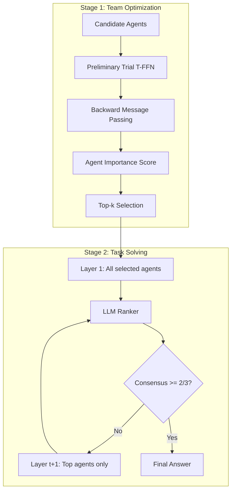

# A Dynamic LLM-Powered Agent Network for Task-Oriented Agent Collaboration

- **Link**: https://arxiv.org/abs/2310.02170
- **Authors**: Zijun Liu, Yanzhe Zhang, Peng Li, Yang Liu, Diyi Yang
- **Year**: 2024
- **Venue**: COLM 2024
- **Type**: Academic Paper

## Abstract

Recent studies show that collaborating multiple large language model (LLM) powered agents is a promising way for task solving. However, current approaches are constrained by using a fixed number of agents and static communication structures. In this work, we propose automatically selecting a team of agents from candidates to collaborate in a dynamic communication structure toward different tasks and domains. Specifically, we build a framework named Dynamic LLM-Powered Agent Network (DyLAN) for LLM-powered agent collaboration, operating a two-stage paradigm: (1) Team Optimization and (2) Task Solving. During the first stage, we utilize an agent selection algorithm, based on an unsupervised metric called Agent Importance Score, enabling the selection of best agents according to their contributions in a preliminary trial, oriented to the given task. Then, in the second stage, the selected agents collaborate dynamically according to the query. Empirically, we demonstrate that DyLAN outperforms strong baselines in code generation, decision-making, general reasoning, and arithmetic reasoning tasks with moderate computational cost. On specific subjects in MMLU, selecting a team of agents in the team optimization stage improves accuracy by up to 25.0% in DyLAN.

## Abstract（日本語訳）

近年の研究は、複数のLLM駆動エージェントの協調がタスク解決の有望なアプローチであることを示している。しかし、現在のアプローチは固定数のエージェントと静的な通信構造の使用に制約されている。本研究では、異なるタスクやドメインに向けて、候補からエージェントチームを自動選択し、動的な通信構造で協調させることを提案する。具体的には、LLM駆動エージェント協調のためのフレームワーク「Dynamic LLM-Powered Agent Network（DyLAN）」を構築し、(1)チーム最適化と(2)タスク解決の2段階パラダイムで運用する。第1段階では、Agent Importance Scoreと呼ばれる教師なしメトリクスに基づくエージェント選択アルゴリズムを利用し、予備試行における貢献度に応じて最適なエージェントを選択する。第2段階では、選択されたエージェントがクエリに応じて動的に協調する。実験的に、DyLANがコード生成、意思決定、一般推論、算術推論タスクにおいて、適度な計算コストで強力なベースラインを上回ることを実証した。MMLUの特定科目では、チーム最適化段階でのエージェントチーム選択により、DyLANの精度が最大25.0%向上した。

## 概要

DyLANは、固定的なエージェント数と静的な通信構造という既存マルチエージェントシステムの2つの根本的な制約を同時に解決するフレームワークである。Temporal Feed-Forward Network（T-FFN）というネットワーク構造を基盤とし、エージェント間の協調を時間層間の情報伝播としてモデル化する。核心的な技術は、(1) Agent Importance Scoreによるタスク固有のエージェント選択、(2) LLM Rankerによる動的なチーム再編成、(3) ビザンチン合意に着想を得た早期停止メカニズムの3つである。4つのタスク領域（コード生成、意思決定、一般推論、算術推論）において、APIコールを大幅に削減しつつ既存手法を上回る性能を達成している。

## 問題と動機

- **固定エージェント数の制約**: 既存のマルチエージェントフレームワーク（LLM Debate、CAMEL、AgentVerseなど）は事前に固定されたエージェント数で動作する。しかし、タスクの複雑度やドメインによって最適なエージェント数は異なるため、この固定性は非効率や性能低下を招く。

- **静的通信構造の限界**: 従来のアプローチはエージェント間の通信パターンが事前定義されている（例: 全エージェントが全出力を参照する完全結合構造）。この静的構造では、特定のタスクに対してどのエージェント間の情報交換が最も有益かを適応的に判断できない。

- **エージェント選択の原理的手法の欠如**: どのエージェント（役割・ペルソナ）がどのタスクに最適かを、系統的かつ自動的に決定する手法が存在しなかった。手動でのエージェント設計は労力がかかり、タスクやドメインの変化に対応できない。

- **計算コストの問題**: LATSのような手法はAPIコールが400回を超えるなど、計算コストが極めて高い。実用的なシステムには、性能と効率のバランスが不可欠である。

## 提案手法

**DyLAN: Dynamic LLM-Powered Agent Network**

### Temporal Feed-Forward Network（T-FFN）

マルチエージェント協調をT-FFNとしてモデル化する。各時間ステップ t に N 個のノード（エージェント）を配置し、隣接する時間層間にのみエッジが存在する。

- ノード: V_t = {v_{t,1}, ..., v_{t,N}} （各エージェントに対応）
- エッジ: 隣接層間の通信チャネル
- 各ノードは前層の全エージェントの出力を受け取り、自身の応答を生成

### 第1段階: チーム最適化

予備試行でエージェントの貢献度を評価し、最適なチームを選択する。

**Agent Importance Score の計算（3ステップ後方メッセージパッシング）:**

**ステップ1: 伝播（順方向パス）**
各ノード v_{t,j} が前層ノード v_{t-1,i} の応答を評価する:
```
w_{t-1,i,j} = f^(s)_{t,j}(p_j, q, M)
```
ここで p_j はエージェントのペルソナ、q はクエリ、M はメッセージ履歴。

**ステップ2: 集約（後方パス）**
貢献度の重み付き合計を各層で計算:
```
I_{t-1,i} = Σ_{(v_{t-1,i}, v_{t,j}) ∈ E} I_{t,j} · w_{t-1,i,j}
```

**ステップ3: 選択**
全時間ステップにわたる最終重要度スコアを集約:
```
I_i = Σ_{t=1}^T I_{t,i}
```
上位k個のエージェントをスコアに基づいて選択。

### 第2段階: タスク解決

選択されたエージェントが動的通信構造で協調する。

**推論（順方向メッセージパッシング）:**
1. クエリ q が第1層エージェント V_1 に入力
2. 各後続層が前層の応答を集約: f_mp(M, v_{t,j})
3. 最終回答: argmax{M_T} から最終層応答を選択
4. プロセス: f_Infer(q, G) = o

**エージェントチーム再編成（動的構造）:**
- LLM Rankerが各タイムステップでエージェントを評価
- 上位エージェントのみが次の層に進行、それ以外は非活性化
- エッジ定義: E_{t,t+1} = V'_t × V'_{t+1}（上位エージェントのみ）
- 結果: 動的に拡張するT-FFN構造

**早期停止メカニズム:**
ビザンチン合意理論に基づく: p個の不正エージェントに耐えるには少なくとも3p+1個のエージェントが必要。単一層内の2/3超のエージェントが一致した回答に達した場合に推論を終了。

### 既存手法との違い

DyLANは以下の特徴を全て兼ね備える唯一のフレームワーク:
- 複数エージェントロール
- 早期停止
- 動的通信構造
- **自動チーム最適化**（DyLANのみ）

LLM-Blender、Debate、Reflexion、CAMEL、AgentVerseはいずれも動的構造または原理的エージェント選択のいずれかを欠く。

## アルゴリズム（疑似コード）

```
Algorithm: DyLAN Framework

# 第1段階: チーム最適化
入力: 候補エージェント A = {a_1,...,a_N}, サンプルクエリ集合 Q_sample
出力: 選択エージェント A* ⊂ A

1: for q in Q_sample do
2:     G ← BuildT-FFN(A, T_layers)
3:     Run forward inference through G
4:     # 後方メッセージパッシングでAgent Importance Score計算
5:     I_T ← InitializeScores(final_layer)
6:     for t = T-1, ..., 1 do
7:         for each node v_{t,i} do
8:             w_{t,i,j} ← f^(s)(evaluate predecessors)
9:             I_{t,i} ← Σ_j I_{t+1,j} · w_{t,i,j}
10:        end for
11:    end for
12:    I_i += Σ_t I_{t,i} for each agent i
13: end for
14: A* ← TopK(A, by=I_i, k=k)
15: return A*

# 第2段階: タスク解決
入力: 選択エージェント A*, クエリ q
出力: 最終回答 o

1: G ← BuildT-FFN(A*, T_layers)
2: V_1 ← ReceiveQuery(q)
3: for t = 1, ..., T do
4:     for each v_{t,j} in V_t do
5:         response_{t,j} ← f_mp(messages, v_{t,j})
6:     end for
7:     # 早期停止チェック
8:     if ConsensusReached(V_t, threshold=2/3) then
9:         return ConsensusAnswer(V_t)
10:    end if
11:    # エージェントチーム再編成
12:    rankings ← LLMRanker(responses_t)
13:    V'_{t+1} ← TopAgents(rankings)
14: end for
15: o ← argmax(M_T)
16: return o
```

## アーキテクチャ / プロセスフロー

```
┌─────────────────────────────────────────────────────────┐
│                    DyLAN Framework                        │
│                                                           │
│  ┌──────────────────────────────────────────────────┐    │
│  │  第1段階: チーム最適化                              │    │
│  │                                                    │    │
│  │  候補エージェント [a1, a2, ..., aN]                 │    │
│  │         ↓                                          │    │
│  │  予備試行 (T-FFN Forward Pass)                     │    │
│  │         ↓                                          │    │
│  │  Agent Importance Score 計算                       │    │
│  │  (後方メッセージパッシング)                         │    │
│  │         ↓                                          │    │
│  │  Top-k エージェント選択 → A*                       │    │
│  └──────────────────────────────────────────────────┘    │
│                     ↓                                     │
│  ┌──────────────────────────────────────────────────┐    │
│  │  第2段階: タスク解決                                │    │
│  │                                                    │    │
│  │  Layer 1    Layer 2    Layer 3    ... Layer T      │    │
│  │  [a*1]  →  [a*1]  →  [a*1]  →       [a*1]       │    │
│  │  [a*2]  →  [a*2]  →  [a*2]          [a*2]       │    │
│  │  [a*3]  →  [a*3]     (deactivated)               │    │
│  │  [a*4]     (deactivated)                          │    │
│  │                                                    │    │
│  │  ← LLM Rankerによる動的再編成 →                    │    │
│  │  ← 2/3合意で早期停止 →                             │    │
│  └──────────────────────────────────────────────────┘    │
└─────────────────────────────────────────────────────────┘
```



## Figures & Tables

### Table 2: コード生成・意思決定の結果

**コード生成（HumanEval, 164サンプル）:**

| 手法 | Pass@1 | APIコール |
|------|--------|-----------|
| Single Execution | 73.2% | 1.00 |
| Reflexion | 68.3% | - |
| CodeT | 65.8% | - |
| LATS | - | 48.00 |
| AgentVerse | - | 22.50 |
| **DyLAN** | **82.9%** | **16.85** |

**意思決定（WebShop, 50テスト環境）:**

| 手法 | Reward | 成功率 | APIコール |
|------|--------|--------|-----------|
| Direct Execution | 50.6 | - | 14.52 |
| LATS | - | - | 400+ |
| **DyLAN** | **68.3** | **42.0%** | **24.85** |

### Table 4: 一般推論（MMLU, ~11,400問）

| 手法 | 精度 | APIコール |
|------|------|-----------|
| Single Execution | 66.4% | 1.00 |
| LLM Debate | - | 12.00 |
| **DyLAN** | **70.5%** | **4.39** |

特定科目では最大25.0%の精度向上を達成（Table 8）。

### Table 5: エージェント選択効果のアブレーション

| タスク | 選択前→選択後 | 性能変化 | APIコール変化 |
|--------|---------------|----------|---------------|
| コード生成 | 12→8エージェント | 76.2%→82.9% | 23.04→16.85 |
| 意思決定 | 8→4エージェント | 53.0→68.3 | 32.03→24.85 |
| 一般推論 | 7→4エージェント | 69.5%→70.5% | 8.30→4.39 |

### Table 3: 算術推論（MATH, 5,000問）

| 手法 | 全体精度 | APIコール |
|------|----------|-----------|
| CoTベースライン | 31.6% | - |
| Complex CoT | 37.6% | 6.21 |
| **DyLAN (CoT)** | **35.7%** | **7.15** |

算術推論での改善が限定的（+4.1%）であることは、知識依存型タスクにおける課題を示唆。

## 実験と評価

### 実験設定

**データセット:**
- **HumanEval** (コード生成): 164のPythonプログラミング問題
- **WebShop** (意思決定): 50のテスト環境でのWebショッピングタスク
- **MMLU** (一般推論): ~11,400問にダウンサンプリング、多分野の多肢選択式問題
- **MATH** (算術推論): 5,000問、7つのサブ領域

**エージェント構成:**
- コード生成: 12候補から8エージェント選択、ツール（コードインタプリタ）有効
- 意思決定: 8候補から4エージェント選択、ツールなし
- 一般推論: 7候補から4エージェント、科目別最適化、ツールなし
- 算術推論: 4エージェント固定（同一プロンプト）

**ベースライン:**
- LLM-Blender、LLM Debate、Reflexion、CAMEL、AgentVerse、LATS、CodeT

### 主要結果

1. **コード生成**: DyLANは82.9% Pass@1を達成し、Single Execution（73.2%）を+9.7%上回る。LATSの48.00 APIコールに対し16.85コールと65%効率的。

2. **意思決定**: DyLAN報酬68.3はDirect Execution（50.6）を+17.7上回る。LATSの400+ APIコールに対し24.85コールと94%以上効率的。

3. **一般推論**: DyLAN精度70.5%はSingle Execution（66.4%）を+4.1%上回る。LLM Debateの12.00コールに対し4.39コールと63%効率的。

4. **算術推論**: 改善は限定的（+4.1%）だが、これは数学的知識がエージェントの推論パターンよりもモデルの内在的能力に依存することを示唆。

### アブレーション分析

**早期停止の効果:**
- APIコール45%〜66%削減
- 精度に微増の効果（不要な推論ステップの排除による）

**エージェントチーム再編成の効果:**
- 正確性に不可欠: 1%〜6%の精度向上
- 非活性化エージェントの除外により、重要なエージェントに計算リソースを集中

**最適チームサイズ:**
- 7候補から2〜4エージェントの選択が最適
- 53%〜68%の効率性向上
- エージェント数を増やしすぎると情報の冗長性が増加し、逆に性能が低下

**Agent Importance Scoreの有効性:**
- 特定MMLU科目で最大25.0%の精度向上
- タスク固有のエージェント選択が汎用的な固定チームより優れることを実証

## 備考

- DyLANの最も独創的な貢献は、Agent Importance Scoreという教師なしメトリクスによる自動エージェント選択である。この手法はタスクに固有であり、事前の人間の知識なしにエージェントの貢献度を定量化できる。
- ビザンチン合意理論からの早期停止メカニズムの着想は、分散システム理論をマルチエージェントLLMシステムに橋渡しする興味深いアプローチである。
- T-FFN構造は、ニューラルネットワークの層構造とマルチエージェント通信を統一的に扱える抽象化を提供しており、今後の拡張の基盤となりうる。
- 算術推論での限定的な改善は、マルチエージェント協調が「推論パターンの多様性」から恩恵を受けるタスクに最も効果的であることを示唆している。純粋な知識依存タスクでは、より強力な基盤モデルの方が重要かもしれない。
- Agent Importance Scoreの計算は教師なしで行われるため、ラベル付きデータを必要とせず、新しいドメインへの適用が容易である点は実用上の大きな利点である。
