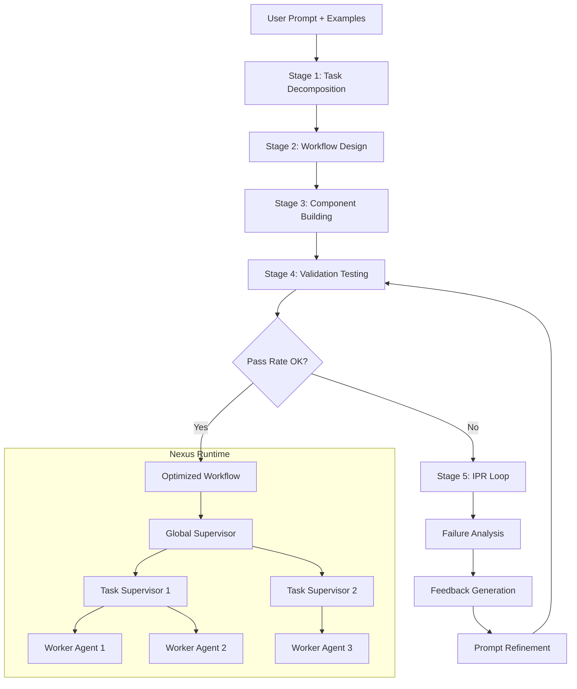

# Adaptive Multi-Agent Reasoning via Automated Workflow Generation

- **Link**: https://arxiv.org/abs/2507.14393
- **Authors**: Humza Sami, Mubashir ul Islam, Pierre-Emmanuel Gaillardon, Valerio Tenace
- **Year**: 2025
- **Venue**: arXiv (Computer Science > Artificial Intelligence)
- **Type**: Academic Paper

## Abstract

The rise of Large Reasoning Models (LRMs) promises a significant leap forward in language model capabilities, aiming to tackle increasingly sophisticated tasks with unprecedented efficiency and accuracy. However, despite their impressive performance, recent studies have highlighted how current reasoning models frequently fail to generalize to novel, unseen problems, often resorting to memorized solutions rather than genuine inferential reasoning. Such behavior underscores a critical limitation in modern LRMs, i.e., their tendency toward overfitting, which in turn results in poor generalization in problem-solving capabilities.

In this paper, we introduce Nexus Architect, an enhanced iteration of our multi-agent system framework, Nexus, equipped with a novel automated workflow synthesis mechanism. Given a user's prompt and a small set of representative examples, the Architect autonomously generates a tailored reasoning workflow by selecting suitable strategies, tool integrations, and adversarial techniques for a specific problem class. Furthermore, the Architect includes an iterative prompt refinement mechanism that fine-tunes agents' system prompts to maximize performance and improve the generalization capabilities of the system.

We empirically evaluate Nexus Architect by employing an off-the-shelf, non-reasoning model on a custom dataset of challenging logical questions and compare its performance against state-of-the-art LRMs. Results show that Nexus Architect consistently outperforms existing solutions, achieving up to a 66% increase in pass rate over Gemini 2.5 Flash Preview, nearly 2.5x against Claude Sonnet 4 and DeepSeek-R1, and over 3x w.r.t. Llama 4 Scout.

## Abstract（日本語訳）

大規模推論モデル（LRM）の台頭は、言語モデルの能力に大きな飛躍をもたらすことが期待され、前例のない効率性と精度でますます高度なタスクに取り組むことを目指している。しかし、その印象的な性能にもかかわらず、近年の研究は現在の推論モデルが新規の未見の問題への汎化に頻繁に失敗し、真の推論的推理ではなく記憶された解法に頼ることが多いことを明らかにしている。このような振る舞いは、現代のLRMにおける重大な限界、すなわち過学習への傾向を浮き彫りにしており、それが問題解決能力における汎化性の低さにつながっている。

本論文では、マルチエージェントシステムフレームワーク「Nexus」の強化版であるNexus Architectを導入する。これは新規の自動ワークフロー合成メカニズムを備えている。ユーザーのプロンプトと少数の代表的な例が与えられると、Architectは適切な戦略、ツール統合、敵対的技法を選択することで、特定の問題クラスに合わせたカスタム推論ワークフローを自律的に生成する。さらに、Architectはエージェントのシステムプロンプトを微調整してシステムの性能を最大化し汎化能力を向上させる反復的プロンプト精錬メカニズムを含む。

我々はNexus Architectを既製の非推論モデルを用いて挑戦的な論理問題のカスタムデータセットで実証評価し、最先端のLRMと性能を比較する。結果は、Nexus Architectが既存のソリューションを一貫して上回ることを示し、Gemini 2.5 Flash Previewに対して最大66%のパス率向上、Claude Sonnet 4およびDeepSeek-R1に対して約2.5倍、Llama 4 Scoutに対して3倍以上の改善を達成した。

## 概要

Nexus Architectは、LRMの汎化能力の限界に対処するため、自動ワークフロー合成と反復的プロンプト精錬（IPR）を組み合わせたマルチエージェントシステムフレームワークである。核心的なアイデアは、問題クラスに応じてマルチエージェントの推論ワークフローを自動的に設計・最適化することで、ファインチューニングなしに既製の非推論モデル（GPT-4.1）が最先端の推論モデルを上回る性能を達成することである。5段階のパイプライン（タスク分解、ワークフロー設計、コンポーネント構築、検証テスト、IPRフィードバック）により、特定の問題クラスに特化した実行可能なPythonワークフローを生成する。ArcBenchデータセット（158問の挑戦的論理問題）において、Gemini 2.5 Flash Previewを66%、Claude Sonnet 4を約2.5倍上回る性能を示した。

## 問題と動機

- **LRMの汎化能力の限界**: 現代の大規模推論モデル（DeepSeek-R1、Claude Sonnet 4、Gemini 2.5等）は印象的な性能を示すが、新規の未見の問題に対して真の推論的推理ではなく記憶された解法パターンに依存する傾向がある。これは「過学習」の一形態であり、ベンチマーク汚染問題とも関連する。

- **推論モデルの本質的弱点**: 推論モデルは訓練データに含まれるパターンの再現には優れるが、トリック問題やリドル（なぞなぞ）のような従来のパターンが通用しない問題では、「もっともらしいが誤った」回答を自信を持って生成してしまう。真の演繹的推論能力と記憶された推論パターンの適用との間には本質的なギャップが存在する。

- **静的システム設計の非効率性**: 手動で設計されたマルチエージェントワークフローは、特定の問題タイプに最適化されるが、異なる問題クラスには適応できない。問題タイプごとにワークフローを再設計する必要があり、スケーラブルではない。

- **プロンプトエンジニアリングの限界**: 手動プロンプト設計は労力がかかり、体系的な最適化が困難である。エージェントのシステムプロンプトの微妙な違いが性能に大きな影響を与えるが、最適なプロンプトを見つけるための原理的なアプローチが不足している。

## 提案手法

**Nexus Architect: 自動ワークフロー合成による適応的マルチエージェント推論**

### 5段階パイプライン

Nexus Architectは以下の5段階で動作する:

**Stage 1: タスク分解と計画**
ユーザーのプロンプトを「タスクと具体的要件の構造化リスト」に変換する。問題を体系的に解決するためのサブタスクに分割し、各サブタスクの依存関係と優先順位を特定する。

**Stage 2: 推論ワークフロー設計**
「マルチエージェントアーキテクチャ全体の包括的な設計図」を生成する。具体的には:
- スーパーバイザーの配置構成
- 各エージェントの仕様（入力/出力フィールド、役割定義）
- 必要なツールの指定
- エージェント間の情報フローの設計

**Stage 3: コンポーネント構築とプロンプトエンジニアリング**
専用のビルダーがスーパーバイザー、エージェント、ツールをインスタンス化する。Nexusのドキュメントガイドラインに従い「初期システムプロンプトシード」を決定する。

**Stage 4: ワークフロー検証とテスト**
提供された問題-回答ペアを用いた自動検証で「全体的な性能、精度、タスク固有のメトリクス」を測定する。成功したワークフローは実行可能なPythonコードを出力する。

**Stage 5: IPR（反復的プロンプト精錬）フィードバックループ**
失敗したワークフローに対して体系的な失敗分析を実行し、「各エージェントのシステムプロンプトを精錬するための修正指示」を生成する。

### Iterative Prompt Refinement（IPR）メカニズム

IPRはNexus Architectの最も革新的な要素であり、以下のサイクルで動作する:

1. **初期設計**: コーディネータエージェントのシステムメッセージを設計
2. **性能テスト**: 問題-回答ペアに対するテスト実行
3. **フィードバック生成**: 問題点と根本原因を特定する詳細なフィードバック
4. **プロンプト修正**: 特定された欠点に対処するシステムメッセージの修正
5. **検証テスト**: 改善を確認する再テスト

核心原則: 精錬は「より複雑なアーキテクチャ変更ではなく、自動プロンプトエンジニアリングを通じて」行われる。

### Nexusフレームワーク基盤の6つの特徴

1. **階層的スーパービジョン**: グローバルスーパーバイザーがタスクスーパーバイザーとワーカーに委任
2. **ローコードワークフロー仕様**: 宣言的YAMLファイルによる定義
3. **標準化ツールインターフェース**: Model Context Protocol（MCP）経由
4. **モジュール式メモリ統合**: ロールベースのアクセス制御付き
5. **カスタムメッセージングプロトコル**: エンドツーエンドの情報フロー保持
6. **オープンソースpip配布**: モデル非依存、ドメイン非依存

### 既存手法との違い

- **vs. 推論モデル（LRM）**: LRMはモデル内部の推論に依存するが、Nexus Architectは外部のマルチエージェント構造で推論を組織化。ファインチューニング不要。
- **vs. 手動マルチエージェント設計**: ワークフロー全体を自動生成するため、新しい問題クラスへの適応が迅速。
- **vs. 他のマルチエージェントフレームワーク**: IPRによるプロンプトレベルの自動最適化を備え、少数の例から汎化能力を向上。

## アルゴリズム（疑似コード）

```
Algorithm: Nexus Architect - Automated Workflow Synthesis

入力: ユーザープロンプト P, 代表的例題集合 E = {(q_i, a_i)}_{i=1}^n
出力: 最適化済みマルチエージェントワークフロー W*

# Phase 1: ワークフロー合成
1: tasks ← TaskDecompose(P, NexusDocs)
2: blueprint ← DesignWorkflow(tasks, NexusDocs)
3: W ← BuildComponents(blueprint)    // スーパーバイザー, エージェント, ツール
4: code ← GeneratePythonCode(W)

# Phase 2: 検証
5: E_sample ← RandomSample(E, k=10)
6: results ← RunWorkflow(code, E_sample)
7: metrics ← EvaluatePerformance(results, E_sample)

# Phase 3: 反復的プロンプト精錬（IPR）
8: for iteration = 1, ..., MAX_IPR do
9:     if metrics.pass_rate >= threshold then
10:        break
11:    end if
12:    # 失敗分析
13:    failures ← IdentifyFailures(results, E_sample)
14:    feedback ← AnalyzeRootCauses(failures)
15:    
16:    # プロンプト精錬
17:    for each agent a in W do
18:        a.system_prompt ← RefinePrompt(a.system_prompt, feedback)
19:    end for
20:    
21:    # 再テスト
22:    results ← RunWorkflow(code, E_sample)
23:    metrics ← EvaluatePerformance(results, E_sample)
24: end for

25: W* ← W with refined prompts
26: return W*
```

## アーキテクチャ / プロセスフロー

```
┌────────────────────────────────────────────────────────┐
│                  Nexus Architect Pipeline                │
│                                                          │
│  ┌─────────┐  ┌─────────────┐  ┌───────────────────┐  │
│  │ Stage 1  │→│   Stage 2    │→│     Stage 3        │  │
│  │タスク分解 │  │ワークフロー │  │コンポーネント構築  │  │
│  │ & 計画   │  │   設計      │  │& プロンプト設計    │  │
│  └─────────┘  └─────────────┘  └───────────────────┘  │
│                                          ↓               │
│  ┌────────────────────────────────────────────────────┐ │
│  │              Stage 4: 検証テスト                     │ │
│  │  問題-回答ペアで自動テスト → 性能メトリクス算出     │ │
│  └────────────────────────┬───────────────────────────┘ │
│                           ↓                              │
│  ┌────────────────────────────────────────────────────┐ │
│  │        Stage 5: IPR フィードバックループ             │ │
│  │                                                      │ │
│  │  ┌──────────┐   ┌──────────┐   ┌────────────────┐ │ │
│  │  │失敗分析   │ → │フィードバ │ → │プロンプト修正   │ │ │
│  │  │          │   │ック生成   │   │                │ │ │
│  │  └──────────┘   └──────────┘   └───────┬────────┘ │ │
│  │                                         ↓          │ │
│  │                              ┌──────────────┐      │ │
│  │                              │ 再テスト      │──┐  │ │
│  │                              └──────────────┘  │  │ │
│  │                                    ↑            │  │ │
│  │                                    └────────────┘  │ │
│  │                              (MAX_IPR回まで反復)    │ │
│  └────────────────────────────────────────────────────┘ │
│                           ↓                              │
│  ┌────────────────────────────────────────────────────┐ │
│  │         最適化済みワークフロー (Python Code)         │ │
│  └────────────────────────────────────────────────────┘ │
└────────────────────────────────────────────────────────┘
```



## Figures & Tables

### Figure 1: Nexus Architectの全体パイプライン
5段階のパイプライン（タスク分解→ワークフロー設計→コンポーネント構築→検証テスト→IPRフィードバック）の概念図。各段階がどのように接続され、IPRループが反復的に改善を行うかを示す。Nexusのドキュメントがタスク分解とワークフロー設計の両段階でin-context learningに使用される。

### Figure 2: 最先端モデルとの性能比較

ArcBenchデータセットでの各モデルのパス率比較:

| モデル | ベストパス率 | Nexus Architectとの比較 |
|--------|-------------|------------------------|
| Gemini 2.5 Flash Preview | 44.94% | Nexus Architectが+66%改善 |
| Claude Sonnet 4 | - | Nexus Architectが約2.5倍 |
| DeepSeek-R1 | - | Nexus Architectが約2.5倍 |
| Claude 3.5 Sonnet | - | 比較対象 |
| Claude Opus 4 | - | 比較対象 |
| Llama 4 Scout | - | Nexus Architectが3倍以上 |
| Llama 4 Maverick | - | 比較対象 |
| **Nexus Architect (GPT-4.1)** | **~70%+** | **ベスト** |

### Figure 3: IPR反復による性能推移
5回のIPR反復を通じたパス率の推移を5つの独立実行で示す。最も顕著な改善はRun 4で、10問サンプルセットでのパス率が60%から90%に向上。全体データセットでのパス率は約70%に到達。全サンプルの6%のみを使用した精錬で、全体の汎化能力が大幅に向上している。

### Appendix B: IPR実例 - デジタル時計リドル
**問題**: 「デジタル時計の6:10に、分針と時針が形成する鈍角の度数は？」
**正解**: 「デジタル時計に分針や時針はない」

- **IPR反復1の失敗**: エージェントが数学的に角度（125度）を計算し、トリックの本質を見逃す
- **フィードバック**: スーパーバイザーが「リドル/パンチライン解釈を認識・優先しなかった」と特定
- **IPR反復2の精錬**: 「パズルの文脈がトリック・パンチラインを示唆する場合、全下流エージェントにリドル/パンチライン応答を PRIMARY として優先的に提示するよう明示的に要求する」という条項を追加
- **IPR反復2の結果**: エージェントが正しく「デジタル時計に針はない」と回答

## 実験と評価

### 実験設定

**データセット: ArcBench**
- RoR-Benchスイートを改訂したカスタムデータセット
- 158問の問題-回答ペア（元は多言語、英語に翻訳）
- 演繹的推論を必要とする「これまでに見たことのない新規問題」として設計されたリドル
- LLMのアクセシビリティのためにいくつかの問題/回答を著者が修正

**実験プロトコル:**
- 各ランで10問の問題-回答ペアをランダムに選択
- 5回の独立実行
- 各実行で5回のIPR反復
- メトリクス: パス率（正解数/総問題数）

**基盤モデル:**
- Nexus Architect: GPT-4.1（temperature=1, top_p=1）
- ファインチューニングなしの既製モデルを使用

**比較対象モデルと設定:**

| モデル | プロバイダー | Temperature | Top_p |
|--------|-------------|-------------|-------|
| Llama 4 Scout | AWS Bedrock | 0.5 | 0.9 |
| Llama 4 Maverick | AWS Bedrock | 0.5 | 0.9 |
| DeepSeek-R1 | AWS Bedrock | 1 | 0.95 |
| Claude Sonnet 4 | AWS Bedrock | 1 | 1 |
| Claude 3.5 Sonnet | AWS Bedrock | 1 | 1 |
| Claude Opus 4 | AWS Bedrock | 1 | 1 |
| Gemini 2.5 Flash Preview | Google AI Studio | 1 | 0.95 |
| GPT 4.1 | OpenAI API | 1 | 1 |

### 主要結果

1. **最先端LRMを大幅に上回る性能**: 非推論モデル（GPT-4.1）をベースとしたNexus Architectが、Gemini 2.5 Flash Preview（最良のLRM）を66%上回るパス率を達成。

2. **推論モデルの限界を露呈**: Claude Sonnet 4、DeepSeek-R1に対して約2.5倍、Llama 4 Scoutに対して3倍以上の性能差は、LRMが記憶された推論パターンに依存していることを強く示唆。

3. **少数例からの効率的汎化**: わずか6%（10/158問）のサンプルを用いたIPRで、全データセットに対する汎化能力が大幅に向上。これはIPRメカニズムがタスク固有の推論戦略を効果的に抽出・一般化できることを示す。

4. **IPRの一貫した改善効果**: 5回の独立実行全てでIPR反復を通じた一貫したパス率向上を確認。最大で60%→90%（サンプルセット）の改善を達成。

### アブレーション分析

**IPR反復数の影響:**
- 5回のIPR反復で一貫した改善が観察される
- 反復5に向けてパス率が改善し続ける傾向
- Run 4では10問サンプルセットで60%→90%の改善
- 全体データセットでのパス率は約70%に到達

**ワークフロー自動生成の効果:**
- Nexusドキュメントのin-context learningを通じて、Architectは問題クラスに適したマルチエージェント構造を自動設計
- 手動設計と比較して、新しい問題タイプへの適応が迅速
- 生成されたワークフローは実行可能なPythonコードとして出力

**プロンプト精錬 vs アーキテクチャ変更:**
- IPRはアーキテクチャを変更せずプロンプトのみを精錬するアプローチ
- これにより、ワークフロー構造の安定性を保ちつつ、エージェントの振る舞いを最適化
- 構造変更よりもプロンプト精錬の方が効率的かつ制御可能であることを示唆

## 備考

- Nexus Architectの最も注目すべき成果は、ファインチューニングなしの非推論モデル（GPT-4.1）が最先端の推論モデルを大幅に上回ったことである。これは「推論能力」がモデル内部の能力ではなく、適切に構造化されたマルチエージェントワークフローによって外部化・増幅できることを示唆している。
- IPRメカニズムは「自動プロンプトエンジニアリング」の一形態として理解できる。わずか6%のサンプルから全体への汎化を達成する点は、Few-shot学習の文脈でも注目に値する。
- デジタル時計リドルの実例（Appendix B）は、IPRがどのようにエージェントの「メタ認知的」な振る舞いを改善するかの具体的な証拠を提供しており、トリック問題への耐性を体系的に獲得するプロセスが明確に示されている。
- Model Context Protocol（MCP）を採用したツール統合と、宣言的YAMLによるワークフロー定義は、実用的なマルチエージェントシステムの構築において重要な工学的貢献である。
- 評価がArcBench（158問のリドル）のみに限定されている点は、より広範なタスクドメインでの検証が今後の課題として残る。特に、コード生成や数学的推論など、より構造化されたタスクでの性能は未検証である。
- ソースコード（https://github.com/PrimisAI/nexus）とデータセット（https://github.com/PrimisAI/arcbench）が公開されており、再現性が確保されている。
