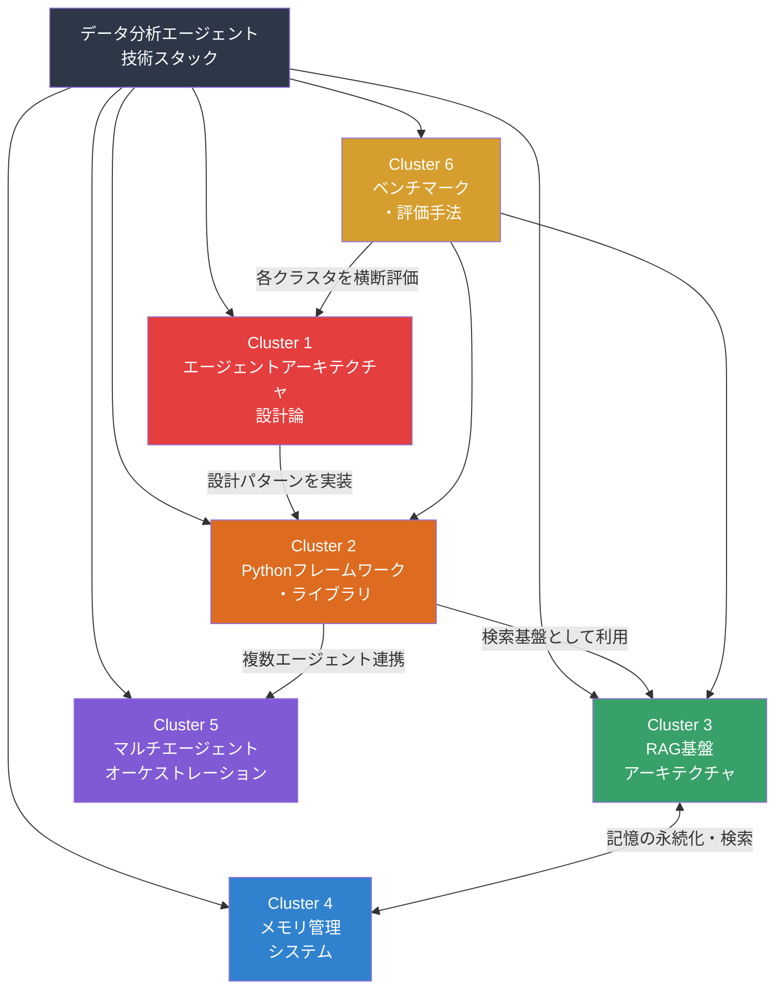

# データ分析エージェント領域：技術スタック・Pythonライブラリ・RAG基盤メモリ管理

## 研究パラメータ

- **研究タイプ**: 学術論文サーベイ
- **対象期間**: 2022年 – 2026年
- **生成日**: 2026-04-05
- **入力キーワード**: データ分析エージェント、技術スタック、Pythonライブラリ、RAG基盤、メモリ管理

## 全体像

データ分析エージェントは、LLM（大規模言語モデル）をコアとして自律的にデータ分析タスクを遂行するシステムであり、2023年以降急速に研究・実用化が進んでいる。この領域は、(1) エージェントアーキテクチャの設計論、(2) 実装基盤としてのPythonフレームワーク・ライブラリ群、(3) 外部知識の検索・活用を担うRAG基盤、(4) 対話履歴やタスク状態を管理するメモリシステム、(5) エージェント間の連携を制御するオーケストレーション手法、(6) 性能評価のためのベンチマーク体系という6つの主要ドメインで構成される。2025年後半から2026年にかけて複数の包括的サーベイ論文が発表され、分野全体の体系化が進んでいる。特にMCP（Model Context Protocol）の業界標準化と、神経科学に着想を得たメモリ階層モデルの台頭が顕著なトレンドである。

## 参照サーベイ・レビュー論文

| タイトル | 年 | 概要 | リンク |
|---------|------|------|--------|
| LLM/Agent-as-Data-Analyst: A Survey | 2025 | データ分析エージェントの4つの設計目標（セマンティック認識・自律パイプライン・ツール拡張・オープンワールド）を体系化 | [arXiv:2509.23988](https://arxiv.org/abs/2509.23988) |
| A Survey on LLM-based Agents for Statistics and Data Science | 2024-2025 | 統計・データサイエンス向けLLMエージェントの進化・能力・課題を包括的に分析 | [arXiv:2412.14222](https://arxiv.org/abs/2412.14222) |
| Large Language Model-based Data Science Agent: A Survey | 2025 | エージェント設計原則をロール・実行・知識・振り返りの4次元で体系化 | [arXiv:2508.02744](https://arxiv.org/abs/2508.02744) |
| Agentic RAG: A Survey | 2025 | エージェント型RAGのシングル/マルチエージェントアーキテクチャを分類 | [arXiv:2501.09136](https://arxiv.org/abs/2501.09136) |
| Memory in the Age of AI Agents: A Survey | 2025 | エージェントメモリを事実的・経験的・作業メモリに分類し統合管理を議論 | [arXiv:2512.13564](https://arxiv.org/abs/2512.13564) |
| A Survey on the Memory Mechanism of LLM-based Agents | 2025 | LLMエージェントのメモリ形成・進化・検索ダイナミクスを分析 | [ACM](https://dl.acm.org/doi/10.1145/3748302) |

## ドメインマップ

## クラスタサマリー

| # | クラスタ名 | キーワード数 | 概要 |
|---|-----------|-------------|------|
| 1 | [データ分析エージェントアーキテクチャ設計論](cluster-01-agent-architecture.md) | 12 | LLMベースデータ分析エージェントの設計原則・パターン・タクソノミー |
| 2 | [Pythonエージェントフレームワーク・ライブラリ](cluster-02-python-frameworks.md) | 15 | 主要フレームワーク（LangGraph, CrewAI等）とデータ分析特化ライブラリ |
| 3 | [RAG基盤アーキテクチャ](cluster-03-rag-architecture.md) | 13 | Agentic RAGの進化・検索戦略・ベクトルDB・チャンキング最適化 |
| 4 | [エージェントメモリ管理システム](cluster-04-memory-management.md) | 14 | 短期/長期/エピソード/意味メモリの階層管理と統合フレームワーク |
| 5 | [マルチエージェントオーケストレーション](cluster-05-orchestration.md) | 11 | 複数エージェントの協調・通信プロトコル・ワークフロー制御 |
| 6 | [ベンチマーク・評価手法](cluster-06-benchmarks.md) | 10 | データ分析エージェントの能力測定・評価フレームワーク・データセット |
